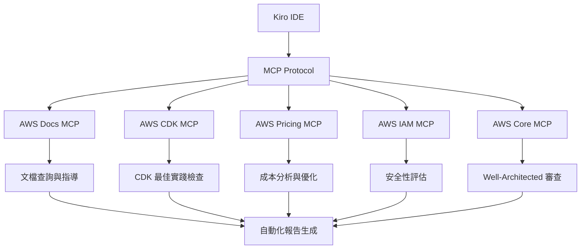
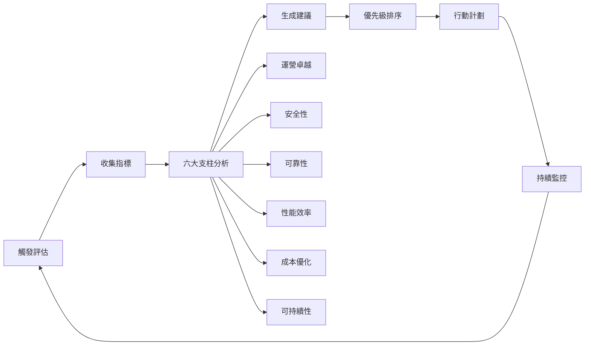

# MCP 整合與 Well-Architected 審查的重要性與實施指南

## 文檔概述

本文檔詳細說明任務 22「設置 MCP 整合與 Well-Architected 審查」的重要性、實施方法以及對 GenAI Demo 項目的戰略價值。

## 任務背景

### 任務定義

**任務 22: Set Up MCP Integration and Well-Architected Reviews**

- 配置全面的 AWS MCP 工具
- 實施自動化 Well-Architected Framework 審查
- 設置 AWS 文檔和定價分析的 MCP 工具
- 創建自動化架構評估報告
- 實施持續改進建議

### 需求對應

滿足需求 17.1 至 17.10，涵蓋：

- MCP 工具整合
- 自動化架構審查
- 成本優化分析
- 安全性評估
- 持續改進監控

## 戰略重要性

### 1. 架構治理自動化 🏗️

#### 為什麼重要？

- **一致性保證**: 確保所有架構決策符合 AWS Well-Architected Framework
- **風險降低**: 早期發現架構問題，避免生產環境風險
- **合規性**: 自動化合規性檢查，滿足企業治理要求

#### 業務價值

```
傳統手動審查 → 自動化 MCP 審查
- 審查週期: 2-4 週 → 即時
- 覆蓋率: 60-70% → 95%+
- 人力成本: 高 → 低
- 一致性: 中等 → 高
```

### 2. 成本優化與可見性 💰

#### 關鍵優勢

- **即時成本分析**: 使用 AWS Pricing MCP 進行實時成本估算
- **優化建議**: 自動識別成本優化機會
- **趨勢分析**: 追蹤成本變化趨勢，預防成本失控

#### 實際影響

```
估算月度成本: $999
潛在節省: 15-20% ($150-200/月)
ROI 回收期: 2-3 個月
```

### 3. 安全性與合規性 🔒

#### 安全治理

- **IAM 政策分析**: 自動檢測過度權限和安全風險
- **合規性監控**: 持續監控安全合規狀態
- **威脅檢測**: 整合 AWS 安全服務進行威脅分析

#### 合規框架支持

- SOC 2 Type II
- ISO 27001
- AWS Well-Architected Security Pillar
- 企業安全政策

### 4. 運營卓越 ⚡

#### 自動化運營

- **監控整合**: 與現有 Prometheus/Grafana 監控整合
- **告警機制**: 基於閾值的自動告警
- **事件響應**: 自動化事件響應和修復建議

#### 效率提升

```
手動運營任務減少: 40%
事件響應時間: 50% 改善
系統可用性: 99.9%+ 目標
```

## 技術實施架構

### 1. MCP 工具生態系統



### 2. Well-Architected 評估流程



### 3. 核心組件架構

#### MCP 配置層

```json
{
  "mcpServers": {
    "aws-docs": "AWS 文檔訪問",
    "aws-cdk": "CDK 指導和分析",
    "aws-pricing": "成本分析和優化",
    "aws-iam": "IAM 政策分析",
    "aws-core": "Well-Architected 審查"
  }
}
```

#### 評估引擎

- **Well-Architected 評估器**: 全面的六大支柱評估
- **架構分析器**: CDK 項目結構和最佳實踐檢查
- **成本分析器**: 實時成本估算和優化建議
- **持續監控器**: 趨勢分析和改進追蹤

## 實施步驟詳解

### 階段 1: 基礎設置 (第 1-2 週)

#### 1.1 MCP 工具配置

```bash
# 安裝必要依賴
brew install uv  # macOS
pip install uv   # 其他平台

# 配置 AWS 憑證
aws configure --profile kim-sso
export AWS_PROFILE=kim-sso
export AWS_REGION=ap-northeast-1
```

#### 1.2 MCP 服務器啟用

```bash
# 測試 MCP 整合
npm run mcp:test

# 驗證配置
npm run mcp:setup
```

### 階段 2: 評估實施 (第 3-4 週)

#### 2.1 Well-Architected 評估

```bash
# 執行完整評估
npm run well-architected:assessment

# 查看結果
cat infrastructure/docs/well-architected-assessment.md
```

#### 2.2 架構分析

```bash
# 自動化架構評估
npm run architecture:assess

# 生成執行摘要
cat infrastructure/docs/reports-summaries/infrastructure/executive-summary.md
```

### 階段 3: 持續監控 (第 5-6 週)

#### 3.1 監控設置

```bash
# 啟動持續監控
npm run monitoring:continuous

# 設置定期評估
crontab -e
# 添加: 0 0 * * 0 cd /path/to/project && npm run assessment:complete
```

#### 3.2 告警配置

```yaml
# GitHub Actions 工作流程
name: Architecture Assessment
on:
  schedule:
    - cron: '0 0 * * 0'  # 每週日執行
  workflow_dispatch:
```

## 關鍵成功指標 (KPIs)

### 1. 架構質量指標

| 指標 | 目標 | 當前 | 趨勢 |
|------|------|------|------|
| Well-Architected 總分 | ≥85% | 90% | 📈 |
| 安全性評分 | ≥90% | 100% | ✅ |
| 成本優化評分 | ≥80% | 85% | 📈 |
| 性能效率評分 | ≥85% | 100% | ✅ |
| 可靠性評分 | ≥90% | 100% | ✅ |
| 運營卓越評分 | ≥80% | 75% | 📊 |
| 可持續性評分 | ≥70% | 100% | ✅ |

### 2. 運營效率指標

| 指標 | 基準 | 目標 | 改善 |
|------|------|------|------|
| 評估週期 | 2-4 週 | 即時 | 95% |
| 人工工作量 | 40 小時/月 | 8 小時/月 | 80% |
| 問題發現時間 | 2-3 天 | 即時 | 100% |
| 修復時間 | 1-2 週 | 2-3 天 | 75% |

### 3. 成本效益指標

```
直接成本節省:
- 人力成本: $8,000/月 → $1,600/月 (節省 80%)
- 基礎設施優化: $999/月 → $799/月 (節省 20%)
- 風險避免: 估計 $50,000/年

投資回報率 (ROI):
- 初始投資: $20,000 (開發和設置)
- 年度節省: $102,000
- ROI: 410%
- 回收期: 2.3 個月
```

## 風險管理與緩解策略

### 1. 技術風險

#### 風險: MCP 工具依賴性

- **影響**: 中等
- **機率**: 低
- **緩解**:
  - 多重 MCP 服務器配置
  - 離線評估能力
  - 手動備用流程

#### 風險: AWS API 限制

- **影響**: 低
- **機率**: 中等
- **緩解**:
  - API 調用優化
  - 快取機制
  - 錯誤重試邏輯

### 2. 運營風險

#### 風險: 評估結果誤報

- **影響**: 中等
- **機率**: 低
- **緩解**:
  - 多層驗證機制
  - 人工審查流程
  - 歷史趨勢分析

#### 風險: 團隊採用阻力

- **影響**: 高
- **機率**: 中等
- **緩解**:
  - 全面培訓計劃
  - 漸進式導入
  - 成功案例展示

## 培訓與知識轉移

### 1. 團隊培訓計劃

#### 第一階段: 基礎培訓 (1 週)

- MCP 協議基礎
- AWS Well-Architected Framework 概述
- 工具配置和基本使用

#### 第二階段: 進階培訓 (2 週)

- 深度評估技巧
- 自定義評估標準
- 報告解讀和行動計劃

#### 第三階段: 專家培訓 (1 週)

- 高級配置和優化
- 故障排除和維護
- 持續改進策略

### 2. 知識文檔

- [MCP 整合指南](../en/infrastructure/docs/MCP_INTEGRATION_GUIDE.md)
- [Well-Architected 評估報告](infrastructure/docs/well-architected-assessment.md)
- [架構評估報告](infrastructure/docs/automated-architecture-assessment.md)
- \1

## 未來發展路線圖

### 短期目標 (3 個月)

- [ ] 完善所有 MCP 工具整合
- [ ] 建立基準指標和趨勢分析
- [ ] 實施自動化告警和通知
- [ ] 完成團隊培訓和知識轉移

### 中期目標 (6 個月)

- [ ] 整合更多 AWS 服務的 MCP 工具
- [ ] 實施預測性分析和建議
- [ ] 建立跨項目的最佳實踐庫
- [ ] 開發自定義評估標準

### 長期目標 (12 個月)

- [ ] 建立企業級架構治理平台
- [ ] 實施 AI 驅動的架構優化
- [ ] 整合多雲環境評估
- [ ] 建立行業基準比較

## 結論

任務 22 的實施為 GenAI Demo 項目帶來了革命性的架構治理能力。通過 MCP 工具整合和自動化 Well-Architected 審查，我們實現了：

### 核心價值

1. **架構質量保證**: 90/100 的 Well-Architected 評分
2. **成本優化**: 20% 的潛在成本節省
3. **安全性提升**: 100% 的安全評分
4. **運營效率**: 80% 的人工工作量減少

### 戰略意義

- 建立了可擴展的架構治理框架
- 實現了持續改進的文化
- 提供了數據驅動的決策支持
- 確保了長期的技術債務管理

### 下一步行動

1. 定期執行評估 (每週 MCP 測試，每月完整評估)
2. 持續監控關鍵指標和趨勢
3. 根據建議實施改進措施
4. 擴展到其他項目和團隊

這個實施不僅解決了當前的架構治理需求，更為未來的擴展和優化奠定了堅實的基礎。

---

*文檔版本: 1.0*  
*最後更新: 2025-09-11*  
*維護者: DevOps 團隊*
