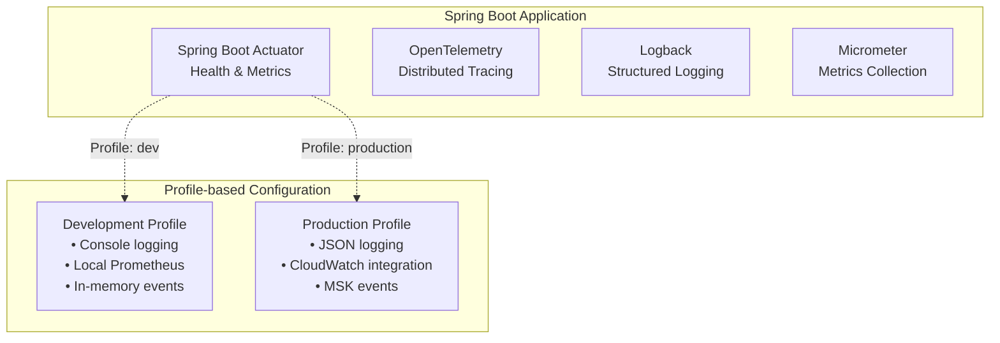
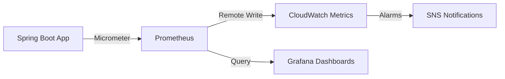
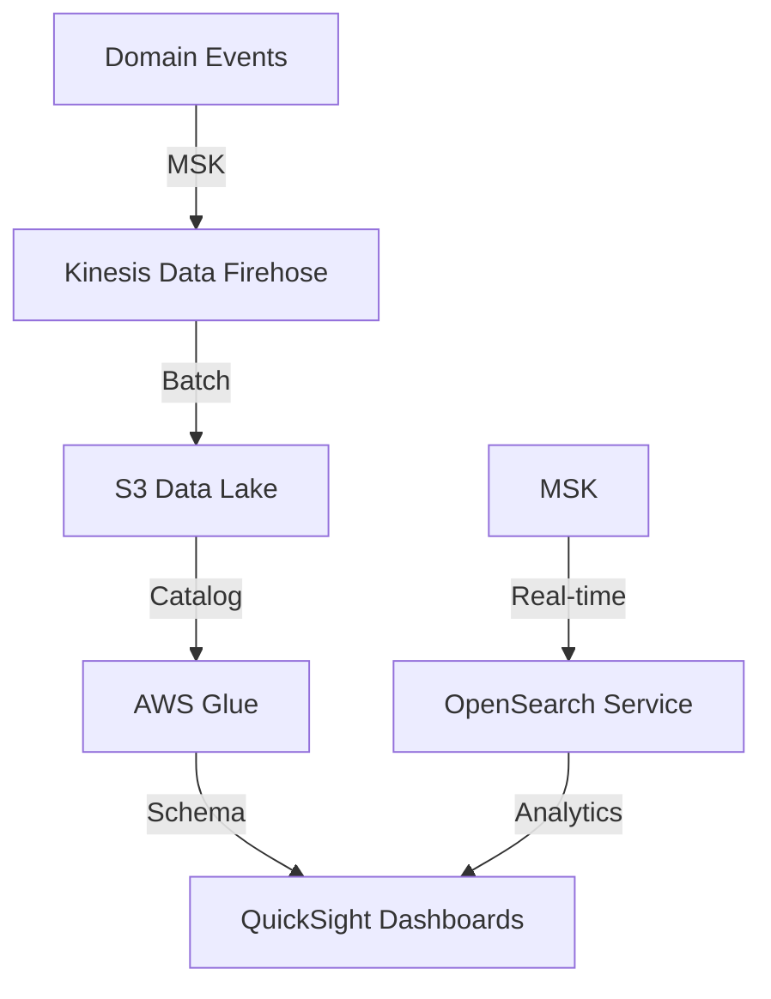

# Observability Architecture

## Overview

This document describes the comprehensive observability architecture for the GenAI Demo application, integrating logging, metrics, tracing, and business intelligence capabilities across development and production environments.

## Architecture Principles

### 1. Multi-Environment Strategy

- **Development**: Lightweight, local observability tools
- **Production**: Full AWS-native observability stack
- **Profile-based Configuration**: Automatic switching based on Spring profiles

### 2. Three Pillars of Observability

- **Logging**: Structured JSON logs with correlation IDs
- **Metrics**: Application and business metrics via Prometheus/CloudWatch
- **Tracing**: Distributed tracing with OpenTelemetry and AWS X-Ray

### 3. Event-Driven Analytics

- **Domain Events**: Business events streamed to analytics pipeline
- **Real-time Dashboards**: QuickSight dashboards for business insights
- **Cost Optimization**: Automated log archival and lifecycle management

## Component Architecture

### Application Layer Integration



### Infrastructure Components

#### Development Environment

- **Local Prometheus**: Docker Compose setup for metrics collection
- **Console Logging**: Colored, human-readable logs
- **In-Memory Events**: Simple event handling for debugging
- **H2 Console**: Database inspection and debugging

#### Production Environment

- **CloudWatch Logs**: Centralized log aggregation
- **CloudWatch Metrics**: Long-term metrics storage
- **AWS X-Ray**: Distributed tracing across services
- **Amazon MSK**: Event streaming for analytics
- **OpenSearch Service**: Advanced log search and analysis
- **QuickSight**: Business intelligence dashboards

## Logging Strategy

### Log Structure

```json
{
  "timestamp": "2024-01-15T10:30:45.123Z",
  "level": "INFO",
  "thread": "http-nio-8080-exec-1",
  "logger": "solid.humank.genaidemo.application.order.OrderApplicationService",
  "message": "Order created successfully",
  "mdc": {
    "correlationId": "abc-123-def",
    "userId": "CUST-001",
    "orderId": "ORDER-456",
    "traceId": "1-5e1b4e5f-38a7c5c3f5a1b2c3d4e5f6a7",
    "spanId": "38a7c5c3f5a1b2c3"
  },
  "kubernetes": {
    "pod": "genai-demo-7d4b8c9f8-xyz12",
    "namespace": "default",
    "node": "ip-10-0-1-100.ap-northeast-1.compute.internal"
  }
}
```

### Log Lifecycle Management

1. **Real-time (0-7 days)**: CloudWatch Logs for immediate access
2. **Warm storage (7-30 days)**: S3 Standard for cost optimization
3. **Cold storage (30+ days)**: S3 Glacier for long-term retention
4. **Search capability**: OpenSearch Service for advanced queries

## Metrics Collection

### Application Metrics

- **Business Metrics**: Order count, revenue, customer registrations
- **Performance Metrics**: Response times, throughput, error rates
- **System Metrics**: JVM memory, CPU usage, database connections
- **Custom Metrics**: Domain-specific KPIs and SLAs

### Metrics Pipeline



## Distributed Tracing

### Trace Context Propagation

- **OpenTelemetry**: Industry-standard tracing instrumentation
- **AWS X-Ray**: AWS-native tracing service
- **Correlation IDs**: MDC-based correlation across logs and traces
- **Span Attributes**: Rich metadata for trace analysis

### Trace Sampling Strategy

- **Development**: 100% sampling for complete visibility
- **Production**: Adaptive sampling based on traffic volume
- **Error Traces**: Always sample traces with errors
- **High-value Traces**: Always sample business-critical operations

## Event-Driven Analytics

### Domain Events Pipeline



### Business Intelligence Dashboards

#### Executive Dashboard

- Daily active customers
- Revenue trends and forecasts
- Order conversion rates
- System health overview

#### Customer Analytics

- Customer lifecycle metrics
- Segmentation analysis
- Loyalty program performance
- Churn prediction

#### Operational Dashboard

- Order processing funnel
- Payment success rates
- Inventory levels and alerts
- Delivery performance

## Security and Compliance

### Data Protection

- **PII Masking**: Automatic masking of sensitive data in logs
- **Encryption**: TLS for data in transit, encryption at rest
- **Access Control**: IAM-based access to observability tools
- **Audit Logging**: Security events and access logs

### Compliance Features

- **Data Retention**: Configurable retention policies
- **Data Residency**: Regional data storage compliance
- **Audit Trail**: Complete audit trail for all observability data
- **Privacy Controls**: GDPR-compliant data handling

## Cost Optimization

### Cost Management Strategies

1. **Log Sampling**: Intelligent sampling to reduce volume
2. **Metric Aggregation**: Pre-aggregated metrics for efficiency
3. **Storage Tiering**: Automated lifecycle management
4. **Resource Right-sizing**: Optimized instance sizes

### Cost Monitoring

- **CloudWatch Billing Alerts**: Automated cost notifications
- **Usage Analytics**: Detailed usage and cost breakdowns
- **Optimization Recommendations**: AI-driven cost optimization

## Disaster Recovery

### Backup Strategy

- **Multi-AZ Storage**: Observability data stored across AZs
- **Cross-Region Replication**: Critical data replicated to DR region
- **Point-in-Time Recovery**: Ability to restore to specific timestamps
- **Automated Backups**: Scheduled backups with retention policies

### Recovery Procedures

1. **Service Restoration**: Automated service recovery procedures
2. **Data Recovery**: Step-by-step data recovery processes
3. **Failover Testing**: Regular DR testing and validation
4. **RTO/RPO Targets**: Defined recovery time and point objectives

## Implementation Roadmap

### Phase 1: Foundation (Weeks 1-2)

- Spring Boot profile configuration
- Basic logging and metrics setup
- Development environment observability

### Phase 2: Production Infrastructure (Weeks 3-4)

- AWS CDK infrastructure deployment
- CloudWatch integration
- Basic alerting setup

### Phase 3: Advanced Observability (Weeks 5-6)

- Distributed tracing implementation
- OpenSearch Service setup
- Advanced dashboards

### Phase 4: Analytics and BI (Weeks 7-8)

- Event streaming pipeline
- QuickSight dashboard creation
- Business intelligence reports

### Phase 5: Optimization (Weeks 9-10)

- Cost optimization implementation
- Performance tuning
- Security hardening

## Monitoring and Alerting

### Alert Categories

1. **Critical**: Service down, data loss, security breaches
2. **Warning**: Performance degradation, capacity issues
3. **Info**: Deployment notifications, maintenance windows

### Alert Channels

- **SNS**: Email and SMS notifications
- **Slack**: Team collaboration channels
- **PagerDuty**: On-call escalation (if configured)
- **Dashboard**: Visual indicators in monitoring dashboards

## Best Practices

### Development Guidelines

1. **Structured Logging**: Always use structured JSON logging
2. **Correlation IDs**: Include correlation IDs in all operations
3. **Meaningful Metrics**: Create business-relevant metrics
4. **Error Handling**: Proper error logging and alerting

### Operational Guidelines

1. **Regular Reviews**: Weekly observability data reviews
2. **Capacity Planning**: Proactive capacity management
3. **Performance Baselines**: Establish and monitor baselines
4. **Incident Response**: Well-defined incident response procedures

## Related Documentation

- [AWS Infrastructure Architecture](../diagrams/aws_infrastructure.mmd)
- [Multi-Environment Configuration](../diagrams/multi_environment.mmd)
- \1
- [DDD Architecture](../diagrams/ddd_architecture.mmd)
- [Hexagonal Architecture](../diagrams/hexagonal_architecture.mmd)

> **Note**: The AWS infrastructure diagram has been simplified to show core components (EKS, RDS, S3, CloudWatch, ALB). For detailed infrastructure including CDK stacks, networking, observability services, and complete multi-service architecture, refer to the infrastructure documentation and deployment guides.
