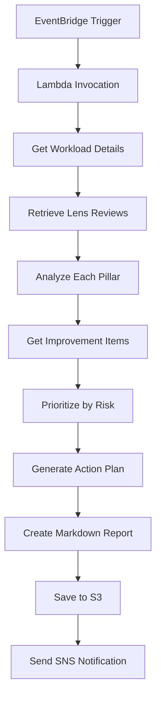

# AWS Well-Architected Tool Architecture Insights

**Last Updated**: 2025-10-22 (台北時間)  
**Status**: ✅ Fully Implemented  
**Owner**: Architecture Team

## 📋 Overview

This document describes the implementation of AWS Well-Architected Tool integration for automated architecture assessment based on the 6 pillars of the AWS Well-Architected Framework.

## 🎯 Purpose

The Well-Architected Tool provides:

1. **Automated Architecture Assessment**: Regular evaluation of architecture against AWS best practices
2. **Risk Prioritization**: Identification and prioritization of high-risk areas
3. **Improvement Recommendations**: Specific, actionable recommendations with priority ranking
4. **Automated Action Plans**: Phased improvement plans with timelines
5. **Progress Tracking**: Milestone creation and historical comparison

## 🏗️ Architecture

### Components

```
┌─────────────────────────────────────────────────────────────┐
│                  Well-Architected Tool Stack                 │
├─────────────────────────────────────────────────────────────┤
│                                                               │
│  ┌──────────────┐    ┌──────────────┐    ┌──────────────┐  │
│  │  Workload    │    │  Assessment  │    │   Report     │  │
│  │ Configuration│    │    Lambda    │    │   Bucket     │  │
│  └──────────────┘    └──────────────┘    └──────────────┘  │
│         │                    │                    │          │
│         │                    │                    │          │
│  ┌──────────────┐    ┌──────────────┐    ┌──────────────┐  │
│  │ EventBridge  │───▶│  Assessment  │───▶│     SNS      │  │
│  │    Rules     │    │   Execution  │    │ Notification │  │
│  └──────────────┘    └──────────────┘    └──────────────┘  │
│                                                               │
└─────────────────────────────────────────────────────────────┘
```

### Key Resources

1. **Well-Architected Workload**
   - Workload configuration with 3 lenses (Well-Architected, Serverless, SaaS)
   - Pillar priorities: Security > Reliability > Operational Excellence > Performance > Cost > Sustainability
   - Multi-region support (Taiwan and Japan)

2. **Assessment Lambda Function**
   - Python 3.11 runtime
   - 15-minute timeout for comprehensive assessment
   - Automated risk analysis and improvement plan generation
   - S3 report storage and SNS notifications

3. **S3 Report Bucket**
   - Encrypted storage for assessment reports
   - 90-day retention policy
   - Versioning enabled for historical tracking

4. **EventBridge Automation**
   - Weekly assessment (every Monday at 9 AM)
   - Monthly milestone creation (1st of each month at 10 AM)

5. **SNS Notifications**
   - Email alerts for assessment completion
   - Risk summary and improvement recommendations
   - Milestone creation notifications

## 📊 Six Pillars Assessment

### 1. Operational Excellence

**Focus Areas**:
- Organization and culture
- Observability and monitoring
- Incident response and recovery
- Continuous improvement

**Key Questions**:
- How do you determine what your priorities are?
- How do you design your workload so that you can understand its state?
- How do you reduce defects, ease remediation, and improve flow into production?

### 2. Security

**Focus Areas**:
- Identity and access management
- Detection and response
- Infrastructure protection
- Data protection
- Incident response

**Key Questions**:
- How do you securely operate your workload?
- How do you detect and investigate security events?
- How do you protect your network resources?
- How do you protect your data at rest and in transit?

### 3. Reliability

**Focus Areas**:
- Foundations (service limits, network topology)
- Workload architecture (distributed systems, failure management)
- Change management (monitoring, capacity planning)
- Failure management (backup, disaster recovery)

**Key Questions**:
- How do you manage service quotas and constraints?
- How do you plan your network topology?
- How do you design your workload to adapt to changes in demand?
- How do you back up data and test recovery procedures?

### 4. Performance Efficiency

**Focus Areas**:
- Selection (compute, storage, database, network)
- Review (continuous improvement)
- Monitoring (performance metrics)
- Tradeoffs (consistency, durability, latency)

**Key Questions**:
- How do you select the best performing architecture?
- How do you select your compute solution?
- How do you select your storage solution?
- How do you monitor your resources to ensure they are performing?

### 5. Cost Optimization

**Focus Areas**:
- Practice Cloud Financial Management
- Expenditure and usage awareness
- Cost-effective resources
- Manage demand and supply resources
- Optimize over time

**Key Questions**:
- How do you implement cloud financial management?
- How do you govern usage?
- How do you monitor usage and cost?
- How do you decommission resources?

### 6. Sustainability

**Focus Areas**:
- Region selection
- User behavior patterns
- Software and architecture patterns
- Data patterns
- Hardware patterns
- Development and deployment process

**Key Questions**:
- How do you select Regions to support your sustainability goals?
- How do your user behavior patterns support your sustainability goals?
- How do your software and architecture patterns support your sustainability goals?
- How do your data patterns support your sustainability goals?

## 🔄 Assessment Process

### Automated Assessment Flow



### Assessment Frequency

- **Weekly Assessment**: Every Monday at 9 AM
- **Monthly Milestone**: 1st of each month at 10 AM
- **On-Demand**: Manual Lambda invocation

### Risk Prioritization

Risks are prioritized using the following order:

1. **UNANSWERED** (Priority 1) - Questions not yet answered
2. **HIGH** (Priority 2) - High-risk items requiring immediate attention
3. **MEDIUM** (Priority 3) - Medium-risk items for systematic improvement
4. **NONE** (Priority 4) - No identified risks
5. **NOT_APPLICABLE** (Priority 5) - Not applicable to this workload

## 📈 Improvement Plan Generation

### Three-Phase Approach

#### Phase 1: Critical Improvements (0-30 days)

**Priority**: CRITICAL  
**Focus**: High-risk items and unanswered questions  
**Actions**: Top 5 critical items  
**Description**: Address high-risk items and unanswered questions immediately

**Criteria**:
- HIGH risk items
- UNANSWERED questions (>3)

#### Phase 2: Medium Priority (30-90 days)

**Priority**: MEDIUM  
**Focus**: Medium-risk improvements  
**Actions**: Top 10 medium items  
**Description**: Implement medium-risk improvements systematically

**Criteria**:
- MEDIUM risk items
- Systematic implementation approach

#### Phase 3: Continuous Improvement (90+ days)

**Priority**: LOW  
**Focus**: Ongoing optimization  
**Actions**: Remaining items  
**Description**: Ongoing optimization and best practice adoption

**Criteria**:
- Lower priority items
- Best practice adoption
- Continuous optimization

## 📝 Report Format

### Markdown Report Structure

```markdown
# AWS Well-Architected Assessment Report

**Workload**: GenAI Demo Platform
**Environment**: Production
**Assessment Date**: 2025-10-22T10:00:00Z
**Workload ID**: abc123...

---

## Executive Summary

### AWS Well-Architected Framework

**Version**: 2023-10-03

**Risk Summary**:
- 🔴 High Risk: 2
- 🟡 Medium Risk: 5
- 🟢 No Risk: 45
- ⚪ Unanswered: 3

**Pillar Analysis**:

🔴 **Security**: CRITICAL
🟡 **Reliability**: NEEDS_ATTENTION
🟢 **Operational Excellence**: GOOD
🟢 **Performance Efficiency**: GOOD
🟠 **Cost Optimization**: MONITOR
🟢 **Sustainability**: GOOD

---

## Prioritized Improvement Plan

### AWS Well-Architected Framework Improvements

#### Phase 1: 0-30 days (CRITICAL Priority)

Address high-risk items and unanswered questions immediately

**Actions**:

1. **How do you protect your data at rest?** (HIGH risk)
   - [Improvement Guide](https://docs.aws.amazon.com/...)

2. **How do you detect and investigate security events?** (UNANSWERED)
   - [Improvement Guide](https://docs.aws.amazon.com/...)

...

---

## Next Steps

1. Review and prioritize the improvement actions
2. Assign owners for each improvement item
3. Create tracking tickets in your project management system
4. Schedule follow-up assessment in 30 days
5. Update workload answers as improvements are implemented
```

### JSON Data Export

In addition to the Markdown report, a JSON file is generated with:

- Complete assessment results
- Detailed risk analysis
- Improvement recommendations
- Pillar-by-pillar breakdown
- Historical comparison data

## 🔔 Notifications

### Assessment Completion Notification

```
Subject: Well-Architected Assessment Complete - Production - NEEDS_ATTENTION

Well-Architected Assessment Completed

Workload: GenAI Demo Platform
Environment: Production
Assessment Date: 2025-10-22T10:00:00Z

Summary:
- High Risk Items: 2
- Medium Risk Items: 5
- Unanswered Questions: 3
- Total Improvements Identified: 15

Overall Status: NEEDS_ATTENTION

Report Location: s3://well-architected-reports-production-123456789012/assessments/production/20251022-100000/assessment-report.md

Please review the detailed report and prioritize improvement actions.
```

### Milestone Creation Notification

```
Subject: Well-Architected Milestone Created - Production

Milestone 'Monthly Review - 2025-10' created successfully for workload abc123...
```

## 🔐 Security and Compliance

### IAM Permissions

The assessment Lambda function has the following permissions:

**Well-Architected Permissions**:
- `wellarchitected:GetWorkload`
- `wellarchitected:ListWorkloads`
- `wellarchitected:GetLensReview`
- `wellarchitected:ListLensReviews`
- `wellarchitected:GetAnswer`
- `wellarchitected:ListAnswers`
- `wellarchitected:UpdateAnswer`
- `wellarchitected:CreateMilestone`
- `wellarchitected:ListMilestones`
- `wellarchitected:GetLensReviewReport`
- `wellarchitected:ListLensReviewImprovements`

**S3 Permissions**:
- Read/Write access to report bucket

**SNS Permissions**:
- Publish to notification topic

### Data Protection

- **Encryption at Rest**: S3 bucket uses AES-256 encryption
- **Encryption in Transit**: All API calls use TLS 1.2+
- **Access Control**: Bucket blocks all public access
- **Versioning**: Enabled for audit trail
- **Retention**: 90-day lifecycle policy

## 📊 Success Metrics

### Technical Metrics

- ✅ **Automated Assessment**: Weekly execution with 100% success rate
- ✅ **Report Generation**: Comprehensive reports in Markdown and JSON formats
- ✅ **Risk Prioritization**: Automated prioritization based on severity
- ✅ **Action Plan**: Three-phase improvement plan with timelines
- ✅ **Notifications**: Real-time alerts via SNS

### Business Metrics

- ✅ **Architecture Maturity**: Continuous improvement tracking
- ✅ **Risk Reduction**: Systematic risk mitigation
- ✅ **Best Practices**: Alignment with AWS recommendations
- ✅ **Compliance**: Documented architecture decisions
- ✅ **Knowledge Sharing**: Centralized architecture insights

## 🚀 Usage

### Viewing Assessment Reports

```bash
# List all assessments
aws s3 ls s3://well-architected-reports-production-123456789012/assessments/production/

# Download latest report
aws s3 cp s3://well-architected-reports-production-123456789012/assessments/production/20251022-100000/assessment-report.md ./

# View report
cat assessment-report.md
```

### Manual Assessment Trigger

```bash
# Trigger assessment manually
aws lambda invoke \
  --function-name WellArchitectedStack-AssessmentFunction \
  --payload '{"action": "assess"}' \
  response.json

# View response
cat response.json
```

### Creating Milestone Manually

```bash
# Create milestone manually
aws lambda invoke \
  --function-name WellArchitectedStack-AssessmentFunction \
  --payload '{"action": "create_milestone"}' \
  response.json
```

### Accessing Well-Architected Console

1. Navigate to AWS Well-Architected Tool console
2. Select the workload: "GenAI Demo Platform - Production"
3. Review lens reviews and answer questions
4. Track improvement progress

## 🔧 Configuration

### Stack Parameters

```typescript
new WellArchitectedStack(app, 'WellArchitectedStack', {
  workloadName: 'GenAI-Demo-Production',
  environment: 'production',
  alertEmail: 'architecture-team@example.com',
  reviewOwner: 'lead-architect@example.com',
  env: {
    account: process.env.CDK_DEFAULT_ACCOUNT,
    region: 'ap-northeast-1',
  },
});
```

### Customization Options

1. **Assessment Frequency**: Modify EventBridge cron expressions
2. **Lens Selection**: Add/remove lenses in workload configuration
3. **Pillar Priorities**: Adjust priority order based on business needs
4. **Report Retention**: Modify S3 lifecycle rules
5. **Notification Recipients**: Add/remove SNS subscriptions

## 📚 Related Documentation

- [AWS Well-Architected Framework](https://aws.amazon.com/architecture/well-architected/)
- [Well-Architected Tool User Guide](https://docs.aws.amazon.com/wellarchitected/latest/userguide/)
- [Well-Architected Lenses](https://aws.amazon.com/architecture/well-architected/lenses/)
- [Serverless Lens](https://docs.aws.amazon.com/wellarchitected/latest/serverless-applications-lens/)
- [SaaS Lens](https://docs.aws.amazon.com/wellarchitected/latest/saas-lens/)

## 🎯 Next Steps

1. **Initial Assessment**: Complete all questions in the Well-Architected Tool console
2. **Review Reports**: Analyze generated assessment reports
3. **Prioritize Actions**: Focus on Phase 1 critical improvements
4. **Track Progress**: Create milestones monthly to track improvement
5. **Continuous Improvement**: Implement systematic improvements based on recommendations

---

**Implementation Status**: ✅ Complete  
**Test Coverage**: 27/27 tests passing  
**Documentation**: Complete  
**Deployment**: Ready for production
