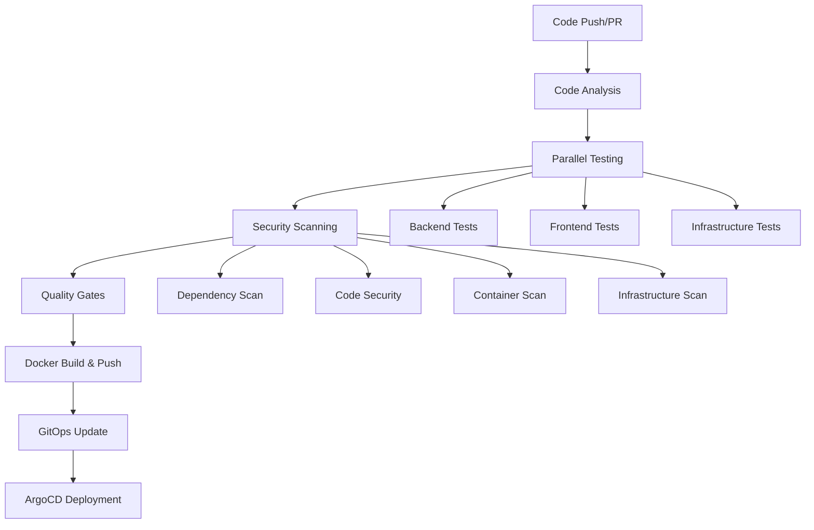

# CI/CD Pipeline Documentation

This directory contains the complete CI/CD pipeline configuration for the GenAI Demo project, implementing automated testing, security scanning, multi-architecture Docker builds, and GitOps deployment strategies.

## 🏗️ Pipeline Architecture

### Overview

The CI/CD pipeline follows modern DevOps practices:

- **Comprehensive Testing**: Unit, integration, BDD, and architecture tests
- **Security-First Approach**: Multi-layered security scanning and vulnerability assessment
- **Multi-Architecture Builds**: ARM64 Graviton3-optimized Docker images
- **Quality Gates**: Automated quality assurance and compliance checks
- **GitOps Deployment**: Automated manifest updates for ArgoCD

### Pipeline Flow



## 📁 Workflow Files

### Core Workflows

#### 1. `ci-cd.yml` - Main CI/CD Pipeline

**Triggers**: Push to main/develop branches, Pull Requests  
**Purpose**: Complete CI/CD pipeline with testing, security, and deployment

**Key Features**:

- **Change Detection**: Only run relevant tests based on file changes
- **Parallel Execution**: Backend, frontend, and infrastructure tests run in parallel
- **Multi-Architecture Builds**: ARM64 and AMD64 Docker images
- **Quality Gates**: Automated quality assurance with configurable thresholds
- **GitOps Integration**: Automatic Kubernetes manifest updates

**Jobs**:

1. **Code Analysis** - Change detection and dependency vulnerability scanning
2. **Backend Tests** - Unit, integration, BDD, and architecture tests
3. **Frontend Tests** - CMC and consumer frontend tests with Lighthouse
4. **Infrastructure Tests** - CDK unit, integration, and compliance tests
5. **Security Scanning** - Comprehensive security analysis
6. **Build & Push** - Multi-architecture Docker image builds
7. **Quality Gates** - Automated quality assurance and reporting
8. **Deploy Preparation** - GitOps manifest updates
9. **Notifications** - Status reporting and cleanup

#### 2. `security-scan.yml` - Security Scanning Workflow

**Triggers**: Workflow call, manual dispatch, daily schedule  
**Purpose**: Comprehensive security scanning across all components

**Scan Types**:

- **Dependency Vulnerabilities**: OWASP Dependency Check, npm audit
- **Static Code Analysis**: CodeQL, Semgrep
- **Container Security**: Trivy, Hadolint
- **Infrastructure Security**: CDK-nag, Checkov

#### 3. `performance-test.yml` - Performance Testing

**Triggers**: Manual dispatch, weekly schedule  
**Purpose**: Load testing and performance monitoring

**Test Types**:

- **Load Testing**: K6-based API load testing
- **Database Performance**: Database operation benchmarks
- **Frontend Performance**: Lighthouse CI performance audits

#### 4. `dependency-update.yml` - Dependency Management

**Triggers**: Weekly schedule, manual dispatch  
**Purpose**: Automated dependency updates with security focus

**Update Types**:

- **Security Updates**: Critical vulnerability patches
- **Minor Updates**: Compatible feature updates
- **Major Updates**: Breaking change updates (manual review)

#### 5. `release.yml` - Release Management

**Triggers**: Git tags, manual dispatch  
**Purpose**: Automated release creation with semantic versioning

**Release Process**:

1. Version validation and tag creation
2. Full test suite execution
3. Security scan validation
4. Release artifact building
5. Docker image publishing
6. Changelog generation
7. GitHub release creation
8. Deployment manifest updates

### Supporting Files

#### `dependabot.yml` - Automated Dependency Updates

Configures Dependabot for:

- Java/Gradle dependencies
- Node.js/npm dependencies
- Docker base images
- GitHub Actions

#### `CODEOWNERS` - Code Review Requirements

Defines review requirements for:

- Backend code (@backend-team)
- Frontend code (@frontend-team)
- Infrastructure code (@devops-team)
- Security-sensitive files (@security-team)

#### `pull_request_template.md` - PR Template

Standardized PR template including:

- Change description and type
- Testing checklist
- Security considerations
- Performance impact assessment
- Deployment considerations

## 🔧 Configuration

### Environment Variables

#### Required Secrets

```yaml
AWS_ACCESS_KEY_ID: AWS access key for ECR and deployments
AWS_SECRET_ACCESS_KEY: AWS secret key
AWS_ACCOUNT_ID: AWS account ID for ECR repositories
GITHUB_TOKEN: GitHub token for releases and PR comments
```

#### Pipeline Configuration

```yaml
# AWS Configuration
AWS_REGION: ap-northeast-1 (primary region)
AWS_REGION_DR: ap-east-2 (disaster recovery region)

# Build Configuration
JAVA_VERSION: '21'
NODE_VERSION: '18'

# Quality Gates
QUALITY_GATE_COVERAGE_THRESHOLD: 80
VULNERABILITY_SEVERITY_THRESHOLD: 'HIGH'
```

### ECR Repositories

The pipeline pushes to these ECR repositories:

- `genai-demo/backend` - Spring Boot backend
- `genai-demo/cmc-frontend` - Next.js CMC frontend
- `genai-demo/consumer-frontend` - Angular consumer frontend

### Docker Image Tags

Images are tagged with:

- `latest` - Latest main branch build
- `{branch-name}` - Branch-specific builds
- `{branch-name}-{sha}` - Commit-specific builds
- `{version}` - Release versions (e.g., v1.2.3)

## 🧪 Testing Strategy

### Test Categories

#### Backend Tests

1. **Unit Tests** (`./gradlew test`)
   - Pure business logic testing
   - Mock external dependencies
   - Fast execution (< 100ms per test)

2. **Integration Tests** (`./gradlew integrationTest`)
   - Database integration testing
   - External service integration
   - Spring context loading

3. **BDD Tests** (`./gradlew cucumber`)
   - Behavior-driven development scenarios
   - End-to-end user workflows
   - Gherkin feature specifications

4. **Architecture Tests** (`./gradlew testArchitecture`)
   - ArchUnit-based architecture validation
   - DDD pattern compliance
   - Dependency rule enforcement

#### Frontend Tests

1. **Unit Tests** (`npm run test:ci`)
   - Component testing
   - Service testing
   - Utility function testing

2. **Build Validation** (`npm run build`)
   - TypeScript compilation
   - Bundle optimization
   - Asset generation

3. **Code Linting** (`npm run lint`)
   - Code style enforcement
   - Best practice validation
   - Accessibility checks

#### Infrastructure Tests

1. **CDK Unit Tests** (`npm run test:unit`)
   - Construct testing
   - Resource configuration validation
   - Stack composition testing

2. **CDK Integration Tests** (`npm run test:integration`)
   - Cross-stack dependencies
   - Resource relationships
   - Configuration validation

3. **CDK Snapshot Tests** (`npm run test:snapshot`)
   - CloudFormation template validation
   - Infrastructure drift detection
   - Change impact analysis

4. **Compliance Tests** (`npm run test:compliance`)
   - Security rule validation
   - Best practice compliance
   - Cost optimization checks

### Test Execution Strategy

#### Parallel Execution

- Backend, frontend, and infrastructure tests run in parallel
- Matrix strategy for multiple test suites
- Optimized resource utilization

#### Conditional Execution

- Tests only run when relevant code changes
- Path-based change detection
- Efficient CI resource usage

#### Quality Thresholds

- Minimum test coverage: 80%
- Security vulnerability threshold: HIGH
- Performance regression detection

## 🔒 Security Implementation

### Multi-Layer Security Scanning

#### 1. Dependency Vulnerability Scanning

- **OWASP Dependency Check**: Java dependencies
- **npm audit**: Node.js dependencies
- **Trivy**: Container base images
- **GitHub Security Advisories**: Automated vulnerability detection

#### 2. Static Code Analysis

- **CodeQL**: Security-focused code analysis
- **Semgrep**: Custom security rules
- **ESLint Security**: Frontend security patterns

#### 3. Container Security

- **Trivy**: Container vulnerability scanning
- **Hadolint**: Dockerfile best practices
- **Multi-stage builds**: Minimal attack surface

#### 4. Infrastructure Security

- **CDK-nag**: AWS security best practices
- **Checkov**: Infrastructure-as-code security
- **AWS Config**: Runtime compliance monitoring

### Security Automation

#### Automated Security Updates

- Daily security scans
- Automated dependency updates for critical vulnerabilities
- Security issue creation for critical findings
- SARIF integration with GitHub Security tab

#### Security Quality Gates

- Block deployments with critical vulnerabilities
- Require security team review for security-sensitive changes
- Automated security regression testing

## 🚀 Deployment Strategy

### GitOps Workflow

#### 1. Image Building

- Multi-architecture Docker builds (ARM64/AMD64)
- Optimized for AWS Graviton3 processors
- Cached builds for faster execution

#### 2. Manifest Updates

- Automatic Kubernetes manifest updates
- Image tag updates with commit SHA
- Configuration versioning

#### 3. ArgoCD Integration

- Automatic deployment detection
- Blue-green deployment strategy
- Rollback capabilities

### Deployment Environments

#### Development Environment

- Automatic deployment from main branch
- Lightweight resource allocation
- Development-specific configurations

#### Staging Environment

- Manual deployment triggers
- Production-like environment
- Performance and integration testing

#### Production Environment

- Release-based deployments
- Full resource allocation
- Multi-region deployment support

## 📊 Monitoring and Observability

### Pipeline Monitoring

#### Metrics Collection

- Build duration tracking
- Test execution metrics
- Security scan results
- Deployment success rates

#### Alerting

- Pipeline failure notifications
- Security vulnerability alerts
- Performance regression alerts
- Deployment status updates

#### Reporting

- Quality gate reports
- Security scan summaries
- Performance test results
- Dependency update reports

### Artifact Management

#### Test Results

- JUnit XML reports
- Coverage reports
- Security scan results (SARIF)
- Performance test results

#### Build Artifacts

- Docker images in ECR
- Release binaries
- Documentation artifacts
- Infrastructure templates

#### Retention Policies

- Test results: 30 days
- Security scans: 30 days
- Release artifacts: 90 days
- Performance reports: 90 days

## 🔄 Maintenance and Updates

### Regular Maintenance Tasks

#### Weekly

- Dependency updates (automated)
- Security scans (automated)
- Performance tests (automated)

#### Monthly

- Pipeline optimization review
- Security policy updates
- Performance baseline updates

#### Quarterly

- Tool version updates
- Security audits
- Performance optimization review

### Pipeline Evolution

#### Continuous Improvement

- Pipeline performance optimization
- New tool integration
- Security enhancements
- Quality gate improvements

#### Version Management

- Workflow versioning
- Backward compatibility
- Migration strategies
- Documentation updates

## 🆘 Troubleshooting

### Common Issues

#### Build Failures

1. **Memory Issues**: Increase JVM heap size in Gradle configuration
2. **Test Timeouts**: Optimize test execution or increase timeout values
3. **Dependency Conflicts**: Review dependency updates and compatibility

#### Security Scan Failures

1. **False Positives**: Update security scan configuration
2. **New Vulnerabilities**: Review and update dependencies
3. **Policy Violations**: Update security policies or fix violations

#### Deployment Issues

1. **Image Pull Errors**: Verify ECR permissions and image tags
2. **Manifest Errors**: Validate Kubernetes manifest syntax
3. **ArgoCD Sync Issues**: Check ArgoCD configuration and connectivity

### Debug Procedures

#### Pipeline Debugging

1. Enable debug logging in workflow files
2. Use workflow dispatch for manual testing
3. Review GitHub Actions logs and artifacts

#### Security Debugging

1. Review SARIF files for detailed findings
2. Check security scan configurations
3. Validate security tool versions

#### Performance Debugging

1. Analyze performance test results
2. Review resource utilization metrics
3. Check for performance regressions

## 📚 Additional Resources

### Documentation

- GitHub Actions Documentation
- Docker Multi-Architecture Builds
- AWS CDK Testing
- ArgoCD GitOps

### Tools and Services

- Trivy Security Scanner
- CodeQL
- K6 Load Testing
- Lighthouse CI

### Best Practices

- CI/CD Security Best Practices
- Container Security Best Practices
- GitOps Best Practices

---

For questions or support, please contact the DevOps team or create an issue in the repository.