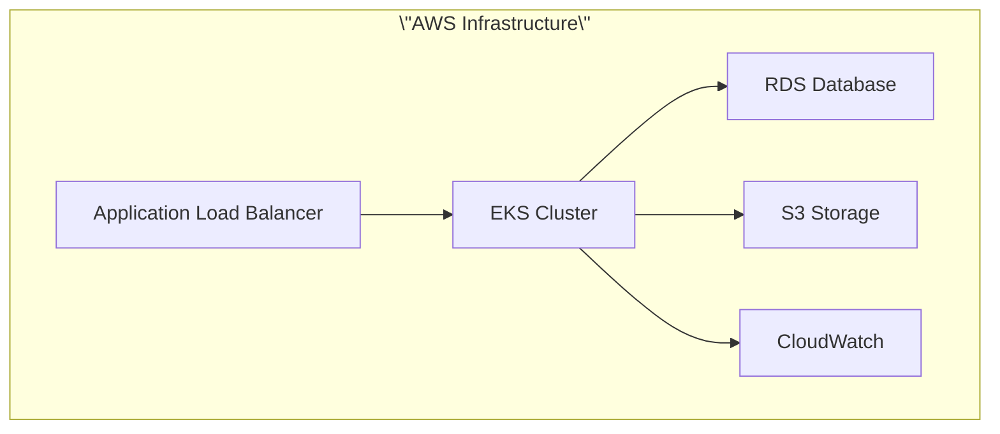

# Cross-Viewpoint and Perspective Document Cross-Reference Links

## Overview

This document provides intelligent cross-reference links between all architecture documents, helping readers quickly navigate to related documents and understand the relationships between different viewpoints and perspectives.

## 🔗 Core Navigation Links

### Main Entry Points

- **[Documentation Center Homepage](README.md)** - Complete navigation and search system
- **[Viewpoint-Perspective Cross-Reference Matrix](viewpoint-perspective-matrix.md)** - Impact analysis between viewpoints and perspectives
- **[Architecture Decision Records (ADR)](architecture/adr/)** - Records of all important architectural decisions

### Quick Navigation

| Navigation Type | Entry Document | Description |
|----------------|----------------|-------------|
| **Navigation by Role** | [Documentation Center - Navigation by Role](README.md#👨‍💼-navigation-by-role) | Architects, developers, DevOps, security engineers, etc. |
| **Navigation by Concern** | [Documentation Center - Navigation by Concern](README.md#🔍-navigation-by-concern) | System architecture, DDD, data architecture, security, etc. |
| **Visual Navigation** | [Documentation Center - Visual Navigation](README.md#📊-visual-navigation) | Diagram overview and visual architecture |
| **Smart Search** | [Documentation Center - Smart Search](README.md#🔍-smart-search-and-navigation) | Keyword search and topic navigation |

## 📊 Cross-Viewpoint References

### Functional Viewpoint

**Main Document**: [Functional Viewpoint Overview](viewpoints/functional/README.md)

#### Strongly Related Viewpoints
- **[Information Viewpoint](viewpoints/information/README.md)** - Domain events and data flow design
- **[Development Viewpoint](viewpoints/development/README.md)** - DDD tactical pattern implementation
- **[Deployment Viewpoint](viewpoints/deployment/README.md)** - Deployment strategies for functional modules

#### Related Documents
- **[Domain Model Design](viewpoints/functional/domain-model.md)** ↔ **[Domain Event Design](viewpoints/information/domain-events.md)**
- **[Aggregate Root Design](viewpoints/functional/aggregates.md)** ↔ **Hexagonal Architecture Implementation**
- **[Bounded Contexts](viewpoints/functional/bounded-contexts.md)** ↔ **[Infrastructure as Code](viewpoints/deployment/infrastructure-as-code.md)**

#### Related Diagrams
- **[Domain Model Diagram](diagrams/plantuml/domain-model-diagram.svg)** - Complete domain model visualization
- **[Bounded Context Diagram](diagrams/plantuml/bounded-context-diagram.svg)** - Context boundaries
- **[Event Storming Series](diagrams/plantuml/event-storming/)** - Business process analysis

### Context Viewpoint

**Main Document**: [Context Viewpoint Overview](viewpoints/context/README.md)

#### Strongly Related Viewpoints
- **[Functional Viewpoint](viewpoints/functional/README.md)** - Functional requirements for external system integration
- **[Deployment Viewpoint](viewpoints/deployment/README.md)** - Deployment integration with external systems
- **[Operational Viewpoint](viewpoints/operational/README.md)** - External system monitoring and integration status

#### Related Documents
- **[System Boundary Definition](viewpoints/context/README.md#system-boundaries-and-external-dependencies)** ↔ **[Functional Boundary Design](viewpoints/functional/bounded-contexts.md)**
- **[External System Integration](viewpoints/context/README.md#external-system-integration)** ↔ **[Infrastructure Deployment](viewpoints/deployment/README.md)**
- **[Stakeholder Analysis](viewpoints/context/README.md#stakeholder-analysis)** ↔ **[Operational Monitoring Requirements](viewpoints/operational/README.md)**

#### Related Diagrams
- **[System Context Diagram](diagrams/generated/context/system-context-overview.png)** - Complete system boundaries and external dependencies
- **[External Integration Architecture](diagrams/generated/context/external-integrations.png)** - External system integration design
- **[Stakeholder Interaction Diagram](diagrams/generated/context/stakeholder-interactions.png)** - Stakeholder relationship analysis

### Information Viewpoint

**Main Document**: [Information Viewpoint Overview](viewpoints/information/README.md)

#### Strongly Related Viewpoints
- **[Functional Viewpoint](viewpoints/functional/README.md)** - Correspondence between business logic and data models
- **[Concurrency Viewpoint](viewpoints/concurrency/README.md)** - Event-driven and asynchronous processing
- **[Operational Viewpoint](viewpoints/operational/README.md)** - Data monitoring and observability

#### Related Documents
- **[Domain Event Design](viewpoints/information/domain-events.md)** ↔ **[Aggregate Root Design](viewpoints/functional/aggregates.md)**
- **[Architecture Elements](viewpoints/information/architecture-elements.md)** ↔ **[Concurrency Viewpoint Overview](viewpoints/concurrency/README.md)**

#### Related Diagrams
- **Event-Driven Architecture Diagram**

```mermaid
graph LR
    subgraph Domain Events [\"Domain Events\"]
        OCE[OrderCreatedEvent]
        OIAE[OrderItemAddedEvent]
        PRE[PaymentRequestedEvent]
        PFE[PaymentFailedEvent]
    end
    
    subgraph Event Processing [\"Event Processing\"]
        EP[DomainEventPublisherService]
        EB[DomainEventBus]
        OS[OrderProcessingSaga]
    end
    
    subgraph Event Listeners [\"Event Listeners\"]
        PS[PaymentService]
        LS[LogisticsService]
    end
    
    AGG[Order<br>Aggregate Root] -->|Generates| OCE
    AGG -->|Generates| OIAE
    OCE -->|Publishes to| EP
    OIAE -->|Publishes to| EP
    EP -->|Sends to| EB
    EB -->|Distributes| OS
    EB -->|Distributes| PS
    EB -->|Distributes| LS
    OS -->|Coordinates| PS
    OS -->|Coordinates| LS
    PS -->|Generates| PRE
    PS -->|Generates| PFE
    PRE -->|Publishes to| EP
    PFE -->|Publishes to| EP
    
    classDef event fill:#ffcc99,stroke:#333,stroke-width:2px
    classDef publisher fill:#99ccff,stroke:#333,stroke-width:2px
    classDef handler fill:#cc99ff,stroke:#333,stroke-width:2px
    classDef aggregateRoot fill:#bbf,stroke:#333,stroke-width:2px
    
    class OCE,OIAE,PRE,PFE event
    class EP,EB publisher
    class OS,PS,LS handler
    class AGG aggregateRoot
```

- **[CQRS Pattern Diagram](diagrams/plantuml/cqrs-pattern-diagram.svg)** - Command Query Responsibility Segregation
- **[Event Storming Detailed Analysis](diagrams/plantuml/event-storming/)** - Big Picture, Process Level, Design Level

### Concurrency Viewpoint

**Main Document**: [Concurrency Viewpoint Overview](viewpoints/concurrency/README.md)

#### Strongly Related Viewpoints
- **[Information Viewpoint](viewpoints/information/README.md)** - Event-driven architecture and data consistency
- **[Operational Viewpoint](viewpoints/operational/README.md)** - Concurrency monitoring and performance tuning

#### Related Documents
- **Concurrency Processing Strategy** ↔ **[Domain Event Design](viewpoints/information/domain-events.md)**
- **Asynchronous Processing** ↔ **[Observability Overview](viewpoints/operational/observability-overview.md)**

#### Related Diagrams
- **Event-Driven Architecture Diagram** (same as above) - Concurrent event processing
- **[System Architecture Overview](diagrams/mermaid/architecture-overview.md)** - Concurrent processing layer

### Development Viewpoint

**Main Document**: [Development Viewpoint Overview](viewpoints/development/README.md)

#### Strongly Related Viewpoints
- **[Functional Viewpoint](viewpoints/functional/README.md)** - Implementation of DDD tactical patterns
- **[Deployment Viewpoint](viewpoints/deployment/README.md)** - Development environment and CI/CD processes

#### Related Documents
- **Hexagonal Architecture Implementation** ↔ **[Domain Model Design](viewpoints/functional/domain-model.md)**
- **Development Workflow** ↔ **[Infrastructure as Code](viewpoints/deployment/infrastructure-as-code.md)**
- **Epic Implementation Guide** ↔ **[Aggregate Root Design](viewpoints/functional/aggregates.md)**

#### Related Diagrams
- **[Hexagonal Architecture Diagram](diagrams/mermaid/hexagonal-architecture.md)** - Ports and adapters implementation
- **[DDD Layered Architecture Diagram](diagrams/mermaid/ddd-layered-architecture.md)** - Complete development architecture

### Deployment Viewpoint

**Main Document**: [Deployment Viewpoint Overview](viewpoints/deployment/README.md)

#### Strongly Related Viewpoints
- **[Development Viewpoint](viewpoints/development/README.md)** - CI/CD processes and build strategies
- **[Operational Viewpoint](viewpoints/operational/README.md)** - Post-deployment monitoring and maintenance

#### Related Documents
- **[Infrastructure as Code](viewpoints/deployment/infrastructure-as-code.md)** ↔ **Development Workflow**
- **[Production Deployment Checklist](viewpoints/deployment/production-deployment-checklist.md)** ↔ **[Observability Overview](viewpoints/operational/observability-overview.md)**
- **[Observability Deployment](viewpoints/deployment/observability-deployment.md)** ↔ **[Production Observability Testing Guide](viewpoints/operational/production-observability-testing-guide.md)**

#### Related Diagrams
- **[Deployment Architecture Diagram](diagrams/plantuml/deployment-diagram.svg)** - Complete deployment architecture
- **AWS Infrastructure Diagram**



- **Multi-Environment Architecture Diagram**

```mermaid
graph TB
    subgraph DEV [\"Development Environment\"]
        DEV_APP[Spring Boot App<br/>Profile: dev]
        H2_DB[(H2 Database)]
        MEMORY_EVENTS[In-Memory Events]
    end
    
    subgraph PROD [\"Production Environment\"]
        PROD_APP[Spring Boot App<br/>Profile: production]
        RDS_DB[(RDS PostgreSQL)]
        MSK_EVENTS[MSK Events]
    end
    
    subgraph CONFIG [\"Configuration\"]
        BASE_CONFIG[application.yml]
        DEV_CONFIG[application-dev.yml]
        PROD_CONFIG[application-production.yml]
    end
    
    BASE_CONFIG --> DEV_CONFIG
    BASE_CONFIG --> PROD_CONFIG
    
    DEV_CONFIG --> DEV_APP
    PROD_CONFIG --> PROD_APP
    
    DEV_APP --> H2_DB
    DEV_APP --> MEMORY_EVENTS
    
    PROD_APP --> RDS_DB
    PROD_APP --> MSK_EVENTS
    
    classDef dev fill:#e8f5e8,stroke:#2e7d32,stroke-width:2px
    classDef prod fill:#ffebee,stroke:#c62828,stroke-width:2px
    classDef config fill:#fff3e0,stroke:#e65100,stroke-width:2px
    
    class DEV_APP,H2_DB,MEMORY_EVENTS dev
    class PROD_APP,RDS_DB,MSK_EVENTS prod
    class BASE_CONFIG,DEV_CONFIG,PROD_CONFIG config
```

### Operational Viewpoint

**Main Document**: [Operational Viewpoint Overview](viewpoints/operational/README.md)

#### Strongly Related Viewpoints
- **[Deployment Viewpoint](viewpoints/deployment/README.md)** - Deployment strategies and operational readiness
- **[Concurrency Viewpoint](viewpoints/concurrency/README.md)** - Concurrency monitoring and performance tuning
- **[Information Viewpoint](viewpoints/information/README.md)** - Data monitoring and event tracking

#### Related Documents
- **[Observability Overview](viewpoints/operational/observability-overview.md)** ↔ **[Observability Deployment](viewpoints/deployment/observability-deployment.md)**
- **[Production Observability Testing Guide](viewpoints/operational/production-observability-testing-guide.md)** ↔ **[Production Deployment Checklist](viewpoints/deployment/production-deployment-checklist.md)**
- **[Configuration Guide](viewpoints/operational/configuration-guide.md)** ↔ **[Infrastructure as Code](viewpoints/deployment/infrastructure-as-code.md)**

#### Related Diagrams
- **Observability Architecture Diagram**

```mermaid
graph TB
    subgraph APP [\"Spring Boot Application\"]
        ACTUATOR[Spring Boot Actuator]
        OTEL[OpenTelemetry Agent]
        LOGBACK[Logback JSON Logging]
        MICROMETER[Micrometer Metrics]
    end
    
    subgraph K8S [\"Kubernetes Cluster\"]
        FLUENT[Fluent Bit DaemonSet]
        PROMETHEUS[Prometheus]
        GRAFANA[Grafana]
    end
    
    subgraph AWS [\"AWS Services\"]
        CW_LOGS[CloudWatch Logs]
        CW_METRICS[CloudWatch Metrics]
        XRAY[AWS X-Ray]
        OPENSEARCH[OpenSearch Service]
    end
    
    ACTUATOR --> PROMETHEUS
    LOGBACK --> FLUENT
    OTEL --> XRAY
    MICROMETER --> PROMETHEUS
    
    FLUENT --> CW_LOGS
    PROMETHEUS --> CW_METRICS
    GRAFANA --> PROMETHEUS
    
    CW_LOGS --> OPENSEARCH
    
    classDef application fill:#e1f5fe,stroke:#01579b,stroke-width:2px
    classDef kubernetes fill:#f3e5f5,stroke:#4a148c,stroke-width:2px
    classDef aws fill:#fff3e0,stroke:#e65100,stroke-width:2px
    
    class ACTUATOR,OTEL,LOGBACK,MICROMETER application
    class FLUENT,PROMETHEUS,GRAFANA kubernetes
    class CW_LOGS,CW_METRICS,XRAY,OPENSEARCH aws
```

- **[Detailed Observability Diagram](diagrams/plantuml/observability-diagram.svg)** - Detailed monitoring component design

## 🎯 Cross-Perspective References

### Security Perspective

**Main Document**: [Security Perspective Overview](perspectives/security/README.md)

#### Cross-Viewpoint Applications
- **[Functional Viewpoint Security Considerations](viewpoints/functional/quality-considerations.md)** - Business logic security
- **[Information Viewpoint Security Considerations](viewpoints/information/README.md)** - Data security and privacy
- **[Development Viewpoint Security Considerations](viewpoints/development/README.md)** - Secure coding practices
- **[Deployment Viewpoint Security Considerations](viewpoints/deployment/README.md)** - Infrastructure security
- **[Operational Viewpoint Security Considerations](viewpoints/operational/README.md)** - Security monitoring and incident response

#### Related Documents
- **[Cross-Viewpoint Security Applications](perspectives/security/cross-viewpoint-application.md)** - Specific security implementations across viewpoints

#### Related Diagrams
- **[Security Architecture Diagram](diagrams/plantuml/security-architecture-diagram.svg)** - Complete security architecture design

### Performance Perspective

**Main Document**: [Performance Perspective Overview](perspectives/performance/README.md)

#### Cross-Viewpoint Applications
- **[Information Viewpoint Performance Considerations](viewpoints/information/README.md)** - Data access and query optimization
- **[Concurrency Viewpoint Performance Considerations](viewpoints/concurrency/README.md)** - Concurrent processing and load balancing
- **[Deployment Viewpoint Performance Considerations](viewpoints/deployment/README.md)** - Infrastructure performance configuration
- **[Operational Viewpoint Performance Considerations](viewpoints/operational/README.md)** - Performance monitoring and tuning

#### Related Diagrams
- **[System Performance Architecture](diagrams/mermaid/architecture-overview.md)** - Performance critical paths
- **Event-Driven Performance** (same diagram as above) - High-performance event processing

### Availability Perspective

**Main Document**: [Availability Perspective Overview](perspectives/availability/README.md)

#### Cross-Viewpoint Applications
- **[Functional Viewpoint Availability Considerations](viewpoints/functional/README.md)** - Fault-tolerant design for critical functions
- **[Concurrency Viewpoint Availability Considerations](viewpoints/concurrency/README.md)** - Concurrent failure isolation
- **[Deployment Viewpoint Availability Considerations](viewpoints/deployment/README.md)** - High availability deployment strategies
- **[Operational Viewpoint Availability Considerations](viewpoints/operational/README.md)** - Failure detection and automatic recovery

#### Related Diagrams
- **High Availability Architecture** (Multi-Environment diagram above) - Multi-environment high availability design
- **Disaster Recovery Architecture** (AWS Infrastructure diagram above) - Disaster recovery strategy

### Evolution Perspective

**Main Document**: [Evolution Perspective Overview](perspectives/evolution/README.md)

#### Cross-Viewpoint Applications
- **[Functional Viewpoint Evolution Considerations](viewpoints/functional/README.md)** - Function expansion and business rule flexibility
- **[Development Viewpoint Evolution Considerations](viewpoints/development/README.md)** - Code quality and technical debt management

#### Related Diagrams
- **[Evolution Architecture Diagram](diagrams/mermaid/ddd-layered-architecture.md)** - Evolvable layered architecture

### Usability Perspective

**Main Document**: [Usability Perspective Overview](perspectives/usability/README.md)

#### Cross-Viewpoint Applications
- **[Functional Viewpoint Usability Considerations](viewpoints/functional/README.md)** - User experience and interface design

#### Related Diagrams
- **[API Interaction Diagram](diagrams/mermaid/api-interactions.md)** - User interface and API interactions

### Regulation Perspective

**Main Document**: [Regulation Perspective Overview](perspectives/regulation/README.md)

#### Cross-Viewpoint Applications
- **[Information Viewpoint Regulation Considerations](viewpoints/information/README.md)** - Data governance and privacy protection
- **[Operational Viewpoint Regulation Considerations](viewpoints/operational/README.md)** - Compliance monitoring and audit support

#### Related Diagrams
- **[Compliance Architecture Diagram](diagrams/plantuml/observability-diagram.svg)** - Compliance monitoring and auditing

### Location Perspective

**Main Document**: [Location Perspective Overview](perspectives/location/README.md)

#### Cross-Viewpoint Applications
- **[Deployment Viewpoint Location Considerations](viewpoints/deployment/README.md)** - Geographically distributed deployment strategies

#### Related Diagrams
- **Geographic Distribution Diagram** (AWS Infrastructure diagram above) - Multi-region deployment architecture

### Cost Perspective

**Main Document**: [Cost Perspective Overview](perspectives/cost/README.md)

#### Cross-Viewpoint Applications
- **[Development Viewpoint Cost Considerations](viewpoints/development/README.md)** - Development efficiency and maintenance costs
- **[Deployment Viewpoint Cost Considerations](viewpoints/deployment/README.md)** - Infrastructure cost optimization
- **[Operational Viewpoint Cost Considerations](viewpoints/operational/README.md)** - Operational cost monitoring

#### Related Diagrams
- **Cost Optimization Diagram** (Multi-Environment diagram above) - Cost-effective architecture design

## 🔧 Professional Domain Cross-References

### API Design and Integration

#### Core Documents
- **API Versioning Strategy** ↔ **[Evolution Perspective](perspectives/evolution/README.md)**
- **Frontend Integration Guide** ↔ **[Usability Perspective](perspectives/usability/README.md)**
- **Observability API** ↔ **[Operational Viewpoint](viewpoints/operational/README.md)**

#### Related Diagrams
- **[API Interaction Diagram](diagrams/mermaid/api-interactions.md)** - API design and interaction relationships

### MCP (Model Context Protocol) Integration

#### Core Documents
- **[MCP Integration Guide](mcp/README.md)** ↔ **[Development Viewpoint](viewpoints/development/README.md)**
- **[Excalidraw MCP Usage](mcp/excalidraw-mcp-usage-guide.md)** ↔ **[Diagram Tools Guide](diagrams/diagram-tools-guide.md)**

### Testing and Quality Assurance

#### Core Documents
- **[Test Performance Monitoring](testing/test-performance-monitoring.md)** ↔ **[Performance Perspective](perspectives/performance/README.md)**
- **[Test Configuration Examples](testing/test-configuration-examples.md)** ↔ **[Development Viewpoint](viewpoints/development/README.md)**

## 📊 Diagram Cross-References

### By Diagram Type

#### Mermaid Diagrams (GitHub Direct Display)
- **[System Architecture Overview](diagrams/mermaid/architecture-overview.md)** - Links to all viewpoints
- **[DDD Layered Architecture](diagrams/mermaid/ddd-layered-architecture.md)** - Links to functional and development viewpoints
- **[Hexagonal Architecture](diagrams/mermaid/hexagonal-architecture.md)** - Links to development viewpoint
- **[Event-Driven Architecture](diagrams/mermaid/event-driven-architecture.md)** - Links to information and concurrency viewpoints
- **[API Interaction Diagram](diagrams/mermaid/api-interactions.md)** - Links to usability perspective

#### PlantUML Diagrams (Detailed UML)
- **[Domain Model Diagram](diagrams/plantuml/domain-model-diagram.svg)** - Links to functional viewpoint
- **[Bounded Context Diagram](diagrams/plantuml/bounded-context-diagram.svg)** - Links to functional viewpoint
- **[Event Storming Series](diagrams/plantuml/event-storming/)** - Links to information viewpoint
- **[Security Architecture Diagram](diagrams/plantuml/security-architecture-diagram.svg)** - Links to security perspective
- **[Deployment Architecture Diagram](diagrams/plantuml/deployment-diagram.svg)** - Links to deployment viewpoint
- **[Observability Diagram](diagrams/plantuml/observability-diagram.svg)** - Links to operational viewpoint

### By Viewpoint

#### Functional Viewpoint Related Diagrams
- **[Domain Model Diagram](diagrams/plantuml/domain-model-diagram.svg)**
- **[Bounded Context Diagram](diagrams/plantuml/bounded-context-diagram.svg)**
- **[Use Case Diagram](diagrams/plantuml/use-case-diagram.svg)**

#### Information Viewpoint Related Diagrams
- **[Event Storming Series](diagrams/plantuml/event-storming/)**
- **[CQRS Pattern Diagram](diagrams/plantuml/cqrs-pattern-diagram.svg)**
- **[Event Sourcing Diagram](diagrams/plantuml/event-sourcing-diagram.svg)**

#### Concurrency Viewpoint Related Diagrams
- **Event-Driven Architecture Diagram** (shown above)
- **[Concurrent Processing Diagram](diagrams/mermaid/architecture-overview.md)**

#### Development Viewpoint Related Diagrams
- **[Hexagonal Architecture Diagram](diagrams/mermaid/hexagonal-architecture.md)**
- **[DDD Layered Architecture Diagram](diagrams/mermaid/ddd-layered-architecture.md)**

#### Deployment Viewpoint Related Diagrams
- **[Deployment Architecture Diagram](diagrams/plantuml/deployment-diagram.svg)**
- **AWS Infrastructure Diagram** (shown above)
- **Multi-Environment Architecture Diagram** (shown above)

#### Operational Viewpoint Related Diagrams
- **Observability Architecture Diagram** (shown above)
- **[Detailed Observability Diagram](diagrams/plantuml/observability-diagram.svg)**

## 🎯 Usage Recommendations

### Navigation Strategies

1. **Beginner's Guide**: Start from [Documentation Center Homepage](README.md), use role navigation to find appropriate entry points
2. **Deep Learning**: Use [Viewpoint-Perspective Matrix](viewpoint-perspective-matrix.md) to understand relationships
3. **Practical Application**: Use concern navigation to quickly locate relevant documents based on specific needs
4. **Problem Solving**: Use smart search functionality and cross-references to quickly find solutions

### Document Maintenance

- **Automated Synchronization**: Use `python scripts/sync-diagram-references.py` to maintain diagram references
- **Link Checking**: Regularly run `./scripts/validate-docs.sh` to check link validity
- **Cross-Reference Updates**: Update cross-reference relationships in this document when adding new documents

---

**Maintenance Note**: This document is automatically updated as architecture documentation evolves, ensuring accuracy and completeness of cross-references.
