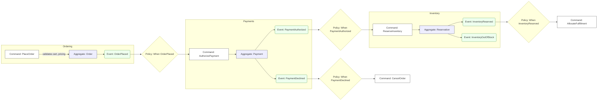
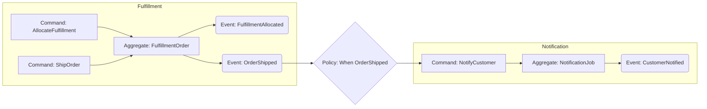
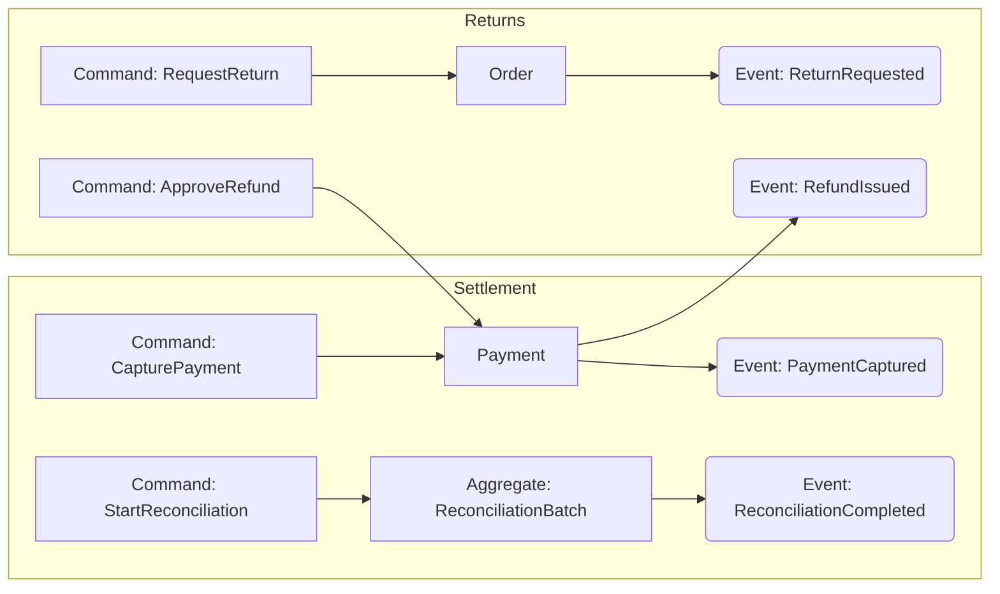
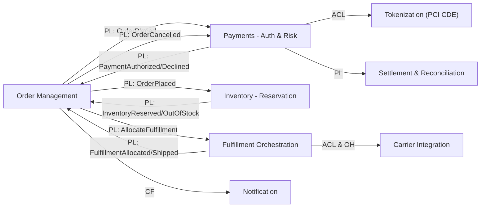
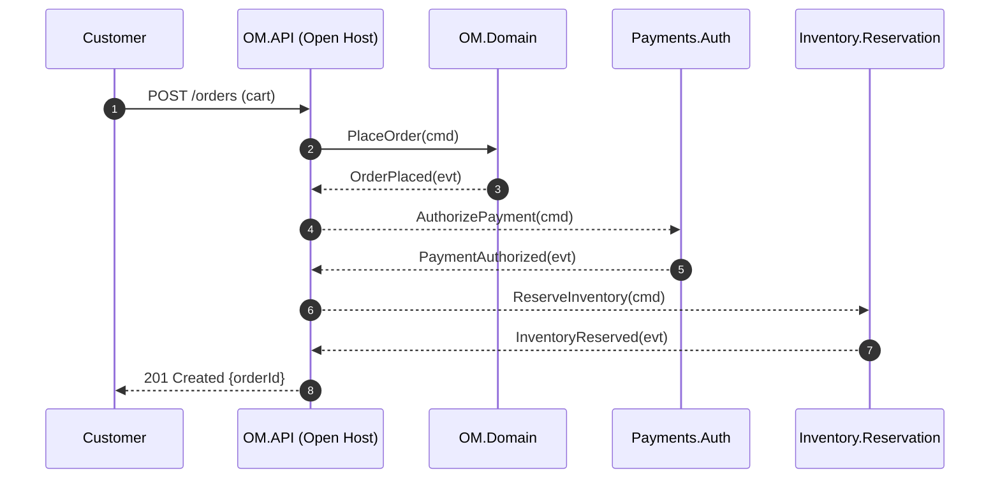
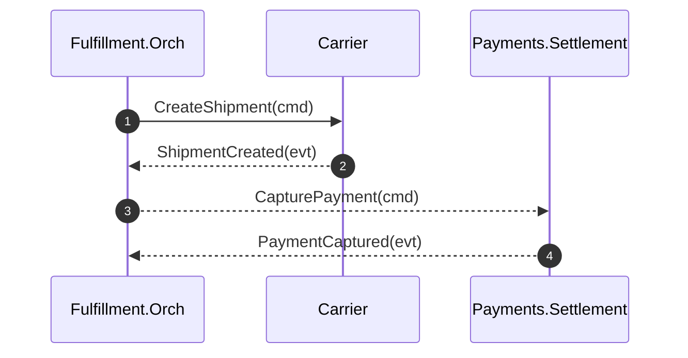
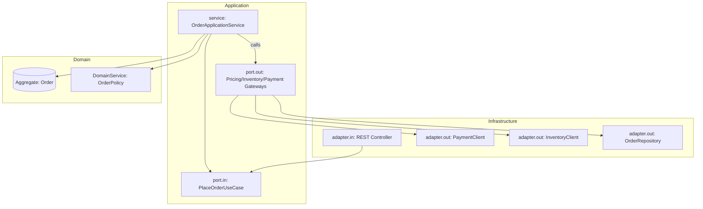
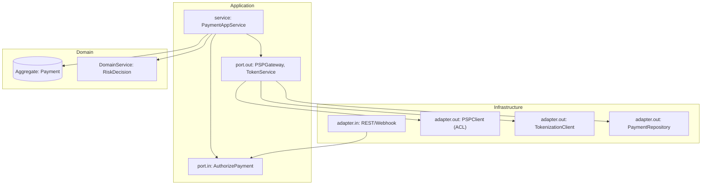

# DDD + Hexagonal Architecture: From Problem Domain to Solution Domain (genai-demo Reference) (繁體中文版)

> **注意**: 此文件需要翻譯。原始英文版本請參考對應的英文文件。

# DDD + Hexagonal Architecture: From Problem Domain to Solution Domain (genai-demo Reference)

> This document clearly illustrates the progression from **Subdomain** ➜ **Bounded Context** ➜ **Hexagonal Architecture (Ports & Adapters)**:
> 1) Event Storming Big Picture, 2) Subdomain ➜ Context Mapping, 3) Context Map, 4) Representative Sequence Diagrams, 5) Aggregates & Invariants, 6) Event Contracts (Published Language), 7) Hex Diagrams & Port/Adapter, 8) Modularization & Test Governance (ArchUnit).

---

## 0. Scope and Actors
- **Business Objectives**: Support order placement, payment authorization, inventory reservation, shipping & delivery, settlement & reconciliation, returns.
- **Actors**: Customers, Customer Service, Warehouse Staff, Finance, Risk Management.
- **External Systems**: Payment Service Providers (PSP), Carriers, Tax/Accounting, KYC/AML.

---

## 1. Event Storming (Big Picture)
> Scenario-based illustration following the main flow: "Order Placement ➜ Authorization ➜ Reservation ➜ Fulfillment ➜ Shipping ➜ Settlement". Color semantics indicated by text: `Command`, `Aggregate`, `Event`, `Policy`, `External`.

### 1.1 Ordering & Payment Authorization


### 1.2 Fulfillment, Shipping, and Notifications


### 1.3 Settlement, Reconciliation & Refunds


---

## 2. Subdomain ➜ Bounded Context (When to Split One-to-Many)

| Subdomain | Typical Upstream/Downstream Capabilities | Suggested Bounded Contexts | Why Split (One-to-Many Signals) |
|---|---|---|---|
| Ordering | Create/manage orders, cancellation, modifications | **Order Management** | Different semantics and consistency with Fulfillment/Payment; order state machine separated from shipping/payment flows |
| Payments | Authorization, capture, reconciliation, refunds, disputes | **Auth & Risk**, **Settlement & Reconciliation**, **Dispute/Chargeback**, **Tokenization** | Different consistency and timing requirements (real-time vs. batch), compliance boundaries (PCI CDE), process/external protocol differences |
| Inventory | Inventory views, reservations, restocking | **Reservation**, **StockLedger** | Different transaction boundaries and read/write models, different evolution rates for reservations vs. ledger |
| Fulfillment | Allocation, shipping, reverse logistics | **Fulfillment Orchestration**, **Carrier Integration** | Multiple Carrier integrations (protocol/SLA differences) vs. internal operational models |
| Customer | Identity, consent/preferences | **Identity/Profile**, **Consent/Privacy** | Different regulatory/data levels, semantic conflicts |

> Decision Criteria: Consistency rule differences, language dialects, read/write separation, compliance boundaries, external integrations, evolution rates, organizational boundaries, regional regulations, event storming clustering.

---

## 3. Context Map
> Relationship patterns annotated: `PL`=Published Language, `ACL`=Anti-Corruption Layer, `OH`=Open Host Service, `C/S`=Customer/Supplier, `CF`=Conformist.



---

## 4. Representative Sequence Diagrams

### 4.1 Place Order (Including Authorization and Reservation)


### 4.2 Ship & Capture (Shipping and Settlement)


---

## 5. Aggregates & Invariants

### 5.1 Order Management
- **Order** (Aggregate Root)
  - Invariants:
    1) `Order` cannot be shipped before `PENDING` status;
    2) `CANCELLED` orders cannot be modified;
    3) Only `PaymentAuthorized` & `InventoryReserved` can transition to `READY_TO_SHIP`.

### 5.2 Payments - Auth & Risk
- **Payment** (AR)
  - Invariants:
    1) Authorization cannot be duplicated;
    2) After `CAPTURED`, no state reversal except refunds;
    3) Card numbers must never be stored (Token only).

### 5.3 Inventory - Reservation
- **Reservation** (AR)
  - Invariants:
    1) Reservations for the same `orderId` cannot be duplicated;
    2) Reservations must be less than or equal to available stock;
    3) Automatic release on timeout.

### 5.4 Fulfillment Orchestration
- **FulfillmentOrder** (AR)
  - Invariants: Only `Allocated` can `Ship`; only `Shipped` can trigger `Capture`.

---

## 6. Event Contracts (Published Language)
> Represented using JSON Schema/examples. In practice, recommend using **schema registry** for version control.

### 6.1 `OrderPlaced` (Published by OM)
```json
{
  "event": "OrderPlaced",
  "version": 1,
  "orderId": "ORD-2025-0001",
  "customerId": "CUST-1001",
  "lines": [{"sku": "SKU-1", "qty": 2, "unitPrice": 100.0}],
  "total": 200.0,
  "occurredAt": "2025-08-28T10:02:00Z"
}
```

### 6.2 `PaymentAuthorized` (Published by Payments.Auth)
```json
{
  "event": "PaymentAuthorized",
  "version": 2,
  "orderId": "ORD-2025-0001",
  "paymentId": "PAY-8899",
  "authCode": "A1B2C3",
  "amount": 200.0,
  "occurredAt": "2025-08-28T10:02:03Z"
}
```

### 6.3 `InventoryReserved` (Published by Inventory.Reservation)
```json
{
  "event": "InventoryReserved",
  "version": 1,
  "orderId": "ORD-2025-0001",
  "reservations": [{"sku": "SKU-1", "qty": 2}],
  "expireAt": "2025-08-28T10:32:03Z"
}
```

---

## 7. Hexagonal Architecture Views (Ports & Adapters)

### 7.1 Order Management (Example)


### 7.2 Payments.Auth (With ACL and Tokenization)


---

## 8. Modularization Recommendations (Gradle Multi-Module)
```
app/
  ├─ order-management
  │   ├─ domain
  │   ├─ application
  │   └─ infrastructure
  ├─ payments-auth
  │   ├─ domain
  │   ├─ application
  │   └─ infrastructure
  ├─ payments-settlement
  ├─ inventory-reservation
  ├─ fulfillment-orchestration
  └─ shared-kernel (only truly cross-domain common Domain Primitives/Events/Id)
```
> **Shared Kernel** strict control: Only place stable and common **Domain Primitives** across contexts (such as Money, Quantity, Id). Avoid putting business models in to prevent coupling.

---

## 9. ArchUnit Governance (Extended Version)
> Place in each module's `src/test/java/.../architecture`, integrated with JUnit5.

```java
// 9.1 Prohibit Application dependency on Infrastructure
ArchRuleDefinition.noClasses()
  .that().resideInAPackage("solid.humank.genaidemo" + ".application..")
  .should().dependOnClassesThat().resideInAnyPackage("solid.humank.genaidemo" + ".infrastructure..");

// 9.2 Domain must not depend on Application/Infrastructure
ArchRuleDefinition.noClasses()
  .that().resideInAPackage("solid.humank.genaidemo" + ".domain..")
  .should().dependOnClassesThat()
  .resideInAnyPackage("solid.humank.genaidemo" + ".application..", "solid.humank.genaidemo" + ".infrastructure..");

// 9.3 Controllers must not directly access Repository or EntityManager
ArchRuleDefinition.noClasses()
  .that().resideInAnyPackage("solid.humank.genaidemo" + ".infrastructure.adapter.in..")
  .or().haveSimpleNameEndingWith("Controller")
  .should().accessClassesThat().haveSimpleNameEndingWith("Repository")
  .orShould().accessClassesThat().haveName("javax.persistence.EntityManager");

// 9.4 Only Application can be annotated with @Transactional (or restrict via whitelist)
ArchRuleDefinition.noClasses()
  .that().resideInAPackage("solid.humank.genaidemo" + ".domain..")
  .or().resideInAPackage("solid.humank.genaidemo" + ".infrastructure..")
  .should().beAnnotatedWith("org.springframework.transaction.annotation.Transactional");

// 9.5 Prohibit field injection
ArchRuleDefinition.noFields()
  .should().beAnnotatedWith("org.springframework.beans.factory.annotation.Autowired");
```

---

## 10. Splitting and Evolution Strategy
1) **First establish single context main flow** (Order + Auth + Reservation + Fulfillment).
2) **Observe pressure points** (consistency/language/compliance/vendors), correspondingly split out `payments-settlement`, `carrier-integration` and other contexts.
3) **Use events as contracts** (PL), use ACL across contexts to avoid semantic leakage.
4) **Team alignment**: One stream-aligned team owns one context; establish platform/enabling teams at high architectural threshold points.

---

## 11. Q CLI Agent Context Integration
- Place this document at `docs/ddd-hex-rules.md`, add ArchUnit tests from `architecture-tests/**`.
- Point custom Agent's `resources` to this file, allowing Q to reference specifications and event contracts when responding.

> The above visual draft can be directly used as workshop material (Event Storming ➜ Context Map ➜ Hex/Ports ➜ Test Governance). If you want me to automatically generate ArchUnit test filenames and Gradle module skeleton based on your actual package base, tell me the base package and I'll replace and output a ready-to-run version.


---

## 12. Aggregate and Business Strict Rules (Actionable Checklist + Test Templates)

> This section converts the specifications that need to be strictly implemented at the aggregate/business logic layer into checkable rules and ArchUnit test skeletons, already replaced with your base package: `solid.humank.genaidemo`.

### 12.1 Specification Summary (Essential)
1. **Aggregate Root as single entry point**, state changes only through AR public behaviors.
2. **Invariant constraints** must be maintained "atomically" within AR, prohibited from being scattered in application layer.
3. **Specification** expresses can/cannot with composable boolean rules; **Policy** decides how to do it.
4. **State machine whitelist**: Illegal transitions throw domain exceptions.
5. **Cross-aggregate references by ID only**; no external calls within AR.
6. **Single transaction modifies single aggregate**; default optimistic locking (`@Version`).
7. **Domain events** recorded only after invariants are established and state is confirmed; sent via Outbox after commit.
8. **Application service vs Domain service**: Process coordination in application layer; core rules in AR/domain services.
9. **Validation layering**: Interface/application does input format checking; business rules in AR/VO/specifications.
10. **Repository only for AR**; returns aggregate slices sufficient to maintain invariants.
11. **Prohibit field injection**; use constructor injection to enhance testability.
12. **@Transactional whitelist**: Only allow application service/adapter-in boundaries (adjustable per project).
13. **Domain independent of Spring** (avoid technical framework pollution of model).

---

### 12.2 ArchUnit Tests (New)
> Recommended path: `app/src/test/java/solid/humank/genaidemo/architecture/`  
> New file: `ExtendedArchitectureRulesTest.java`

```java
package solid.humank.genaidemo.architecture;

import com.tngtech.archunit.core.domain.JavaClasses;
import com.tngtech.archunit.core.importer.ClassFileImporter;
import com.tngtech.archunit.lang.ArchCondition;
import com.tngtech.archunit.lang.ConditionEvents;
import com.tngtech.archunit.lang.SimpleConditionEvent;
import com.tngtech.archunit.lang.syntax.ArchRuleDefinition;
import com.tngtech.archunit.core.domain.JavaClass;
import org.junit.jupiter.api.Test;

class ExtendedArchitectureRulesTest {
  private static final String BASE = "solid.humank.genaidemo";

  @Test
  void transactional_annotation_whitelist() {
    JavaClasses classes = new ClassFileImporter().importPackages(BASE);
    ArchRuleDefinition.noClasses()
        .that().resideInAnyPackage(BASE + ".domain..", BASE + ".infrastructure..")
        .should().beAnnotatedWith("org.springframework.transaction.annotation.Transactional")
        .because("@Transactional should be controlled by application layer/adapter-in, avoid polluting domain/infrastructure")
        .check(classes);
  }

  @Test
  void forbid_field_injection_autowired() {
    JavaClasses classes = new ClassFileImporter().importPackages(BASE);
    ArchRuleDefinition.noFields()
        .should().beAnnotatedWith("org.springframework.beans.factory.annotation.Autowired")
        .because("Prohibit field injection, please use constructor injection")
        .check(classes);
  }

  @Test
  void domain_should_not_depend_on_spring_framework() {
    JavaClasses classes = new ClassFileImporter().importPackages(BASE);
    ArchRuleDefinition.noClasses()
        .that().resideInAPackage(BASE + ".domain..")
        .should().dependOnClassesThat().resideInAnyPackage("org.springframework..")
        .because("Domain model should be framework-agnostic, keep it pure")
        .check(classes);
  }

  @Test
  void jpa_entity_should_have_version_field_for_optimistic_lock() {
    JavaClasses classes = new ClassFileImporter().importPackages(BASE);
    var mustHaveVersion = new ArchCondition<JavaClass>("have a @Version field") {
      @Override public void check(JavaClass clazz, ConditionEvents events) {
        boolean isEntity = clazz.isAnnotatedWith("jakarta.persistence.Entity")
                        || clazz.isAnnotatedWith("javax.persistence.Entity");
        if (!isEntity) return;
        boolean hasVersion = clazz.getFields().stream().anyMatch(f ->
            f.isAnnotatedWith("jakarta.persistence.Version") || f.isAnnotatedWith("javax.persistence.Version"));
        if (!hasVersion) {
          events.add(SimpleConditionEvent.violated(clazz,
              clazz.getName() + " should declare an @Version field for optimistic locking"));
        }
      }
    };
    ArchRuleDefinition.classes().should(mustHaveVersion).check(classes);
  }

  @Test
  void controller_should_not_access_repository_or_entitymanager_directly() {
    JavaClasses classes = new ClassFileImporter().importPackages(BASE);
    ArchRuleDefinition.noClasses()
        .that().resideInAnyPackage(BASE + ".infrastructure.adapter.in..")
        .or().haveSimpleNameEndingWith("Controller")
        .should().accessClassesThat().haveSimpleNameEndingWith("Repository")
        .orShould().accessClassesThat().haveName("jakarta.persistence.EntityManager")
        .orShould().accessClassesThat().haveName("javax.persistence.EntityManager")
        .because("Adapter-in should interact with data access through application ports")
        .check(classes);
  }
}
```

> If you already have `LayerDependencyTest / AdaptersAndControllersTest / ValueObjectImmutabilityTest` from Chapter 2, this file serves as **extended rules**; combining all four can form a more complete governance network.

---

### 12.3 Gradle Dependencies (Reminder)
Add ArchUnit and JUnit5 dependencies to `app/build.gradle`:
```gradle
dependencies {
  testImplementation platform("org.junit:junit-bom:5.10.2")
  testImplementation "org.junit.jupiter:junit-jupiter"
  testImplementation "com.tngtech.archunit:archunit-junit5:1.3.0"
}

test { useJUnitPlatform() }
```

---

### 12.4 Q CLI Agent (Resource Enhancement)
Please ensure your Agent JSON (`java-ddd-hex-genaidemo.json`) includes in `resources`:
```
file://app/src/test/java/solid/humank/genaidemo/architecture/**/*.java
file://docs/ddd-hex-rules.md
```
This way Q will reference specifications and test files when responding.


---
*此文件由自動翻譯系統生成，可能需要人工校對。*
