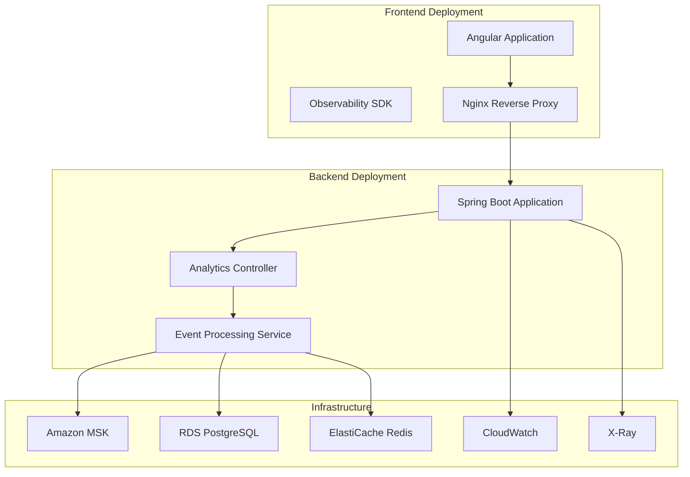

# Observability Deployment Guide

## Overview

This guide provides detailed instructions for deploying the frontend-backend observability integration system across different environments, including development, testing, and production deployment steps and configurations.

## Deployment Architecture

### System Components



## Environment Setup

### Development Environment Deployment

#### 1. Local Development Environment Setup

**Prerequisites**:

- Node.js 18+
- Java 21
- Docker & Docker Compose
- Git

**Deployment Steps**:

```bash
# 1. Clone project
git clone https://github.com/your-org/genai-demo.git
cd genai-demo

# 2. Start infrastructure services
docker-compose up -d redis postgresql

# 3. Start backend service
./gradlew bootRun --args='--spring.profiles.active=dev'

# 4. Start frontend service
cd consumer-frontend
npm install
npm run start

# 5. Verify deployment
curl http://localhost:8080/actuator/health
curl http://localhost:4200
```

**Docker Compose Configuration**:

```yaml
# docker-compose.dev.yml
version: '3.8'
services:
  redis:
    image: redis:7-alpine
    ports:
      - "6379:6379"
    command: redis-server --appendonly yes
    volumes:
      - redis-data:/data

  postgresql:
    image: postgres:15-alpine
    environment:
      POSTGRES_DB: genai_demo_dev
      POSTGRES_USER: genai_demo
      POSTGRES_PASSWORD: dev_password
    ports:
      - "5432:5432"
    volumes:
      - postgres-data:/var/lib/postgresql/data

  zookeeper:
    image: confluentinc/cp-zookeeper:7.4.0
    environment:
      ZOOKEEPER_CLIENT_PORT: 2181
      ZOOKEEPER_TICK_TIME: 2000

  kafka:
    image: confluentinc/cp-kafka:7.4.0
    depends_on:
      - zookeeper
    ports:
      - "9092:9092"
    environment:
      KAFKA_BROKER_ID: 1
      KAFKA_ZOOKEEPER_CONNECT: zookeeper:2181
      KAFKA_LISTENER_SECURITY_PROTOCOL_MAP: PLAINTEXT:PLAINTEXT,PLAINTEXT_HOST:PLAINTEXT
      KAFKA_ADVERTISED_LISTENERS: PLAINTEXT://kafka:29092,PLAINTEXT_HOST://localhost:9092
      KAFKA_OFFSETS_TOPIC_REPLICATION_FACTOR: 1
      KAFKA_AUTO_CREATE_TOPICS_ENABLE: true

volumes:
  redis-data:
  postgres-data:
```

#### 2. Development Environment Configuration Verification

```bash
#!/bin/bash
# verify-dev-deployment.sh

echo "=== Verifying Development Environment Deployment ==="

# Check backend health status
echo "1. Checking backend service..."
curl -f http://localhost:8080/actuator/health || exit 1

# Check frontend service
echo "2. Checking frontend service..."
curl -f http://localhost:4200 || exit 1

# Check database connection
echo "3. Checking database connection..."
curl -f http://localhost:8080/actuator/health/db || exit 1

# Check Redis connection
echo "4. Checking Redis connection..."
curl -f http://localhost:8080/actuator/health/redis || exit 1

# Test observability API
echo "5. Testing observability API..."
curl -X POST http://localhost:8080/api/analytics/events \
  -H "Content-Type: application/json" \
  -H "X-Trace-Id: dev-test-$(date +%s)" \
  -H "X-Session-Id: dev-session" \
  -d '[{"eventId":"dev-test","eventType":"page_view","sessionId":"dev-session","traceId":"dev-test-'$(date +%s)'","timestamp":'$(date +%s000)',"data":{"page":"/test"}}]' || exit 1

echo "✅ Development environment deployment verification complete"
```

### Test Environment Deployment

#### 1. CI/CD Pipeline Configuration

**GitHub Actions Workflow**:

```yaml
# .github/workflows/test-deployment.yml
name: Test Environment Deployment

on:
  pull_request:
    branches: [ main, develop ]
  push:
    branches: [ develop ]

jobs:
  test-deployment:
    runs-on: ubuntu-latest
    
    services:
      postgres:
        image: postgres:15
        env:
          POSTGRES_PASSWORD: test_password
          POSTGRES_DB: genai_demo_test
        options: >-
          --health-cmd pg_isready
          --health-interval 10s
          --health-timeout 5s
          --health-retries 5
        ports:
          - 5432:5432
      
      redis:
        image: redis:7
        options: >-
          --health-cmd "redis-cli ping"
          --health-interval 10s
          --health-timeout 5s
          --health-retries 5
        ports:
          - 6379:6379

    steps:
    - uses: actions/checkout@v3
    
    - name: Set up JDK 21
      uses: actions/setup-java@v3
      with:
        java-version: '21'
        distribution: 'temurin'
    
    - name: Set up Node.js
      uses: actions/setup-node@v3
      with:
        node-version: '18'
    
    - name: Cache Gradle packages
      uses: actions/cache@v3
      with:
        path: |
          ~/.gradle/caches
          ~/.gradle/wrapper
        key: ${{ runner.os }}-gradle-${{ hashFiles('**/*.gradle*', '**/gradle-wrapper.properties') }}
    
    - name: Run backend tests
      run: ./gradlew test --profile test
      env:
        SPRING_PROFILES_ACTIVE: test
        SPRING_DATASOURCE_URL: jdbc:postgresql://localhost:5432/genai_demo_test
        SPRING_DATASOURCE_USERNAME: postgres
        SPRING_DATASOURCE_PASSWORD: test_password
        SPRING_REDIS_HOST: localhost
        SPRING_REDIS_PORT: 6379
    
    - name: Build backend application
      run: ./gradlew build -x test
    
    - name: Install frontend dependencies
      run: |
        cd consumer-frontend
        npm ci
    
    - name: Run frontend tests
      run: |
        cd consumer-frontend
        npm run test:ci
    
    - name: Build frontend application
      run: |
        cd consumer-frontend
        npm run build:test
    
    - name: Run integration tests
      run: ./gradlew integrationTest
      env:
        SPRING_PROFILES_ACTIVE: test
    
    - name: Deploy to test environment
      if: github.ref == 'refs/heads/develop'
      run: |
        # Deploy to test environment script
        ./scripts/deploy-test.sh
```

#### 2. Test Environment Infrastructure

**Kubernetes Configuration**:

```yaml
# k8s/test/namespace.yaml
apiVersion: v1
kind: Namespace
metadata:
  name: genai-demo-test
  labels:
    environment: test
    project: genai-demo

---
# k8s/test/configmap.yaml
apiVersion: v1
kind: ConfigMap
metadata:
  name: genai-demo-config
  namespace: genai-demo-test
data:
  application.yml: |
    spring:
      profiles:
        active: test
      datasource:
        url: jdbc:postgresql://postgres-service:5432/genai_demo_test
        username: genai_demo
        password: ${DB_PASSWORD}
      redis:
        host: redis-service
        port: 6379
    genai-demo:
      events:
        publisher: in-memory
      observability:
        analytics:
          enabled: true
          batch-size: 10
          flush-interval: 10s

---
# k8s/test/deployment.yaml
apiVersion: apps/v1
kind: Deployment
metadata:
  name: genai-demo-backend
  namespace: genai-demo-test
spec:
  replicas: 2
  selector:
    matchLabels:
      app: genai-demo-backend
  template:
    metadata:
      labels:
        app: genai-demo-backend
    spec:
      containers:
      - name: backend
        image: genai-demo/backend:test
        ports:
        - containerPort: 8080
        env:
        - name: SPRING_PROFILES_ACTIVE
          value: "test"
        - name: DB_PASSWORD
          valueFrom:
            secretKeyRef:
              name: db-secret
              key: password
        volumeMounts:
        - name: config
          mountPath: /app/config
        livenessProbe:
          httpGet:
            path: /actuator/health/liveness
            port: 8080
          initialDelaySeconds: 30
          periodSeconds: 10
        readinessProbe:
          httpGet:
            path: /actuator/health/readiness
            port: 8080
          initialDelaySeconds: 10
          periodSeconds: 5
      volumes:
      - name: config
        configMap:
          name: genai-demo-config
```

### Production Environment Deployment

#### 1. AWS Infrastructure Deployment

**CDK Deployment Script**:

```bash
#!/bin/bash
# deploy-production.sh

set -e

ENVIRONMENT="production"
PROJECT_NAME="genai-demo"
AWS_REGION="us-east-1"

echo "=== Deploying Production Environment Infrastructure ==="

# 1. Deploy network infrastructure
echo "1. Deploying VPC and network components..."
cd infrastructure
npm install
npx cdk deploy NetworkStack --require-approval never \
  --context environment=$ENVIRONMENT \
  --context projectName=$PROJECT_NAME

# 2. Deploy security components
echo "2. Deploying security and KMS..."
npx cdk deploy SecurityStack --require-approval never \
  --context environment=$ENVIRONMENT \
  --context projectName=$PROJECT_NAME

# 3. Deploy MSK cluster
echo "3. Deploying MSK cluster..."
npx cdk deploy MSKStack --require-approval never \
  --context environment=$ENVIRONMENT \
  --context projectName=$PROJECT_NAME

# 4. Deploy RDS database
echo "4. Deploying RDS database..."
npx cdk deploy RDSStack --require-approval never \
  --context environment=$ENVIRONMENT \
  --context projectName=$PROJECT_NAME

# 5. Deploy EKS cluster
echo "5. Deploying EKS cluster..."
npx cdk deploy EKSStack --require-approval never \
  --context environment=$ENVIRONMENT \
  --context projectName=$PROJECT_NAME

# 6. Deploy observability infrastructure
echo "6. Deploying observability components..."
npx cdk deploy ObservabilityStack --require-approval never \
  --context environment=$ENVIRONMENT \
  --context projectName=$PROJECT_NAME

echo "✅ Infrastructure deployment complete"

# 7. Create Kafka topics
echo "7. Creating Kafka topics..."
./scripts/create-kafka-topics.sh $ENVIRONMENT

# 8. Deploy application
echo "8. Deploying application..."
./scripts/deploy-application.sh $ENVIRONMENT

echo "✅ Production environment deployment complete"
```

#### 2. Kafka Topic Creation

```bash
#!/bin/bash
# scripts/create-kafka-topics.sh

ENVIRONMENT=$1
PROJECT_NAME="genai-demo"

if [ -z "$ENVIRONMENT" ]; then
    echo "Usage: $0 <environment>"
    exit 1
fi

# Get MSK cluster information
MSK_CLUSTER_ARN=$(aws cloudformation describe-stacks \
    --stack-name ${PROJECT_NAME}-${ENVIRONMENT}-msk \
    --query 'Stacks[0].Outputs[?OutputKey==`MSKClusterArn`].OutputValue' \
    --output text)

MSK_BOOTSTRAP_SERVERS=$(aws kafka describe-cluster \
    --cluster-arn $MSK_CLUSTER_ARN \
    --query 'ClusterInfo.BrokerNodeGroupInfo.ClientSubnets[0]' \
    --output text)

echo "Creating observability Kafka topics..."

# Observability topic list
TOPICS=(
    "${PROJECT_NAME}.${ENVIRONMENT}.observability.user.behavior"
    "${PROJECT_NAME}.${ENVIRONMENT}.observability.performance.metrics"
    "${PROJECT_NAME}.${ENVIRONMENT}.observability.business.analytics"
    "${PROJECT_NAME}.${ENVIRONMENT}.observability.user.behavior.dlq"
    "${PROJECT_NAME}.${ENVIRONMENT}.observability.performance.metrics.dlq"
    "${PROJECT_NAME}.${ENVIRONMENT}.observability.business.analytics.dlq"
)

for topic in "${TOPICS[@]}"; do
    echo "Creating topic: $topic"
    
    # Set different partitions and retention based on topic type
    if [[ $topic == *"performance"* ]]; then
        PARTITIONS=3
        RETENTION_MS=1209600000  # 14 days
    elif [[ $topic == *"dlq"* ]]; then
        PARTITIONS=1
        RETENTION_MS=2592000000  # 30 days
    else
        PARTITIONS=6
        RETENTION_MS=7776000000  # 90 days
    fi
    
    aws kafka create-configuration \
        --name "${topic}-config" \
        --kafka-versions "2.8.1" \
        --server-properties "
            auto.create.topics.enable=false
            default.replication.factor=3
            min.insync.replicas=2
            log.retention.ms=${RETENTION_MS}
            compression.type=gzip
        " || true
    
    # Note: MSK doesn't support direct topic creation, topics are created when applications first connect
    echo "Topic $topic will be auto-created when application first connects"
done

echo "✅ Kafka topic configuration complete"
```

#### 3. Application Deployment

**Kubernetes Production Configuration**:

```yaml
# k8s/production/deployment.yaml
apiVersion: apps/v1
kind: Deployment
metadata:
  name: genai-demo-backend
  namespace: genai-demo-production
  labels:
    app: genai-demo-backend
    version: v1
spec:
  replicas: 3
  strategy:
    type: RollingUpdate
    rollingUpdate:
      maxSurge: 1
      maxUnavailable: 0
  selector:
    matchLabels:
      app: genai-demo-backend
  template:
    metadata:
      labels:
        app: genai-demo-backend
        version: v1
      annotations:
        prometheus.io/scrape: "true"
        prometheus.io/port: "8080"
        prometheus.io/path: "/actuator/prometheus"
    spec:
      serviceAccountName: genai-demo-service-account
      containers:
      - name: backend
        image: genai-demo/backend:latest
        ports:
        - containerPort: 8080
          name: http
        env:
        - name: SPRING_PROFILES_ACTIVE
          value: "msk"
        - name: MSK_BOOTSTRAP_SERVERS
          valueFrom:
            secretKeyRef:
              name: msk-config
              key: bootstrap-servers
        - name: DB_HOST
          valueFrom:
            secretKeyRef:
              name: rds-config
              key: host
        - name: DB_PASSWORD
          valueFrom:
            secretKeyRef:
              name: rds-config
              key: password
        - name: REDIS_HOST
          valueFrom:
            configMapKeyRef:
              name: redis-config
              key: host
        resources:
          requests:
            memory: "1Gi"
            cpu: "500m"
          limits:
            memory: "2Gi"
            cpu: "1000m"
        livenessProbe:
          httpGet:
            path: /actuator/health/liveness
            port: 8080
          initialDelaySeconds: 60
          periodSeconds: 30
          timeoutSeconds: 10
          failureThreshold: 3
        readinessProbe:
          httpGet:
            path: /actuator/health/readiness
            port: 8080
          initialDelaySeconds: 30
          periodSeconds: 10
          timeoutSeconds: 5
          failureThreshold: 3
        volumeMounts:
        - name: config
          mountPath: /app/config
        - name: logs
          mountPath: /app/logs
      volumes:
      - name: config
        configMap:
          name: genai-demo-config
      - name: logs
        emptyDir: {}

---
apiVersion: v1
kind: Service
metadata:
  name: genai-demo-backend-service
  namespace: genai-demo-production
  labels:
    app: genai-demo-backend
spec:
  selector:
    app: genai-demo-backend
  ports:
  - port: 80
    targetPort: 8080
    name: http
  type: ClusterIP

---
apiVersion: networking.k8s.io/v1
kind: Ingress
metadata:
  name: genai-demo-ingress
  namespace: genai-demo-production
  annotations:
    kubernetes.io/ingress.class: "alb"
    alb.ingress.kubernetes.io/scheme: internet-facing
    alb.ingress.kubernetes.io/target-type: ip
    alb.ingress.kubernetes.io/ssl-redirect: '443'
    alb.ingress.kubernetes.io/certificate-arn: ${SSL_CERTIFICATE_ARN}
spec:
  rules:
  - host: api.genai-demo.com
    http:
      paths:
      - path: /
        pathType: Prefix
        backend:
          service:
            name: genai-demo-backend-service
            port:
              number: 80
```

#### 4. Frontend Deployment Configuration

**Nginx Configuration**:

```nginx
# nginx.conf
upstream backend {
    server genai-demo-backend-service:80;
}

server {
    listen 80;
    server_name genai-demo.com www.genai-demo.com;
    return 301 https://$server_name$request_uri;
}

server {
    listen 443 ssl http2;
    server_name genai-demo.com www.genai-demo.com;

    ssl_certificate /etc/ssl/certs/genai-demo.crt;
    ssl_certificate_key /etc/ssl/private/genai-demo.key;
    ssl_protocols TLSv1.2 TLSv1.3;
    ssl_ciphers ECDHE-RSA-AES256-GCM-SHA512:DHE-RSA-AES256-GCM-SHA512:ECDHE-RSA-AES256-GCM-SHA384:DHE-RSA-AES256-GCM-SHA384;
    ssl_prefer_server_ciphers off;

    # Frontend static files
    location / {
        root /usr/share/nginx/html;
        index index.html;
        try_files $uri $uri/ /index.html;
        
        # Cache settings
        location ~* \.(js|css|png|jpg|jpeg|gif|ico|svg)$ {
            expires 1y;
            add_header Cache-Control "public, immutable";
        }
    }

    # API proxy
    location /api/ {
        proxy_pass http://backend;
        proxy_set_header Host $host;
        proxy_set_header X-Real-IP $remote_addr;
        proxy_set_header X-Forwarded-For $proxy_add_x_forwarded_for;
        proxy_set_header X-Forwarded-Proto $scheme;
        
        # Observability headers
        proxy_set_header X-Request-ID $request_id;
        proxy_set_header X-Forwarded-Request-ID $request_id;
    }

    # WebSocket proxy
    location /ws/ {
        proxy_pass http://backend;
        proxy_http_version 1.1;
        proxy_set_header Upgrade $http_upgrade;
        proxy_set_header Connection "upgrade";
        proxy_set_header Host $host;
        proxy_set_header X-Real-IP $remote_addr;
        proxy_set_header X-Forwarded-For $proxy_add_x_forwarded_for;
        proxy_set_header X-Forwarded-Proto $scheme;
    }

    # Health check
    location /health {
        access_log off;
        return 200 "healthy\n";
        add_header Content-Type text/plain;
    }
}
```

## Deployment Verification

### Automated Deployment Verification

```bash
#!/bin/bash
# scripts/verify-production-deployment.sh

ENVIRONMENT="production"
API_BASE_URL="https://api.genai-demo.com"
FRONTEND_URL="https://genai-demo.com"

echo "=== Verifying Production Environment Deployment ==="

# 1. Check infrastructure health status
echo "1. Checking infrastructure..."

# Check MSK cluster
MSK_CLUSTER_ARN=$(aws cloudformation describe-stacks \
    --stack-name genai-demo-${ENVIRONMENT}-msk \
    --query 'Stacks[0].Outputs[?OutputKey==`MSKClusterArn`].OutputValue' \
    --output text)

MSK_STATUS=$(aws kafka describe-cluster --cluster-arn $MSK_CLUSTER_ARN \
    --query 'ClusterInfo.State' --output text)

if [ "$MSK_STATUS" != "ACTIVE" ]; then
    echo "❌ MSK cluster status abnormal: $MSK_STATUS"
    exit 1
fi
echo "✅ MSK cluster status normal"

# Check RDS database
RDS_INSTANCE_ID="genai-demo-${ENVIRONMENT}-db"
RDS_STATUS=$(aws rds describe-db-instances \
    --db-instance-identifier $RDS_INSTANCE_ID \
    --query 'DBInstances[0].DBInstanceStatus' --output text)

if [ "$RDS_STATUS" != "available" ]; then
    echo "❌ RDS database status abnormal: $RDS_STATUS"
    exit 1
fi
echo "✅ RDS database status normal"

# 2. Check application health status
echo "2. Checking application..."

# Check backend health status
BACKEND_HEALTH=$(curl -s -w "%{http_code}" -o /dev/null ${API_BASE_URL}/actuator/health)
if [ "$BACKEND_HEALTH" != "200" ]; then
    echo "❌ Backend health check failed: HTTP $BACKEND_HEALTH"
    exit 1
fi
echo "✅ Backend health status normal"

# Check frontend accessibility
FRONTEND_STATUS=$(curl -s -w "%{http_code}" -o /dev/null $FRONTEND_URL)
if [ "$FRONTEND_STATUS" != "200" ]; then
    echo "❌ Frontend access failed: HTTP $FRONTEND_STATUS"
    exit 1
fi
echo "✅ Frontend accessible normally"

# 3. Check observability functionality
echo "3. Checking observability functionality..."

# Test analytics API
TRACE_ID="prod-verify-$(date +%s)"
SESSION_ID="prod-verify-session"

ANALYTICS_RESPONSE=$(curl -s -w "%{http_code}" -X POST ${API_BASE_URL}/api/analytics/events \
  -H "Content-Type: application/json" \
  -H "X-Trace-Id: $TRACE_ID" \
  -H "X-Session-Id: $SESSION_ID" \
  -d '[{"eventId":"prod-verify","eventType":"page_view","sessionId":"'$SESSION_ID'","traceId":"'$TRACE_ID'","timestamp":'$(date +%s000)',"data":{"page":"/verify"}}]')

if [[ "${ANALYTICS_RESPONSE: -3}" != "200" ]]; then
    echo "❌ Analytics API test failed: HTTP ${ANALYTICS_RESPONSE: -3}"
    exit 1
fi
echo "✅ Analytics API functionality normal"

# Check metrics endpoint
METRICS_RESPONSE=$(curl -s -w "%{http_code}" -o /dev/null ${API_BASE_URL}/actuator/metrics)
if [ "$METRICS_RESPONSE" != "200" ]; then
    echo "❌ Metrics endpoint abnormal: HTTP $METRICS_RESPONSE"
    exit 1
fi
echo "✅ Metrics endpoint normal"

# 4. Check monitoring and alerts
echo "4. Checking monitoring configuration..."

# Check CloudWatch metrics
NAMESPACE="GenAI/Demo/production"
METRIC_COUNT=$(aws cloudwatch list-metrics --namespace $NAMESPACE \
    --query 'length(Metrics)' --output text)

if [ "$METRIC_COUNT" -lt "10" ]; then
    echo "⚠️  CloudWatch metrics count low: $METRIC_COUNT"
else
    echo "✅ CloudWatch metrics normal: $METRIC_COUNT metrics"
fi

# Check alarm configuration
ALARM_COUNT=$(aws cloudwatch describe-alarms \
    --alarm-name-prefix "genai-demo-${ENVIRONMENT}" \
    --query 'length(MetricAlarms)' --output text)

if [ "$ALARM_COUNT" -lt "5" ]; then
    echo "⚠️  CloudWatch alarms count low: $ALARM_COUNT"
else
    echo "✅ CloudWatch alarm configuration normal: $ALARM_COUNT alarms"
fi

# 5. Performance benchmark testing
echo "5. Running performance benchmark testing..."

# Use Apache Bench for simple load testing
ab -n 100 -c 10 ${API_BASE_URL}/actuator/health > /tmp/ab_results.txt 2>&1

REQUESTS_PER_SECOND=$(grep "Requests per second" /tmp/ab_results.txt | awk '{print $4}')
MEAN_TIME=$(grep "Time per request" /tmp/ab_results.txt | head -1 | awk '{print $4}')

echo "Performance test results:"
echo "  - Requests per second: $REQUESTS_PER_SECOND"
echo "  - Average response time: ${MEAN_TIME}ms"

if (( $(echo "$REQUESTS_PER_SECOND < 50" | bc -l) )); then
    echo "⚠️  Performance may need optimization"
else
    echo "✅ Performance performing well"
fi

echo "=== Production environment deployment verification complete ==="
```

### Monitoring Dashboard Setup

**CloudWatch Dashboard Configuration**:

```json
{
  "widgets": [
    {
      "type": "metric",
      "properties": {
        "metrics": [
          ["GenAI/Demo/production", "observability.events.received"],
          [".", "observability.events.processed"],
          [".", "observability.events.failed"]
        ],
        "period": 300,
        "stat": "Sum",
        "region": "us-east-1",
        "title": "Observability Event Processing"
      }
    },
    {
      "type": "metric",
      "properties": {
        "metrics": [
          ["AWS/ApplicationELB", "RequestCount", "LoadBalancer", "genai-demo-production-alb"],
          [".", "TargetResponseTime", ".", "."],
          [".", "HTTPCode_Target_2XX_Count", ".", "."],
          [".", "HTTPCode_Target_4XX_Count", ".", "."],
          [".", "HTTPCode_Target_5XX_Count", ".", "."]
        ],
        "period": 300,
        "stat": "Average",
        "region": "us-east-1",
        "title": "Application Load Balancer Metrics"
      }
    },
    {
      "type": "metric",
      "properties": {
        "metrics": [
          ["AWS/MSK", "BytesInPerSec", "Cluster Name", "genai-demo-production-msk"],
          [".", "BytesOutPerSec", ".", "."],
          [".", "MessagesInPerSec", ".", "."]
        ],
        "period": 300,
        "stat": "Average",
        "region": "us-east-1",
        "title": "MSK Cluster Metrics"
      }
    }
  ]
}
```

## Rollback Strategy

### Automatic Rollback Trigger Conditions

```yaml
# k8s/production/rollback-policy.yaml
apiVersion: argoproj.io/v1alpha1
kind: Rollout
metadata:
  name: genai-demo-backend-rollout
spec:
  replicas: 3
  strategy:
    canary:
      steps:
      - setWeight: 20
      - pause: {duration: 10m}
      - setWeight: 40
      - pause: {duration: 10m}
      - setWeight: 60
      - pause: {duration: 10m}
      - setWeight: 80
      - pause: {duration: 10m}
      analysis:
        templates:
        - templateName: success-rate
        args:
        - name: service-name
          value: genai-demo-backend-service
      scaleDownDelaySeconds: 30
      abortScaleDownDelaySeconds: 30
  selector:
    matchLabels:
      app: genai-demo-backend
  template:
    metadata:
      labels:
        app: genai-demo-backend
    spec:
      containers:
      - name: backend
        image: genai-demo/backend:latest
```

### Manual Rollback Procedure

```bash
#!/bin/bash
# scripts/rollback-production.sh

ENVIRONMENT="production"
ROLLBACK_VERSION=$1

if [ -z "$ROLLBACK_VERSION" ]; then
    echo "Usage: $0 <rollback-version>"
    echo "Available versions:"
    kubectl get deployments genai-demo-backend -n genai-demo-production -o jsonpath='{.metadata.annotations.deployment\.kubernetes\.io/revision}'
    exit 1
fi

echo "=== Executing Production Environment Rollback ==="

# 1. Confirm rollback version
echo "1. Confirming rollback to version: $ROLLBACK_VERSION"
read -p "Are you sure you want to continue? (y/N): " -n 1 -r
echo
if [[ ! $REPLY =~ ^[Yy]$ ]]; then
    echo "Rollback cancelled"
    exit 1
fi

# 2. Execute rollback
echo "2. Executing Kubernetes deployment rollback..."
kubectl rollout undo deployment/genai-demo-backend \
    --namespace=genai-demo-production \
    --to-revision=$ROLLBACK_VERSION

# 3. Wait for rollback completion
echo "3. Waiting for rollback completion..."
kubectl rollout status deployment/genai-demo-backend \
    --namespace=genai-demo-production \
    --timeout=600s

# 4. Verify rollback results
echo "4. Verifying rollback results..."
sleep 30

HEALTH_STATUS=$(curl -s -w "%{http_code}" -o /dev/null https://api.genai-demo.com/actuator/health)
if [ "$HEALTH_STATUS" != "200" ]; then
    echo "❌ Health check failed after rollback: HTTP $HEALTH_STATUS"
    echo "Please check application logs and consider further rollback operations"
    exit 1
fi

echo "✅ Rollback complete, application health status normal"

# 5. Notify relevant personnel
echo "5. Sending rollback notification..."
# Add Slack or Email notification logic here

echo "=== Production environment rollback complete ==="
```

## Security Considerations

### Deployment Security Checklist

- [ ] **Network Security**
  - [ ] VPC and subnets properly configured
  - [ ] Security group rules follow least privilege principle
  - [ ] NAT gateway and route tables configured

- [ ] **Identity and Access Management**
  - [ ] IAM roles and policies with least privilege
  - [ ] Service accounts properly configured
  - [ ] Key Management Service (KMS) enabled

- [ ] **Data Encryption**
  - [ ] Encryption in transit (TLS 1.2+)
  - [ ] Encryption at rest
  - [ ] Key rotation policies

- [ ] **Monitoring and Auditing**
  - [ ] CloudTrail logging enabled
  - [ ] VPC Flow Logs enabled
  - [ ] Security event monitoring configured

### Compliance Checking

```bash
#!/bin/bash
# scripts/compliance-check.sh

echo "=== Compliance Check ==="

# Check encryption configuration
echo "1. Checking encryption configuration..."

# Check RDS encryption
RDS_ENCRYPTED=$(aws rds describe-db-instances \
    --db-instance-identifier genai-demo-production-db \
    --query 'DBInstances[0].StorageEncrypted' --output text)

if [ "$RDS_ENCRYPTED" != "True" ]; then
    echo "❌ RDS database encryption not enabled"
else
    echo "✅ RDS database encryption enabled"
fi

# Check MSK encryption
MSK_ENCRYPTION=$(aws kafka describe-cluster \
    --cluster-arn $MSK_CLUSTER_ARN \
    --query 'ClusterInfo.EncryptionInfo.EncryptionAtRest.DataVolumeKMSKeyId' \
    --output text)

if [ "$MSK_ENCRYPTION" == "None" ]; then
    echo "❌ MSK cluster encryption at rest not enabled"
else
    echo "✅ MSK cluster encryption at rest enabled"
fi

# Check CloudTrail
CLOUDTRAIL_STATUS=$(aws cloudtrail get-trail-status \
    --name genai-demo-production-trail \
    --query 'IsLogging' --output text)

if [ "$CLOUDTRAIL_STATUS" != "True" ]; then
    echo "❌ CloudTrail logging not enabled"
else
    echo "✅ CloudTrail logging enabled"
fi

echo "=== Compliance check complete ==="
```

## Related Documentation

- [Configuration Guide](../observability/configuration-guide.md)
- API Documentation
- [Troubleshooting Guide](../troubleshooting/observability-troubleshooting.md)
- [Architecture Documentation](../architecture/observability-architecture.md)