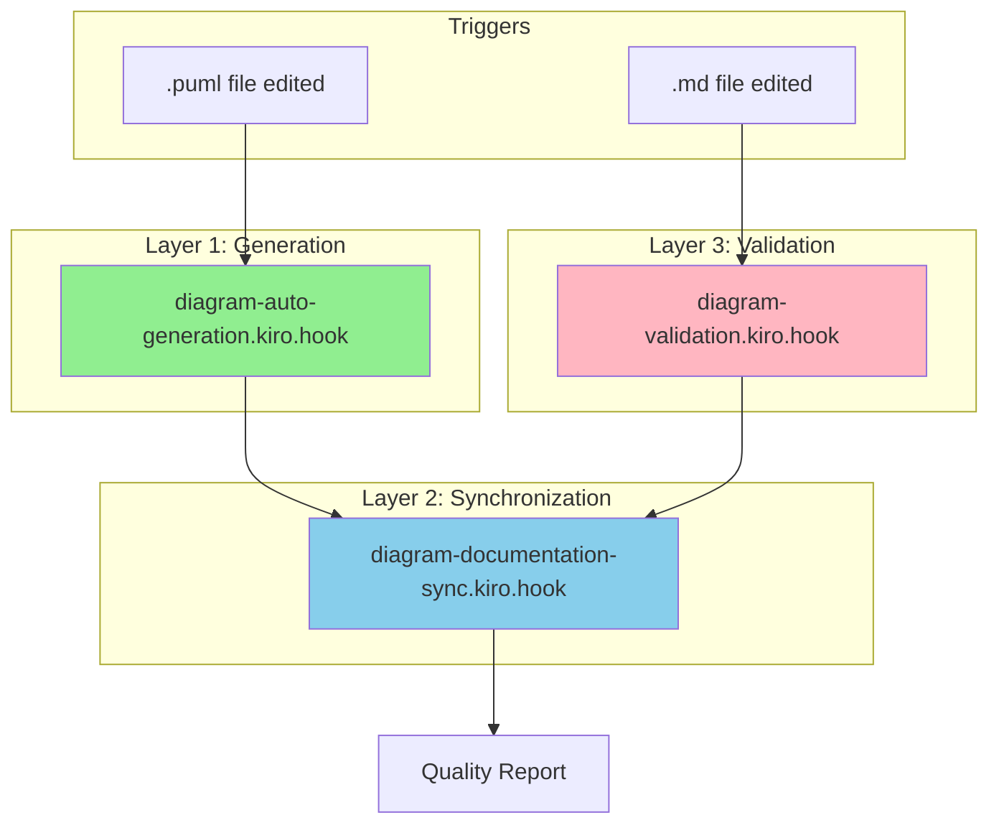
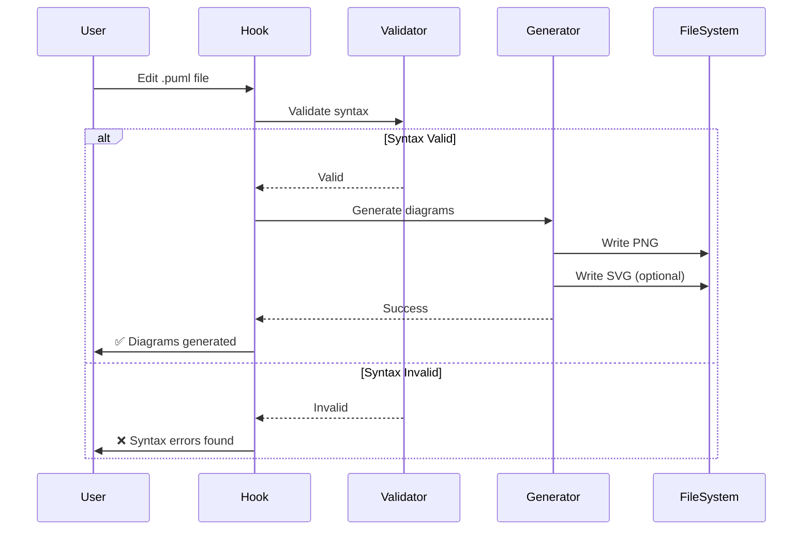
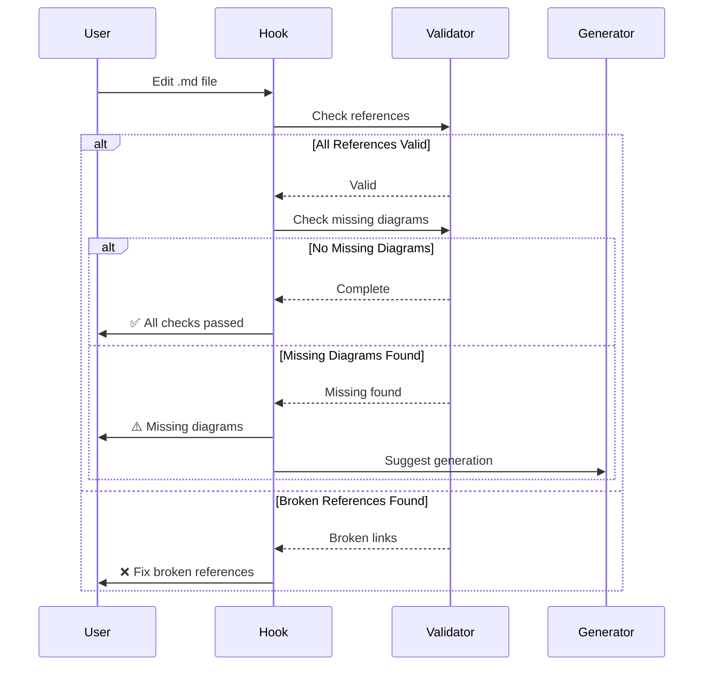
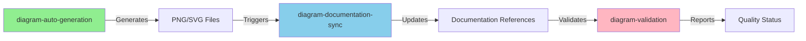
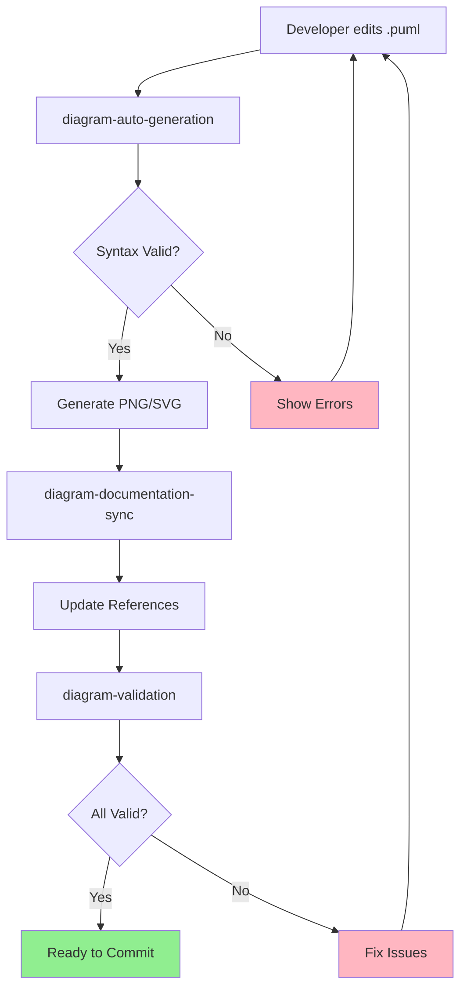

# Diagram Hooks Design and Implementation

## Overview

This document describes the design, implementation, and coordination of diagram-related Kiro hooks. These hooks automate diagram generation, validation, and synchronization to ensure documentation quality and consistency.

## Hook Architecture

### Three-Layer Hook System



## Hook 1: diagram-auto-generation.kiro.hook

### Purpose

Automatically generate PNG/SVG diagrams when PlantUML source files are modified.

### Trigger Conditions

```json
{
  "type": "fileEdited",
  "patterns": [
    "docs/diagrams/viewpoints/**/*.puml",
    "docs/diagrams/perspectives/**/*.puml"
  ]
}
```

### Execution Flow



### Actions Performed

1. **Syntax Validation**

   ```bash
   ./scripts/validate-diagrams.sh --check-syntax
   ```

   - Validates PlantUML syntax
   - Reports errors with line numbers
   - Prevents generation of invalid diagrams

2. **Diagram Generation**

   ```bash
   ./scripts/generate-diagrams.sh --format=png
   ```

   - Generates PNG for GitHub documentation
   - Optionally generates SVG for high-resolution
   - Maintains directory structure
   - Handles errors gracefully

3. **Missing Diagram Check**

   ```bash
   ./scripts/validate-diagrams.sh --check-missing
   ```

   - Verifies all source files have generated diagrams
   - Reports missing files
   - Suggests regeneration if needed

4. **Reference Update Trigger**
   - Notifies `diagram-documentation-sync.kiro.hook`
   - Triggers documentation reference updates
   - Ensures consistency

### Quality Checks

- ✅ Diagram renders correctly
- ✅ Text is readable at default zoom
- ✅ Colors follow standards (Event Storming if applicable)
- ✅ File size is reasonable (<500KB for PNG)
- ✅ Generated files are in correct directory

### Error Handling

| Error Type | Action | User Notification |
|------------|--------|-------------------|
| Syntax Error | Stop generation | Show error details with line numbers |
| PlantUML JAR Missing | Auto-download | Inform user of download |
| Java Not Found | Stop execution | Request Java installation |
| File Permission | Skip file | Warn about permission issue |
| Generation Failure | Retry once | Show generation error |

## Hook 2: diagram-validation.kiro.hook

### Purpose

Validate diagram references and completeness when documentation files are modified. Acts as a quality gate before commits.

### Trigger Conditions

```json
{
  "type": "fileEdited",
  "patterns": [
    "docs/viewpoints/**/*.md",
    "docs/perspectives/**/*.md",
    "docs/architecture/**/*.md",
    "docs/api/**/*.md",
    "docs/development/**/*.md",
    "docs/operations/**/*.md"
  ]
}
```

### Execution Flow



### Actions Performed

1. **Reference Validation**

   ```bash
   ./scripts/validate-diagrams.sh --check-references
   ```

   - Checks all diagram references in markdown
   - Verifies referenced files exist
   - Validates relative paths
   - Reports broken links

2. **Missing Diagram Check**

   ```bash
   ./scripts/validate-diagrams.sh --check-missing
   ```

   - Identifies source files without generated diagrams
   - Suggests regeneration
   - Warns about outdated diagrams

3. **Comprehensive Validation**

   ```bash
   ./scripts/validate-diagrams.sh
   ```

   - Runs all validation checks
   - Generates validation report
   - Provides actionable recommendations

4. **Auto-Fix Suggestions**
   - Suggests correct paths for broken references
   - Recommends diagram generation commands
   - Provides examples of correct references

### Validation Severity Levels

| Level | Description | Action Required |
|-------|-------------|-----------------|
| **ERROR** | Broken references, missing critical diagrams | Must fix before commit |
| **WARNING** | Missing optional diagrams, outdated files | Should fix soon |
| **INFO** | Suggestions for improvement | Optional enhancement |

### Common Issues Detected

1. **Broken References**
   - Incorrect relative paths
   - Typos in filenames
   - References to non-existent diagrams
   - Case sensitivity issues

2. **Missing Diagrams**
   - .puml files without generated PNG/SVG
   - Outdated generated files
   - Diagrams referenced but not created

3. **Path Issues**
   - Absolute paths instead of relative
   - Incorrect directory structure
   - Wrong file extensions

### Quality Standards Enforced

- ✅ Use PNG format for GitHub documentation
- ✅ Use relative paths from document location
- ✅ Group diagram references in dedicated sections
- ✅ Provide meaningful alt text for accessibility
- ✅ Follow naming conventions

## Hook Coordination

### Coordination with diagram-documentation-sync.kiro.hook

Both diagram hooks coordinate with the existing `diagram-documentation-sync.kiro.hook`:



### Execution Order

1. **On .puml file change**:

   ```
   diagram-auto-generation (generate)
        ↓
   diagram-documentation-sync (update references)
        ↓
   diagram-validation (verify completeness)
   ```

2. **On .md file change**:

   ```
   diagram-validation (check references)
        ↓
   diagram-documentation-sync (sync if needed)
        ↓
   diagram-auto-generation (generate if missing)
   ```

### Conflict Prevention

1. **File Locking**
   - Hooks use temporary files during generation
   - Atomic file operations
   - Retry mechanism for locked files

2. **State Management**
   - Each hook maintains its own state
   - Shared state through file system
   - No direct hook-to-hook communication

3. **Idempotency**
   - All hooks are idempotent
   - Safe to run multiple times
   - No side effects on repeated execution

## Integration with Development Workflow

### Pre-Commit Workflow



### CI/CD Integration

These hooks can be integrated into CI/CD pipelines:

```yaml
# .github/workflows/validate-diagrams.yml
name: Validate Diagrams

on:
  pull_request:
    paths:

      - 'docs/diagrams/**/*.puml'
      - 'docs/**/*.md'

jobs:
  validate:
    runs-on: ubuntu-latest
    steps:

      - uses: actions/checkout@v3
      
      - name: Setup Java

        uses: actions/setup-java@v3
        with:
          java-version: '11'
      
      - name: Validate Diagram Syntax

        run: ./scripts/validate-diagrams.sh --check-syntax
      
      - name: Check Diagram References

        run: ./scripts/validate-diagrams.sh --check-references
      
      - name: Check Missing Diagrams

        run: ./scripts/validate-diagrams.sh --check-missing
```

## Best Practices

### For Developers

1. **Edit PlantUML Files**
   - Let hooks handle generation automatically
   - Review generated diagrams before committing
   - Fix syntax errors immediately

2. **Reference Diagrams**
   - Use relative paths
   - Follow naming conventions
   - Add meaningful alt text

3. **Commit Generated Files**
   - Always commit both .puml and generated files
   - Don't gitignore generated diagrams
   - Keep source and generated in sync

### For Documentation Writers

1. **Check References**
   - Run validation before committing
   - Fix broken links immediately
   - Use correct relative paths

2. **Request Missing Diagrams**
   - Create .puml files for needed diagrams
   - Let hooks generate them
   - Verify generation success

3. **Follow Standards**
   - Use PNG for GitHub docs
   - Group diagrams in dedicated sections
   - Provide context for each diagram

## Troubleshooting

### Hook Not Triggering

**Symptoms**: Hook doesn't run when files are edited

**Solutions**:

1. Check hook is enabled in `.kiro/hooks/`
2. Verify file patterns match edited files
3. Check Kiro IDE hook settings
4. Review hook logs

### Generation Failures

**Symptoms**: Diagrams not generated or errors shown

**Solutions**:

1. Validate PlantUML syntax manually
2. Check Java installation
3. Verify PlantUML JAR exists
4. Check file permissions
5. Review error messages

### Validation Errors

**Symptoms**: Validation reports broken references

**Solutions**:

1. Check relative paths are correct
2. Verify referenced files exist
3. Check for typos in filenames
4. Ensure case sensitivity matches

### Performance Issues

**Symptoms**: Hooks take too long to execute

**Solutions**:

1. Generate only changed files
2. Use PNG format only (skip SVG)
3. Optimize PlantUML diagrams
4. Check system resources

## Metrics and Monitoring

### Success Metrics

- **Generation Success Rate**: >99%
- **Validation Pass Rate**: >95%
- **Average Execution Time**: <10 seconds
- **Broken Reference Rate**: <1%

### Monitoring Commands

```bash
# Check hook execution logs
cat .kiro/logs/hooks/diagram-auto-generation.log

# Validate all diagrams
./scripts/validate-diagrams.sh

# Generate missing diagrams
./scripts/generate-diagrams.sh --format=png

# Comprehensive check
./scripts/validate-diagrams.sh && ./scripts/generate-diagrams.sh
```

## Future Enhancements

### Planned Features

1. **Incremental Generation**
   - Only regenerate changed diagrams
   - Cache unchanged diagrams
   - Faster execution

2. **Parallel Processing**
   - Generate multiple diagrams simultaneously
   - Utilize multi-core processors
   - Reduce total execution time

3. **Smart Validation**
   - AI-powered diagram quality checks
   - Suggest improvements
   - Detect common issues

4. **Integration with Event Storming**
   - Auto-generate Event Storming diagrams
   - Sync with domain events
   - Update on code changes

## References

- [PlantUML Documentation](https://plantuml.com/)

---

**Document Version**: 1.0  
**Last Updated**: 2025-01-17  
**Maintainer**: Development Team
