# Hooks Audit Report

**Date**: 2025-01-17  
**Auditor**: AI Assistant  
**Purpose**: Comprehensive evaluation of all Kiro hooks for redundancy, conflicts, and missing implementations

## Executive Summary

### Critical Findings

🔴 **5 Missing Hooks**: Documented in README but not implemented  
🟡 **1 Conflict**: README mentions deleted hook that was just re-created  
🟢 **4 Implemented Hooks**: Working correctly

### Recommendations

1. **Immediate**: Remove or implement missing hooks from README
2. **High Priority**: Resolve diagram-auto-generation conflict
3. **Medium Priority**: Verify all hook dependencies exist

---

## Detailed Analysis

### 1. Implemented Hooks (✅ Exist)

| Hook File | Status | Issues |
|-----------|--------|--------|
| `bdd-feature-monitor.kiro.hook` | ✅ Exists | None |
| `ddd-annotation-monitor.kiro.hook` | ✅ Exists | None |
| `diagram-auto-generation.kiro.hook` | ✅ Exists | ⚠️ Conflict with README |
| `diagram-validation.kiro.hook` | ✅ Exists | None |

### 2. Missing Hooks (❌ Not Found)

These hooks are documented in README but don't exist in `.kiro/hooks/`:

#### 2.1 english-documentation-enforcement.kiro.hook

- **Priority**: Highest (Level 1)
- **Function**: English documentation standard enforcement
- **Impact**: High - Language consistency not enforced
- **Recommendation**: **Implement or remove from README**

#### 2.2 reports-organization-monitor.kiro.hook

- **Priority**: High (Level 3)
- **Function**: Report file organization monitoring
- **Impact**: Medium - Reports may be disorganized
- **Recommendation**: **Implement or remove from README**

#### 2.3 reports-quality-assurance.kiro.hook

- **Priority**: Medium (Level 5)
- **Function**: Report quality assurance
- **Impact**: Medium - Report quality not validated
- **Recommendation**: **Implement or remove from README**

#### 2.4 viewpoints-perspectives-quality.kiro.hook

- **Priority**: Highest (Level 2)
- **Function**: Architecture documentation quality assurance
- **Impact**: High - Architecture docs not validated
- **Recommendation**: **Implement or remove from README**

#### 2.5 diagram-documentation-sync.kiro.hook

- **Priority**: Medium (Level 6)
- **Function**: Diagram-documentation bidirectional sync
- **Impact**: High - Referenced by new diagram hooks
- **Recommendation**: **Must implement - required by diagram-auto-generation and diagram-validation**

### 3. Conflicts and Issues

#### 3.1 diagram-auto-generation.kiro.hook Conflict

**Issue**: README states this hook was deleted, but we just created it.

**README Statement**:

```text
### 🗑️ 已移除的 Hooks

1. **diagram-auto-generation.kiro.hook** - **已刪除**
   - **原因**: 功能完全被 diagram-documentation-sync.kiro.hook 取代
   - **狀態**: 已從系統中移除

```

**Current Status**: Hook exists and is listed as active (Hook #5)

**Resolution Options**:

**Option A: Keep New Implementation** (Recommended)

- Remove from "已移除的 Hooks" section
- Keep in active hooks list
- Update version history
- Rationale: New implementation has clear purpose and doesn't duplicate sync hook

**Option B: Delete and Rely on Sync Hook**

- Delete newly created hook
- Ensure diagram-documentation-sync handles generation
- Update documentation
- Rationale: Follows previous architectural decision

**Recommendation**: **Option A** - The new implementation is well-designed and serves a distinct purpose from the sync hook.

### 4. Hook Dependencies Analysis

#### 4.1 Dependency Graph

```mermaid
graph TB
    DG[diagram-auto-generation] -.->|requires| DS[diagram-documentation-sync]
    DV[diagram-validation] -.->|requires| DS
    DS -.->|missing| X[❌ Not Implemented]
    
    DDD[ddd-annotation-monitor] -.->|triggers| DG
    BDD[bdd-feature-monitor] -.->|triggers| DG
    
    style X fill:#ff6b6b
    style DS fill:#ff6b6b
    style DG fill:#51cf66
    style DV fill:#51cf66
```



**Critical Issue**: Both new diagram hooks depend on `diagram-documentation-sync.kiro.hook` which doesn't exist!

#### 4.2 Missing Dependencies Impact

| Hook | Depends On | Impact if Missing |
|------|------------|-------------------|
| diagram-auto-generation | diagram-documentation-sync | Cannot update doc references after generation |
| diagram-validation | diagram-documentation-sync | Cannot trigger sync when issues found |
| ddd-annotation-monitor | diagram-auto-generation | Cannot trigger diagram updates |
| bdd-feature-monitor | diagram-auto-generation | Cannot trigger diagram updates |

### 5. Hook Coordination Issues

#### 5.1 Execution Flow Problems

**Documented Flow**:

```text
.puml change → diagram-auto-generation → diagram-documentation-sync → diagram-validation
```

**Actual Flow** (with missing sync hook):

```text
.puml change → diagram-auto-generation → ❌ BROKEN → diagram-validation
```

**Impact**:

- Generated diagrams won't have updated references
- Validation may fail due to missing sync
- Manual intervention required

#### 5.2 Priority Conflicts

README lists priorities but some hooks don't exist:

| Priority Level | Hook | Status |
|----------------|------|--------|
| 1 (Highest) | english-documentation-enforcement | ❌ Missing |
| 2 (Highest) | viewpoints-perspectives-quality | ❌ Missing |
| 3 (High) | reports-organization-monitor | ❌ Missing |
| 4 (High) | diagram-auto-generation | ✅ Exists |
| 5 (Medium) | reports-quality-assurance | ❌ Missing |
| 5 (Medium) | diagram-validation | ✅ Exists |
| 6 (Medium) | diagram-documentation-sync | ❌ Missing |
| 7 (Low) | ddd-annotation-monitor | ✅ Exists |
| 7 (Low) | bdd-feature-monitor | ✅ Exists |

**Issue**: 5 out of 9 hooks are missing, including 2 highest priority hooks.

## Recommendations

### Immediate Actions (Critical)

#### 1. Implement diagram-documentation-sync.kiro.hook

**Priority**: 🔴 Critical  
**Reason**: Required by both new diagram hooks  
**Effort**: Medium  
**Impact**: High

**Suggested Implementation**:

```json
{
  "enabled": true,
  "name": "Diagram Documentation Sync Hook",
  "description": "Bidirectional sync between diagrams and documentation references",
  "version": "1.0",
  "when": {
    "type": "fileEdited",
    "patterns": [
      "docs/diagrams/**/*.puml",
      "docs/diagrams/**/*.mmd",
      "docs/viewpoints/**/*.md",
      "docs/perspectives/**/*.md"
    ]
  },
  "then": {
    "type": "askAgent",
    "prompt": "Diagram or documentation files changed. Sync references..."
  }
}
```

#### 2. Resolve diagram-auto-generation Conflict

**Priority**: 🔴 Critical  
**Action**: Remove from "已移除的 Hooks" section in README  
**Effort**: Low  
**Impact**: Medium

#### 3. Update README to Match Reality

**Priority**: 🟡 High  
**Action**: Either implement missing hooks or remove from documentation  
**Effort**: Low (documentation) or High (implementation)  
**Impact**: High (clarity and accuracy)

### Short-term Actions (High Priority)

#### 4. Decide on Missing Hooks Strategy

**Option A: Implement All Missing Hooks**

- Pros: Complete system as documented
- Cons: High effort, may not all be needed
- Effort: High (5 hooks to implement)
- Timeline: 2-3 weeks

**Option B: Remove Unnecessary Hooks from README**

- Pros: Documentation matches reality
- Cons: Lose planned functionality
- Effort: Low (update documentation)
- Timeline: 1 day

**Option C: Phased Implementation**

- Pros: Prioritize critical hooks
- Cons: Temporary inconsistency
- Effort: Medium
- Timeline: 1-2 weeks

**Recommended**: **Option C - Phased Implementation**

**Phase 1** (Week 1):

1. Implement `diagram-documentation-sync.kiro.hook` (critical dependency)
2. Update README to remove conflict

**Phase 2** (Week 2):

1. Evaluate need for quality assurance hooks
2. Implement if needed or remove from README

**Phase 3** (Future):

1. Consider implementing language enforcement
2. Consider implementing report organization

### Long-term Actions (Medium Priority)

#### 5. Create Hook Testing Framework

- Test hook triggers
- Validate hook coordination
- Prevent future conflicts

#### 6. Document Hook Dependencies

- Create dependency map
- Validate before adding new hooks
- Automated dependency checking

#### 7. Implement Hook Monitoring

- Track hook execution
- Monitor performance
- Alert on failures

## Proposed Changes

### Change 1: Update README - Remove Conflict

**File**: `.kiro/hooks/README.md`

**Remove from "已移除的 Hooks"**:

```markdown

1. **diagram-auto-generation.kiro.hook** - **已刪除**
   - **原因**: 功能完全被 diagram-documentation-sync.kiro.hook 取代
   - **狀態**: 已從系統中移除

```

**Add to version history**:

```markdown

- **v1.3** (2025-01-17): Re-implemented diagram-auto-generation with improved design

```

### Change 2: Create diagram-documentation-sync.kiro.hook

**Priority**: Critical  
**Status**: To be implemented  
**Dependencies**: None  
**Dependents**: diagram-auto-generation, diagram-validation

### Change 3: Update README - Mark Missing Hooks

Add status indicators to README:

```markdown

1. **english-documentation-enforcement.kiro.hook** (v1.0) - ⚠️ **未實現**
2. **reports-organization-monitor.kiro.hook** (v1.0) - ⚠️ **未實現**
3. **reports-quality-assurance.kiro.hook** (v1.0) - ⚠️ **未實現**
4. **viewpoints-perspectives-quality.kiro.hook** (v1.1) - ⚠️ **未實現**
5. **diagram-auto-generation.kiro.hook** (v1.0) - ✅ **已實現**
6. **diagram-validation.kiro.hook** (v1.0) - ✅ **已實現**
7. **diagram-documentation-sync.kiro.hook** (v1.0) - 🔴 **需要實現（關鍵依賴）**
8. **ddd-annotation-monitor.kiro.hook** (v1.0) - ✅ **已實現**
9. **bdd-feature-monitor.kiro.hook** (v1.0) - ✅ **已實現**

```

## Risk Assessment

### High Risk Issues

1. **Missing Critical Dependency** (diagram-documentation-sync)
   - Risk: New diagram hooks won't work properly
   - Mitigation: Implement immediately
   - Timeline: 1-2 days

2. **Documentation Mismatch**
   - Risk: Confusion about what hooks exist
   - Mitigation: Update README immediately
   - Timeline: 1 hour

### Medium Risk Issues

1. **Missing Quality Assurance Hooks**
   - Risk: Quality issues not caught automatically
   - Mitigation: Manual reviews or implement hooks
   - Timeline: 1-2 weeks

2. **Hook Coordination Complexity**
   - Risk: Hooks may conflict or duplicate work
   - Mitigation: Clear documentation and testing
   - Timeline: Ongoing

### Low Risk Issues

1. **Missing Language Enforcement**
   - Risk: Inconsistent documentation language
   - Mitigation: Manual reviews
   - Timeline: Future consideration

## Conclusion

### Summary

- **4 hooks implemented** and working
- **5 hooks missing** but documented
- **1 critical dependency** missing (diagram-documentation-sync)
- **1 conflict** in documentation (diagram-auto-generation)

### Next Steps

1. ✅ **Immediate**: Implement `diagram-documentation-sync.kiro.hook`
2. ✅ **Immediate**: Update README to remove conflict
3. ⏳ **This Week**: Decide on missing hooks strategy
4. ⏳ **This Week**: Update README with status indicators
5. 📅 **Next Week**: Implement or remove remaining hooks

### Success Criteria

- ✅ All documented hooks either exist or marked as planned
- ✅ No conflicts in documentation
- ✅ All hook dependencies satisfied
- ✅ Clear roadmap for missing functionality

---

**Report Status**: Complete  
**Next Review**: After implementing diagram-documentation-sync.kiro.hook  
**Owner**: Development Team
