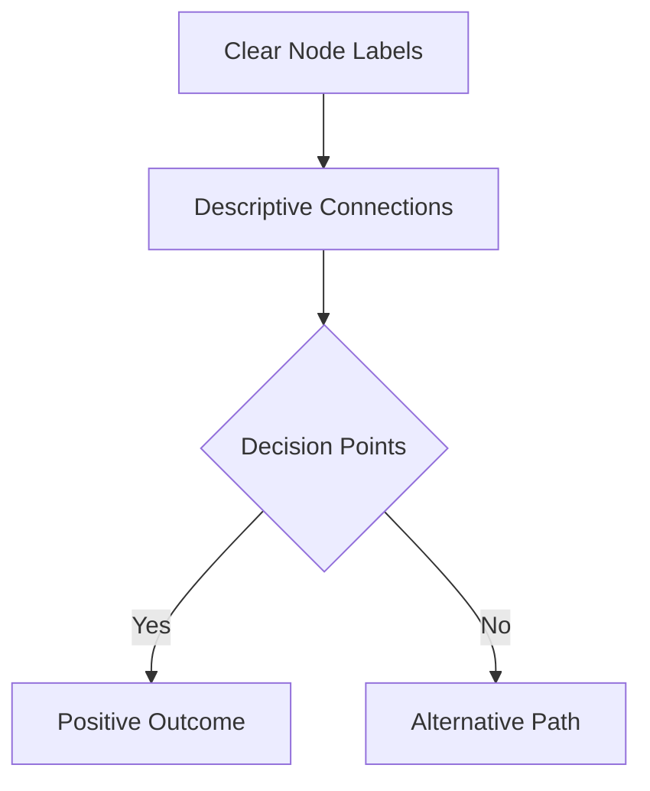
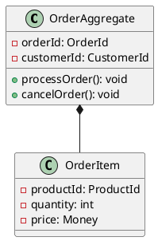

# 📊 Diagram Documentation System

## Overview

This directory contains comprehensive diagram documentation for the GenAI Demo e-commerce platform, organized by diagram type and tool. Our diagram system supports multiple formats and tools to accommodate different use cases and team preferences.

## 🎨 Diagram Tools and Formats

### Supported Diagram Tools

| Tool | Format | Use Case | Status |
|------|--------|----------|--------|
| **Mermaid** | `.mmd` | Architecture, Sequence, Flowcharts | ✅ Primary |
| **PlantUML** | `.puml` | UML Diagrams, Complex Relationships | ✅ Active |
| **Excalidraw** | `.excalidraw` | Collaborative Sketching, Wireframes | ✅ Active |
| **Legacy UML** | `.uml` | Historical Diagrams | 📁 Archived |

### Tool Selection Guidelines

#### Mermaid (Recommended)

- **Best for**: Architecture diagrams, sequence diagrams, flowcharts
- **Advantages**: GitHub native support, version control friendly, fast rendering
- **Use cases**: System architecture, API flows, business processes
- **Integration**: Embedded in Markdown, automated generation

#### PlantUML

- **Best for**: Complex UML diagrams, detailed class relationships
- **Advantages**: Comprehensive UML support, advanced layout options
- **Use cases**: Domain modeling, detailed system design, technical specifications
- **Integration**: Build system integration, automated documentation

#### Excalidraw

- **Best for**: Collaborative design sessions, quick sketches, wireframes
- **Advantages**: Real-time collaboration, intuitive interface, export flexibility
- **Use cases**: Design workshops, brainstorming, user interface mockups
- **Integration**: Design process, team collaboration sessions

## 📁 Directory Structure

```text
diagrams/
├── mermaid/                    # Mermaid diagrams (Primary)
│   ├── architecture/           # System architecture diagrams
│   ├── domain-event-handling/  # Event-driven architecture
│   ├── event-storming/         # Event storming results
│   ├── api-flows/              # API interaction flows
│   └── business-processes/     # Business workflow diagrams
├── plantuml/                   # PlantUML diagrams
│   ├── domain-models/          # Domain model class diagrams
│   ├── sequence-diagrams/      # Detailed sequence diagrams
│   ├── component-diagrams/     # Component relationships
│   └── event-storming/         # Event storming UML representation
├── excalidraw/                 # Excalidraw collaborative diagrams
│   ├── workshops/              # Design workshop outputs
│   ├── wireframes/             # UI/UX wireframes
│   ├── brainstorming/          # Brainstorming session results
│   └── architecture-sketches/  # Quick architecture sketches
└── legacy/                     # Archived legacy diagrams
    └── uml/                    # Historical UML diagrams
```

## 🏗️ Architecture Diagram Categories

### System Architecture

- **[Hexagonal Architecture](mermaid/architecture/hexagonal-architecture.mmd)** - Port-Adapter pattern implementation
- **[Microservices Architecture](mermaid/architecture/microservices-overview.mmd)** - Service decomposition and interactions
- **[Layered Architecture](mermaid/architecture/layered-architecture.mmd)** - DDD layered design
- **[Event-Driven Architecture](mermaid/architecture/event-driven-architecture.mmd)** - Asynchronous communication patterns

### Domain Models

- **[Order Domain](plantuml/domain-models/order-domain.puml)** - Order aggregate and entities
- **[Customer Domain](plantuml/domain-models/customer-domain.puml)** - Customer management model
- **[Inventory Domain](plantuml/domain-models/inventory-domain.puml)** - Inventory tracking and management
- **[Payment Domain](plantuml/domain-models/payment-domain.puml)** - Payment processing model

### Event Storming

- **[Design Level](mermaid/event-storming/design-level.md)** - Aggregate design with events
- **[Process Level](plantuml/event-storming/process-level.puml)** - Business process flows
- **[Implementation Level](mermaid/event-storming/implementation-level.mmd)** - Technical implementation details

### API Flows

- **[Order Processing Flow](mermaid/api-flows/order-processing.mmd)** - Complete order lifecycle
- **[Payment Processing Flow](mermaid/api-flows/payment-processing.mmd)** - Payment handling workflow
- **[Inventory Management Flow](mermaid/api-flows/inventory-management.mmd)** - Inventory operations

## 🔄 Diagram Lifecycle Management

### Creation Process

#### 1. Planning Phase

- **Purpose Definition**: Clear objective for the diagram
- **Audience Identification**: Target viewers and their needs
- **Tool Selection**: Choose appropriate diagramming tool
- **Content Scope**: Define what will be included/excluded

#### 2. Creation Phase

- **Draft Creation**: Initial diagram version
- **Peer Review**: Team feedback and validation
- **Iteration**: Refinement based on feedback
- **Finalization**: Approved final version

#### 3. Integration Phase

- **Documentation Integration**: Link to relevant documentation
- **Version Control**: Commit to repository
- **Cross-References**: Update related documents
- **Notification**: Inform stakeholders of new diagram

### Maintenance Process

#### Regular Updates

- **Quarterly Review**: Assess diagram accuracy and relevance
- **Change-Driven Updates**: Update when system changes
- **Stakeholder Feedback**: Incorporate user suggestions
- **Technology Updates**: Adapt to new tools and standards

#### Version Management
- **Semantic Versioning**: Major.Minor.Patch for significant changes
- **Change Documentation**: Record what changed and why
- **Backward Compatibility**: Maintain links to previous versions
- **Archive Process**: Move outdated diagrams to legacy folder

#### Quality Assurance
- **Accuracy Validation**: Verify diagrams match current implementation
- **Consistency Check**: Ensure consistent notation and style
- **Accessibility Review**: Check for color blindness and readability
- **Performance Optimization**: Optimize for fast loading and rendering

## 🎯 Diagram Standards and Guidelines

### Visual Design Standards

#### Color Scheme
- **Primary Colors**: Blue (#0066CC) for main components
- **Secondary Colors**: Green (#00AA44) for positive flows, Red (#CC0000) for errors
- **Neutral Colors**: Gray (#666666) for supporting elements
- **Background**: White or light gray for clarity

#### Typography
- **Font Family**: Sans-serif fonts (Arial, Helvetica, or system default)
- **Font Sizes**: Consistent hierarchy (Title: 16px, Labels: 12px, Notes: 10px)
- **Text Alignment**: Left-aligned for readability
- **Contrast**: High contrast for accessibility

#### Layout Principles
- **Hierarchy**: Clear visual hierarchy with proper spacing
- **Alignment**: Consistent alignment and grid-based layout
- **Whitespace**: Adequate spacing between elements
- **Flow Direction**: Left-to-right, top-to-bottom reading pattern

### Content Standards

#### Naming Conventions
- **Components**: PascalCase for classes and services (e.g., OrderService)
- **Events**: Past tense with Event suffix (e.g., OrderCreatedEvent)
- **Processes**: Verb phrases (e.g., Process Payment)
- **Data**: Descriptive nouns (e.g., Customer Information)

#### Documentation Requirements
- **Title**: Clear, descriptive title for each diagram
- **Description**: Brief explanation of diagram purpose
- **Legend**: Key for symbols and colors used
- **Last Updated**: Date of last modification
- **Version**: Current version number

#### Technical Accuracy
- **Implementation Alignment**: Diagrams must reflect actual code structure
- **Consistency**: Consistent representation across related diagrams
- **Completeness**: Include all relevant components and relationships
- **Validation**: Regular validation against implementation

## 🔧 Tool-Specific Guidelines

### Mermaid Best Practices

#### Syntax Standards


#### Performance Optimization
- **Node Limits**: Keep diagrams under 50 nodes for performance
- **Complexity Management**: Break complex diagrams into multiple views
- **Rendering Speed**: Use simple shapes for faster rendering
- **Mobile Compatibility**: Ensure diagrams work on mobile devices

### PlantUML Best Practices

#### Class Diagram Standards


#### Sequence Diagram Guidelines
- **Actor Naming**: Use clear, role-based names
- **Message Clarity**: Descriptive message labels
- **Timing**: Proper sequence and timing representation
- **Error Handling**: Include error scenarios

### Excalidraw Best Practices

#### Collaborative Guidelines
- **Real-time Editing**: Coordinate simultaneous editing sessions
- **Version Control**: Export and commit final versions
- **Sharing**: Use appropriate sharing permissions
- **Documentation**: Document collaborative session outcomes

#### Export Standards
- **Format Selection**: PNG for documentation, SVG for scalability
- **Resolution**: High resolution for print materials
- **Compression**: Optimize file size without quality loss
- **Naming**: Consistent file naming conventions

## 📚 Integration with Documentation

### Cross-Reference System

#### Linking Strategy
- **Bidirectional Links**: Diagrams link to documentation and vice versa
- **Context Preservation**: Maintain context when navigating between documents
- **Update Propagation**: Ensure changes update all references
- **Broken Link Detection**: Regular validation of all links

#### Documentation Integration
- **Embedded Diagrams**: Include diagrams directly in relevant documentation
- **Reference Sections**: Dedicated sections for diagram references
- **Version Synchronization**: Keep diagram and documentation versions aligned
- **Search Integration**: Ensure diagrams are discoverable through search

### Automated Generation

#### Build Integration
- **Gradle Tasks**: Automated diagram generation during build
- **CI/CD Pipeline**: Include diagram validation in continuous integration
- **Dependency Tracking**: Track dependencies between diagrams and code
- **Error Reporting**: Report diagram generation failures

#### Template System
- **Diagram Templates**: Standardized templates for common diagram types
- **Code Generation**: Generate diagrams from code annotations
- **Data Integration**: Pull live data for dynamic diagrams
- **Consistency Enforcement**: Automated style and standard validation

## 🎓 Training and Onboarding

### New Team Member Guide

#### Getting Started
1. **Tool Installation**: Set up required diagramming tools
2. **Standards Review**: Read and understand diagram standards
3. **Template Usage**: Learn to use provided templates
4. **Review Process**: Understand diagram review and approval process

#### Skill Development
- **Tool Proficiency**: Develop skills in each diagramming tool
- **Design Principles**: Learn visual design and information architecture
- **Domain Knowledge**: Understand business domain for accurate modeling
- **Collaboration**: Practice collaborative diagramming techniques

### Advanced Techniques

#### Complex Diagram Management
- **Layered Views**: Create multiple abstraction levels
- **Interactive Diagrams**: Add interactivity for complex systems
- **Animation**: Use animation for process flows
- **Responsive Design**: Ensure diagrams work across devices

#### Integration Patterns
- **Live Data**: Connect diagrams to live system data
- **Version Control**: Advanced version control strategies
- **Automation**: Automate diagram updates from code changes
- **Quality Metrics**: Measure and improve diagram quality

## 🔍 Quality Assurance

### Review Process

#### Peer Review
- **Technical Accuracy**: Verify technical correctness
- **Visual Design**: Check adherence to design standards
- **Clarity**: Ensure diagrams are clear and understandable
- **Completeness**: Verify all necessary information is included

#### Stakeholder Review
- **Business Alignment**: Confirm business process accuracy
- **User Experience**: Validate from user perspective
- **Accessibility**: Check accessibility compliance
- **Feedback Integration**: Incorporate stakeholder feedback

### Metrics and Monitoring

#### Quality Metrics
- **Accuracy Rate**: Percentage of diagrams matching implementation
- **Update Frequency**: How often diagrams are updated
- **Usage Analytics**: Which diagrams are most accessed
- **Feedback Scores**: User satisfaction with diagram quality

#### Continuous Improvement
- **Regular Audits**: Systematic review of diagram quality
- **Process Optimization**: Improve creation and maintenance processes
- **Tool Evaluation**: Assess and upgrade diagramming tools
- **Training Updates**: Keep training materials current

## 🚀 Future Roadmap

### Planned Enhancements

#### Tool Integration
- **Advanced Automation**: More sophisticated automated generation
- **AI Assistance**: AI-powered diagram creation and optimization
- **Real-time Collaboration**: Enhanced collaborative features
- **Mobile Optimization**: Better mobile diagram viewing and editing

#### Process Improvements
- **Workflow Automation**: Streamlined creation and approval workflows
- **Quality Automation**: Automated quality checks and validation
- **Integration Expansion**: Better integration with development tools
- **Performance Optimization**: Faster rendering and loading

### Technology Evolution
- **New Tool Adoption**: Evaluate and adopt new diagramming technologies
- **Standard Updates**: Keep up with evolving industry standards
- **Accessibility Improvements**: Enhanced accessibility features
- **Performance Enhancements**: Continuous performance improvements

---

**Diagram System Owner**: Development Team  
**Last Updated**: January 22, 2025  
**Next Review**: April 22, 2025  
**Version**: 2.1

**Quick Links**:
- [Mermaid Diagrams](mermaid/) - Primary diagramming tool
- [PlantUML Diagrams](plantuml/) - UML and complex diagrams
- [Excalidraw Diagrams](excalidraw/) - Collaborative sketches
- [Legacy Diagrams](legacy/) - Historical reference
