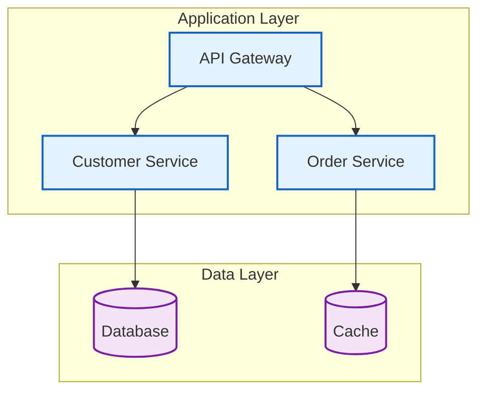
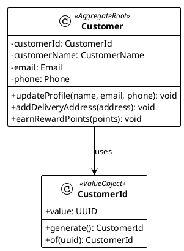

# Diagram Tools Usage Guide

## Overview

This project uses three main diagram tools to meet different visualization needs:

- **Mermaid**: Architecture diagrams displayed directly on GitHub
- **PlantUML**: Detailed UML diagrams
- **Excalidraw**: Conceptual design and hand-drawn style diagrams

## Tool Selection Strategy

### Use Case Comparison Table

| Tool | Best Use Cases | GitHub Display | Advantages | Disadvantages |
|------|---------------|----------------|------------|---------------|
| **Mermaid** | System architecture, flowcharts, sequence diagrams | ✅ Direct display | Concise syntax, GitHub native support, version control friendly | Limited style customization, insufficient expression for complex diagrams |
| **PlantUML** | Detailed UML diagrams, complex class diagrams, design documents | ❌ Requires PNG conversion | Powerful features, UML standard, supports complex diagrams | Complex syntax, requires additional tools for image generation |
| **Excalidraw** | Conceptual design, brainstorming, hand-drawn style diagrams | ❌ Requires PNG conversion | Intuitive and easy to use, hand-drawn style, AI-assisted creation | Not suitable for precise technical diagrams, requires MCP integration |

## Mermaid - Primary Architecture Diagrams

### Mermaid Use Cases

1. **System Overview Diagrams** - Show overall architecture
2. **Service Interactions** - Microservice communication diagrams
3. **Deployment Architecture** - Infrastructure overview
4. **Business Processes** - High-level process flows
5. **Event-Driven Architecture** - Event flow diagrams

### Mermaid Syntax Examples



### Directory Structure

```text
docs/diagrams/viewpoints/
├── functional/
│   ├── system-overview.md              # System overview diagram (contains Mermaid code blocks)
│   ├── bounded-contexts.md             # Bounded context diagram (contains Mermaid code blocks)
│   └── use-case-flow.md               # Use case flow diagram (contains Mermaid code blocks)
├── information/
│   ├── event-driven-architecture.md   # Event-driven architecture (contains Mermaid code blocks)
│   ├── data-flow.md                   # Data flow diagram (contains Mermaid code blocks)
│   └── event-storming-overview.md     # Event Storming overview (contains Mermaid code blocks)
├── development/
│   ├── hexagonal-architecture.md      # Hexagonal architecture diagram (contains Mermaid code blocks)
│   ├── ddd-layered-architecture.md    # DDD layered architecture (contains Mermaid code blocks)
│   └── ci-cd-pipeline.md              # CI/CD pipeline diagram (contains Mermaid code blocks)
├── deployment/
│   ├── infrastructure-overview.md     # Infrastructure overview (contains Mermaid code blocks)
│   └── deployment-pipeline.md         # Deployment pipeline diagram (contains Mermaid code blocks)
├── operational/
│   ├── monitoring-architecture.md     # Monitoring architecture (contains Mermaid code blocks)
│   └── observability-flow.md          # Observability flow (contains Mermaid code blocks)
└── concurrency/
    └── async-processing.md             # Asynchronous processing architecture (contains Mermaid code blocks)
```

## PlantUML - Detailed Technical Diagrams

### PlantUML Use Cases

1. **Domain Model Class Diagrams** - DDD aggregate root design
2. **Event Storming Diagrams** - Three-phase event storming
3. **Sequence Diagrams** - Detailed interaction flows
4. **Component Diagrams** - System component relationships
5. **Deployment Diagrams** - Detailed deployment architecture

### PlantUML Syntax Examples



### PlantUML Directory Structure

```text
docs/diagrams/viewpoints/
├── functional/
│   ├── domain-model-class.puml         # Domain model class diagram
│   ├── aggregate-details.puml          # Aggregate root detailed design
│   └── use-case-diagram.puml           # Use case diagram
├── information/
│   ├── event-storming-big-picture.puml # Event Storming Big Picture
│   ├── event-storming-process.puml     # Event Storming Process Level
│   ├── event-storming-design.puml      # Event Storming Design Level
│   └── sequence-diagrams/              # Sequence diagram directory
│       ├── order-processing.puml
│       ├── payment-processing.puml
│       └── inventory-management.puml
└── deployment/
    ├── infrastructure-architecture.puml # Infrastructure architecture
    ├── deployment-diagram.puml         # Deployment diagram
    └── network-topology.puml           # Network topology diagram
```

### Event Storming Standard Colors

```plantuml
' Event Storming standard colors
skinparam rectangle {
    ' Events - Orange series
    BackgroundColor<<Event>> #FFA500
    BorderColor<<Event>> #FF8C00
    
    ' Hotspots/Issues - Red series  
    BackgroundColor<<Hotspot>> #FF0000
    BorderColor<<Hotspot>> #DC143C
    
    ' Actors - Yellow series
    BackgroundColor<<Actor>> #FFD700
    BorderColor<<Actor>> #DAA520
    
    ' Commands - Blue series
    BackgroundColor<<Command>> #1E90FF
    BorderColor<<Command>> #0000FF
    
    ' Aggregates - Yellow series
    BackgroundColor<<Aggregate>> #FFFF00
    BorderColor<<Aggregate>> #FFD700
    
    ' Read Models - Green series
    BackgroundColor<<ReadModel>> #32CD32
    BorderColor<<ReadModel>> #228B22
    
    ' Policies - Purple series
    BackgroundColor<<Policy>> #800080
    BorderColor<<Policy>> #4B0082
}
```

## Excalidraw - Conceptual Design Diagrams

### Excalidraw Use Cases

1. **Conceptual Design** - Early architecture design
2. **Brainstorming** - Team discussion diagrams
3. **Stakeholder Mapping** - System participant diagrams
4. **User Journey** - User experience flows
5. **Hand-drawn Style Diagrams** - Informal documentation

### MCP Integration Usage

```javascript
// Use Excalidraw MCP to create concept diagrams
const conceptDiagram = await excalidrawMCP.createDiagram({
  title: "System Architecture Concept Diagram",
  elements: [
    {
      type: "rectangle",
      x: 100,
      y: 100,
      width: 200,
      height: 100,
      text: "User Interface",
      backgroundColor: "#e3f2fd"
    },
    {
      type: "rectangle", 
      x: 100,
      y: 250,
      width: 200,
      height: 100,
      text: "Business Logic",
      backgroundColor: "#f3e5f5"
    }
  ]
});
```

### Excalidraw Directory Structure

```text
docs/diagrams/concepts/
├── architecture-brainstorm.excalidraw  # Architecture brainstorming
├── design-sketches.excalidraw          # Design sketches
├── stakeholder-mapping.excalidraw      # Stakeholder mapping diagram
├── user-journey.excalidraw             # User journey
└── system-context.excalidraw           # System context diagram
```

## Automated Diagram Generation

### GitHub Actions Workflow

```yaml
name: Generate Diagrams
on:
  push:
    paths:
      - 'docs/diagrams/**/*.puml'
      - 'docs/diagrams/**/*.excalidraw'

jobs:
  generate-diagrams:
    runs-on: ubuntu-latest
    steps:
      - uses: actions/checkout@v3
      
      - name: Generate PlantUML diagrams
        uses: cloudbees/plantuml-github-action@master
        with:
          args: -v -tpng docs/diagrams/**/*.puml
          
      - name: Generate Excalidraw PNGs
        run: |
          npm install -g @excalidraw/cli
          find docs/diagrams -name "*.excalidraw" -exec excalidraw-cli {} \;
          
      - name: Commit generated images
        run: |
          git config --local user.email "action@github.com"
          git config --local user.name "GitHub Action"
          git add docs/diagrams/**/*.png
          git commit -m "Auto-generate diagram images" || exit 0
          git push
```

### Local Development Scripts

```bash
#!/bin/bash
# scripts/generate-all-diagrams.sh

echo "🎨 Generating all diagrams..."

# Generate PlantUML diagrams
echo "📊 Generating PlantUML diagrams..."
find docs/diagrams -name "*.puml" -exec java -jar tools-and-environment/plantuml.jar -tpng {} \;

# Generate Excalidraw diagrams (via MCP)
echo "✏️ Generating Excalidraw diagrams..."
find docs/diagrams -name "*.excalidraw" -exec node scripts/excalidraw-to-svg.js {} \;

# Validate Mermaid syntax
echo "🔍 Validating Mermaid syntax..."
find docs/diagrams -name "*.mmd" -exec npx @mermaid-js/mermaid-cli -i {} -o {}.png \;

echo "✅ All diagrams generated successfully!"
```

## Diagram Maintenance Best Practices

### 1. Naming Conventions

- **Mermaid**: `kebab-case.mmd`
- **PlantUML**: `kebab-case.puml`
- **Excalidraw**: `kebab-case.excalidraw`

### 2. File Organization

- Organize by Viewpoint classification
- Place related diagrams in the same directory
- Use descriptive file names

### 3. Version Control

- Include source files in version control
- Optionally include PNG files
- Use `.gitignore` to manage generated files

### 4. Documentation Association

- Reference diagrams in Markdown documents
- Provide diagram descriptions and context
- Keep diagrams synchronized with documentation

### 5. Quality Checks

- Regularly check diagram accuracy
- Validate diagram syntax correctness
- Ensure diagrams match actual implementation

## Tool Installation and Configuration

### PlantUML Setup

```bash
# Download PlantUML JAR
wget https://github.com/plantuml/plantuml/releases/latest/download/plantuml.jar -O tools-and-environment/plantuml.jar

# Generate diagrams
java -jar tools/plantuml.jar -tpng docs/diagrams/**/*.puml
```

### Mermaid CLI Setup

```bash
# Install Mermaid CLI
npm install -g @mermaid-js/mermaid-cli

# Generate diagrams
mmdc -i input.mmd -o output.png
```

### Excalidraw MCP Setup

```json
{
  "mcpServers": {
    "excalidraw": {
      "command": "uvx",
      "args": ["excalidraw-mcp-server@latest"],
      "env": {
        "EXCALIDRAW_API_KEY": "${EXCALIDRAW_API_KEY}"
      }
    }
  }
}
```

## Summary

By properly using these three diagram tools, we can:

1. **Mermaid** - Provide GitHub-friendly architecture overviews
2. **PlantUML** - Create detailed technical design diagrams
3. **Excalidraw** - Support conceptual design and creative expression

Each tool has its optimal use cases, and choosing the right tool can maximize the effectiveness and maintainability of diagrams.