# 電子商務系統 UML 文檔說明

本目錄包含電子商務系統的各種 UML 圖表，用於描述系統的架構、設計和行為。

## 圖表列表

### 基礎圖表

1. **類別圖 (class-diagram.puml)**
   - 描述系統中的主要類別及其關係
   - 包括訂單、支付、定價和配送聚合根，以及相關實體、值對象和領域服務

2. **對象圖 (object-diagram.puml)**
   - 展示領域模型的實例關係
   - 包括訂單、訂單項目、支付和配送等具體對象實例

3. **組件圖 (component-diagram.puml)**
   - 展示系統的主要組件及其交互
   - 基於六角形架構，展示端口和適配器
   - 包括持久化適配器和外部系統適配器

4. **部署圖 (deployment-diagram.puml)**
   - 描述系統的部署架構
   - 包括服務器、數據庫、消息中間件和外部系統

5. **套件圖 (package-diagram.puml)**
   - 展示系統的套件結構和依賴關係
   - 按照六角形架構劃分為接口層、應用層、領域層和基礎設施層
   - 包括定價和配送模組的套件結構

6. **時序圖 (sequence-diagram.puml)**
   - 描述訂單處理的主要流程
   - 包括創建訂單、處理支付和添加訂單項目的時序

7. **定價處理時序圖 (pricing-sequence-diagram.puml)**
   - 描述定價處理的主要流程
   - 包括創建定價規則、更新佣金費率、獲取產品類別的定價規則和計算佣金

8. **配送處理時序圖 (delivery-sequence-diagram.puml)**
   - 描述配送處理的主要流程
   - 包括創建配送、安排配送、分配配送資源、更新配送地址、標記為已送達等操作

9. **狀態圖 (state-diagram.puml)**
   - 展示訂單在不同狀態之間的轉換
   - 包括子狀態和可能的回退路徑

10. **活動圖概覽 (activity-diagram-overview.puml)**
    - 高層次展示電子商務系統的主要業務流程
    - 包括客戶、訂單系統、支付系統和物流系統的交互

11. **活動圖詳細 (activity-diagram-detail.puml)**
    - 詳細展示訂單處理的具體步驟
    - 包括各層之間的交互和事件流

12. **使用案例圖 (use-case-diagram.puml)**
    - 描述系統的主要功能和參與者
    - 區分核心用例和擴展用例

### 領域驅動設計圖表

13. **領域模型圖 (domain-model-diagram.puml)**
    - 詳細展示系統中的聚合根、實體、值對象和領域服務
    - 按照領域上下文組織
    - 包括訂單、支付、定價和配送聚合

14. **六角形架構圖 (hexagonal-architecture-diagram.puml)**
    - 詳細展示系統的端口和適配器模式
    - 包括驅動適配器、應用核心和被驅動適配器
    - 展示應用層映射器的作用

15. **DDD分層架構圖 (ddd-layers-diagram.puml)**
    - 展示DDD分層架構的依賴關係和數據流向
    - 詳細說明每一層的職責和組件
    - 特別強調數據轉換和映射器的作用

16. **Saga模式圖 (saga-pattern-diagram.puml)**
    - 展示分布式事務處理流程
    - 包括正常流程和補償事務

17. **限界上下文圖 (bounded-context-diagram.puml)**
    - 展示系統中不同上下文之間的關係
    - 包括上下文映射模式

18. **事件風暴圖 (big-picture-exploration.puml, process-modeling.puml, design-level.puml)**
    - 展示系統中的命令、事件、聚合根、策略和讀模型
    - 基於事件風暴工作坊的結果
    - **大圖探索階段 (Big Picture Exploration)**：快速了解整個業務領域
    - **流程建模階段 (Process Modeling)**：深入理解事件之間的因果關係
    - **設計級別階段 (Design Level)**：為軟體實現提供詳細設計

### 進階架構圖表

19. **CQRS模式圖 (cqrs-pattern-diagram.puml)**
    - 展示命令和查詢責任分離模式
    - 包括命令端和查詢端的架構

20. **事件溯源圖 (event-sourcing-diagram.puml)**
    - 展示事件的存儲和重放機制
    - 包括如何從事件構建讀模型

21. **API接口圖 (api-interface-diagram.puml)**
    - 展示系統對外提供的API接口
    - 包括端點和數據結構

22. **數據模型圖 (data-model-diagram.puml)**
    - 展示系統的數據庫模型和關係
    - 包括表、列和關係

23. **安全架構圖 (security-architecture-diagram.puml)**
    - 展示系統的安全機制和認證授權流程
    - 包括安全控制和監控

24. **可觀測性架構圖 (observability-diagram.puml)**
    - 展示系統的監控、日誌和可觀測性架構
    - 包括指標、日誌、追蹤和告警

## 如何查看圖表

這些圖表使用 PlantUML 創建，可以通過以下方式查看：

1. **使用 PlantUML 在線服務**：
   - 訪問 <http://www.plantuml.com/plantuml/uml/>
   - 複製 .puml 文件內容並粘貼到編輯器中

2. **使用 PlantUML 本地渲染**：
   - 使用項目根目錄中的 plantuml.jar
   - 執行命令：`java -jar plantuml.jar docs/uml/圖表名稱.puml`

3. **使用 IDE 插件**：
   - IntelliJ IDEA、VS Code 等 IDE 都有 PlantUML 插件
   - 安裝插件後可直接在 IDE 中預覽

## 圖表更新指南

更新這些 UML 圖表時，請遵循以下原則：

1. 保持圖表與實際代碼一致
2. 使用中文命名和註釋，提高可讀性
3. 適當使用顏色和分組，增強視覺效果
4. 添加必要的註釋，解釋複雜的關係或概念
5. 更新後在本文檔中記錄變更

## 最近更新

- 2023-03-23：初始版本創建
- 2024-05-10：更新所有圖表以反映最新系統架構
- 2024-05-10：添加新的領域驅動設計圖表
- 2024-05-10：添加進階架構圖表
- 2024-05-10：添加對象圖和活動圖
- 2024-06-08：更新類別圖、組件圖、領域模型圖、六角形架構圖和套件圖
- 2024-06-08：添加定價處理時序圖、配送處理時序圖和DDD分層架構圖

## 圖表預覽

要查看圖表，請使用上述方法之一渲染 .puml 文件。以下是一些示例圖表的預覽：

### 類別圖

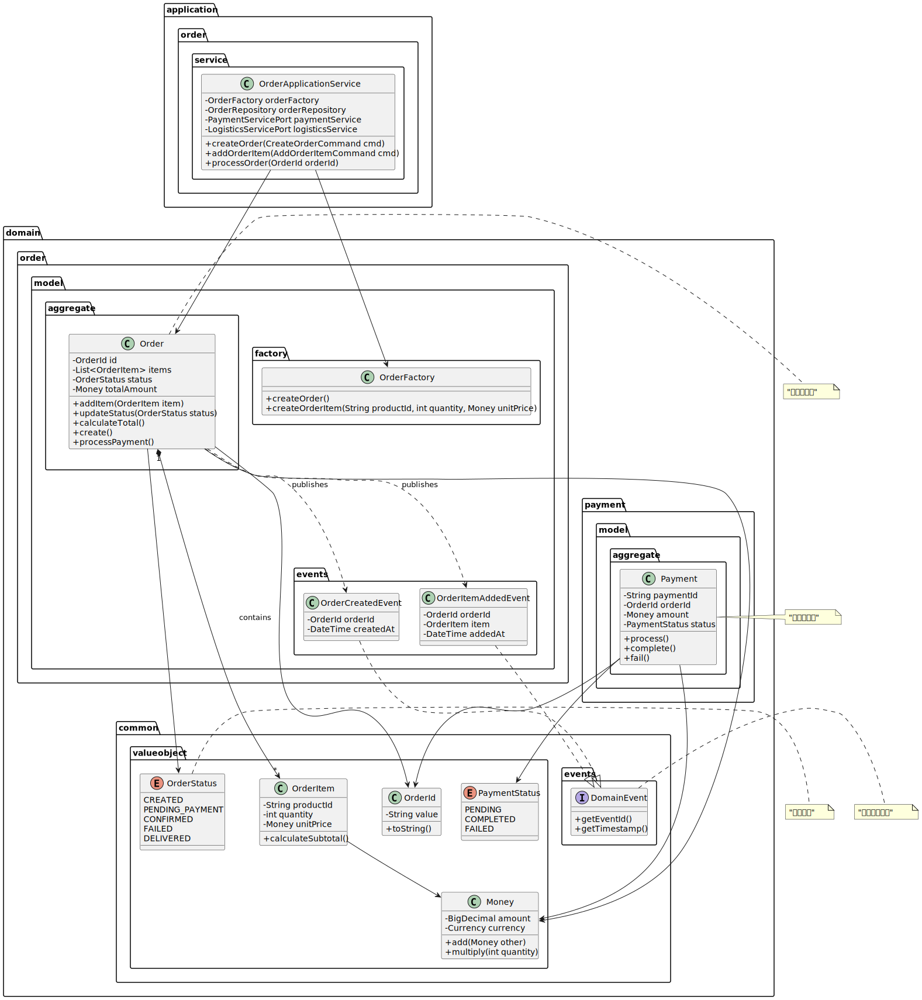

### 對象圖

### 組件圖

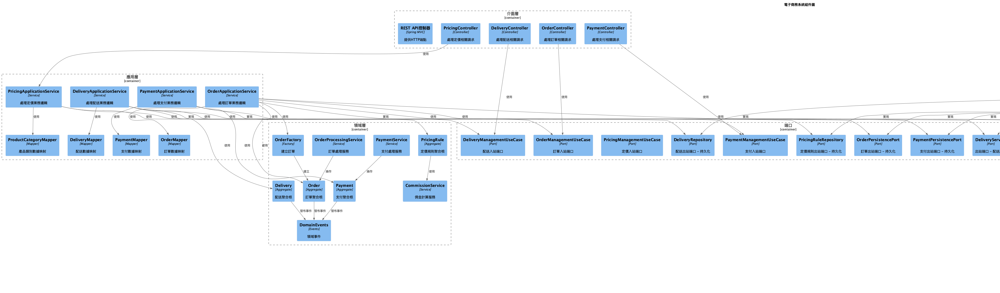

### 部署圖

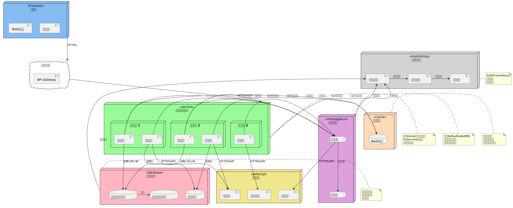

### 套件圖

### 時序圖

### 定價處理時序圖

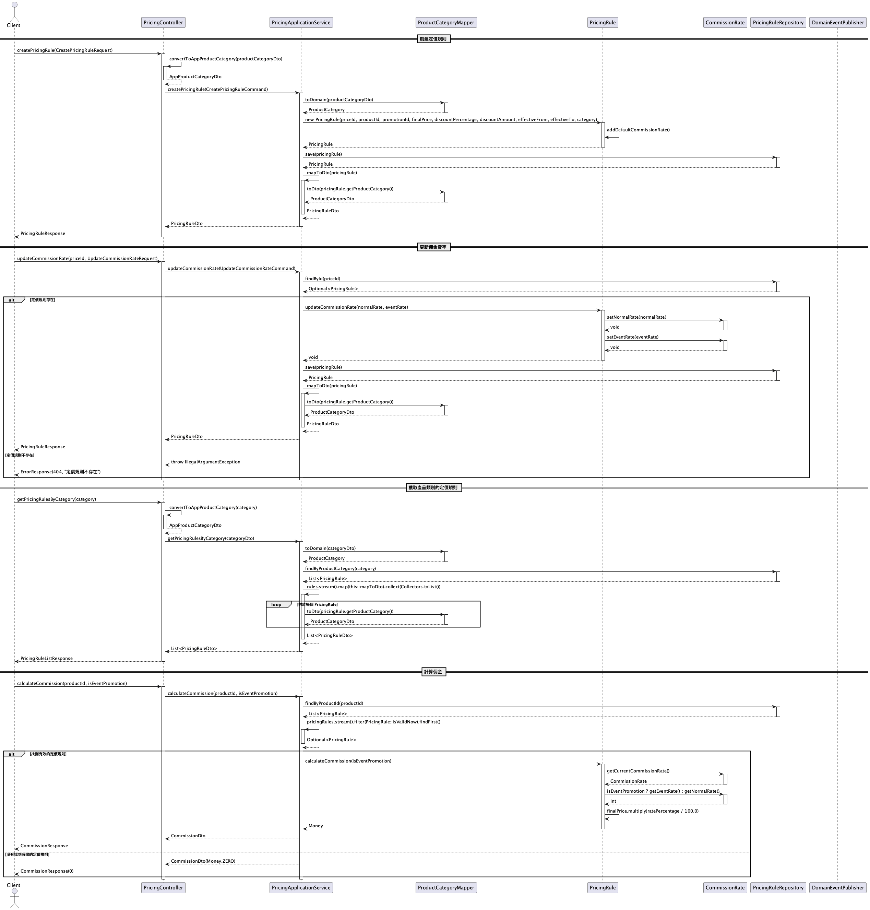

### 配送處理時序圖

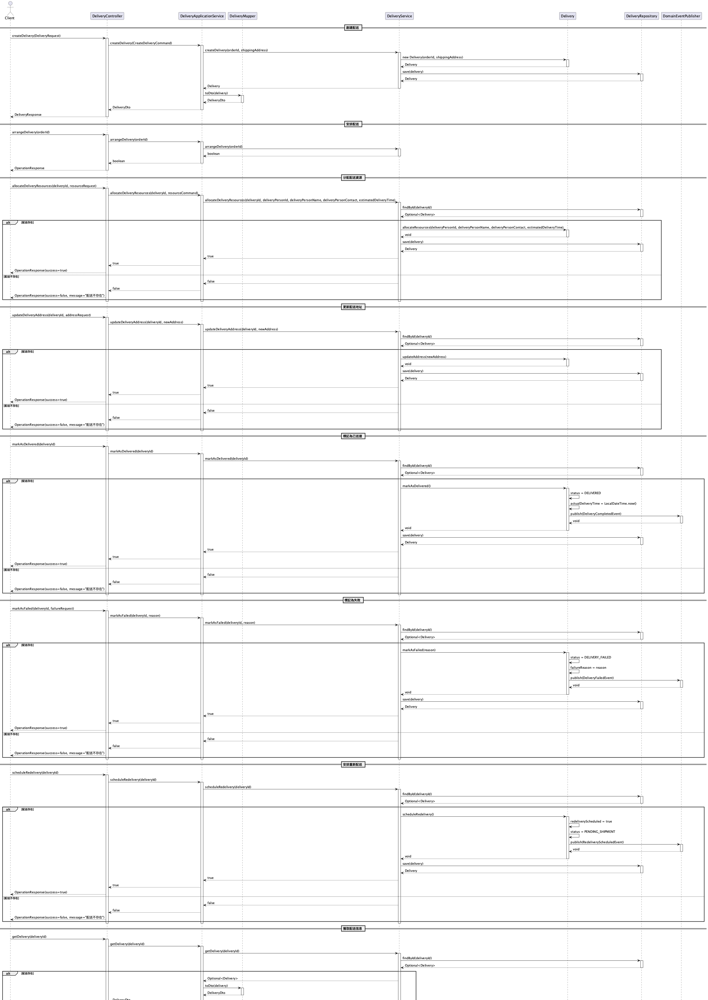

### 狀態圖

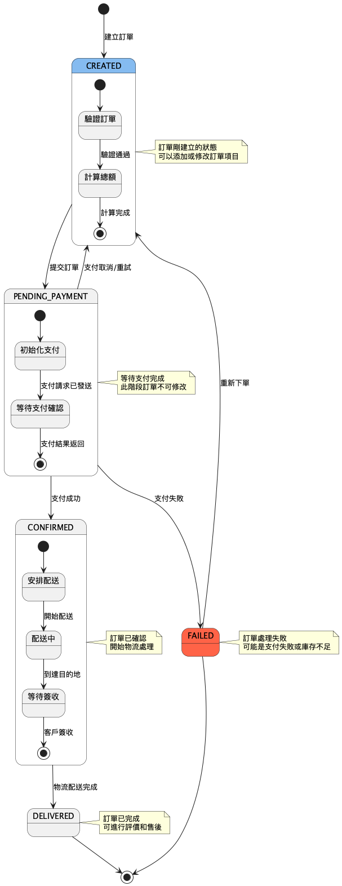

### 活動圖概覽

### 活動圖詳細

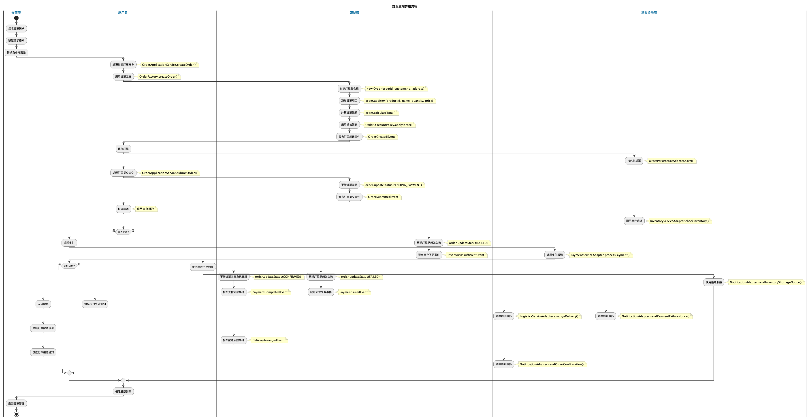

### 使用案例圖

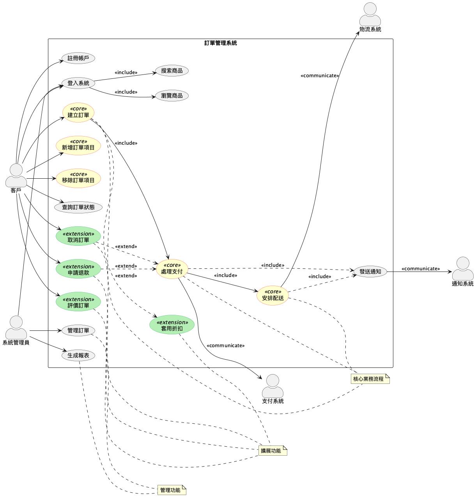

### 領域模型圖

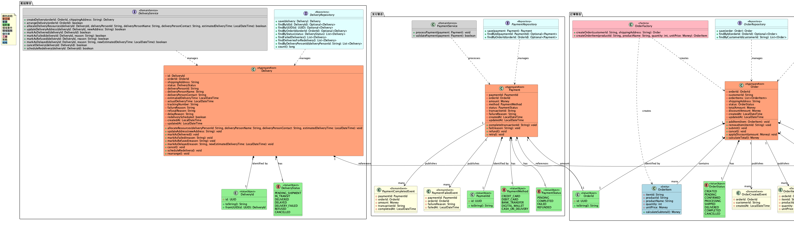

### 六角形架構圖

### DDD分層架構圖

### Saga模式圖

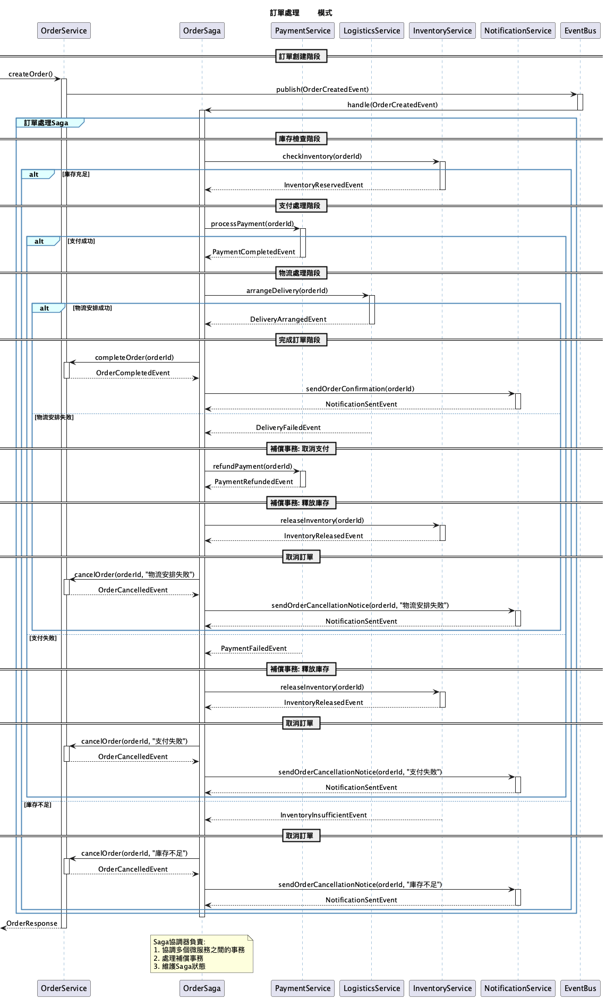

### 限界上下文圖

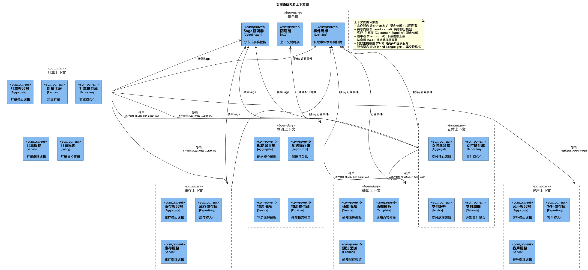

### 事件風暴圖-Big Picture Exploration

### 事件風暴圖-Process Modeling

### 事件風暴圖-Design Level

### CQRS模式圖

### 事件溯源圖

### API接口圖

### 數據模型圖

### 安全架構圖

### 可觀測性架構圖

