# Event Storming Three-Phase PlantUML Generation Guide

This document provides a guide for using PlantUML to create diagrams for the three phases of Event Storming, including layout, color specifications, element ordering, and best practices.

## Event Storming Overview

Event Storming is a collaborative modeling technique created by Alberto Brandolini for exploring complex business domains. It typically consists of three main phases:

1. **Big Picture Exploration**: Rapidly understand the entire business domain
2. **Process Modeling**: Deep understanding of causal relationships between events
3. **Design Level**: Provide detailed design for software implementation

## Standard Color Specifications

Event Storming uses specific colors to distinguish different types of elements:

| Element Type | Color Code | Description |
|-------------|------------|-------------|
| Events | #FFA500 (Orange) | Things that happen in the system |
| Commands | #1E90FF (Blue) | Actions or intentions that trigger events |
| Aggregates | #FFFF00 (Yellow) | Entities that ensure business rules |
| Policies | #800080 (Purple) | Business rules executed when events occur |
| Read Models | #32CD32 (Green) | Information or views that users see |
| External Systems | #FF69B4 (Pink) | External systems interacting with core system |
| Actors | #FFD700 (Gold) | People or systems executing commands |
| Hotspots/Issues | #FF0000 (Red) | Problems or decision points to be resolved |
| Services | #ADD8E6 (Light Blue) | Coordinate aggregates and handle business logic |

## Layout Principles

### General Layout Principles

1. **Time Flow**: Left to right represents time flow
2. **Main Process Center**: Main process (happy path) in the middle
3. **Branch Processes Below**: Exception paths or branch processes below main process
4. **Vertical Layering**: Different types of elements arranged in vertical layers
5. **Related Element Grouping**: Use `together` or `package` to group related elements

### Element Vertical Ordering (Top to Bottom)

1. Actors
2. Read Models
3. Commands
4. Aggregates
5. Events
6. Issues/Hotspots
7. Policies
8. External Systems

## PlantUML Implementation for Three Phases

### 1. Big Picture Exploration

#### Focus Areas
- Major domain events
- Temporal sequence between events
- Key issues and decision points

#### Element Types
- Events
- Hotspots/Issues

#### PlantUML Example

```puml
@startuml big-picture-exploration
left to right direction

skinparam rectangle {
    RoundCorner 25
    BorderColor black
    FontStyle bold
}

title Order System Event Storm Diagram - Big Picture Exploration Phase

' Focus only on major domain events
rectangle "Order Created" as OrderCreatedEvent #FFA500
rectangle "Order Item Added" as OrderItemAddedEvent #FFA500
rectangle "Order Submitted" as OrderSubmittedEvent #FFA500
rectangle "Inventory Checked" as InventoryCheckedEvent #FFA500
rectangle "Inventory Reserved" as InventoryReservedEvent #FFA500
rectangle "Payment Requested" as PaymentRequestedEvent #FFA500
rectangle "Payment Completed" as PaymentCompletedEvent #FFA500
rectangle "Order Confirmed" as OrderConfirmedEvent #FFA500
rectangle "Delivery Arranged" as DeliveryArrangedEvent #FFA500
rectangle "Delivery Completed" as DeliveryCompletedEvent #FFA500
rectangle "Order Cancelled" as OrderCancelledEvent #FFA500

' Hotspots/Issues
rectangle "How to handle inventory reservation timeout?" as InventoryTimeoutIssue #FF0000
rectangle "Payment failure retry strategy?" as PaymentRetryIssue #FF0000
rectangle "How to handle reserved inventory after order cancellation?" as InventoryReleaseIssue #FF0000
rectangle "How to handle delivery failure?" as DeliveryFailureIssue #FF0000

' Timeline connections
OrderCreatedEvent --> OrderItemAddedEvent
OrderItemAddedEvent --> OrderSubmittedEvent
OrderSubmittedEvent --> InventoryCheckedEvent
InventoryCheckedEvent --> InventoryReservedEvent
InventoryReservedEvent --> PaymentRequestedEvent
PaymentRequestedEvent --> PaymentCompletedEvent
PaymentCompletedEvent --> OrderConfirmedEvent
OrderConfirmedEvent --> DeliveryArrangedEvent
DeliveryArrangedEvent --> DeliveryCompletedEvent

' Branch paths
InventoryCheckedEvent -[#red]-> OrderCancelledEvent : Insufficient inventory
PaymentRequestedEvent -[#red]-> OrderCancelledEvent : Payment failed

' Hotspot issue connections
InventoryTimeoutIssue -[#red,dashed]-> InventoryReservedEvent
PaymentRetryIssue -[#red,dashed]-> PaymentRequestedEvent
InventoryReleaseIssue -[#red,dashed]-> OrderCancelledEvent
DeliveryFailureIssue -[#red,dashed]-> DeliveryArrangedEvent
```

#### Layout Tips
- Keep it simple, focus only on main event flow
- Use red dashed lines to connect issues with related events
- Use red solid lines for exception flows
- Arrange events chronologically from left to right
- Place issues diagonally above or below related events

### 2. Process Modeling

#### Focus Areas
- Causal relationships between commands and events
- How aggregates handle commands and produce events
- How read models influence user decisions
- How policies respond to events

#### Element Types
- Actors
- Read Models
- Commands
- Aggregates
- Events
- Policies