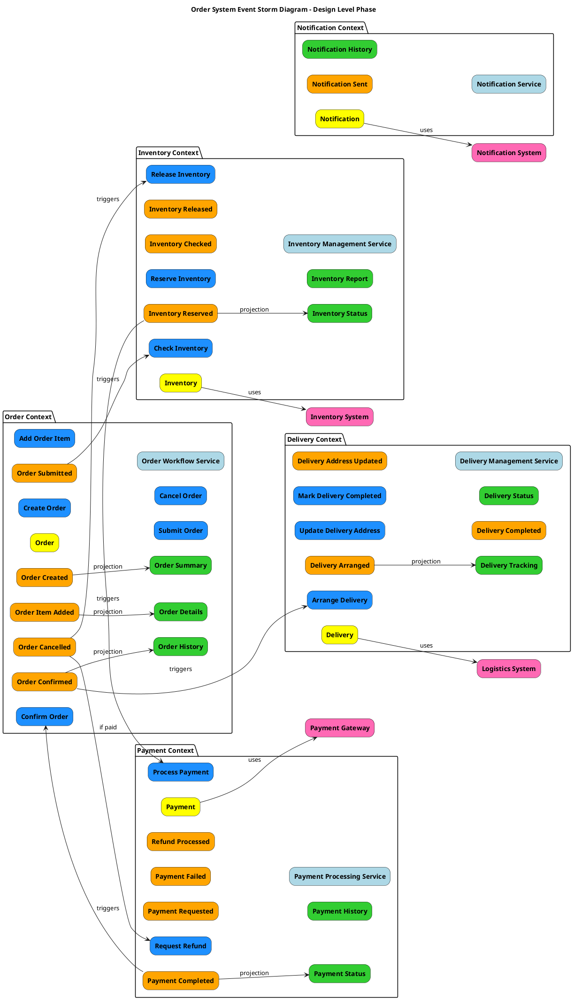

```puml
@startuml big-picture-exploration
left to right direction

skinparam rectangle {
    RoundCorner 25
    BorderColor black
    FontStyle bold
}

title Order System Event Storm Diagram - Big Picture Exploration Phase

' Focus only on major domain events
rectangle "Order Created" as OrderCreatedEvent #FFA500
rectangle "Order Item Added" as OrderItemAddedEvent #FFA500
rectangle "Order Submitted" as OrderSubmittedEvent #FFA500
rectangle "Inventory Checked" as InventoryCheckedEvent #FFA500
rectangle "Inventory Reserved" as InventoryReservedEvent #FFA500
rectangle "Payment Requested" as PaymentRequestedEvent #FFA500
rectangle "Payment Completed" as PaymentCompletedEvent #FFA500
rectangle "Order Confirmed" as OrderConfirmedEvent #FFA500
rectangle "Delivery Arranged" as DeliveryArrangedEvent #FFA500
rectangle "Delivery Completed" as DeliveryCompletedEvent #FFA500
rectangle "Order Cancelled" as OrderCancelledEvent #FFA500

' Hotspots/Issues
rectangle "How to handle inventory reservation timeout?" as InventoryTimeoutIssue #FF0000
rectangle "Payment failure retry strategy?" as PaymentRetryIssue #FF0000
rectangle "How to handle reserved inventory after order cancellation?" as InventoryReleaseIssue #FF0000
rectangle "How to handle delivery failure?" as DeliveryFailureIssue #FF0000

' Timeline connections
OrderCreatedEvent --> OrderItemAddedEvent
OrderItemAddedEvent --> OrderSubmittedEvent
OrderSubmittedEvent --> InventoryCheckedEvent
InventoryCheckedEvent --> InventoryReservedEvent
InventoryReservedEvent --> PaymentRequestedEvent
PaymentRequestedEvent --> PaymentCompletedEvent
PaymentCompletedEvent --> OrderConfirmedEvent
OrderConfirmedEvent --> DeliveryArrangedEvent
DeliveryArrangedEvent --> DeliveryCompletedEvent

' Branch paths
InventoryCheckedEvent -[#red]-> OrderCancelledEvent : Insufficient inventory
PaymentRequestedEvent -[#red]-> OrderCancelledEvent : Payment failed

' Hotspot issue connections
InventoryTimeoutIssue -[#red,dashed]-> InventoryReservedEvent
PaymentRetryIssue -[#red,dashed]-> PaymentRequestedEvent
InventoryReleaseIssue -[#red,dashed]-> OrderCancelledEvent
DeliveryFailureIssue -[#red,dashed]-> DeliveryArrangedEvent
```

```puml
@startuml process-modeling
left to right direction

skinparam rectangle {
    RoundCorner 25
    BorderColor black
    FontStyle bold
}

title Order System Event Storm Diagram - Process Modeling Phase

' Actors
rectangle "Customer" as Customer #FFD700
rectangle "System Administrator" as Admin #FFD700

' Read Models
rectangle "Product Catalog" as ProductCatalogReadModel #32CD32
rectangle "Order Summary" as OrderSummaryReadModel #32CD32
rectangle "Inventory Status" as InventoryStatusReadModel #32CD32
rectangle "Payment Status" as PaymentStatusReadModel #32CD32

' Commands
rectangle "Create Order" as CreateOrderCommand #1E90FF
rectangle "Add Order Item" as AddOrderItemCommand #1E90FF
rectangle "Submit Order" as SubmitOrderCommand #1E90FF
rectangle "Check Inventory" as CheckInventoryCommand #1E90FF
rectangle "Reserve Inventory" as ReserveInventoryCommand #1E90FF
rectangle "Process Payment" as ProcessPaymentCommand #1E90FF
rectangle "Confirm Order" as ConfirmOrderCommand #1E90FF
rectangle "Cancel Order" as CancelOrderCommand #1E90FF

' Aggregates
rectangle "Order" as OrderAggregate #FFFF00
rectangle "Inventory" as InventoryAggregate #FFFF00
rectangle "Payment" as PaymentAggregate #FFFF00

' Events
rectangle "Order Created" as OrderCreatedEvent #FFA500
rectangle "Order Item Added" as OrderItemAddedEvent #FFA500
rectangle "Order Submitted" as OrderSubmittedEvent #FFA500
rectangle "Inventory Checked" as InventoryCheckedEvent #FFA500
rectangle "Inventory Reserved" as InventoryReservedEvent #FFA500
rectangle "Payment Requested" as PaymentRequestedEvent #FFA500
rectangle "Payment Completed" as PaymentCompletedEvent #FFA500
rectangle "Order Confirmed" as OrderConfirmedEvent #FFA500
rectangle "Order Cancelled" as OrderCancelledEvent #FFA500

' Policies
rectangle "Inventory Reservation Policy" as InventoryReservationPolicy #800080
rectangle "Payment Processing Policy" as PaymentProcessingPolicy #800080
rectangle "Order Cancellation Policy" as OrderCancellationPolicy #800080

' Process connections
' Order creation flow
Customer --> ProductCatalogReadModel
ProductCatalogReadModel --> CreateOrderCommand
CreateOrderCommand --> OrderAggregate
OrderAggregate --> OrderCreatedEvent
OrderCreatedEvent --> OrderSummaryReadModel

' Add order item flow
Customer --> OrderSummaryReadModel
OrderSummaryReadModel --> AddOrderItemCommand
AddOrderItemCommand --> OrderAggregate
OrderAggregate --> OrderItemAddedEvent

' Submit order flow
Customer --> SubmitOrderCommand
SubmitOrderCommand --> OrderAggregate
OrderAggregate --> OrderSubmittedEvent
OrderSubmittedEvent --> CheckInventoryCommand

' Inventory check and reservation flow
CheckInventoryCommand --> InventoryAggregate
InventoryAggregate --> InventoryCheckedEvent
InventoryCheckedEvent --> InventoryReservationPolicy
InventoryReservationPolicy --> ReserveInventoryCommand
ReserveInventoryCommand --> InventoryAggregate
InventoryAggregate --> InventoryReservedEvent
InventoryReservedEvent --> InventoryStatusReadModel
InventoryReservedEvent --> ProcessPaymentCommand

' Payment processing flow
ProcessPaymentCommand --> PaymentAggregate
PaymentAggregate --> PaymentRequestedEvent
PaymentAggregate --> PaymentCompletedEvent : Payment successful
PaymentAggregate --> OrderCancelledEvent : Payment failed
PaymentCompletedEvent --> PaymentStatusReadModel
PaymentCompletedEvent --> PaymentProcessingPolicy
PaymentProcessingPolicy --> ConfirmOrderCommand

' Order confirmation flow
ConfirmOrderCommand --> OrderAggregate
OrderAggregate --> OrderConfirmedEvent

' Order cancellation flow
CancelOrderCommand --> OrderAggregate
OrderAggregate --> OrderCancelledEvent
OrderCancelledEvent --> OrderCancellationPolicy
```

# Event Storming Three-Phase PlantUML Generation Guide

This document provides a guide for using PlantUML to create diagrams for the three phases of Event Storming, including layout, color specifications, element ordering, and best practices.

## Event Storming Overview

Event Storming is a collaborative modeling technique created by Alberto Brandolini for exploring complex business domains. It typically consists of three main phases:

1. **Big Picture Exploration**: Rapidly understand the entire business domain
2. **Process Modeling**: Deep understanding of causal relationships between events
3. **Design Level**: Provide detailed design for software implementation

## Standard Color Specifications

Event Storming uses specific colors to distinguish different types of elements:

| Element Type | Color Code | Description |
|-------------|------------|-------------|
| Events | #FFA500 (Orange) | Things that happen in the system |
| Commands | #1E90FF (Blue) | Actions or intentions that trigger events |
| Aggregates | #FFFF00 (Yellow) | Entities that ensure business rules |
| Policies | #800080 (Purple) | Business rules executed when events occur |
| Read Models | #32CD32 (Green) | Information or views that users see |
| External Systems | #FF69B4 (Pink) | External systems interacting with core system |
| Actors | #FFD700 (Gold) | People or systems executing commands |
| Hotspots/Issues | #FF0000 (Red) | Problems or decision points to be resolved |
| Services | #ADD8E6 (Light Blue) | Coordinate aggregates and handle business logic |

## Layout Principles

### General Layout Principles

1. **Time Flow**: Left to right represents time flow
2. **Main Process Center**: Main process (happy path) in the middle
3. **Branch Processes Below**: Exception paths or branch processes below main process
4. **Vertical Layering**: Different types of elements arranged in vertical layers
5. **Related Element Grouping**: Use `together` or `package` to group related elements

### Element Vertical Ordering (Top to Bottom)

1. Actors
2. Read Models
3. Commands
4. Aggregates
5. Events
6. Issues/Hotspots
7. Policies
8. External Systems

## PlantUML Implementation for Three Phases

### 1. Big Picture Exploration

#### Focus Areas
- Major domain events
- Temporal sequence between events
- Key issues and decision points

#### Element Types
- Events
- Hotspots/Issues

#### PlantUML Example


#### Layout Tips
- Keep it simple, focus only on main event flow
- Use red dashed lines to connect issues with related events
- Use red solid lines for exception flows
- Arrange events chronologically from left to right
- Place issues diagonally above or below related events

### 2. Process Modeling

#### Focus Areas
- Causal relationships between commands and events
- How aggregates handle commands and produce events
- How read models influence user decisions
- How policies respond to events

#### Element Types
- Actors
- Read Models
- Commands
- Aggregates
- Events
- Policies

#### PlantUML Example


#### Layout Tips
- Arrange different types of elements in vertical layers
- Use horizontal flow to represent business processes
- Vertically align related elements
- Use annotations to explain special conditions or branches
- Place main processes in the middle, branch processes below

### 3. Design Level

#### Focus Areas
- Bounded context boundaries
- Relationships between aggregates
- Service responsibilities
- Integration with external systems
- Read model design and event projections

#### Element Types
- Bounded Contexts
- Aggregates
- Commands
- Events
- Read Models
- Services
- External Systems

#### PlantUML Example


#### Layout Tips
- Use `package` to clearly separate bounded contexts
- Maintain consistent element arrangement within each context
- Use annotations to explain integration points between contexts
- Highlight interactions with external systems
- Place related contexts together
- Show event-to-read-model projection relationships

## Importance of Read Models in Design Level Phase

In the design level phase, read models are an important component of system design and should not be overlooked. Read models have the following importance in this phase:

1. **CQRS Pattern Implementation**: In the design level phase, Command Query Responsibility Segregation (CQRS) pattern is typically considered, where read models are the core of the query side.

2. **User Interface Design**: Read models directly influence user interface design and implementation, requiring clear definition in the design level phase.

3. **Performance Optimization**: Design level phase needs to consider read model performance optimization strategies, such as caching, indexing, etc.

4. **Event Projection**: In event-driven architecture, read models are typically the result of event projections, which needs to be clarified in the design level phase.

5. **Data Consistency**: Read models help solve eventual consistency issues, requiring consideration of event ordering and data synchronization in the design level phase.

6. **Query Complexity Reduction**: Read models specifically optimized for particular query scenarios can significantly reduce query complexity and improve system response speed.

7. **Cross-Bounded Context Data Integration**: Read models can integrate data from multiple bounded contexts, providing unified views for users.

### Read Model Design Recommendations

In the third phase of Event Storming design, special attention should be paid to the following read model design recommendations:

1. **Clarify Read Model Source Events**: Each read model should clearly identify which events its data comes from, for example:

```puml
OrderCreatedEvent --> OrderSummaryReadModel : projection
OrderItemAddedEvent --> OrderDetailReadModel : projection
PaymentCompletedEvent --> OrderSummaryReadModel : update payment status
```

2. **Define Read Model Update Strategy**:
   - Immediate update: Update read model immediately after event occurs
   - Batch update: Periodically batch process events to update read model
   - On-demand update: Update read model only when queried

3. **Read Model Version Management**: Consider read model evolution strategy, especially in long-running systems.

4. **Read Model Caching Strategy**: Design appropriate caching mechanisms, including cache invalidation strategy and update mechanism.

5. **Cross-Bounded Context Read Models**: Clearly define read models spanning multiple bounded contexts and design their data synchronization mechanisms.

### Read Model Representation in PlantUML

In design level phase PlantUML diagrams, read models should be represented in the following ways:

1. **Include Related Read Models in Each Bounded Context**:

```puml
package "Order Context" {
    rectangle "Order Summary" as OrderSummaryReadModel #32CD32
    rectangle "Order Details" as OrderDetailReadModel #32CD32
}
```

2. **Show Event-to-Read Model Projection Relationships**:

```puml
OrderCreatedEvent --> OrderSummaryReadModel : projection
OrderItemAddedEvent --> OrderDetailReadModel : projection
```

3. **Represent Read Model and User Interface Relationships**:

```puml
rectangle "User" as User #FFD700
User --> OrderSummaryReadModel : query
OrderSummaryReadModel --> User : display
```

4. **Represent Read Model Update Strategy**:

```puml
PaymentCompletedEvent --> OrderSummaryReadModel : immediate update
InventoryCheckedEvent --> InventoryReportReadModel : batch update
```

5. **Represent Cross-Bounded Context Read Models**:

```puml
package "Integrated View" {
    rectangle "Customer Order History" as CustomerOrderHistoryReadModel #32CD32
}

OrderConfirmedEvent --> CustomerOrderHistoryReadModel : projection
PaymentCompletedEvent --> CustomerOrderHistoryReadModel : projection
DeliveryCompletedEvent --> CustomerOrderHistoryReadModel : projection
```

This provides a more comprehensive view of system design, including complete views of both command and query sides, and how read models support user interaction and business decisions.

## Best Practices

### File Organization
- Create separate PlantUML files for each phase
- Use consistent naming conventions, such as `big-picture-exploration.puml`
- Include legend in each file explaining color meanings

### Readability Enhancement
- Use meaningful element IDs, such as `OrderCreatedEvent` instead of `event1`
- Add explanatory text for complex connections
- Use spacing and grouping to enhance visual clarity
- Maintain consistent naming style

### Diagram Generation
Use the following command to convert PlantUML files to SVG format:

```bash
java -jar plantuml.jar -tsvg path/to/file.puml
```

For large diagrams, you may need to increase memory allocation:

```bash
java -Xmx1024m -jar plantuml.jar -tsvg path/to/file.puml
```

## Differences and Connections Between Three Phases

### Phase Evolution
1. **Big Picture Exploration Phase**: Focus on "what happened", capturing major events and issues
2. **Process Modeling Phase**: Add "who did what" and "why", adding commands, aggregates, and policies
3. **Design Level Phase**: Add "how to implement", dividing bounded contexts and services

### Information Density
- Big Picture Exploration Phase: Low density, only core events and issues
- Process Modeling Phase: Medium density, including complete business processes
- Design Level Phase: High density, including implementation details and system structure

### Target Audience
- Big Picture Exploration Phase: All stakeholders, including business and technical personnel
- Process Modeling Phase: Domain experts and development teams
- Design Level Phase: Mainly development teams and architects

## Conclusion

Using PlantUML to create diagrams for the three phases of Event Storming can help teams better understand and communicate complex business domains. By following the color specifications, layout principles, and best practices in this guide, you can create clear, consistent, and informative diagrams that support the entire process from business exploration to detailed design.

Each phase's diagrams have their specific focus areas and target audiences. Through gradual deepening and refinement, teams can transition from high-level business overview to detailed technical design, ensuring software implementation remains aligned with business requirements.