# Mermaid Diagrams Guide

## Overview

This directory contains Mermaid diagrams for the project. Mermaid is a JavaScript-based diagramming tool that renders markdown-inspired text definitions to create diagrams dynamically.

> **🔗 Related Standards**: 
> - [Diagram Generation Standards](../../.kiro/steering/diagram-generation-standards.md) - Complete diagram standards
> - [Event Storming Standards](../../.kiro/steering/event-storming-standards.md) - Event Storming diagram examples

## Why Mermaid?

### Advantages

- ✅ **Native GitHub Support**: Renders automatically in GitHub markdown
- ✅ **Version Control Friendly**: Text-based, easy to diff and merge
- ✅ **Quick Iterations**: No compilation needed, instant preview
- ✅ **Collaborative**: Easy for non-technical stakeholders to edit
- ✅ **No External Tools**: Works directly in markdown files

### When to Use Mermaid

- Simple process flows and flowcharts
- Basic architecture diagrams
- Quick conceptual diagrams
- Event Storming session documentation
- Sequence diagrams for API interactions
- State diagrams for workflow visualization

### When to Use PlantUML Instead

- Complex UML class diagrams
- Detailed component diagrams
- Professional documentation requiring precise layout
- Diagrams needing custom styling and colors
- Large-scale architecture diagrams

## Supported Diagram Types

### 1. Flowchart

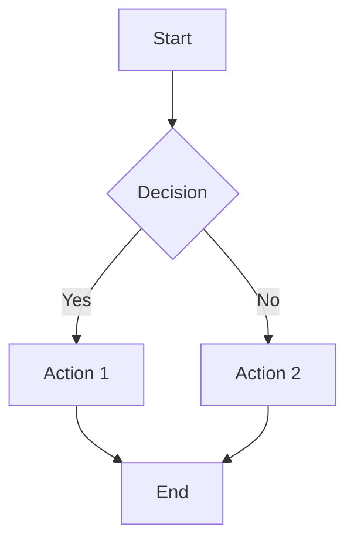

**Use Cases**: Process flows, decision trees, algorithm visualization

### 2. Sequence Diagram

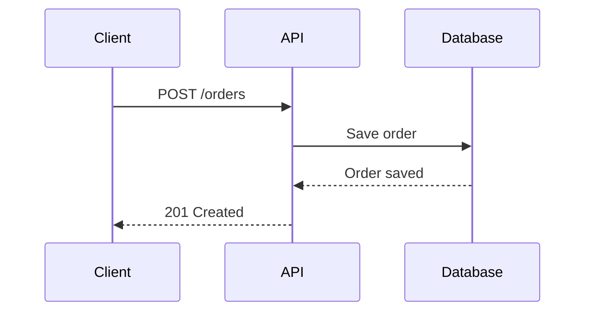

**Use Cases**: API interactions, system communication, event flows

### 3. Class Diagram

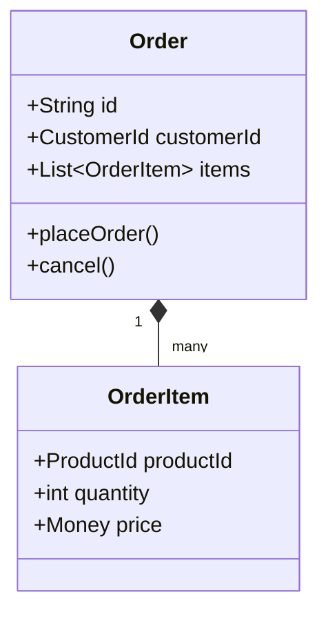

**Use Cases**: Domain models, entity relationships (simple cases)

### 4. State Diagram

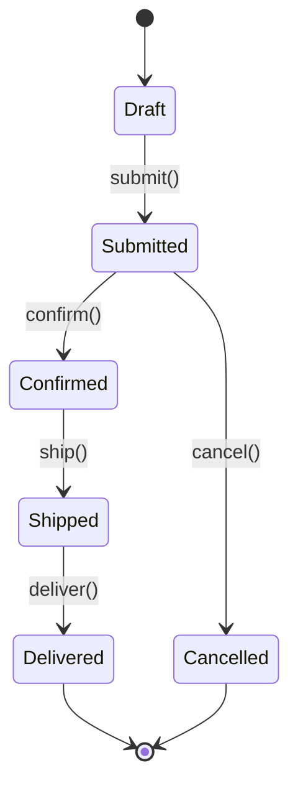

**Use Cases**: Order lifecycle, workflow states, aggregate state transitions

### 5. Entity Relationship Diagram

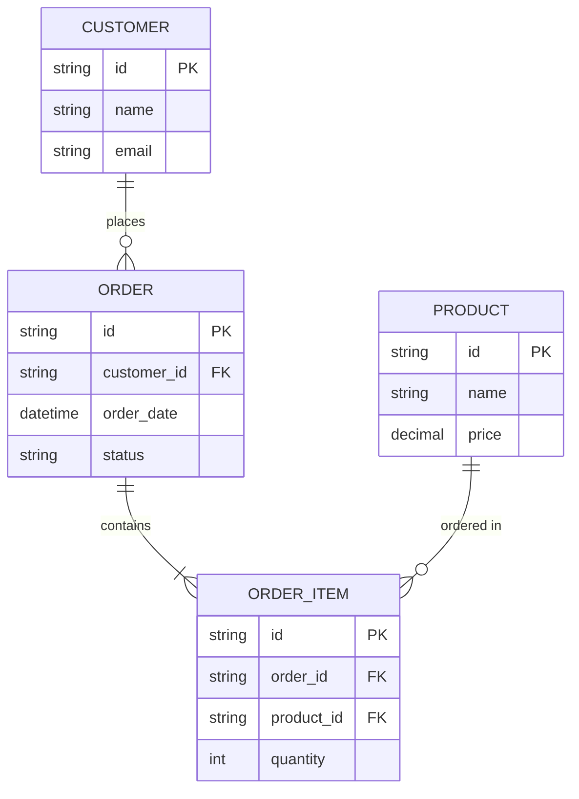

**Use Cases**: Database schema, data relationships, information viewpoint

### 6. Gantt Chart

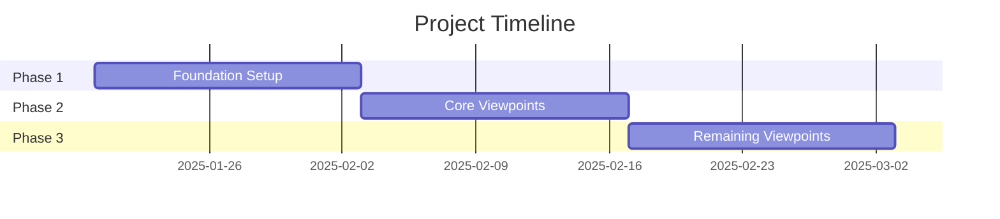

**Use Cases**: Project planning, implementation roadmaps

### 7. Pie Chart

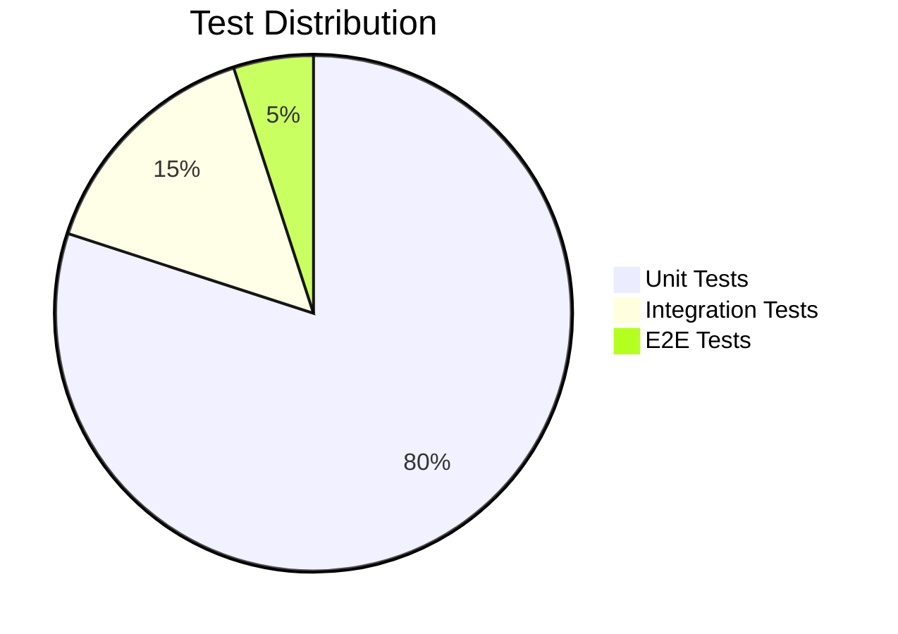

**Use Cases**: Metrics visualization, distribution charts

### 8. Git Graph

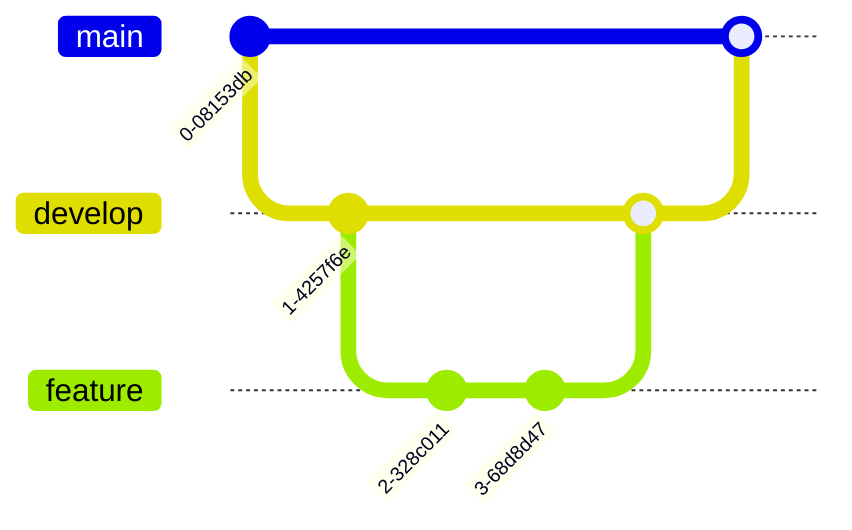

**Use Cases**: Git workflow documentation, branching strategy

## Directory Structure

```
docs/diagrams/mermaid/
├── README.md                          # This file
├── architecture/                      # Architecture diagrams
│   ├── system-context.md
│   ├── bounded-contexts.md
│   └── deployment-overview.md
├── event-storming/                    # Event Storming sessions
│   ├── phase1-big-picture.md
│   ├── phase2-order-process.md
│   └── phase3-shopping-cart.md
├── processes/                         # Business process flows
│   ├── order-fulfillment.md
│   ├── customer-registration.md
│   └── payment-processing.md
├── api/                              # API interaction diagrams
│   ├── authentication-flow.md
│   ├── order-api-sequence.md
│   └── event-publishing.md
└── examples/                         # Example diagrams
    ├── flowchart-example.md
    ├── sequence-example.md
    └── state-example.md
```

## Usage Guidelines

### Inline Diagrams in Documentation

For diagrams that are part of documentation, embed them directly in markdown:

```markdown
## Order Processing Flow

The following diagram shows the order processing workflow:

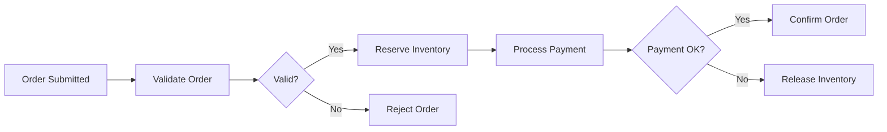
```

### Standalone Diagram Files

For reusable diagrams, create separate `.md` files:

**File**: `docs/diagrams/mermaid/processes/order-fulfillment.md`

```markdown
# Order Fulfillment Process

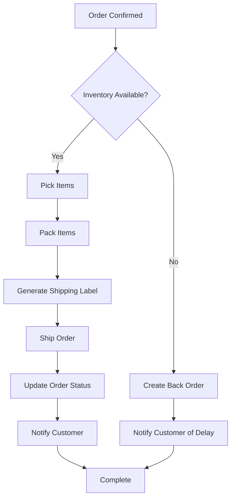
```

Then reference it in documentation:

```markdown
See the [Order Fulfillment Process](../diagrams/mermaid/processes/order-fulfillment.md) for details.
```

## Styling and Customization

### Basic Styling

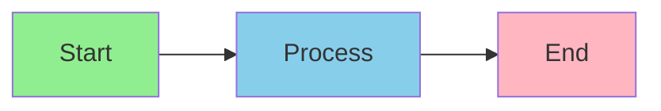

### Event Storming Colors

Follow the Event Storming color standards:

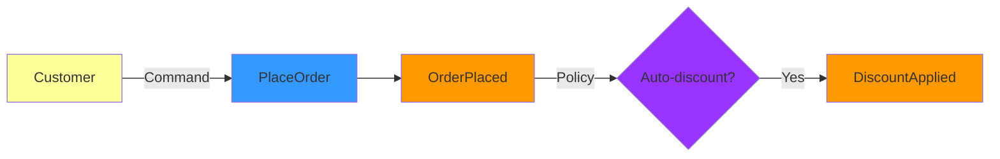

### Class Diagram Styling

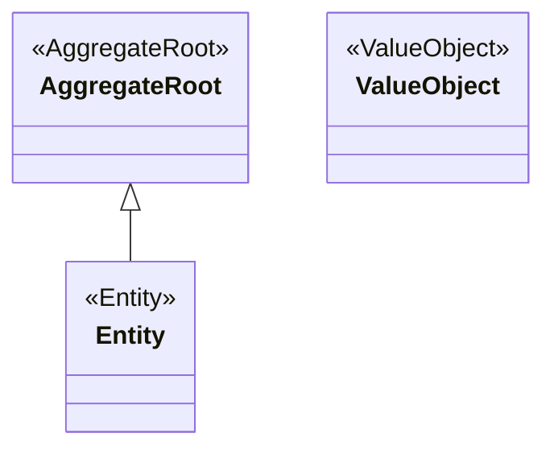

## Best Practices

### 1. Keep It Simple

- Limit nodes to 10-15 per diagram
- Break complex diagrams into multiple simpler ones
- Use subgraphs for grouping related elements

### 2. Use Descriptive Labels

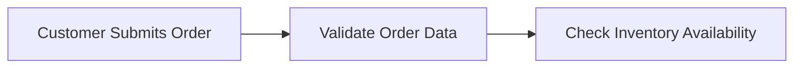

Better than:

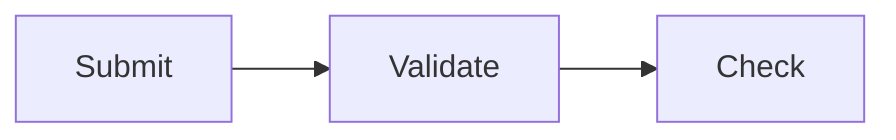

### 3. Add Comments

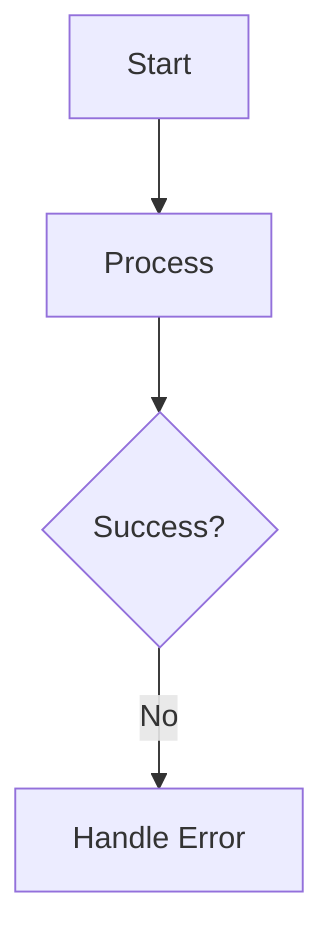

### 4. Use Consistent Direction

- **LR** (Left to Right): For sequential processes
- **TB** (Top to Bottom): For hierarchical structures
- **RL** (Right to Left): For reverse flows
- **BT** (Bottom to Top): For bottom-up processes

### 5. Version Control

- Commit diagram changes with descriptive messages
- Review diagram changes in PRs
- Keep diagrams in sync with code changes

## Testing and Validation

### Preview in IDE

Most modern IDEs support Mermaid preview:

- **VS Code**: Install "Markdown Preview Mermaid Support" extension
- **IntelliJ IDEA**: Built-in support in markdown preview
- **Kiro IDE**: Native Mermaid rendering

### Online Editor

Use the [Mermaid Live Editor](https://mermaid.live/) for:
- Testing complex diagrams
- Experimenting with styling
- Sharing diagrams with stakeholders

### GitHub Preview

- Push to GitHub and view in PR or file browser
- GitHub automatically renders Mermaid diagrams
- No additional tools needed

## Common Issues and Solutions

### Issue: Diagram Not Rendering

**Solution**: Check syntax with Mermaid Live Editor

### Issue: Text Overlapping

**Solution**: 
- Shorten labels
- Use line breaks in labels: `A[Line 1<br/>Line 2]`
- Adjust diagram direction

### Issue: Too Complex

**Solution**:
- Break into multiple diagrams
- Use subgraphs
- Create a high-level overview and detailed sub-diagrams

### Issue: Inconsistent Styling

**Solution**:
- Define style classes
- Use consistent color scheme
- Follow Event Storming color standards

## Examples

See the `examples/` directory for complete examples of each diagram type:

- [Flowchart Example](examples/flowchart-example.md)
- [Sequence Diagram Example](examples/sequence-example.md)
- [State Diagram Example](examples/state-example.md)
- [Class Diagram Example](examples/class-example.md)
- [ER Diagram Example](examples/er-example.md)

## Resources

### Official Documentation

- [Mermaid Official Docs](https://mermaid.js.org/)
- [Mermaid Syntax Reference](https://mermaid.js.org/intro/syntax-reference.html)
- [Mermaid Live Editor](https://mermaid.live/)

### Tutorials

- [Mermaid Tutorial](https://mermaid.js.org/intro/getting-started.html)
- [GitHub Mermaid Support](https://github.blog/2022-02-14-include-diagrams-markdown-files-mermaid/)

### Community

- [Mermaid GitHub](https://github.com/mermaid-js/mermaid)
- [Mermaid Discussions](https://github.com/mermaid-js/mermaid/discussions)

---

**Last Updated**: 2025-01-17  
**Maintainer**: Documentation Team
