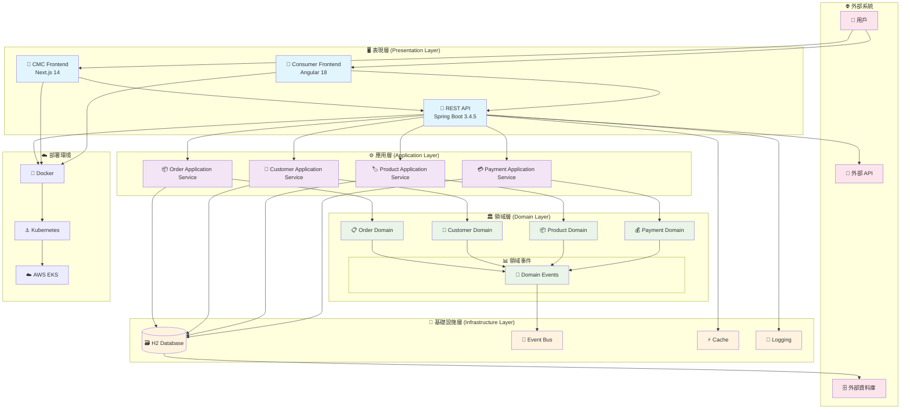

# 系統架構概覽

本文檔展示 GenAI Demo 專案的整體系統架構。

## 整體架構圖

## 架構特點

### 🏗️ 分層架構

- **表現層**: 處理用戶界面和 API 端點
- **應用層**: 協調業務用例和事務管理
- **領域層**: 核心業務邏輯和規則
- **基礎設施層**: 技術實現和外部整合

### 🔄 事件驅動

- 使用領域事件實現鬆耦合
- 支援異步處理和最終一致性
- 便於系統擴展和維護

### 🎯 DDD 戰術模式

- 聚合根管理一致性邊界
- 值對象確保資料完整性
- 領域服務處理跨聚合邏輯

### 🚀 現代技術棧

- Java 21 + Spring Boot 3.4.5
- Next.js 14 + Angular 18
- Docker + Kubernetes 部署
- ARM64 優化 (Apple Silicon + AWS Graviton3)

## 相關文檔

- [六角形架構](hexagonal-architecture.md) - 端口與適配器詳解
- [DDD 分層架構](ddd-layered-architecture.md) - DDD 實現細節
- [事件驅動架構](event-driven-architecture.md) - 事件處理機制
- [API 交互圖](api-interactions.md) - API 調用關係
