# System Architecture Overview

This document shows the overall system architecture of the GenAI Demo project.

## Overall Architecture Diagram

```mermaid
graph TB
    subgraph "🌐 External Systems"
        USER[👤 User]
        EXTERNAL[🔗 External APIs]
        DB_EXTERNAL[🗄️ External Database]
    end
    
    subgraph "🖥️ Presentation Layer"
        CMC[📱 CMC Frontend<br/>Next.js 14]
        CONSUMER[🛒 Consumer Frontend<br/>Angular 18]
        API[🔌 REST API<br/>Spring Boot 3.4.5]
    end
    
    subgraph "⚙️ Application Layer"
        ORDER_APP[📦 Order Application Service]
        CUSTOMER_APP[👥 Customer Application Service]
        PRODUCT_APP[🏷️ Product Application Service]
        PAYMENT_APP[💳 Payment Application Service]
    end
    
    subgraph "🏛️ Domain Layer"
        ORDER_DOM[📋 Order Domain]
        CUSTOMER_DOM[👤 Customer Domain]
        PRODUCT_DOM[📦 Product Domain]
        PAYMENT_DOM[💰 Payment Domain]
        
        subgraph "📊 Domain Events"
            EVENTS[🔔 Domain Events]
        end
    end
    
    subgraph "🔧 Infrastructure Layer"
        H2_DB[(🗃️ H2 Database)]
        EVENT_BUS[📡 Event Bus]
        CACHE[⚡ Cache]
        LOGGING[📝 Logging]
    end
    
    subgraph "☁️ Deployment Environment"
        DOCKER[🐳 Docker]
        K8S[⚓ Kubernetes]
        AWS[☁️ AWS EKS]
    end
    
    %% User interactions
    USER --> CMC
    USER --> CONSUMER
    
    %% Frontend to API
    CMC --> API
    CONSUMER --> API
    
    %% API to application layer
    API --> ORDER_APP
    API --> CUSTOMER_APP
    API --> PRODUCT_APP
    API --> PAYMENT_APP
    
    %% Application layer to domain layer
    ORDER_APP --> ORDER_DOM
    CUSTOMER_APP --> CUSTOMER_DOM
    PRODUCT_APP --> PRODUCT_DOM
    PAYMENT_APP --> PAYMENT_DOM
    
    %% Domain events
    ORDER_DOM --> EVENTS
    CUSTOMER_DOM --> EVENTS
    PRODUCT_DOM --> EVENTS
    PAYMENT_DOM --> EVENTS
    
    %% Infrastructure
    ORDER_APP --> H2_DB
    CUSTOMER_APP --> H2_DB
    PRODUCT_APP --> H2_DB
    PAYMENT_APP --> H2_DB
    
    EVENTS --> EVENT_BUS
    API --> CACHE
    API --> LOGGING
    
    %% External systems
    API --> EXTERNAL
    H2_DB --> DB_EXTERNAL
    
    %% Deployment
    API --> DOCKER
    CMC --> DOCKER
    CONSUMER --> DOCKER
    DOCKER --> K8S
    K8S --> AWS
    
    %% Styles
    classDef frontend fill:#e1f5fe
    classDef application fill:#f3e5f5
    classDef domain fill:#e8f5e8
    classDef infrastructure fill:#fff3e0
    classDef external fill:#fce4ec
    
    class CMC,CONSUMER,API frontend
    class ORDER_APP,CUSTOMER_APP,PRODUCT_APP,PAYMENT_APP application
    class ORDER_DOM,CUSTOMER_DOM,PRODUCT_DOM,PAYMENT_DOM,EVENTS domain
    class H2_DB,EVENT_BUS,CACHE,LOGGING infrastructure
    class USER,EXTERNAL,DB_EXTERNAL external
```

## Architecture Features

### 🏗️ Layered Architecture

- **Presentation Layer**: Handles user interfaces and API endpoints
- **Application Layer**: Coordinates business use cases and transaction management
- **Domain Layer**: Core business logic and rules
- **Infrastructure Layer**: Technical implementation and external integrations

### 🔄 Event-Driven

- Uses domain events to achieve loose coupling
- Supports asynchronous processing and eventual consistency
- Facilitates system scaling and maintenance

### 🎯 DDD Tactical Patterns

- Aggregate roots manage consistency boundaries
- Value objects ensure data integrity
- Domain services handle cross-aggregate logic

### 🚀 Modern Technology Stack

- Java 21 + Spring Boot 3.4.5
- Next.js 14 + Angular 18
- Docker + Kubernetes deployment
- ARM64 optimization (Apple Silicon + AWS Graviton3)

## Related Documentation

- [Hexagonal Architecture](hexagonal-architecture.md) - Ports and adapters details
- [DDD Layered Architecture](ddd-layered-architecture.md) - DDD implementation details
- [Event-Driven Architecture](event-driven-architecture.md) - Event handling mechanisms
- [API Interactions](api-interactions.md) - API call relationships