# DDD 分層架構

本文檔展示領域驅動設計 (DDD) 的分層架構實現。

## DDD 分層架構圖

```mermaid
graph TB
    subgraph "🖥️ 表現層 (Presentation Layer)"
        subgraph "🌐 用戶界面"
            CMC_UI[📱 CMC Frontend<br/>管理界面]
            CONSUMER_UI[🛒 Consumer Frontend<br/>消費者界面]
        end
        
        subgraph "🔌 API 層"
            REST_API[🔗 REST Controllers]
            GRAPHQL[📊 GraphQL API]
            WEBSOCKET[⚡ WebSocket]
        end
    end
    
    subgraph "⚙️ 應用層 (Application Layer)"
        subgraph "📋 應用服務"
            ORDER_APP_SVC[📦 OrderApplicationService]
            CUSTOMER_APP_SVC[👥 CustomerApplicationService]
            PRODUCT_APP_SVC[🏷️ ProductApplicationService]
            PAYMENT_APP_SVC[💳 PaymentApplicationService]
        end
        
        subgraph "📨 命令處理"
            COMMANDS[📝 Commands & Handlers]
            QUERIES[🔍 Queries & Handlers]
        end
        
        subgraph "🔄 事務協調"
            TRANSACTION[⚙️ Transaction Management]
            SAGA[🔄 Saga Orchestration]
        end
    end
    
    subgraph "🏛️ 領域層 (Domain Layer)"
        subgraph "📦 Order 有界上下文"
            ORDER_AGG[📋 Order Aggregate]
            ORDER_ENTITIES[📄 Order Entities]
            ORDER_VOS[💎 Order Value Objects]
            ORDER_EVENTS[📡 Order Domain Events]
            ORDER_SPECS[📏 Order Specifications]
            ORDER_POLICIES[📜 Order Policies]
        end
        
        subgraph "👥 Customer 有界上下文"
            CUSTOMER_AGG[👤 Customer Aggregate]
            CUSTOMER_ENTITIES[👥 Customer Entities]
            CUSTOMER_VOS[💎 Customer Value Objects]
            CUSTOMER_EVENTS[📡 Customer Domain Events]
            LOYALTY_POLICY[🎁 Loyalty Policy]
        end
        
        subgraph "🏷️ Product 有界上下文"
            PRODUCT_AGG[📦 Product Aggregate]
            PRODUCT_ENTITIES[🏷️ Product Entities]
            PRODUCT_VOS[💎 Product Value Objects]
            INVENTORY_POLICY[📊 Inventory Policy]
        end
        
        subgraph "💳 Payment 有界上下文"
            PAYMENT_AGG[💰 Payment Aggregate]
            PAYMENT_ENTITIES[💳 Payment Entities]
            PAYMENT_VOS[💎 Payment Value Objects]
            PAYMENT_EVENTS[📡 Payment Domain Events]
        end
        
        subgraph "🔗 共享核心"
            SHARED_VOS[💎 Shared Value Objects]
            DOMAIN_SERVICES[⚙️ Domain Services]
            DOMAIN_INTERFACES[🔌 Domain Interfaces]
        end
    end
    
    subgraph "🔧 基礎設施層 (Infrastructure Layer)"
        subgraph "💾 持久化"
            JPA_REPOS[🗃️ JPA Repositories]
            H2_DB[(🗄️ H2 Database)]
            FLYWAY[🔄 Flyway Migrations]
        end
        
        subgraph "📡 消息傳遞"
            EVENT_BUS[📨 Event Bus]
            MESSAGE_QUEUE[📬 Message Queue]
            EVENT_STORE[📚 Event Store]
        end
        
        subgraph "🔗 外部整合"
            EXTERNAL_APIS[🌐 External API Clients]
            PAYMENT_GATEWAY[💳 Payment Gateway]
            EMAIL_SERVICE[📧 Email Service]
        end
        
        subgraph "🛠️ 技術服務"
            LOGGING[📝 Logging]
            MONITORING[📊 Monitoring]
            CACHING[⚡ Caching]
            SECURITY[🔒 Security]
        end
    end
    
    %% 依賴關係 (從上到下)
    CMC_UI --> REST_API
    CONSUMER_UI --> REST_API
    REST_API --> ORDER_APP_SVC
    REST_API --> CUSTOMER_APP_SVC
    REST_API --> PRODUCT_APP_SVC
    REST_API --> PAYMENT_APP_SVC
    
    GRAPHQL --> QUERIES
    WEBSOCKET --> EVENT_BUS
    
    ORDER_APP_SVC --> ORDER_AGG
    ORDER_APP_SVC --> COMMANDS
    ORDER_APP_SVC --> TRANSACTION
    
    CUSTOMER_APP_SVC --> CUSTOMER_AGG
    PRODUCT_APP_SVC --> PRODUCT_AGG
    PAYMENT_APP_SVC --> PAYMENT_AGG
    
    COMMANDS --> ORDER_AGG
    QUERIES --> ORDER_ENTITIES
    SAGA --> DOMAIN_SERVICES
    
    %% 領域層內部關係
    ORDER_AGG --> ORDER_ENTITIES
    ORDER_AGG --> ORDER_VOS
    ORDER_AGG --> ORDER_EVENTS
    ORDER_AGG --> ORDER_SPECS
    ORDER_AGG --> ORDER_POLICIES
    
    CUSTOMER_AGG --> CUSTOMER_ENTITIES
    CUSTOMER_AGG --> CUSTOMER_VOS
    CUSTOMER_AGG --> CUSTOMER_EVENTS
    CUSTOMER_AGG --> LOYALTY_POLICY
    
    PRODUCT_AGG --> PRODUCT_ENTITIES
    PRODUCT_AGG --> PRODUCT_VOS
    PRODUCT_AGG --> INVENTORY_POLICY
    
    PAYMENT_AGG --> PAYMENT_ENTITIES
    PAYMENT_AGG --> PAYMENT_VOS
    PAYMENT_AGG --> PAYMENT_EVENTS
    
    %% 共享核心
    ORDER_AGG --> SHARED_VOS
    CUSTOMER_AGG --> SHARED_VOS
    PRODUCT_AGG --> SHARED_VOS
    PAYMENT_AGG --> SHARED_VOS
    
    ORDER_AGG --> DOMAIN_SERVICES
    CUSTOMER_AGG --> DOMAIN_SERVICES
    
    %% 基礎設施依賴 (反向依賴)
    JPA_REPOS -.-> ORDER_AGG
    JPA_REPOS -.-> CUSTOMER_AGG
    JPA_REPOS -.-> PRODUCT_AGG
    JPA_REPOS -.-> PAYMENT_AGG
    
    EVENT_BUS -.-> ORDER_EVENTS
    EVENT_BUS -.-> CUSTOMER_EVENTS
    EVENT_BUS -.-> PAYMENT_EVENTS
    
    JPA_REPOS --> H2_DB
    EVENT_BUS --> MESSAGE_QUEUE
    EVENT_BUS --> EVENT_STORE
    
    ORDER_APP_SVC -.-> EXTERNAL_APIS
    PAYMENT_APP_SVC -.-> PAYMENT_GATEWAY
    CUSTOMER_APP_SVC -.-> EMAIL_SERVICE
    
    %% 樣式定義
    classDef presentation fill:#e3f2fd,stroke:#1565c0,stroke-width:2px
    classDef application fill:#f3e5f5,stroke:#7b1fa2,stroke-width:2px
    classDef domain fill:#e8f5e8,stroke:#2e7d32,stroke-width:3px
    classDef infrastructure fill:#fff3e0,stroke:#ef6c00,stroke-width:2px
    classDef shared fill:#fce4ec,stroke:#c2185b,stroke-width:2px
    
    class CMC_UI,CONSUMER_UI,REST_API,GRAPHQL,WEBSOCKET presentation
    class ORDER_APP_SVC,CUSTOMER_APP_SVC,PRODUCT_APP_SVC,PAYMENT_APP_SVC,COMMANDS,QUERIES,TRANSACTION,SAGA application
    class ORDER_AGG,ORDER_ENTITIES,ORDER_VOS,ORDER_EVENTS,ORDER_SPECS,ORDER_POLICIES,CUSTOMER_AGG,CUSTOMER_ENTITIES,CUSTOMER_VOS,CUSTOMER_EVENTS,LOYALTY_POLICY,PRODUCT_AGG,PRODUCT_ENTITIES,PRODUCT_VOS,INVENTORY_POLICY,PAYMENT_AGG,PAYMENT_ENTITIES,PAYMENT_VOS,PAYMENT_EVENTS domain
    class JPA_REPOS,H2_DB,FLYWAY,EVENT_BUS,MESSAGE_QUEUE,EVENT_STORE,EXTERNAL_APIS,PAYMENT_GATEWAY,EMAIL_SERVICE,LOGGING,MONITORING,CACHING,SECURITY infrastructure
    class SHARED_VOS,DOMAIN_SERVICES,DOMAIN_INTERFACES shared
```



## DDD 戰術模式

### 🏛️ 聚合根 (Aggregate Root)

- **Order**: 訂單聚合根，管理訂單生命週期
- **Customer**: 客戶聚合根，管理客戶資訊和忠誠度
- **Product**: 產品聚合根，管理產品資訊和庫存
- **Payment**: 支付聚合根，管理支付流程

### 💎 值對象 (Value Objects)

```java
// 金額值對象
@ValueObject
public record Money(BigDecimal amount, Currency currency) {
    public Money add(Money other) {
        requireSameCurrency(other);
        return new Money(this.amount.add(other.amount), this.currency);
    }
}

// 客戶 ID 值對象
@ValueObject
public record CustomerId(String value) {
    public static CustomerId generate() {
        return new CustomerId(UUID.randomUUID().toString());
    }
}
```

### 📡 領域事件 (Domain Events)

```java
// 訂單創建事件
public record OrderCreatedEvent(
    OrderId orderId,
    CustomerId customerId,
    Money totalAmount,
    UUID eventId,
    LocalDateTime occurredOn
) implements DomainEvent {
    // 事件實現
}
```

### 📏 規格模式 (Specifications)

```java
// 訂單折扣規格
@Specification
public class OrderDiscountSpecification implements Specification<Order> {
    @Override
    public boolean isSatisfiedBy(Order order) {
        return order.getTotalAmount().amount().compareTo(new BigDecimal("1000")) >= 0
            && isWeekend();
    }
}
```

### 📜 政策模式 (Policies)

```java
// 忠誠度政策
@Policy
public class LoyaltyPointsPolicy implements DomainPolicy<Order, Integer> {
    @Override
    public Integer apply(Order order) {
        return order.getTotalAmount().amount().intValue() / 10;
    }
}
```

## 有界上下文 (Bounded Contexts)

### 📦 訂單上下文 (Order Context)

- 處理訂單創建、確認、取消
- 管理訂單項目和定價
- 協調庫存預留

### 👥 客戶上下文 (Customer Context)

- 管理客戶資訊和偏好
- 處理忠誠度積分
- 客戶分群和行銷

### 🏷️ 產品上下文 (Product Context)

- 產品目錄管理
- 庫存追蹤和預留
- 價格管理

### 💳 支付上下文 (Payment Context)

- 支付處理和驗證
- 退款管理
- 支付方式管理

## 依賴規則

### ⬇️ 依賴方向

1. **表現層** → **應用層** → **領域層**
2. **基礎設施層** → **領域層** (反向依賴)

### 🚫 禁止依賴

- 領域層不能依賴基礎設施層
- 應用層不能依賴表現層
- 有界上下文之間通過事件通信

## 相關文檔

- [架構概覽](architecture-overview.md) - 整體系統架構
- [六角形架構](hexagonal-architecture.md) - 端口與適配器
- [事件驅動架構](event-driven-architecture.md) - 事件處理機制
