# DDD Layered Architecture

This document shows the implementation of Domain-Driven Design (DDD) layered architecture.

## DDD Layered Architecture Diagram

```mermaid
graph TB
    subgraph "🖥️ Presentation Layer"
        subgraph "🌐 User Interfaces"
            CMC_UI[📱 CMC Frontend<br/>Admin Interface]
            CONSUMER_UI[🛒 Consumer Frontend<br/>Consumer Interface]
        end
        
        subgraph "🔌 API Layer"
            REST_API[🔗 REST Controllers]
            GRAPHQL[📊 GraphQL API]
            WEBSOCKET[⚡ WebSocket]
        end
    end
    
    subgraph "⚙️ Application Layer"
        subgraph "📋 Application Services"
            ORDER_APP_SVC[📦 OrderApplicationService]
            CUSTOMER_APP_SVC[👥 CustomerApplicationService]
            PRODUCT_APP_SVC[🏷️ ProductApplicationService]
            PAYMENT_APP_SVC[💳 PaymentApplicationService]
        end
        
        subgraph "📨 Command Processing"
            COMMANDS[📝 Commands & Handlers]
            QUERIES[🔍 Queries & Handlers]
        end
        
        subgraph "🔄 Transaction Coordination"
            TRANSACTION[⚙️ Transaction Management]
            SAGA[🔄 Saga Orchestration]
        end
    end
    
    subgraph "🏛️ Domain Layer"
        subgraph "📦 Order Bounded Context"
            ORDER_AGG[📋 Order Aggregate]
            ORDER_ENTITIES[📄 Order Entities]
            ORDER_VOS[💎 Order Value Objects]
            ORDER_EVENTS[📡 Order Domain Events]
            ORDER_SPECS[📏 Order Specifications]
            ORDER_POLICIES[📜 Order Policies]
        end
        
        subgraph "👥 Customer Bounded Context"
            CUSTOMER_AGG[👤 Customer Aggregate]
            CUSTOMER_ENTITIES[👥 Customer Entities]
            CUSTOMER_VOS[💎 Customer Value Objects]
            CUSTOMER_EVENTS[📡 Customer Domain Events]
            LOYALTY_POLICY[🎁 Loyalty Policy]
        end
        
        subgraph "🏷️ Product Bounded Context"
            PRODUCT_AGG[📦 Product Aggregate]
            PRODUCT_ENTITIES[🏷️ Product Entities]
            PRODUCT_VOS[💎 Product Value Objects]
            INVENTORY_POLICY[📊 Inventory Policy]
        end
        
        subgraph "💳 Payment Bounded Context"
            PAYMENT_AGG[💰 Payment Aggregate]
            PAYMENT_ENTITIES[💳 Payment Entities]
            PAYMENT_VOS[💎 Payment Value Objects]
            PAYMENT_EVENTS[📡 Payment Domain Events]
        end
        
        subgraph "🔗 Shared Kernel"
            SHARED_VOS[💎 Shared Value Objects]
            DOMAIN_SERVICES[⚙️ Domain Services]
            DOMAIN_INTERFACES[🔌 Domain Interfaces]
        end
    end
    
    subgraph "🔧 Infrastructure Layer"
        subgraph "💾 Persistence"
            JPA_REPOS[🗃️ JPA Repositories]
            H2_DB[(🗄️ H2 Database)]
            FLYWAY[🔄 Flyway Migrations]
        end
        
        subgraph "📡 Messaging"
            EVENT_BUS[📨 Event Bus]
            MESSAGE_QUEUE[📬 Message Queue]
            EVENT_STORE[📚 Event Store]
        end
        
        subgraph "🔗 External Integration"
            EXTERNAL_APIS[🌐 External API Clients]
            PAYMENT_GATEWAY[💳 Payment Gateway]
            EMAIL_SERVICE[📧 Email Service]
        end
        
        subgraph "🛠️ Technical Services"
            LOGGING[📝 Logging]
            MONITORING[📊 Monitoring]
            CACHING[⚡ Caching]
            SECURITY[🔒 Security]
        end
    end
    
    %% Dependencies (top to bottom)
    CMC_UI --> REST_API
    CONSUMER_UI --> REST_API
    REST_API --> ORDER_APP_SVC
    REST_API --> CUSTOMER_APP_SVC
    REST_API --> PRODUCT_APP_SVC
    REST_API --> PAYMENT_APP_SVC
    
    GRAPHQL --> QUERIES
    WEBSOCKET --> EVENT_BUS
    
    ORDER_APP_SVC --> ORDER_AGG
    ORDER_APP_SVC --> COMMANDS
    ORDER_APP_SVC --> TRANSACTION
    
    CUSTOMER_APP_SVC --> CUSTOMER_AGG
    PRODUCT_APP_SVC --> PRODUCT_AGG
    PAYMENT_APP_SVC --> PAYMENT_AGG
    
    COMMANDS --> ORDER_AGG
    QUERIES --> ORDER_ENTITIES
    SAGA --> DOMAIN_SERVICES
    
    %% Domain layer internal relationships
    ORDER_AGG --> ORDER_ENTITIES
    ORDER_AGG --> ORDER_VOS
    ORDER_AGG --> ORDER_EVENTS
    ORDER_AGG --> ORDER_SPECS
    ORDER_AGG --> ORDER_POLICIES
    
    CUSTOMER_AGG --> CUSTOMER_ENTITIES
    CUSTOMER_AGG --> CUSTOMER_VOS
    CUSTOMER_AGG --> CUSTOMER_EVENTS
    CUSTOMER_AGG --> LOYALTY_POLICY
    
    PRODUCT_AGG --> PRODUCT_ENTITIES
    PRODUCT_AGG --> PRODUCT_VOS
    PRODUCT_AGG --> INVENTORY_POLICY
    
    PAYMENT_AGG --> PAYMENT_ENTITIES
    PAYMENT_AGG --> PAYMENT_VOS
    PAYMENT_AGG --> PAYMENT_EVENTS
    
    %% Shared kernel
    ORDER_AGG --> SHARED_VOS
    CUSTOMER_AGG --> SHARED_VOS
    PRODUCT_AGG --> SHARED_VOS
    PAYMENT_AGG --> SHARED_VOS
    
    ORDER_AGG --> DOMAIN_SERVICES
    CUSTOMER_AGG --> DOMAIN_SERVICES
    
    %% Infrastructure dependencies (inverted dependencies)
    JPA_REPOS -.-> ORDER_AGG
    JPA_REPOS -.-> CUSTOMER_AGG
    JPA_REPOS -.-> PRODUCT_AGG
    JPA_REPOS -.-> PAYMENT_AGG
    
    EVENT_BUS -.-> ORDER_EVENTS
    EVENT_BUS -.-> CUSTOMER_EVENTS
    EVENT_BUS -.-> PAYMENT_EVENTS
    
    JPA_REPOS --> H2_DB
    EVENT_BUS --> MESSAGE_QUEUE
    EVENT_BUS --> EVENT_STORE
    
    ORDER_APP_SVC -.-> EXTERNAL_APIS
    PAYMENT_APP_SVC -.-> PAYMENT_GATEWAY
    CUSTOMER_APP_SVC -.-> EMAIL_SERVICE
    
    %% Style definitions
    classDef presentation fill:#e3f2fd,stroke:#1565c0,stroke-width:2px
    classDef application fill:#f3e5f5,stroke:#7b1fa2,stroke-width:2px
    classDef domain fill:#e8f5e8,stroke:#2e7d32,stroke-width:3px
    classDef infrastructure fill:#fff3e0,stroke:#ef6c00,stroke-width:2px
    classDef shared fill:#fce4ec,stroke:#c2185b,stroke-width:2px
    
    class CMC_UI,CONSUMER_UI,REST_API,GRAPHQL,WEBSOCKET presentation
    class ORDER_APP_SVC,CUSTOMER_APP_SVC,PRODUCT_APP_SVC,PAYMENT_APP_SVC,COMMANDS,QUERIES,TRANSACTION,SAGA application
    class ORDER_AGG,ORDER_ENTITIES,ORDER_VOS,ORDER_EVENTS,ORDER_SPECS,ORDER_POLICIES,CUSTOMER_AGG,CUSTOMER_ENTITIES,CUSTOMER_VOS,CUSTOMER_EVENTS,LOYALTY_POLICY,PRODUCT_AGG,PRODUCT_ENTITIES,PRODUCT_VOS,INVENTORY_POLICY,PAYMENT_AGG,PAYMENT_ENTITIES,PAYMENT_VOS,PAYMENT_EVENTS domain
    class JPA_REPOS,H2_DB,FLYWAY,EVENT_BUS,MESSAGE_QUEUE,EVENT_STORE,EXTERNAL_APIS,PAYMENT_GATEWAY,EMAIL_SERVICE,LOGGING,MONITORING,CACHING,SECURITY infrastructure
    class SHARED_VOS,DOMAIN_SERVICES,DOMAIN_INTERFACES shared
```



## DDD Tactical Patterns

### 🏛️ Aggregate Roots

- **Order**: Order aggregate root, manages order lifecycle
- **Customer**: Customer aggregate root, manages customer information and loyalty
- **Product**: Product aggregate root, manages product information and inventory
- **Payment**: Payment aggregate root, manages payment processes

### 💎 Value Objects

```java
// Money value object
@ValueObject
public record Money(BigDecimal amount, Currency currency) {
    public Money add(Money other) {
        requireSameCurrency(other);
        return new Money(this.amount.add(other.amount), this.currency);
    }
}

// Customer ID value object
@ValueObject
public record CustomerId(String value) {
    public static CustomerId generate() {
        return new CustomerId(UUID.randomUUID().toString());
    }
}
```

### 📡 Domain Events

```java
// Order created event
public record OrderCreatedEvent(
    OrderId orderId,
    CustomerId customerId,
    Money totalAmount,
    UUID eventId,
    LocalDateTime occurredOn
) implements DomainEvent {
    // Event implementation
}
```

### 📏 Specifications

```java
// Order discount specification
@Specification
public class OrderDiscountSpecification implements Specification<Order> {
    @Override
    public boolean isSatisfiedBy(Order order) {
        return order.getTotalAmount().amount().compareTo(new BigDecimal("1000")) >= 0
            && isWeekend();
    }
}
```

### 📜 Policies

```java
// Loyalty points policy
@Policy
public class LoyaltyPointsPolicy implements DomainPolicy<Order, Integer> {
    @Override
    public Integer apply(Order order) {
        return order.getTotalAmount().amount().intValue() / 10;
    }
}
```

## Bounded Contexts

### 📦 Order Context

- Handles order creation, confirmation, cancellation
- Manages order items and pricing
- Coordinates inventory reservation

### 👥 Customer Context

- Manages customer information and preferences
- Handles loyalty points
- Customer segmentation and marketing

### 🏷️ Product Context

- Product catalog management
- Inventory tracking and reservation
- Price management

### 💳 Payment Context

- Payment processing and validation
- Refund management
- Payment method management

## Dependency Rules

### ⬇️ Dependency Direction

1. **Presentation Layer** → **Application Layer** → **Domain Layer**
2. **Infrastructure Layer** → **Domain Layer** (inverted dependency)

### 🚫 Prohibited Dependencies

- Domain layer cannot depend on infrastructure layer
- Application layer cannot depend on presentation layer
- Bounded contexts communicate through events

## Related Documentation

- [Architecture Overview](architecture-overview.md) - Overall system architecture
- [Hexagonal Architecture](hexagonal-architecture.md) - Ports and adapters
- [Event-Driven Architecture](event-driven-architecture.md) - Event handling mechanisms