# Event-Driven Architecture

This document shows the event-driven architecture design and implementation of the system.

## Event-Driven Architecture Diagram


## Event Flow Examples

### 📦 Order Creation Flow

```mermaid
sequenceDiagram
    participant User as 👤 User
    participant API as 🔌 Order API
    participant OrderSvc as 📦 Order Service
    participant OrderAgg as 📋 Order Aggregate
    participant EventBus as 🚌 Event Bus
    participant InventoryHandler as 📊 Inventory Handler
    participant PaymentHandler as 💳 Payment Handler
    participant NotificationHandler as 📧 Notification Handler
    
    User->>API: Create Order Request
    API->>OrderSvc: CreateOrderCommand
    OrderSvc->>OrderAgg: Create Order
    OrderAgg->>OrderAgg: Validate Business Rules
    OrderAgg->>EventBus: Publish OrderCreatedEvent
    
    par Parallel Event Processing
        EventBus->>InventoryHandler: Handle Inventory Reservation
        InventoryHandler->>InventoryHandler: Reserve Inventory
        InventoryHandler->>EventBus: Publish InventoryReservedEvent
    and
        EventBus->>PaymentHandler: Handle Payment
        PaymentHandler->>PaymentHandler: Process Payment
        PaymentHandler->>EventBus: Publish PaymentProcessedEvent
    and
        EventBus->>NotificationHandler: Send Notification
        NotificationHandler->>NotificationHandler: Send Confirmation Email
    end
    
    API-->>User: Order Created Successfully
```



## Event Design Principles

### 📡 Event Naming Conventions

- Use past tense verbs: `OrderCreated`, `PaymentProcessed`
- Include aggregate name: `Customer*Event`, `Order*Event`
- Specifically describe what happened: `CustomerProfileUpdated`

### 💎 Event Content Design

```java
// Domain event as immutable record
public record OrderCreatedEvent(
    OrderId orderId,
    CustomerId customerId,
    Money totalAmount,
    List<OrderItem> items,
    UUID eventId,
    LocalDateTime occurredOn
) implements DomainEvent {
    
    public static OrderCreatedEvent create(
        OrderId orderId, 
        CustomerId customerId, 
        Money totalAmount,
        List<OrderItem> items
    ) {
        DomainEvent.EventMetadata metadata = DomainEvent.createEventMetadata();
        return new OrderCreatedEvent(
            orderId, customerId, totalAmount, items,
            metadata.eventId(), metadata.occurredOn()
        );
    }
}
```

### 🔄 Event Handler Design

```java
@Component
public class OrderCreatedEventHandler extends AbstractDomainEventHandler<OrderCreatedEvent> {
    
    @Override
    @Transactional
    public void handle(OrderCreatedEvent event) {
        // Check idempotency
        if (isEventAlreadyProcessed(event.getEventId())) {
            return;
        }
        
        try {
            // Execute business logic
            reserveInventory(event.getItems());
            updateCustomerStatistics(event.getCustomerId());
            sendOrderConfirmation(event);
            
            // Mark event as processed
            markEventAsProcessed(event.getEventId());
            
        } catch (Exception e) {
            logEventProcessingError(event, e);
            throw new DomainEventProcessingException("Failed to process order creation", e);
        }
    }
    
    @Override
    public Class<OrderCreatedEvent> getSupportedEventType() {
        return OrderCreatedEvent.class;
    }
}
```

## CQRS Implementation

### 📝 Command Side

- Handle write operations
- Maintain aggregate root state
- Publish domain events

### 📖 Query Side

- Handle read operations
- Maintain read models
- Listen to domain events to update views

### 🔄 Event Sourcing

```java
@Component
public class EventStore {
    
    public void store(DomainEvent event) {
        StoredEvent storedEvent = new StoredEvent(
            event.getEventId().toString(),
            event.getEventType(),
            event.getAggregateId(),
            serializeEvent(event),
            event.getOccurredOn()
        );
        
        eventRepository.save(storedEvent);
    }
    
    public List<DomainEvent> getEventsForAggregate(String aggregateId) {
        return eventRepository.findByAggregateIdOrderByOccurredOnAsc(aggregateId)
            .stream()
            .map(this::deserializeEvent)
            .toList();
    }
}
```

## Error Handling and Recovery

### 💀 Dead Letter Queue

- Handle failed events
- Support manual retry
- Error analysis and monitoring

### 🔄 Retry Mechanism

```java
@Component
public class ResilientEventHandler {
    
    @Retryable(
        value = {TransientException.class},
        maxAttempts = 3,
        backoff = @Backoff(delay = 1000, multiplier = 2)
    )
    public void handleEvent(DomainEvent event) {
        // Event processing logic
    }
    
    @Recover
    public void recover(TransientException ex, DomainEvent event) {
        deadLetterService.send(event, ex);
    }
}
```

## Monitoring and Observability

### 📊 Event Metrics

- Event publishing rate
- Processing latency
- Error rate
- Retry count

### 🔍 Event Tracing

- Distributed tracing
- Event correlation ID
- Processing chain tracking

## Related Documentation

- [Architecture Overview](architecture-overview.md) - Overall system architecture
- [DDD Layered Architecture](ddd-layered-architecture.md) - DDD implementation
- [API Interactions](api-interactions.md) - API design