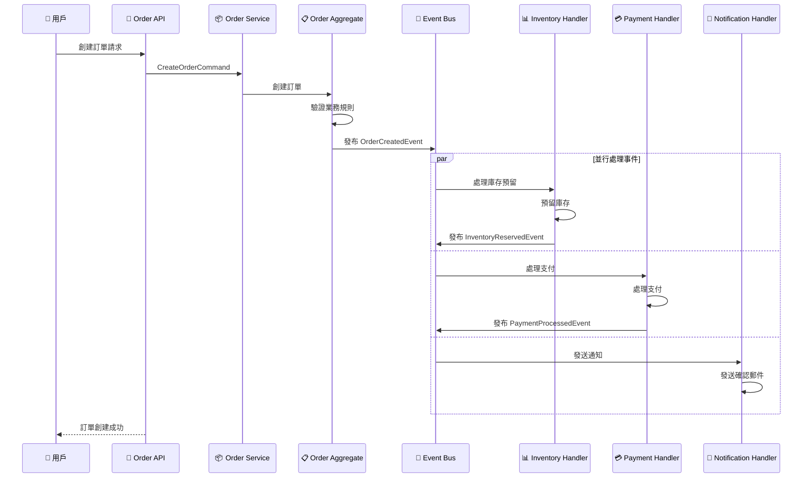

# 事件驅動架構

本文檔展示系統的事件驅動架構設計和實現。

## 事件驅動架構圖

```mermaid
graph TB
    subgraph "👤 用戶操作"
        USER_ACTION[🖱️ 用戶操作]
        API_CALL[📞 API 調用]
    end
    
    subgraph "⚙️ 應用服務層"
        ORDER_SVC[📦 Order Service]
        CUSTOMER_SVC[👥 Customer Service]
        PAYMENT_SVC[💳 Payment Service]
        INVENTORY_SVC[📊 Inventory Service]
    end
    
    subgraph "🏛️ 領域層 - 聚合根"
        ORDER_AGG[📋 Order Aggregate]
        CUSTOMER_AGG[👤 Customer Aggregate]
        PRODUCT_AGG[🏷️ Product Aggregate]
        PAYMENT_AGG[💰 Payment Aggregate]
    end
    
    subgraph "📡 領域事件"
        ORDER_CREATED[📦 OrderCreatedEvent]
        ORDER_CONFIRMED[✅ OrderConfirmedEvent]
        PAYMENT_PROCESSED[💳 PaymentProcessedEvent]
        INVENTORY_RESERVED[📊 InventoryReservedEvent]
        CUSTOMER_UPDATED[👥 CustomerUpdatedEvent]
        LOYALTY_EARNED[🎁 LoyaltyPointsEarnedEvent]
    end
    
    subgraph "🔄 事件處理器"
        subgraph "📦 訂單事件處理器"
            ORDER_CREATED_HANDLER[📝 OrderCreatedHandler]
            ORDER_CONFIRMED_HANDLER[✅ OrderConfirmedHandler]
        end
        
        subgraph "💳 支付事件處理器"
            PAYMENT_HANDLER[💰 PaymentProcessedHandler]
            REFUND_HANDLER[↩️ RefundHandler]
        end
        
        subgraph "📊 庫存事件處理器"
            INVENTORY_HANDLER[📦 InventoryReservedHandler]
            STOCK_HANDLER[📈 StockUpdateHandler]
        end
        
        subgraph "👥 客戶事件處理器"
            CUSTOMER_HANDLER[👤 CustomerUpdatedHandler]
            LOYALTY_HANDLER[🎁 LoyaltyPointsHandler]
            NOTIFICATION_HANDLER[📧 NotificationHandler]
        end
    end
    
    subgraph "📨 事件基礎設施"
        EVENT_BUS[🚌 Event Bus]
        EVENT_STORE[📚 Event Store]
        MESSAGE_QUEUE[📬 Message Queue]
        DEAD_LETTER[💀 Dead Letter Queue]
    end
    
    subgraph "🔗 外部系統"
        EMAIL_SVC[📧 Email Service]
        SMS_SVC[📱 SMS Service]
        PAYMENT_GATEWAY[💳 Payment Gateway]
        WAREHOUSE[🏭 Warehouse System]
        ANALYTICS[📊 Analytics System]
    end
    
    subgraph "📊 讀模型 (CQRS)"
        ORDER_VIEW[📋 Order View Model]
        CUSTOMER_VIEW[👤 Customer View Model]
        INVENTORY_VIEW[📊 Inventory View Model]
        ANALYTICS_VIEW[📈 Analytics View Model]
    end
    
    %% 用戶操作流程
    USER_ACTION --> API_CALL
    API_CALL --> ORDER_SVC
    API_CALL --> CUSTOMER_SVC
    API_CALL --> PAYMENT_SVC
    
    %% 應用服務到聚合根
    ORDER_SVC --> ORDER_AGG
    CUSTOMER_SVC --> CUSTOMER_AGG
    PAYMENT_SVC --> PAYMENT_AGG
    INVENTORY_SVC --> PRODUCT_AGG
    
    %% 聚合根產生事件
    ORDER_AGG --> ORDER_CREATED
    ORDER_AGG --> ORDER_CONFIRMED
    PAYMENT_AGG --> PAYMENT_PROCESSED
    PRODUCT_AGG --> INVENTORY_RESERVED
    CUSTOMER_AGG --> CUSTOMER_UPDATED
    CUSTOMER_AGG --> LOYALTY_EARNED
    
    %% 事件到事件匯流排
    ORDER_CREATED --> EVENT_BUS
    ORDER_CONFIRMED --> EVENT_BUS
    PAYMENT_PROCESSED --> EVENT_BUS
    INVENTORY_RESERVED --> EVENT_BUS
    CUSTOMER_UPDATED --> EVENT_BUS
    LOYALTY_EARNED --> EVENT_BUS
    
    %% 事件匯流排到處理器
    EVENT_BUS --> ORDER_CREATED_HANDLER
    EVENT_BUS --> ORDER_CONFIRMED_HANDLER
    EVENT_BUS --> PAYMENT_HANDLER
    EVENT_BUS --> INVENTORY_HANDLER
    EVENT_BUS --> CUSTOMER_HANDLER
    EVENT_BUS --> LOYALTY_HANDLER
    EVENT_BUS --> NOTIFICATION_HANDLER
    
    %% 事件處理器到外部系統
    NOTIFICATION_HANDLER --> EMAIL_SVC
    NOTIFICATION_HANDLER --> SMS_SVC
    PAYMENT_HANDLER --> PAYMENT_GATEWAY
    INVENTORY_HANDLER --> WAREHOUSE
    
    %% 事件處理器到讀模型
    ORDER_CREATED_HANDLER --> ORDER_VIEW
    ORDER_CONFIRMED_HANDLER --> ORDER_VIEW
    CUSTOMER_HANDLER --> CUSTOMER_VIEW
    INVENTORY_HANDLER --> INVENTORY_VIEW
    PAYMENT_HANDLER --> ANALYTICS_VIEW
    
    %% 事件基礎設施
    EVENT_BUS --> EVENT_STORE
    EVENT_BUS --> MESSAGE_QUEUE
    MESSAGE_QUEUE --> DEAD_LETTER
    
    %% 分析系統
    EVENT_STORE --> ANALYTICS
    ANALYTICS_VIEW --> ANALYTICS
    
    %% 樣式定義
    classDef userAction fill:#e3f2fd,stroke:#1565c0,stroke-width:2px
    classDef application fill:#f3e5f5,stroke:#7b1fa2,stroke-width:2px
    classDef domain fill:#e8f5e8,stroke:#2e7d32,stroke-width:3px
    classDef events fill:#fff3e0,stroke:#ef6c00,stroke-width:2px
    classDef handlers fill:#fce4ec,stroke:#c2185b,stroke-width:2px
    classDef infrastructure fill:#f1f8e9,stroke:#558b2f,stroke-width:2px
    classDef external fill:#ffebee,stroke:#c62828,stroke-width:2px
    classDef readModel fill:#e0f2f1,stroke:#00695c,stroke-width:2px
    
    class USER_ACTION,API_CALL userAction
    class ORDER_SVC,CUSTOMER_SVC,PAYMENT_SVC,INVENTORY_SVC application
    class ORDER_AGG,CUSTOMER_AGG,PRODUCT_AGG,PAYMENT_AGG domain
    class ORDER_CREATED,ORDER_CONFIRMED,PAYMENT_PROCESSED,INVENTORY_RESERVED,CUSTOMER_UPDATED,LOYALTY_EARNED events
    class ORDER_CREATED_HANDLER,ORDER_CONFIRMED_HANDLER,PAYMENT_HANDLER,REFUND_HANDLER,INVENTORY_HANDLER,STOCK_HANDLER,CUSTOMER_HANDLER,LOYALTY_HANDLER,NOTIFICATION_HANDLER handlers
    class EVENT_BUS,EVENT_STORE,MESSAGE_QUEUE,DEAD_LETTER infrastructure
    class EMAIL_SVC,SMS_SVC,PAYMENT_GATEWAY,WAREHOUSE,ANALYTICS external
    class ORDER_VIEW,CUSTOMER_VIEW,INVENTORY_VIEW,ANALYTICS_VIEW readModel
```



## 事件流程範例

### 📦 訂單創建流程



## 事件設計原則

### 📡 事件命名規範

- 使用過去式動詞：`OrderCreated`, `PaymentProcessed`
- 包含聚合名稱：`Customer*Event`, `Order*Event`
- 具體描述發生的事情：`CustomerProfileUpdated`

### 💎 事件內容設計

```java
// 領域事件作為不可變記錄
public record OrderCreatedEvent(
    OrderId orderId,
    CustomerId customerId,
    Money totalAmount,
    List<OrderItem> items,
    UUID eventId,
    LocalDateTime occurredOn
) implements DomainEvent {
    
    public static OrderCreatedEvent create(
        OrderId orderId, 
        CustomerId customerId, 
        Money totalAmount,
        List<OrderItem> items
    ) {
        DomainEvent.EventMetadata metadata = DomainEvent.createEventMetadata();
        return new OrderCreatedEvent(
            orderId, customerId, totalAmount, items,
            metadata.eventId(), metadata.occurredOn()
        );
    }
}
```

### 🔄 事件處理器設計

```java
@Component
public class OrderCreatedEventHandler extends AbstractDomainEventHandler<OrderCreatedEvent> {
    
    @Override
    @Transactional
    public void handle(OrderCreatedEvent event) {
        // 檢查冪等性
        if (isEventAlreadyProcessed(event.getEventId())) {
            return;
        }
        
        try {
            // 執行業務邏輯
            reserveInventory(event.getItems());
            updateCustomerStatistics(event.getCustomerId());
            sendOrderConfirmation(event);
            
            // 標記事件已處理
            markEventAsProcessed(event.getEventId());
            
        } catch (Exception e) {
            logEventProcessingError(event, e);
            throw new DomainEventProcessingException("Failed to process order creation", e);
        }
    }
    
    @Override
    public Class<OrderCreatedEvent> getSupportedEventType() {
        return OrderCreatedEvent.class;
    }
}
```

## CQRS 實現

### 📝 命令端 (Command Side)

- 處理寫入操作
- 維護聚合根狀態
- 發布領域事件

### 📖 查詢端 (Query Side)

- 處理讀取操作
- 維護讀模型
- 監聽領域事件更新視圖

### 🔄 事件溯源 (Event Sourcing)

```java
@Component
public class EventStore {
    
    public void store(DomainEvent event) {
        StoredEvent storedEvent = new StoredEvent(
            event.getEventId().toString(),
            event.getEventType(),
            event.getAggregateId(),
            serializeEvent(event),
            event.getOccurredOn()
        );
        
        eventRepository.save(storedEvent);
    }
    
    public List<DomainEvent> getEventsForAggregate(String aggregateId) {
        return eventRepository.findByAggregateIdOrderByOccurredOnAsc(aggregateId)
            .stream()
            .map(this::deserializeEvent)
            .toList();
    }
}
```

## 錯誤處理和恢復

### 💀 死信佇列 (Dead Letter Queue)

- 處理失敗的事件
- 支援手動重試
- 錯誤分析和監控

### 🔄 重試機制

```java
@Component
public class ResilientEventHandler {
    
    @Retryable(
        value = {TransientException.class},
        maxAttempts = 3,
        backoff = @Backoff(delay = 1000, multiplier = 2)
    )
    public void handleEvent(DomainEvent event) {
        // 事件處理邏輯
    }
    
    @Recover
    public void recover(TransientException ex, DomainEvent event) {
        deadLetterService.send(event, ex);
    }
}
```

## 監控和可觀測性

### 📊 事件指標

- 事件發布率
- 處理延遲
- 錯誤率
- 重試次數

### 🔍 事件追蹤

- 分散式追蹤
- 事件關聯 ID
- 處理鏈追蹤

## 相關文檔

- [架構概覽](architecture-overview.md) - 整體系統架構
- [DDD 分層架構](ddd-layered-architecture.md) - DDD 實現
- [API 交互圖](api-interactions.md) - API 設計
