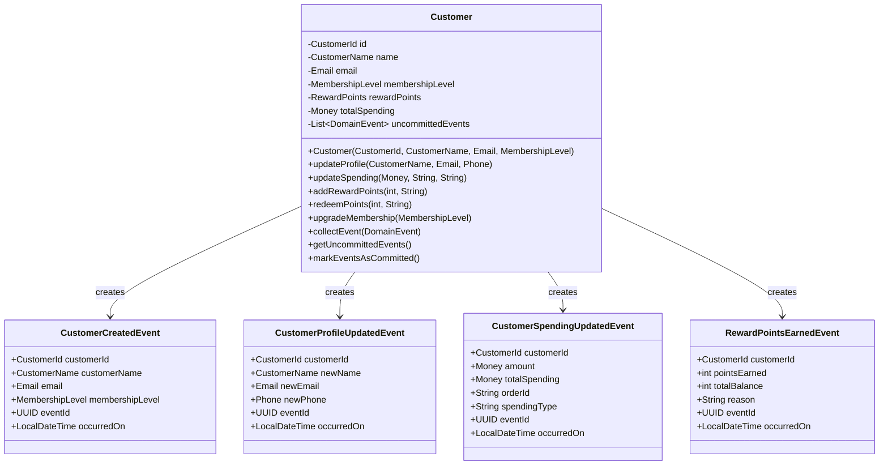
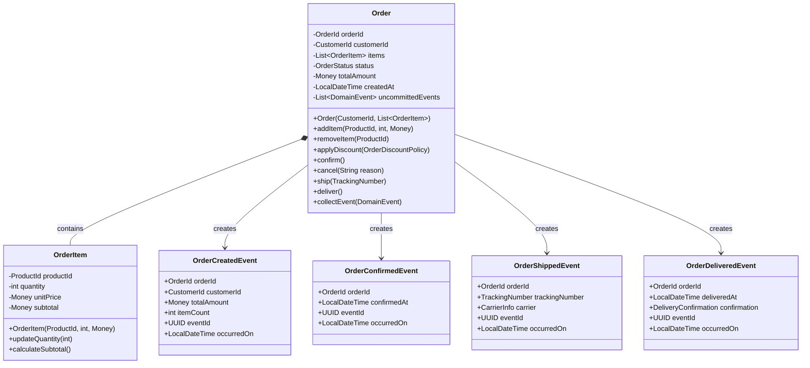
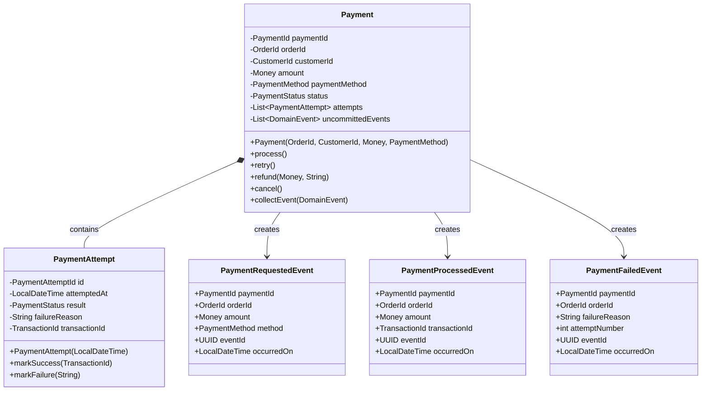
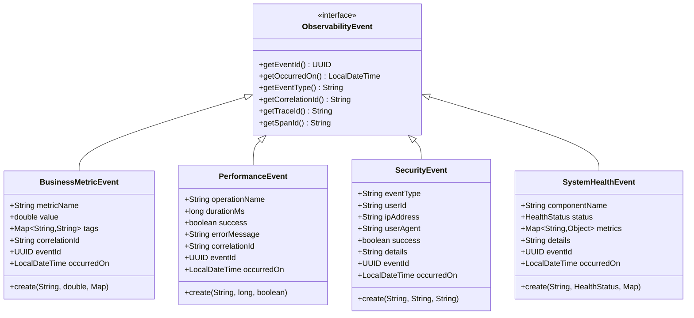
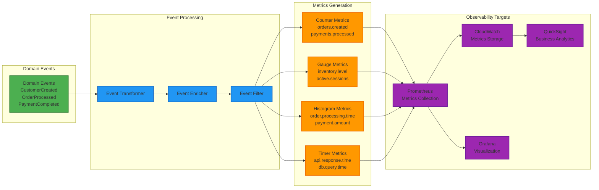

# Event Storming - Design Level (繁體中文版)

> **注意**: 此文件需要翻譯。原始英文版本請參考對應的英文文件。

# Event Storming - Design Level

## Aggregate Design with Events

### Customer Aggregate



### Order Aggregate



### Payment Aggregate



## Event Flow Architecture

### Event Publishing Strategy

```mermaid
graph TB
    subgraph "Aggregate Layer"
        AGG1[Customer Aggregate]
        AGG2[Order Aggregate]
        AGG3[Payment Aggregate]
        AGG4[Inventory Aggregate]
    end
    
    subgraph "Event Collection"
        COLLECTOR[DomainEventCollector]
        HOLDER[AggregateRootEventCollectorHolder]
    end
    
    subgraph "Application Layer"
        APP_SVC[Application Service]
        EVENT_PUB[DomainEventPublisher]
    end
    
    subgraph "Profile-based Publishing"
        DEV_PUB[InMemoryDomainEventPublisher<br/>@Profile("dev")]
        PROD_PUB[KafkaDomainEventPublisher<br/>@Profile("production")]
    end
    
    subgraph "Event Infrastructure"
        SPRING_EVENTS[Spring ApplicationEventPublisher<br/>Development]
        MSK[Amazon MSK<br/>Production]
    end
    
    subgraph "Event Handlers"
        HANDLER1[CustomerEventHandler]
        HANDLER2[OrderEventHandler]
        HANDLER3[PaymentEventHandler]
        HANDLER4[NotificationHandler]
    end
    
    AGG1 -->|collectEvent()| COLLECTOR
    AGG2 -->|collectEvent()| COLLECTOR
    AGG3 -->|collectEvent()| COLLECTOR
    AGG4 -->|collectEvent()| COLLECTOR
    
    COLLECTOR --> HOLDER
    HOLDER -->|getUncommittedEvents()| APP_SVC
    
    APP_SVC -->|publishAll()| EVENT_PUB
    EVENT_PUB -->|@Profile("dev")| DEV_PUB
    EVENT_PUB -->|@Profile("production")| PROD_PUB
    
    DEV_PUB --> SPRING_EVENTS
    PROD_PUB --> MSK
    
    SPRING_EVENTS --> HANDLER1
    SPRING_EVENTS --> HANDLER2
    MSK --> HANDLER3
    MSK --> HANDLER4
    
    classDef aggregate fill:#ffeb3b,stroke:#f57f17,stroke-width:2px
    classDef collection fill:#4caf50,stroke:#2e7d32,stroke-width:2px
    classDef application fill:#2196f3,stroke:#1565c0,stroke-width:2px
    classDef publisher fill:#ff9800,stroke:#ef6c00,stroke-width:2px
    classDef infrastructure fill:#9c27b0,stroke:#6a1b9a,stroke-width:2px
    classDef handler fill:#607d8b,stroke:#37474f,stroke-width:2px
    
    class AGG1,AGG2,AGG3,AGG4 aggregate
    class COLLECTOR,HOLDER collection
    class APP_SVC,EVENT_PUB application
    class DEV_PUB,PROD_PUB publisher
    class SPRING_EVENTS,MSK infrastructure
    class HANDLER1,HANDLER2,HANDLER3,HANDLER4 handler
```

### Event Sourcing Integration

```mermaid
graph TB
    subgraph "Event Store Options"
        MEMORY[In-Memory Store<br/>@Profile("test")]
        JPA[JPA Event Store<br/>@Profile("development")]
        EVENTSTORE[EventStore DB<br/>@Profile("production")]
    end
    
    subgraph "Event Store Interface"
        STORE_IF[EventStore Interface]
        STORE_CONFIG[EventStoreConfiguration]
    end
    
    subgraph "Event Processing"
        PUBLISHER[DomainEventPublisher]
        STORE_INTEGRATION[EventStoreIntegration]
        UPCASTER[EventUpcaster]
    end
    
    subgraph "Event Projection"
        READ_MODEL[Read Model Projections]
        QUERY_HANDLER[Query Handlers]
        VIEW_STORE[View Store]
    end
    
    PUBLISHER -->|After Commit| STORE_INTEGRATION
    STORE_INTEGRATION --> STORE_IF
    STORE_CONFIG -->|Profile-based| MEMORY
    STORE_CONFIG -->|Profile-based| JPA
    STORE_CONFIG -->|Profile-based| EVENTSTORE
    
    STORE_IF --> UPCASTER
    UPCASTER -->|Version Handling| READ_MODEL
    READ_MODEL --> QUERY_HANDLER
    QUERY_HANDLER --> VIEW_STORE
    
    classDef store fill:#ff5722,stroke:#d84315,stroke-width:2px
    classDef interface fill:#795548,stroke:#5d4037,stroke-width:2px
    classDef processing fill:#3f51b5,stroke:#283593,stroke-width:2px
    classDef projection fill:#009688,stroke:#00695c,stroke-width:2px
    
    class MEMORY,JPA,EVENTSTORE store
    class STORE_IF,STORE_CONFIG interface
    class PUBLISHER,STORE_INTEGRATION,UPCASTER processing
    class READ_MODEL,QUERY_HANDLER,VIEW_STORE projection
```

## Observability Event Design

### Observability Events



### Event-to-Metrics Pipeline



## Event Schema Evolution

### Schema Versioning Strategy

```mermaid
graph TB
    subgraph "Event Schema Registry"
        REGISTRY[EventSchemaRegistry]
        SCHEMA_V1[CustomerCreatedEvent v1<br/>• customerId<br/>• customerName<br/>• email]
        SCHEMA_V2[CustomerCreatedEvent v2<br/>• customerId<br/>• customerName<br/>• email<br/>• birthDate (Optional)<br/>• address (Optional)]
    end
    
    subgraph "Event Upcasting"
        UPCASTER[EventUpcaster]
        V1_TO_V2[V1 to V2 Converter<br/>Add Optional fields]
        COMPATIBILITY[Compatibility Check]
    end
    
    subgraph "Event Handlers"
        HANDLER_V1[Legacy Handler<br/>Handles v1 events]
        HANDLER_V2[Modern Handler<br/>Handles v2 events]
        UNIFIED_HANDLER[Unified Handler<br/>Handles both versions]
    end
    
    REGISTRY --> SCHEMA_V1
    REGISTRY --> SCHEMA_V2
    
    SCHEMA_V1 --> UPCASTER
    UPCASTER --> V1_TO_V2
    V1_TO_V2 --> COMPATIBILITY
    COMPATIBILITY --> SCHEMA_V2
    
    SCHEMA_V1 --> HANDLER_V1
    SCHEMA_V2 --> HANDLER_V2
    SCHEMA_V1 --> UNIFIED_HANDLER
    SCHEMA_V2 --> UNIFIED_HANDLER
    
    classDef registry fill:#ff5722,stroke:#d84315,stroke-width:2px
    classDef upcasting fill:#795548,stroke:#5d4037,stroke-width:2px
    classDef handler fill:#607d8b,stroke:#37474f,stroke-width:2px
    
    class REGISTRY,SCHEMA_V1,SCHEMA_V2 registry
    class UPCASTER,V1_TO_V2,COMPATIBILITY upcasting
    class HANDLER_V1,HANDLER_V2,UNIFIED_HANDLER handler
```


---
*此文件由自動翻譯系統生成，可能需要人工校對。*
