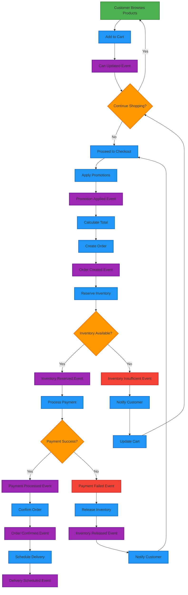
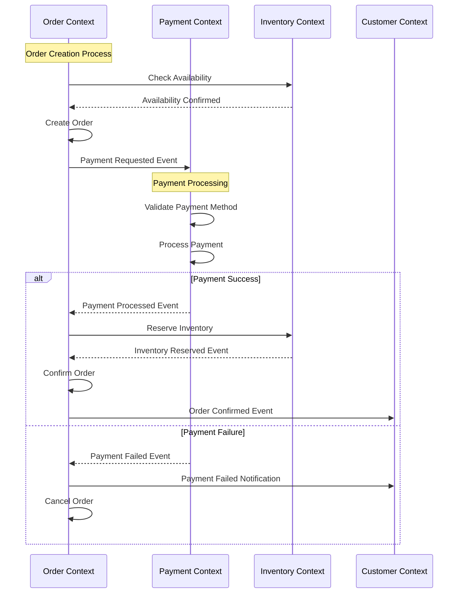
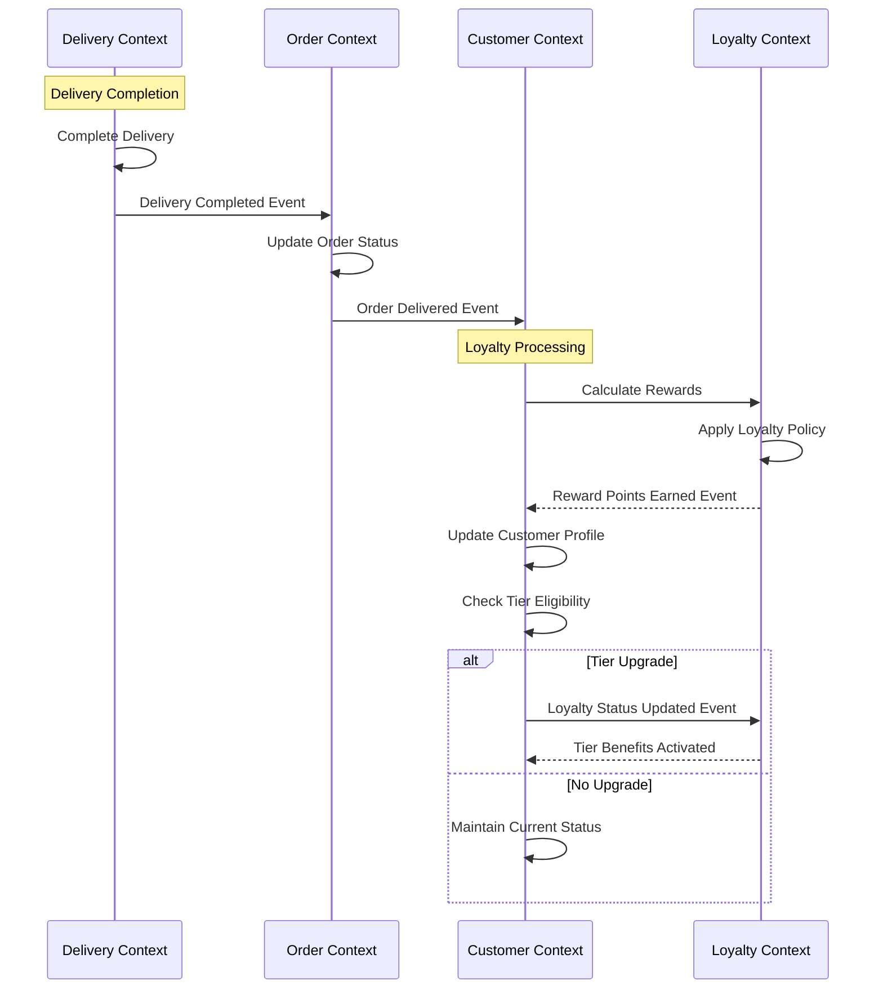
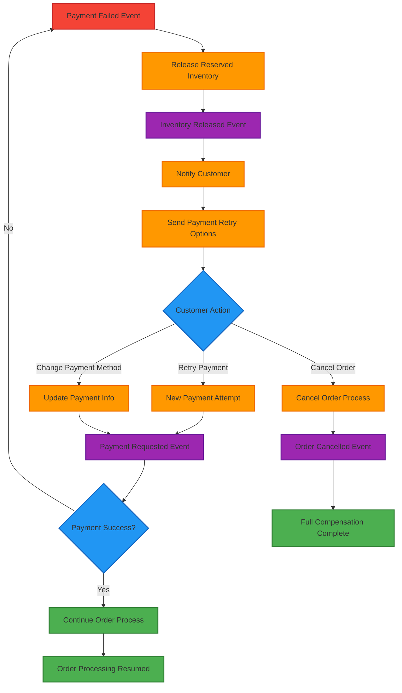

# Event Storming - Process Modeling (繁體中文版)

> **注意**: 此文件需要翻譯。原始英文版本請參考對應的英文文件。

# Event Storming - Process Modeling

## Core Business Processes

### 1. Customer Onboarding Process

```mermaid
graph TD
    A[Customer Visits Site] --> B{First Time Visitor?}
    B -->|Yes| C[Registration Form]
    B -->|No| D[Login Process]
    
    C --> E[Submit Registration]
    E --> F[Email Verification Sent]
    F --> G{Email Verified?}
    G -->|Yes| H[Account Activated]
    G -->|No| I[Resend Verification]
    I --> G
    
    H --> J[Welcome Email Sent]
    J --> K[Profile Setup]
    K --> L[Customer Registered Event]
    
    D --> M[Authentication]
    M --> N{Login Success?}
    N -->|Yes| O[Customer Logged In]
    N -->|No| P[Login Failed]
    P --> D
    
    L --> Q[Customer Ready to Shop]
    O --> Q
    
    classDef start fill:#4caf50,stroke:#2e7d32,stroke-width:2px
    classDef process fill:#2196f3,stroke:#1565c0,stroke-width:2px
    classDef decision fill:#ff9800,stroke:#ef6c00,stroke-width:2px
    classDef event fill:#9c27b0,stroke:#6a1b9a,stroke-width:2px
    classDef end fill:#f44336,stroke:#c62828,stroke-width:2px
    
    class A start
    class C,E,F,H,J,K,D,M,O process
    class B,G,N decision
    class L event
    class Q end
```

### 2. Order Processing Workflow



### 3. Delivery and Fulfillment Process

```mermaid
graph TD
    A[Order Confirmed] --> B[Prepare Shipment]
    B --> C[Package Items]
    C --> D[Generate Shipping Label]
    D --> E[Assign Carrier]
    E --> F[Delivery Scheduled Event]
    
    F --> G[Ship Package]
    G --> H[Order Shipped Event]
    H --> I[Tracking Number Generated]
    I --> J[Customer Notified]
    
    J --> K[Delivery in Transit]
    K --> L[Delivery Started Event]
    L --> M[Out for Delivery]
    M --> N{Delivery Attempt}
    
    N -->|Successful| O[Package Delivered]
    N -->|Failed| P[Delivery Failed Event]
    P --> Q[Reschedule Delivery]
    Q --> M
    
    O --> R[Delivery Completed Event]
    R --> S[Customer Confirmation]
    S --> T{Confirmed by Customer?}
    T -->|Yes| U[Delivery Confirmed Event]
    T -->|No| V[Auto-confirm after 24h]
    V --> U
    
    U --> W[Update Order Status]
    W --> X[Trigger Review Request]
    X --> Y[Review Requested Event]
    
    classDef start fill:#4caf50,stroke:#2e7d32,stroke-width:2px
    classDef process fill:#2196f3,stroke:#1565c0,stroke-width:2px
    classDef decision fill:#ff9800,stroke:#ef6c00,stroke-width:2px
    classDef event fill:#9c27b0,stroke:#6a1b9a,stroke-width:2px
    classDef error fill:#f44336,stroke:#c62828,stroke-width:2px
    classDef end fill:#795548,stroke:#5d4037,stroke-width:2px
    
    class A start
    class B,C,D,E,G,I,J,K,M,O,Q,S,V,W,X process
    class N,T decision
    class F,H,L,P,R,U,Y event
    class P error
    class Y end
```

### 4. Customer Loyalty and Rewards Process

```mermaid
graph TD
    A[Order Delivered] --> B[Calculate Reward Points]
    B --> C[Points Calculation Policy]
    C --> D[Base Points + Bonus Points]
    D --> E[Reward Points Earned Event]
    
    E --> F[Update Customer Balance]
    F --> G[Customer Spending Updated Event]
    G --> H[Check Loyalty Tier]
    H --> I{Tier Upgrade Eligible?}
    
    I -->|Yes| J[Upgrade Loyalty Tier]
    I -->|No| K[Maintain Current Tier]
    
    J --> L[Loyalty Status Updated Event]
    K --> M[Continue Current Benefits]
    
    L --> N[Send Tier Upgrade Notification]
    M --> O[Regular Loyalty Benefits]
    N --> P[Update Customer Profile]
    O --> P
    
    P --> Q[Personalized Offers]
    Q --> R[Promotion Eligibility Check]
    R --> S[Targeted Marketing Event]
    
    %% Parallel process for review collection
    A --> T[Review Request Timer]
    T --> U[Send Review Request]
    U --> V[Review Requested Event]
    V --> W{Review Submitted?}
    W -->|Yes| X[Review Submitted Event]
    W -->|No| Y[Follow-up Reminder]
    Y --> Z[Review Reminder Sent Event]
    
    X --> AA[Review Bonus Points]
    AA --> BB[Additional Points Earned Event]
    BB --> F
    
    classDef start fill:#4caf50,stroke:#2e7d32,stroke-width:2px
    classDef process fill:#2196f3,stroke:#1565c0,stroke-width:2px
    classDef decision fill:#ff9800,stroke:#ef6c00,stroke-width:2px
    classDef event fill:#9c27b0,stroke:#6a1b9a,stroke-width:2px
    classDef policy fill:#607d8b,stroke:#37474f,stroke-width:2px
    classDef end fill:#795548,stroke:#5d4037,stroke-width:2px
    
    class A start
    class B,D,F,H,J,K,N,M,P,Q,R,T,U,Y,AA process
    class I,W decision
    class E,G,L,S,V,X,Z,BB event
    class C policy
    class S end
```

## Cross-Context Event Flows

### Order-to-Payment Flow



### Delivery-to-Loyalty Flow



## Error Handling and Compensation

### Payment Failure Compensation




---
*此文件由自動翻譯系統生成，可能需要人工校對。*
