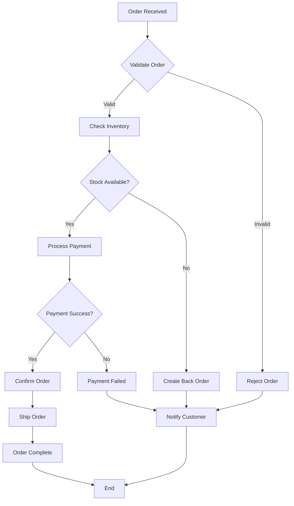
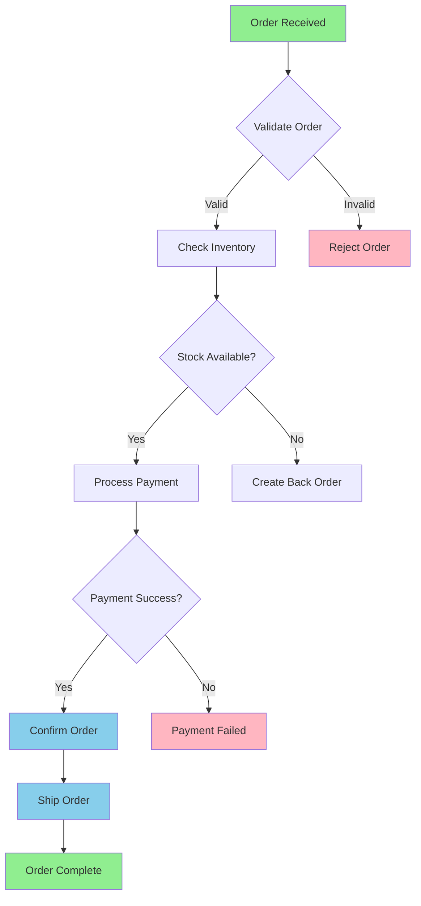
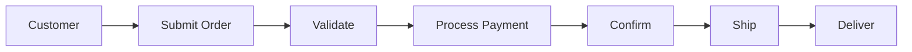
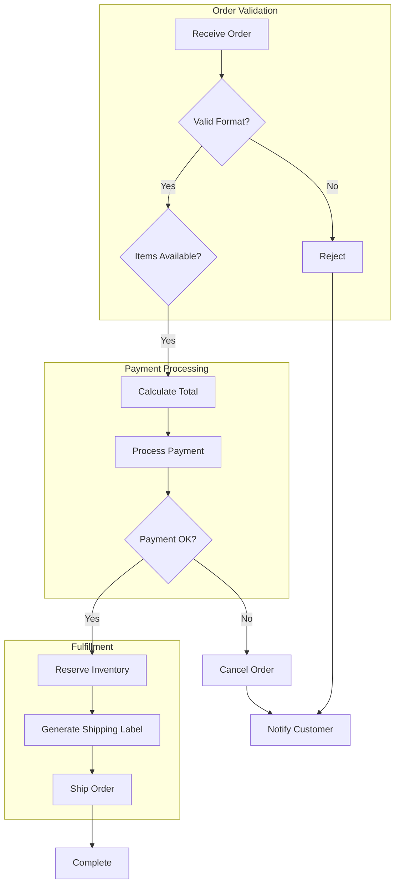

# Flowchart Example: Order Processing

This example demonstrates a typical order processing flowchart using Mermaid.

## Simple Flowchart

## Styled Flowchart with Colors

## Horizontal Flowchart

## Flowchart with Subgraphs

## Use Cases

- **Process Documentation**: Document business processes
- **Algorithm Visualization**: Show algorithm flow
- **Decision Trees**: Visualize decision logic
- **Workflow Design**: Design and communicate workflows

## Tips

1. Use descriptive node labels
2. Keep decision nodes (diamonds) for yes/no questions
3. Use colors to highlight different states
4. Group related steps with subgraphs
5. Limit to 15-20 nodes per diagram for clarity
