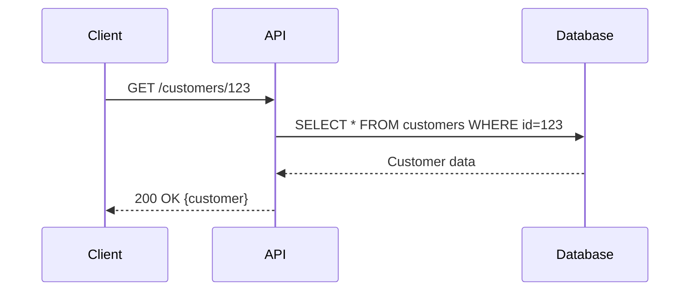
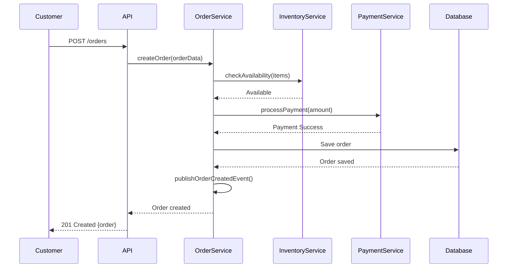
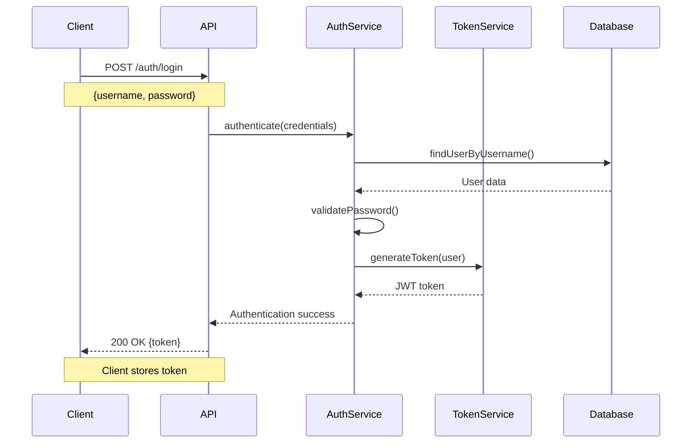
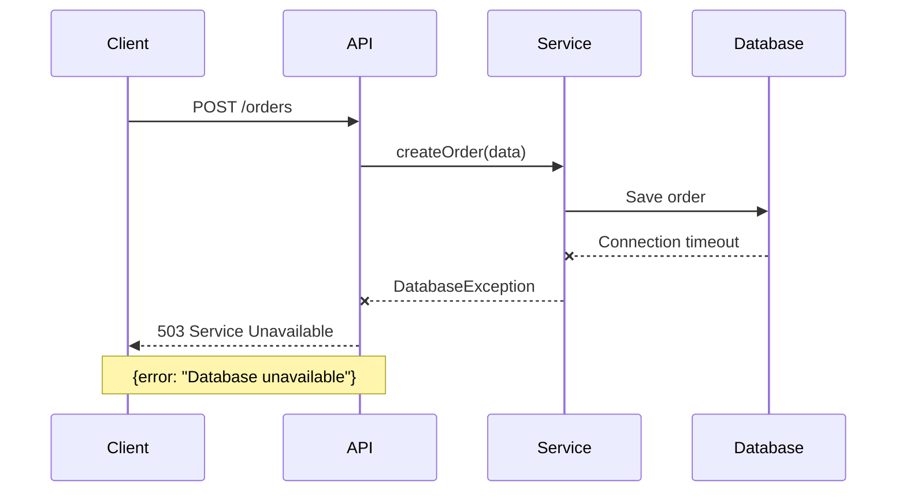
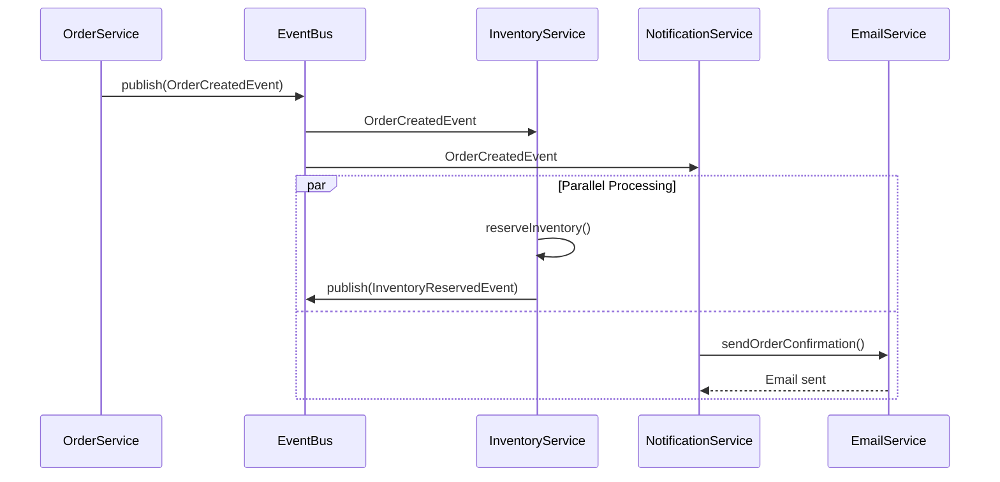
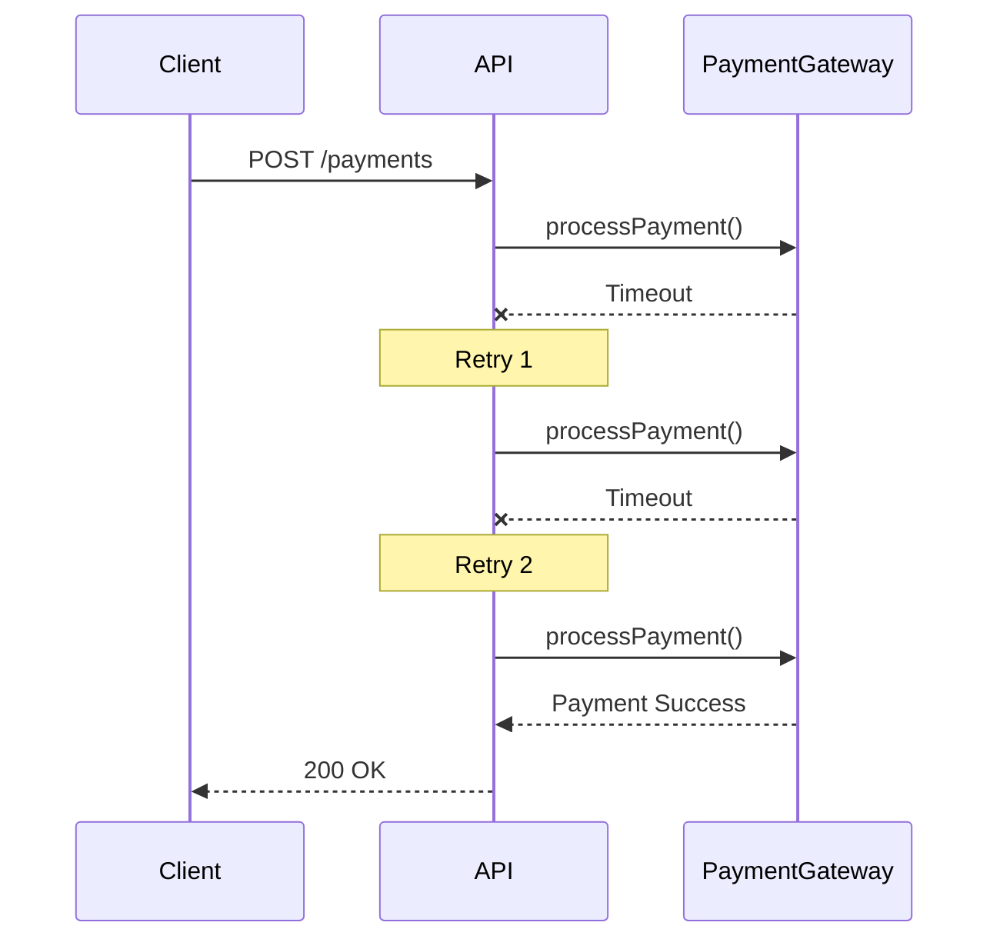
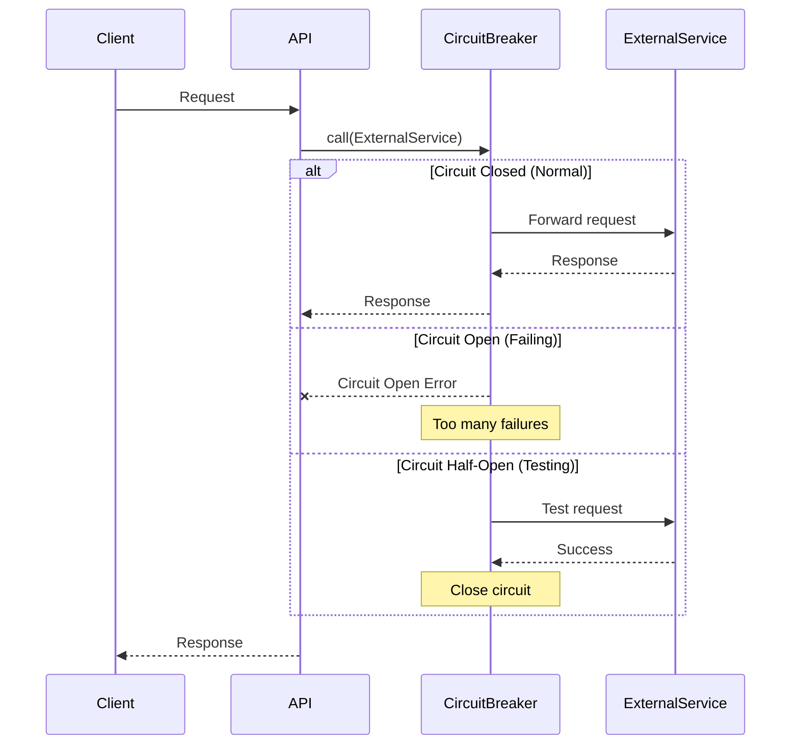

# Sequence Diagram Example: API Interactions

This example demonstrates API interaction sequence diagrams using Mermaid.

## Simple API Call

## Order Submission Flow

## Authentication Flow

## Error Handling

## Event-Driven Architecture

## Retry Mechanism

## Circuit Breaker Pattern

## Use Cases

- **API Documentation**: Document API interaction flows
- **System Integration**: Show how systems communicate
- **Event Flows**: Visualize event-driven architecture
- **Error Scenarios**: Document error handling
- **Authentication**: Show auth flows

## Tips

1. Use `participant` to define actors
2. Use `-->>` for return messages
3. Use `--x` for failed calls
4. Use `Note` for additional context
5. Use `alt/else/end` for conditional flows
6. Use `par/and/end` for parallel processing
7. Keep participants to 5-7 for clarity
