# Hexagonal Architecture

This document shows the hexagonal architecture implementation of the system, clearly separating business logic from technical implementation.

## Hexagonal Architecture Diagram

```mermaid
graph TB
    subgraph "🔵 External World"
        WEB[🌐 Web UI<br/>Next.js/Angular]
        CLI[💻 CLI Tools]
        TESTS[🧪 Tests]
        DB[(🗄️ Database<br/>H2)]
        QUEUE[📬 Message Queue]
        EXTERNAL_API[🔗 External APIs]
        CACHE[⚡ Cache<br/>Redis]
    end
    
    subgraph "🟡 Adapters"
        subgraph "⬅️ Inbound Adapters"
            REST_CTRL[🔌 REST Controllers]
            CLI_ADAPTER[💻 CLI Adapter]
            TEST_ADAPTER[🧪 Test Adapter]
        end
        
        subgraph "➡️ Outbound Adapters"
            JPA_ADAPTER[🗃️ JPA Repository Adapter]
            QUEUE_ADAPTER[📨 Message Queue Adapter]
            API_ADAPTER[🔗 External API Adapter]
            CACHE_ADAPTER[⚡ Cache Adapter]
        end
    end
    
    subgraph "🟢 Ports"
        subgraph "⬅️ Inbound Ports"
            ORDER_USE_CASE[📦 Order Use Cases]
            CUSTOMER_USE_CASE[👥 Customer Use Cases]
            PRODUCT_USE_CASE[🏷️ Product Use Cases]
        end
        
        subgraph "➡️ Outbound Ports"
            ORDER_REPO[📋 Order Repository]
            CUSTOMER_REPO[👤 Customer Repository]
            PRODUCT_REPO[📦 Product Repository]
            EVENT_PUBLISHER[📡 Event Publisher]
            NOTIFICATION[📧 Notification Service]
        end
    end
    
    subgraph "🔴 Core Business Logic"
        subgraph "🏛️ Domain Model"
            ORDER_AGG[📋 Order Aggregate]
            CUSTOMER_AGG[👤 Customer Aggregate]
            PRODUCT_AGG[📦 Product Aggregate]
            PAYMENT_AGG[💳 Payment Aggregate]
        end
        
        subgraph "⚙️ Domain Services"
            PRICING_SERVICE[💰 Pricing Service]
            INVENTORY_SERVICE[📊 Inventory Service]
            LOYALTY_SERVICE[🎁 Loyalty Service]
        end
        
        subgraph "📊 Domain Events"
            ORDER_EVENTS[📦 Order Events]
            CUSTOMER_EVENTS[👥 Customer Events]
            PAYMENT_EVENTS[💳 Payment Events]
        end
    end
    
    %% External world to inbound adapters
    WEB --> REST_CTRL
    CLI --> CLI_ADAPTER
    TESTS --> TEST_ADAPTER
    
    %% Inbound adapters to inbound ports
    REST_CTRL --> ORDER_USE_CASE
    REST_CTRL --> CUSTOMER_USE_CASE
    REST_CTRL --> PRODUCT_USE_CASE
    CLI_ADAPTER --> ORDER_USE_CASE
    TEST_ADAPTER --> ORDER_USE_CASE
    
    %% Inbound ports to core business logic
    ORDER_USE_CASE --> ORDER_AGG
    CUSTOMER_USE_CASE --> CUSTOMER_AGG
    PRODUCT_USE_CASE --> PRODUCT_AGG
    
    ORDER_USE_CASE --> PRICING_SERVICE
    ORDER_USE_CASE --> INVENTORY_SERVICE
    CUSTOMER_USE_CASE --> LOYALTY_SERVICE
    
    %% Core business logic to outbound ports
    ORDER_AGG --> ORDER_REPO
    CUSTOMER_AGG --> CUSTOMER_REPO
    PRODUCT_AGG --> PRODUCT_REPO
    
    ORDER_EVENTS --> EVENT_PUBLISHER
    CUSTOMER_EVENTS --> EVENT_PUBLISHER
    PAYMENT_EVENTS --> EVENT_PUBLISHER
    
    PRICING_SERVICE --> NOTIFICATION
    
    %% Outbound ports to outbound adapters
    ORDER_REPO --> JPA_ADAPTER
    CUSTOMER_REPO --> JPA_ADAPTER
    PRODUCT_REPO --> JPA_ADAPTER
    EVENT_PUBLISHER --> QUEUE_ADAPTER
    NOTIFICATION --> API_ADAPTER
    
    %% Outbound adapters to external world
    JPA_ADAPTER --> DB
    QUEUE_ADAPTER --> QUEUE
    API_ADAPTER --> EXTERNAL_API
    CACHE_ADAPTER --> CACHE
    
    %% Style definitions
    classDef external fill:#ffebee,stroke:#c62828,stroke-width:2px
    classDef inboundAdapter fill:#e3f2fd,stroke:#1565c0,stroke-width:2px
    classDef outboundAdapter fill:#e8f5e8,stroke:#2e7d32,stroke-width:2px
    classDef inboundPort fill:#fff3e0,stroke:#ef6c00,stroke-width:2px
    classDef outboundPort fill:#f3e5f5,stroke:#7b1fa2,stroke-width:2px
    classDef core fill:#ffebee,stroke:#d32f2f,stroke-width:3px
    
    class WEB,CLI,TESTS,DB,QUEUE,EXTERNAL_API,CACHE external
    class REST_CTRL,CLI_ADAPTER,TEST_ADAPTER inboundAdapter
    class JPA_ADAPTER,QUEUE_ADAPTER,API_ADAPTER,CACHE_ADAPTER outboundAdapter
    class ORDER_USE_CASE,CUSTOMER_USE_CASE,PRODUCT_USE_CASE inboundPort
    class ORDER_REPO,CUSTOMER_REPO,PRODUCT_REPO,EVENT_PUBLISHER,NOTIFICATION outboundPort
    class ORDER_AGG,CUSTOMER_AGG,PRODUCT_AGG,PAYMENT_AGG,PRICING_SERVICE,INVENTORY_SERVICE,LOYALTY_SERVICE,ORDER_EVENTS,CUSTOMER_EVENTS,PAYMENT_EVENTS core
```



## Architecture Advantages

### 🎯 Separation of Concerns

- **Core Business Logic**: Independent of technical implementation
- **Adapters**: Handle technical details and external integrations
- **Ports**: Define clear contract interfaces

### 🔄 Dependency Inversion

- Core business logic doesn't depend on external technology
- Adapters implement interfaces defined by ports
- Easy to test and replace technology

### 🧪 Testability

- Core logic can be tested independently
- Adapters can be mocked and replaced
- Supports various testing strategies

### 🔧 Maintainability

- Technical changes don't affect business logic
- New features are easy to add
- Code structure is clear and understandable

## Implementation Details

### Inbound Ports (Use Cases)

```java
// Order management use case
public interface OrderManagementUseCase {
    OrderId createOrder(CreateOrderCommand command);
    void confirmOrder(OrderId orderId);
    OrderDetails getOrderDetails(OrderId orderId);
}
```

### Outbound Ports (Repository)

```java
// Order repository interface
public interface OrderRepository {
    void save(Order order);
    Optional<Order> findById(OrderId orderId);
    List<Order> findByCustomerId(CustomerId customerId);
}
```

### Adapter Implementation

```java
// JPA adapter implementation
@Repository
public class JpaOrderRepositoryAdapter implements OrderRepository {
    // Implement repository interface
}

// REST controller adapter
@RestController
public class OrderController {
    private final OrderManagementUseCase orderUseCase;
    // Implement REST API
}
```

## Related Documentation

- [Architecture Overview](architecture-overview.md) - Overall system architecture
- [DDD Layered Architecture](ddd-layered-architecture.md) - DDD implementation
- [API Interactions](api-interactions.md) - API design