# 六角形架構 (Hexagonal Architecture)

本文檔展示系統的六角形架構實現，清晰分離業務邏輯與技術實現。

## 六角形架構圖

```mermaid
graph TB
    subgraph "🔵 外部世界 (External World)"
        WEB[🌐 Web UI<br/>Next.js/Angular]
        CLI[💻 CLI Tools]
        TESTS[🧪 Tests]
        DB[(🗄️ Database<br/>H2)]
        QUEUE[📬 Message Queue]
        EXTERNAL_API[🔗 External APIs]
        CACHE[⚡ Cache<br/>Redis]
    end
    
    subgraph "🟡 適配器層 (Adapters)"
        subgraph "⬅️ 入站適配器 (Inbound Adapters)"
            REST_CTRL[🔌 REST Controllers]
            CLI_ADAPTER[💻 CLI Adapter]
            TEST_ADAPTER[🧪 Test Adapter]
        end
        
        subgraph "➡️ 出站適配器 (Outbound Adapters)"
            JPA_ADAPTER[🗃️ JPA Repository Adapter]
            QUEUE_ADAPTER[📨 Message Queue Adapter]
            API_ADAPTER[🔗 External API Adapter]
            CACHE_ADAPTER[⚡ Cache Adapter]
        end
    end
    
    subgraph "🟢 端口層 (Ports)"
        subgraph "⬅️ 入站端口 (Inbound Ports)"
            ORDER_USE_CASE[📦 Order Use Cases]
            CUSTOMER_USE_CASE[👥 Customer Use Cases]
            PRODUCT_USE_CASE[🏷️ Product Use Cases]
        end
        
        subgraph "➡️ 出站端口 (Outbound Ports)"
            ORDER_REPO[📋 Order Repository]
            CUSTOMER_REPO[👤 Customer Repository]
            PRODUCT_REPO[📦 Product Repository]
            EVENT_PUBLISHER[📡 Event Publisher]
            NOTIFICATION[📧 Notification Service]
        end
    end
    
    subgraph "🔴 核心業務邏輯 (Core Business Logic)"
        subgraph "🏛️ 領域模型 (Domain Model)"
            ORDER_AGG[📋 Order Aggregate]
            CUSTOMER_AGG[👤 Customer Aggregate]
            PRODUCT_AGG[📦 Product Aggregate]
            PAYMENT_AGG[💳 Payment Aggregate]
        end
        
        subgraph "⚙️ 領域服務 (Domain Services)"
            PRICING_SERVICE[💰 Pricing Service]
            INVENTORY_SERVICE[📊 Inventory Service]
            LOYALTY_SERVICE[🎁 Loyalty Service]
        end
        
        subgraph "📊 領域事件 (Domain Events)"
            ORDER_EVENTS[📦 Order Events]
            CUSTOMER_EVENTS[👥 Customer Events]
            PAYMENT_EVENTS[💳 Payment Events]
        end
    end
    
    %% 外部世界到入站適配器
    WEB --> REST_CTRL
    CLI --> CLI_ADAPTER
    TESTS --> TEST_ADAPTER
    
    %% 入站適配器到入站端口
    REST_CTRL --> ORDER_USE_CASE
    REST_CTRL --> CUSTOMER_USE_CASE
    REST_CTRL --> PRODUCT_USE_CASE
    CLI_ADAPTER --> ORDER_USE_CASE
    TEST_ADAPTER --> ORDER_USE_CASE
    
    %% 入站端口到核心業務邏輯
    ORDER_USE_CASE --> ORDER_AGG
    CUSTOMER_USE_CASE --> CUSTOMER_AGG
    PRODUCT_USE_CASE --> PRODUCT_AGG
    
    ORDER_USE_CASE --> PRICING_SERVICE
    ORDER_USE_CASE --> INVENTORY_SERVICE
    CUSTOMER_USE_CASE --> LOYALTY_SERVICE
    
    %% 核心業務邏輯到出站端口
    ORDER_AGG --> ORDER_REPO
    CUSTOMER_AGG --> CUSTOMER_REPO
    PRODUCT_AGG --> PRODUCT_REPO
    
    ORDER_EVENTS --> EVENT_PUBLISHER
    CUSTOMER_EVENTS --> EVENT_PUBLISHER
    PAYMENT_EVENTS --> EVENT_PUBLISHER
    
    PRICING_SERVICE --> NOTIFICATION
    
    %% 出站端口到出站適配器
    ORDER_REPO --> JPA_ADAPTER
    CUSTOMER_REPO --> JPA_ADAPTER
    PRODUCT_REPO --> JPA_ADAPTER
    EVENT_PUBLISHER --> QUEUE_ADAPTER
    NOTIFICATION --> API_ADAPTER
    
    %% 出站適配器到外部世界
    JPA_ADAPTER --> DB
    QUEUE_ADAPTER --> QUEUE
    API_ADAPTER --> EXTERNAL_API
    CACHE_ADAPTER --> CACHE
    
    %% 樣式定義
    classDef external fill:#ffebee,stroke:#c62828,stroke-width:2px
    classDef inboundAdapter fill:#e3f2fd,stroke:#1565c0,stroke-width:2px
    classDef outboundAdapter fill:#e8f5e8,stroke:#2e7d32,stroke-width:2px
    classDef inboundPort fill:#fff3e0,stroke:#ef6c00,stroke-width:2px
    classDef outboundPort fill:#f3e5f5,stroke:#7b1fa2,stroke-width:2px
    classDef core fill:#ffebee,stroke:#d32f2f,stroke-width:3px
    
    class WEB,CLI,TESTS,DB,QUEUE,EXTERNAL_API,CACHE external
    class REST_CTRL,CLI_ADAPTER,TEST_ADAPTER inboundAdapter
    class JPA_ADAPTER,QUEUE_ADAPTER,API_ADAPTER,CACHE_ADAPTER outboundAdapter
    class ORDER_USE_CASE,CUSTOMER_USE_CASE,PRODUCT_USE_CASE inboundPort
    class ORDER_REPO,CUSTOMER_REPO,PRODUCT_REPO,EVENT_PUBLISHER,NOTIFICATION outboundPort
    class ORDER_AGG,CUSTOMER_AGG,PRODUCT_AGG,PAYMENT_AGG,PRICING_SERVICE,INVENTORY_SERVICE,LOYALTY_SERVICE,ORDER_EVENTS,CUSTOMER_EVENTS,PAYMENT_EVENTS core
```



## 架構優勢

### 🎯 關注點分離

- **核心業務邏輯**: 獨立於技術實現
- **適配器**: 處理技術細節和外部整合
- **端口**: 定義清晰的契約界面

### 🔄 依賴反轉

- 核心業務邏輯不依賴外部技術
- 適配器實現端口定義的介面
- 便於測試和技術替換

### 🧪 可測試性

- 核心邏輯可獨立測試
- 適配器可模擬替換
- 支援各種測試策略

### 🔧 可維護性

- 技術變更不影響業務邏輯
- 新功能易於添加
- 代碼結構清晰易懂

## 實現細節

### 入站端口 (Use Cases)

```java
// 訂單管理用例
public interface OrderManagementUseCase {
    OrderId createOrder(CreateOrderCommand command);
    void confirmOrder(OrderId orderId);
    OrderDetails getOrderDetails(OrderId orderId);
}
```

### 出站端口 (Repository)

```java
// 訂單儲存庫介面
public interface OrderRepository {
    void save(Order order);
    Optional<Order> findById(OrderId orderId);
    List<Order> findByCustomerId(CustomerId customerId);
}
```

### 適配器實現

```java
// JPA 適配器實現
@Repository
public class JpaOrderRepositoryAdapter implements OrderRepository {
    // 實現儲存庫介面
}

// REST 控制器適配器
@RestController
public class OrderController {
    private final OrderManagementUseCase orderUseCase;
    // 實現 REST API
}
```

## 相關文檔

- [架構概覽](architecture-overview.md) - 整體系統架構
- [DDD 分層架構](ddd-layered-architecture.md) - DDD 實現
- [API 交互圖](api-interactions.md) - API 設計
