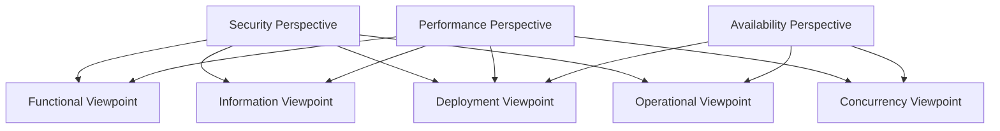

# Perspective Diagrams

## Overview

This directory contains diagram resources based on Rozanski & Woods' eight architectural perspectives, showing visual representations of cross-viewpoint quality attributes and non-functional requirements.

## Perspective Diagram Catalog

### [Security Perspective Diagrams](README.md)

- **security-architecture.puml**: Security architecture diagram (PlantUML)
- **threat-model.mmd**: Threat model diagram (Mermaid)
- **authentication-flow.puml**: Authentication flow diagram (PlantUML)

### [Performance Perspective Diagrams](README.md)

- **performance-architecture.mmd**: Performance architecture diagram (Mermaid)
- **load-balancing.puml**: Load balancing diagram (PlantUML)
- **caching-strategy.mmd**: Caching strategy diagram (Mermaid)

### [Availability Perspective Diagrams](README.md)

- **resilience-patterns.puml**: Resilience patterns diagram (PlantUML)
- **disaster-recovery.mmd**: Disaster recovery diagram (Mermaid)
- **fault-tolerance.puml**: Fault tolerance mechanism diagram (PlantUML)

### [Evolution Perspective Diagrams](README.md)

- **evolution-roadmap.mmd**: Evolution roadmap (Mermaid)
- **refactoring-strategy.puml**: Refactoring strategy diagram (PlantUML)
- **technology-migration.mmd**: Technology migration diagram (Mermaid)

### [Usability Perspective Diagrams](README.md)

- **user-experience-flow.mmd**: User experience flow diagram (Mermaid)
- **interface-design.puml**: Interface design diagram (PlantUML)
- **accessibility-features.mmd**: Accessibility features diagram (Mermaid)

### [Regulation Perspective Diagrams](README.md)

- **compliance-architecture.puml**: Compliance architecture diagram (PlantUML)
- **data-governance.mmd**: Data governance diagram (Mermaid)
- **audit-trail.puml**: Audit trail diagram (PlantUML)

### [Location Perspective Diagrams](README.md)

- **geographic-distribution.mmd**: Geographic distribution diagram (Mermaid)
- **data-locality.puml**: Data locality diagram (PlantUML)
- **edge-computing.mmd**: Edge computing diagram (Mermaid)

### [Cost Perspective Diagrams](README.md)

- **cost-optimization.mmd**: Cost optimization diagram (Mermaid)
- **resource-efficiency.puml**: Resource efficiency diagram (PlantUML)
- **finops-dashboard.mmd**: FinOps dashboard diagram (Mermaid)

## Perspective Diagram Features

### Cross-Viewpoint Relationships

Perspective diagrams show how quality attributes affect multiple architectural viewpoints:

### Quality Attribute Scenario Visualization

Each perspective diagram includes visual representations of quality attribute scenarios:

- **Source → Stimulus → Environment → Artifact → Response → Response Measure**

### Metrics and Monitoring Visualization

Shows how to monitor and measure each quality attribute:

- Dashboard design for key metrics
- Alert and notification processes
- Continuous improvement feedback loops

## Diagram Usage Guidelines

### Design Phase

1. **Quality Attribute Identification**: Use perspective diagrams to identify key quality attributes
2. **Scenario Definition**: Define specific quality attribute scenarios based on diagrams
3. **Trade-off Analysis**: Use diagrams to analyze trade-offs between different perspectives

### Implementation Phase

1. **Architectural Decisions**: Make architectural decisions based on perspective diagrams
2. **Implementation Guidance**: Use diagrams to guide specific implementations
3. **Validation Criteria**: Establish validation criteria based on diagrams

### Operations Phase

1. **Monitoring Design**: Design monitoring systems based on diagrams
2. **Problem Diagnosis**: Use diagrams to assist in problem diagnosis
3. **Continuous Improvement**: Identify improvement opportunities based on diagrams

## Diagram Update Process

### Regular Reviews

- **Monthly Check**: Check consistency between diagrams and actual system
- **Quarterly Update**: Update relevant diagrams based on system changes
- **Annual Assessment**: Comprehensive assessment of perspective diagram effectiveness

### Change Triggers

- Major system architecture changes
- New quality attribute requirements
- Regulatory or standard changes
- Technology stack upgrades

### Collaboration Process

1. **Requirement Identification**: Identify diagram update requirements
2. **Design Discussion**: Team discussion on diagram design
3. **Implementation Update**: Update diagram content
4. **Review Validation**: Team review and validation
5. **Release Update**: Publish updated diagrams

## Related Resources

- [Architectural Viewpoint Diagrams](../../viewpoints/README.md) - Different perspective diagrams of system architecture
- [Legacy Diagrams](../legacy/README.md) - Preserved historical diagrams
- [Quality Attribute Scenarios](../../perspectives/README.md) - Quality attribute scenario definitions

---

**Last Updated**: January 21, 2025  
**Maintainer**: Architecture Team