# Event Storming Three-Phase PlantUML Guide (Traditional Chinese Version)

This document provides guidance for using PlantUML to draw Event Storming outputs from three phases, including layout, color specifications, element ordering, and best practices.

## Event Storming Overview

Event Storming is a collaborative modeling technique created by Alberto Brandolini for exploring complex business domains. It typically consists of three main phases:

1. **Big Picture Exploration**: Quickly understand the entire business domain
2. **Process Modeling**: Deep understanding of cause-and-effect relationships between events
3. **Design Level**: Provide detailed design for software implementation

## Standard Color Specifications

Event Storming uses specific colors to distinguish different types of elements:

| Element Type | Color Code | Description |
|-------------|------------|-------------|
| Events | #FFA500 (Orange) | Things that happen in the system |
| Commands | #1E90FF (Blue) | Actions or intentions that trigger events |
| Aggregates | #FFFF00 (Yellow) | Entities that ensure business rules |
| Policies | #800080 (Purple) | Business rules that should be executed when events occur |
| Read Models | #32CD32 (Green) | Information or views that users see |
| External Systems | #FF69B4 (Pink) | External systems that interact with the core system |
| Actors | #FFD700 (Gold) | People or systems that execute commands |
| Hotspots/Issues | #FF0000 (Red) | Problems or decision points that need resolution |
| Services | #ADD8E6 (Light Blue) | Coordinate aggregates and handle business logic |

## Layout Principles

### General Layout Principles

1. **Time Flow**: Left to right represents time flow
2. **Main Process Centered**: Main process (happy path) placed in the center
3. **Branch Processes Below**: Exception paths or branch processes placed below main process
4. **Vertical Layering**: Different types of elements arranged in vertical layers
5. **Related Element Grouping**: Use `together` or `package` to group related elements

### Element Vertical Ordering (Top to Bottom)

1. Actors
2. Read Models
3. Commands
4. Aggregates
5. Events
6. Issues/Hotspots
7. Policies
8. External Systems

## PlantUML Implementation for Three Phases

### 1. Big Picture Exploration

#### Focus Points
- Major domain events
- Temporal sequence between events
- Key issues and decision points

#### Element Types
- Events
- Hotspots/Issues

#### PlantUML Example

```puml
@startuml big-picture-exploration
left to right direction

skinparam rectangle {
    RoundCorner 25
    BorderColor black
    FontStyle bold
}

title Order System Event Storm Diagram - Big Picture Exploration Phase

' Focus only on major domain events
rectangle "Order Created" as OrderCreatedEvent #FFA500
rectangle "Order Item Added" as OrderItemAddedEvent #FFA500
rectangle "Order Submitted" as OrderSubmittedEvent #FFA500
rectangle "Inventory Checked" as InventoryCheckedEvent #FFA500
rectangle "Inventory Reserved" as InventoryReservedEvent #FFA500
rectangle "Payment Requested" as PaymentRequestedEvent #FFA500
rectangle "Payment Completed" as PaymentCompletedEvent #FFA500
rectangle "Order Confirmed" as OrderConfirmedEvent #FFA500
rectangle "Delivery Arranged" as DeliveryArrangedEvent #FFA500
rectangle "Delivery Completed" as DeliveryCompletedEvent #FFA500
rectangle "Order Cancelled" as OrderCancelledEvent #FFA500

' Hotspots/Issues
rectangle "How to handle inventory reservation timeout?" as InventoryTimeoutIssue #FF0000
rectangle "Payment failure retry strategy?" as PaymentRetryIssue #FF0000
rectangle "How to handle reserved inventory after order cancellation?" as InventoryReleaseIssue #FF0000
rectangle "How to handle delivery failure?" as DeliveryFailureIssue #FF0000

' Timeline connections
OrderCreatedEvent --> OrderItemAddedEvent
OrderItemAddedEvent --> OrderSubmittedEvent
OrderSubmittedEvent --> InventoryCheckedEvent
InventoryCheckedEvent --> InventoryReservedEvent
InventoryReservedEvent --> PaymentRequestedEvent
PaymentRequestedEvent --> PaymentCompletedEvent
PaymentCompletedEvent --> OrderConfirmedEvent
OrderConfirmedEvent --> DeliveryArrangedEvent
DeliveryArrangedEvent --> DeliveryCompletedEvent

' Branch paths
InventoryCheckedEvent -[#red]-> OrderCancelledEvent : Insufficient inventory
PaymentRequestedEvent -[#red]-> OrderCancelledEvent : Payment failed

' Hotspot issue connections
InventoryTimeoutIssue -[#red,dashed]-> InventoryReservedEvent
PaymentRetryIssue -[#red,dashed]-> PaymentRequestedEvent
InventoryReleaseIssue -[#red,dashed]-> OrderCancelledEvent
DeliveryFailureIssue -[#red,dashed]-> DeliveryArrangedEvent
```


#### Layout Tips
- Keep it simple, focus only on main event flows
- Use red dashed lines to connect issues with related events
- Use red solid lines for exception flows
- Arrange events from left to right in chronological order
- Place issues diagonally above or below related events

### 2. Process Modeling

#### Focus Points
- Cause-and-effect relationships between commands and events
- How aggregates handle commands and produce events
- How read models influence user decisions
- How policies respond to events

#### Element Types
- Actors
- Read Models
- Commands
- Aggregates
- Events
- Policies

### 3. Design Level

#### Focus Points
- Bounded context division
- Relationships between aggregates
- Service responsibilities
- Integration with external systems
- Read model design and event projection

#### Element Types
- Bounded Contexts
- Aggregates
- Commands
- Events
- Read Models
- Services
- External Systems

## Best Practices

### File Organization
- Create separate PlantUML files for each phase
- Use consistent naming conventions
- Include legends in each file explaining color meanings

### Readability Enhancement
- Use meaningful element IDs
- Add explanatory text for complex connections
- Use spacing and grouping to enhance visual clarity
- Maintain consistent naming style

### Generating Diagrams
Use the following command to convert PlantUML files to SVG format:

```bash
java -jar plantuml.jar -tsvg path/to/file.puml
```

For large diagrams, you may need to increase memory allocation:

```bash
java -Xmx1024m -jar plantuml.jar -tsvg path/to/file.puml
```

## Conclusion

Using PlantUML to draw Event Storming outputs from three phases can help teams better understand and communicate complex business domains. By following the color specifications, layout principles, and best practices in this guide, you can create clear, consistent, and informative diagrams that support the entire process from business exploration to detailed design.