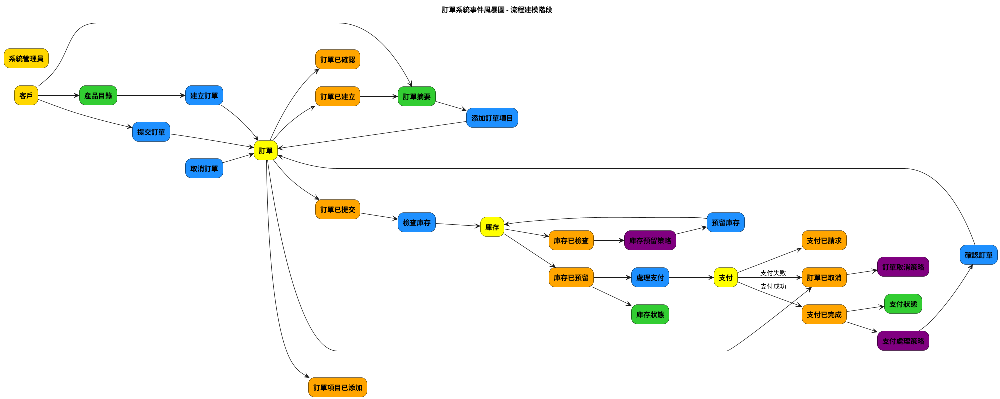

```puml
@startuml big-picture-exploration
left to right direction

skinparam rectangle {
    RoundCorner 25
    BorderColor black
    FontStyle bold
}

title 訂單系統事件風暴圖 - 大圖探索階段

' 只关注主要领域事件
rectangle "訂單已建立" as OrderCreatedEvent #FFA500
rectangle "訂單項目已添加" as OrderItemAddedEvent #FFA500
rectangle "訂單已提交" as OrderSubmittedEvent #FFA500
rectangle "庫存已檢查" as InventoryCheckedEvent #FFA500
rectangle "庫存已預留" as InventoryReservedEvent #FFA500
rectangle "支付已請求" as PaymentRequestedEvent #FFA500
rectangle "支付已完成" as PaymentCompletedEvent #FFA500
rectangle "訂單已確認" as OrderConfirmedEvent #FFA500
rectangle "配送已安排" as DeliveryArrangedEvent #FFA500
rectangle "配送已完成" as DeliveryCompletedEvent #FFA500
rectangle "訂單已取消" as OrderCancelledEvent #FFA500

' 热点/问题
rectangle "庫存預留超時如何處理?" as InventoryTimeoutIssue #FF0000
rectangle "支付失敗後重試策略?" as PaymentRetryIssue #FF0000
rectangle "訂單取消後如何處理已預留庫存?" as InventoryReleaseIssue #FF0000
rectangle "如何處理配送失敗?" as DeliveryFailureIssue #FF0000

' 时间线连接
OrderCreatedEvent --> OrderItemAddedEvent
OrderItemAddedEvent --> OrderSubmittedEvent
OrderSubmittedEvent --> InventoryCheckedEvent
InventoryCheckedEvent --> InventoryReservedEvent
InventoryReservedEvent --> PaymentRequestedEvent
PaymentRequestedEvent --> PaymentCompletedEvent
PaymentCompletedEvent --> OrderConfirmedEvent
OrderConfirmedEvent --> DeliveryArrangedEvent
DeliveryArrangedEvent --> DeliveryCompletedEvent

' 分支路径
InventoryCheckedEvent -[#red]-> OrderCancelledEvent : 库存不足
PaymentRequestedEvent -[#red]-> OrderCancelledEvent : 支付失败

' 热点问题连接
InventoryTimeoutIssue -[#red,dashed]-> InventoryReservedEvent
PaymentRetryIssue -[#red,dashed]-> PaymentRequestedEvent
InventoryReleaseIssue -[#red,dashed]-> OrderCancelledEvent
DeliveryFailureIssue -[#red,dashed]-> DeliveryArrangedEvent
```

```puml
@startuml design-level
left to right direction

skinparam rectangle {
    RoundCorner 25
    BorderColor black
    FontStyle bold
}

title 訂單系統事件風暴圖 - 設計級別階段

' 使用包来表示界限上下文
package "訂單上下文" {
    ' 聚合
    rectangle "訂單" as OrderAggregate #FFFF00
    
    ' 命令
    rectangle "建立訂單" as CreateOrderCommand #1E90FF
    rectangle "添加訂單項目" as AddOrderItemCommand #1E90FF
    rectangle "提交訂單" as SubmitOrderCommand #1E90FF
    rectangle "確認訂單" as ConfirmOrderCommand #1E90FF
    rectangle "取消訂單" as CancelOrderCommand #1E90FF
    
    ' 事件
    rectangle "訂單已建立" as OrderCreatedEvent #FFA500
    rectangle "訂單項目已添加" as OrderItemAddedEvent #FFA500
    rectangle "訂單已提交" as OrderSubmittedEvent #FFA500
    rectangle "訂單已確認" as OrderConfirmedEvent #FFA500
    rectangle "訂單已取消" as OrderCancelledEvent #FFA500
    
    ' 读模型
    rectangle "訂單摘要" as OrderSummaryReadModel #32CD32
    rectangle "訂單詳情" as OrderDetailReadModel #32CD32
    rectangle "訂單歷史" as OrderHistoryReadModel #32CD32
    
    ' 服务
    rectangle "訂單工作流服務" as OrderWorkflowService #ADD8E6
}

package "庫存上下文" {
    ' 聚合
    rectangle "庫存" as InventoryAggregate #FFFF00
    
    ' 命令
    rectangle "檢查庫存" as CheckInventoryCommand #1E90FF
    rectangle "預留庫存" as ReserveInventoryCommand #1E90FF
    rectangle "釋放庫存" as ReleaseInventoryCommand #1E90FF
    
    ' 事件
    rectangle "庫存已檢查" as InventoryCheckedEvent #FFA500
    rectangle "庫存已預留" as InventoryReservedEvent #FFA500
    rectangle "庫存已釋放" as InventoryReleasedEvent #FFA500
    
    ' 读模型
    rectangle "庫存狀態" as InventoryStatusReadModel #32CD32
    rectangle "庫存報表" as InventoryReportReadModel #32CD32
    
    ' 服务
    rectangle "庫存管理服務" as InventoryManagementService #ADD8E6
}

package "支付上下文" {
    ' 聚合
    rectangle "支付" as PaymentAggregate #FFFF00
    
    ' 命令
    rectangle "處理支付" as ProcessPaymentCommand #1E90FF
    rectangle "申請退款" as RequestRefundCommand #1E90FF
    
    ' 事件
    rectangle "支付已請求" as PaymentRequestedEvent #FFA500
    rectangle "支付已完成" as PaymentCompletedEvent #FFA500
    rectangle "支付已失敗" as PaymentFailedEvent #FFA500
    rectangle "退款已處理" as RefundProcessedEvent #FFA500
    
    ' 读模型
    rectangle "支付狀態" as PaymentStatusReadModel #32CD32
    rectangle "支付歷史" as PaymentHistoryReadModel #32CD32
    
    ' 服务
    rectangle "支付處理服務" as PaymentProcessingService #ADD8E6
}

package "配送上下文" {
    ' 聚合
    rectangle "配送" as DeliveryAggregate #FFFF00
    
    ' 命令
    rectangle "安排配送" as ArrangeDeliveryCommand #1E90FF
    rectangle "更新配送地址" as UpdateDeliveryAddressCommand #1E90FF
    rectangle "標記配送完成" as MarkDeliveryCompletedCommand #1E90FF
    
    ' 事件
    rectangle "配送已安排" as DeliveryArrangedEvent #FFA500
    rectangle "配送地址已更新" as DeliveryAddressUpdatedEvent #FFA500
    rectangle "配送已完成" as DeliveryCompletedEvent #FFA500
    
    ' 读模型
    rectangle "配送狀態" as DeliveryStatusReadModel #32CD32
    rectangle "配送追蹤" as DeliveryTrackingReadModel #32CD32
    
    ' 服务
    rectangle "配送管理服務" as DeliveryManagementService #ADD8E6
}

package "通知上下文" {
    ' 聚合
    rectangle "通知" as NotificationAggregate #FFFF00
    
    ' 事件
    rectangle "通知已發送" as NotificationSentEvent #FFA500
    
    ' 读模型
    rectangle "通知歷史" as NotificationHistoryReadModel #32CD32
    
    ' 服务
    rectangle "通知服務" as NotificationService #ADD8E6
}

' 外部系统
rectangle "庫存系統" as InventorySystem #FF69B4
rectangle "支付網關" as PaymentGateway #FF69B4
rectangle "物流系統" as LogisticsSystem #FF69B4
rectangle "通知系統" as NotificationSystem #FF69B4

' 上下文之间的集成
OrderSubmittedEvent --> CheckInventoryCommand : 触发
InventoryReservedEvent --> ProcessPaymentCommand : 触发
PaymentCompletedEvent --> ConfirmOrderCommand : 触发
OrderConfirmedEvent --> ArrangeDeliveryCommand : 触发
OrderCancelledEvent --> ReleaseInventoryCommand : 触发
OrderCancelledEvent --> RequestRefundCommand : 如果已支付

' 事件到读模型的投影
OrderCreatedEvent --> OrderSummaryReadModel : 投影
OrderItemAddedEvent --> OrderDetailReadModel : 投影
OrderConfirmedEvent --> OrderHistoryReadModel : 投影
InventoryReservedEvent --> InventoryStatusReadModel : 投影
PaymentCompletedEvent --> PaymentStatusReadModel : 投影
DeliveryArrangedEvent --> DeliveryTrackingReadModel : 投影

' 与外部系统的集成
InventoryAggregate --> InventorySystem : 使用
PaymentAggregate --> PaymentGateway : 使用
DeliveryAggregate --> LogisticsSystem : 使用
NotificationAggregate --> NotificationSystem : 使用
```

# Event Storming 三阶段产出 PlantUML 指南

本文档提供了使用 PlantUML 绘制 Event Storming 三个阶段产出的指南，包括布局、颜色规范、元素排序和最佳实践。

## Event Storming 概述

Event Storming 是一种协作建模技术，由 Alberto Brandolini 创建，用于探索复杂业务领域。它通常分为三个主要阶段：

1. **大图探索阶段 (Big Picture Exploration)**：快速了解整个业务领域
2. **流程建模阶段 (Process Modeling)**：深入理解事件之间的因果关系
3. **设计级别阶段 (Design Level)**：为软件实现提供详细设计

## 标准颜色规范

Event Storming 使用特定颜色来区分不同类型的元素：

| 元素类型 | 颜色代码 | 说明 |
|---------|---------|------|
| 事件 (Events) | #FFA500 (橙色) | 系统中发生的事情 |
| 命令 (Commands) | #1E90FF (蓝色) | 触发事件的行为或意图 |
| 聚合 (Aggregates) | #FFFF00 (黄色) | 确保业务规则的实体 |
| 策略/政策 (Policies) | #800080 (紫色) | 当事件发生时应执行的业务规则 |
| 读模型 (Read Models) | #32CD32 (绿色) | 用户查看的信息或视图 |
| 外部系统 (External Systems) | #FF69B4 (粉色) | 与核心系统交互的外部系统 |
| 参与者 (Actors) | #FFD700 (金色) | 执行命令的人或系统 |
| 热点/问题 (Hotspots/Issues) | #FF0000 (红色) | 需要解决的问题或决策点 |
| 服务 (Services) | #ADD8E6 (浅蓝色) | 协调聚合和处理业务逻辑 |

## 布局原则

### 通用布局原则

1. **时间流向**：从左到右表示时间流
2. **主流程居中**：主要流程（happy path）放在中间
3. **分支流程下方**：异常路径或分支流程放在主流程下方
4. **垂直分层**：不同类型的元素按垂直层次排列
5. **相关元素分组**：使用 `together` 或 `package` 将相关元素分组

### 元素垂直排序（从上到下）

1. 参与者 (Actors)
2. 读模型 (Read Models)
3. 命令 (Commands)
4. 聚合 (Aggregates)
5. 事件 (Events)
6. 问题/热点 (Issues/Hotspots)
7. 策略 (Policies)
8. 外部系统 (External Systems)

## 三个阶段的 PlantUML 实现

### 1. 大图探索阶段 (Big Picture Exploration)

#### 关注点
- 主要领域事件
- 事件之间的时间顺序
- 关键问题和决策点

#### 元素类型
- 事件 (Events)
- 热点/问题 (Hotspots/Issues)

#### PlantUML 示例


#### 布局技巧
- 保持简单，只关注主要事件流
- 使用红色虚线连接问题和相关事件
- 使用红色实线表示异常流程
- 事件按时间顺序从左到右排列
- 问题放在相关事件的斜上方或斜下方

### 2. 流程建模阶段 (Process Modeling)

#### 关注点
- 命令与事件的因果关系
- 聚合如何处理命令并产生事件
- 读模型如何影响用户决策
- 策略如何响应事件

#### 元素类型
- 参与者 (Actors)
- 读模型 (Read Models)
- 命令 (Commands)
- 聚合 (Aggregates)
- 事件 (Events)
- 策略 (Policies)

#### PlantUML 示例


#### 布局技巧
- 按垂直层次排列不同类型的元素
- 使用水平流向表示业务流程
- 将相关元素垂直对齐
- 使用注释说明特殊条件或分支
- 将主要流程放在中间，分支流程放在下方

### 3. 设计级别阶段 (Design Level)

#### 关注点
- 界限上下文的划分
- 聚合之间的关系
- 服务的职责
- 与外部系统的集成
- 读模型的设计和事件投影

#### 元素类型
- 界限上下文 (Bounded Contexts)
- 聚合 (Aggregates)
- 命令 (Commands)
- 事件 (Events)
- 读模型 (Read Models)
- 服务 (Services)
- 外部系统 (External Systems)

#### PlantUML 示例


#### 布局技巧
- 使用 `package` 清晰划分界限上下文
- 在每个上下文内部保持一致的元素排列
- 使用标注说明上下文之间的集成点
- 突出显示与外部系统的交互
- 将相关的上下文放在一起
- 显示事件到读模型的投影关系

## 读模型在设计级别阶段的重要性

在设计级别阶段，读模型是系统设计的重要组成部分，不应被忽略。读模型在此阶段具有以下重要性：

1. **CQRS模式实现**：在设计级别阶段，通常会考虑实现命令查询责任分离(CQRS)模式，其中读模型是查询部分的核心。

2. **用户界面设计**：读模型直接影响用户界面的设计和实现，在设计级别阶段需要明确定义。

3. **性能优化**：设计级别阶段需要考虑读模型的性能优化策略，如缓存、索引等。

4. **事件投影**：在事件驱动架构中，读模型通常是事件投影的结果，这在设计级别阶段需要明确。

5. **数据一致性**：读模型帮助解决最终一致性问题，在设计级别阶段需要考虑如何处理事件顺序和数据同步。

6. **查询复杂度降低**：专门为特定查询场景优化的读模型可以显著降低查询复杂度，提高系统响应速度。

7. **跨界限上下文数据整合**：读模型可以整合来自多个界限上下文的数据，为用户提供统一视图。

### 读模型设计建议

在第三阶段的 Event Storming 设计中，应该特别注意以下关于读模型的设计建议：

1. **明确读模型的来源事件**：每个读模型应该清晰地标识其数据来源于哪些事件，例如：

```puml
OrderCreatedEvent --> OrderSummaryReadModel : 投影
OrderItemAddedEvent --> OrderDetailReadModel : 投影
PaymentCompletedEvent --> OrderSummaryReadModel : 更新支付状态
```

2. **定义读模型的更新策略**：
   - 即时更新：事件发生后立即更新读模型
   - 批量更新：定期批量处理事件更新读模型
   - 按需更新：在查询时才更新读模型

3. **读模型的版本管理**：考虑读模型的版本演进策略，特别是在长期运行的系统中。

4. **读模型的缓存策略**：设计适当的缓存机制，包括缓存失效策略和更新机制。

5. **跨界限上下文的读模型**：明确定义跨多个界限上下文的读模型，并设计其数据同步机制。

### 读模型在 PlantUML 中的表示

在设计级别阶段的 PlantUML 图中，应该采用以下方式表示读模型：

1. **在各个界限上下文中包含相关读模型**：

```puml
package "订单上下文" {
    rectangle "订单摘要" as OrderSummaryReadModel #32CD32
    rectangle "订单详情" as OrderDetailReadModel #32CD32
}
```

2. **显示事件到读模型的投影关系**：

```puml
OrderCreatedEvent --> OrderSummaryReadModel : 投影
OrderItemAddedEvent --> OrderDetailReadModel : 投影
```

3. **表示读模型与用户界面的关系**：

```puml
rectangle "用户" as User #FFD700
User --> OrderSummaryReadModel : 查询
OrderSummaryReadModel --> User : 显示
```

4. **表示读模型的更新策略**：

```puml
PaymentCompletedEvent --> OrderSummaryReadModel : 即时更新
InventoryCheckedEvent --> InventoryReportReadModel : 批量更新
```

5. **表示跨界限上下文的读模型**：

```puml
package "综合视图" {
    rectangle "客户订单历史" as CustomerOrderHistoryReadModel #32CD32
}

OrderConfirmedEvent --> CustomerOrderHistoryReadModel : 投影
PaymentCompletedEvent --> CustomerOrderHistoryReadModel : 投影
DeliveryCompletedEvent --> CustomerOrderHistoryReadModel : 投影
```

这样可以更全面地展示系统的设计，包括命令端和查询端的完整视图，以及读模型如何支持用户交互和业务决策。

## 最佳实践

### 文件组织
- 为每个阶段创建单独的 PlantUML 文件
- 使用一致的命名约定，如 `big-picture-exploration.puml`
- 在每个文件中包含图例说明颜色含义

### 可读性提升
- 使用有意义的元素 ID，如 `OrderCreatedEvent` 而非 `event1`
- 为复杂连接添加说明文本
- 使用空间和分组来增强视觉清晰度
- 保持一致的命名风格

### 生成图表
使用以下命令将 PlantUML 文件转换为 SVG 格式：

```bash
java -jar plantuml.jar -tsvg path/to/file.puml
```

对于大型图表，可能需要增加内存分配：

```bash
java -Xmx1024m -jar plantuml.jar -tsvg path/to/file.puml
```

## 三个阶段的区别与联系

### 阶段间的演进
1. **大图探索阶段**：专注于"发生了什么"，捕捉主要事件和问题
2. **流程建模阶段**：增加"谁做了什么"和"为什么"，添加命令、聚合和策略
3. **设计级别阶段**：增加"如何实现"，划分界限上下文和服务

### 信息密度
- 大图探索阶段：低密度，只有核心事件和问题
- 流程建模阶段：中等密度，包含完整业务流程
- 设计级别阶段：高密度，包含实现细节和系统结构

### 目标受众
- 大图探索阶段：所有利益相关者，包括业务和技术人员
- 流程建模阶段：领域专家和开发团队
- 设计级别阶段：主要是开发团队和架构师

## 结论

使用 PlantUML 绘制 Event Storming 的三个阶段产出可以帮助团队更好地理解和沟通复杂的业务领域。通过遵循本指南中的颜色规范、布局原则和最佳实践，可以创建清晰、一致且信息丰富的图表，支持从业务探索到详细设计的整个过程。

每个阶段的图表都有其特定的关注点和目标受众，通过逐步深入和细化，团队可以从高层业务概览逐步过渡到详细的技术设计，确保软件实现与业务需求保持一致。
