# Design Document

## Overview

This design document outlines the technical architecture and implementation strategy for integrating comprehensive observability capabilities into the GenAI Demo Java Spring Boot application using AWS CDK for Infrastructure as Code deployment.

## Architecture

### High-Level Architecture

The solution follows a multi-layered architecture with clear separation of concerns:

1. **Application Layer**: Spring Boot application with profile-based configuration
2. **Infrastructure Layer**: AWS CDK managed infrastructure components  
3. **Observability Layer**: Comprehensive monitoring, logging, and tracing
4. **Analytics Layer**: Business intelligence and data analytics pipeline

### Component Overview

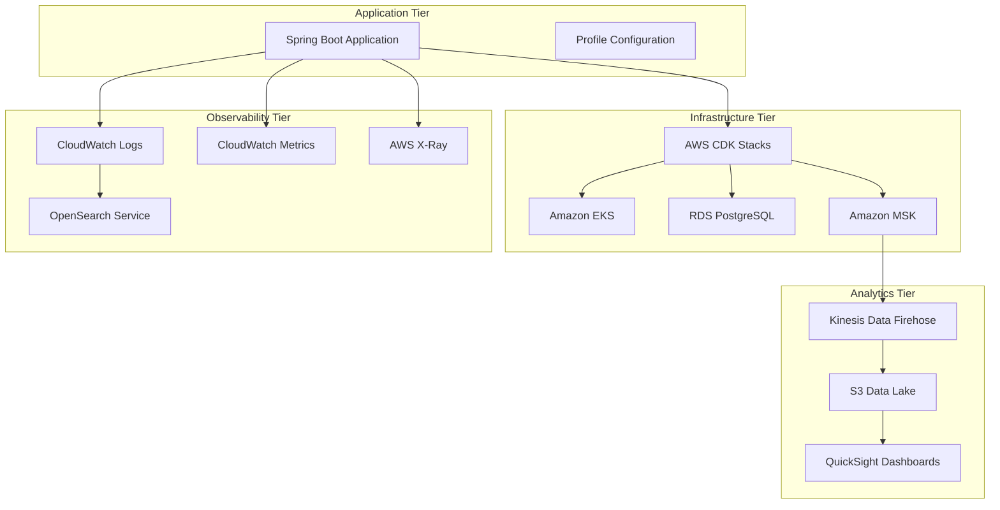

## Components and Interfaces

### 1. Spring Boot Profile Configuration System

#### Configuration Structure

```yaml
# Base Configuration (application.yml)
spring:
  application:
    name: genai-demo
  profiles:
    active: ${SPRING_PROFILES_ACTIVE:dev}

# Development Profile (application-dev.yml)  
spring:
  datasource:
    url: jdbc:h2:mem:genaidemo
    driver-class-name: org.h2.Driver
  flyway:
    locations: classpath:db/migration/h2

# Production Profile (application-production.yml)
spring:
  datasource:
    url: jdbc:postgresql://${DB_HOST}:${DB_PORT}/${DB_NAME}
    driver-class-name: org.postgresql.Driver
  flyway:
    locations: classpath:db/migration/postgresql
```

#### Profile Activation Strategy

- **Local Development**: `SPRING_PROFILES_ACTIVE=dev` (default)
- **Docker Development**: `SPRING_PROFILES_ACTIVE=dev` (explicit)
- **EKS Production**: `SPRING_PROFILES_ACTIVE=prod` (environment variable)

### 2. Multi-Environment Database Configuration

#### Database Abstraction Layer

```java
public interface DatabaseConfigurationStrategy {
    DataSource createDataSource();
    FlywayConfiguration getFlywayConfiguration();
    JpaProperties getJpaProperties();
}

@Configuration
@Profile("dev")
public class DevelopmentDatabaseConfiguration implements DatabaseConfigurationStrategy {
    // H2 in-memory database configuration
}

@Configuration  
@Profile("production")
public class ProductionDatabaseConfiguration implements DatabaseConfigurationStrategy {
    // RDS PostgreSQL configuration
}
```

#### Migration Strategy

```
src/main/resources/db/migration/
├── h2/
│   ├── V1__Create_base_schema_h2.sql
│   ├── V2__Insert_sample_data_h2.sql
│   └── V3__Create_indexes_h2.sql
└── postgresql/
    ├── V1__Create_base_schema_postgresql.sql
    ├── V2__Create_production_indexes_postgresql.sql
    └── V3__Setup_partitioning_postgresql.sql
```

### 3. Domain Events Publishing Architecture

#### Event Publisher Interface

```java
public interface DomainEventPublisher {
    void publish(DomainEvent event);
    void publishAll(List<DomainEvent> events);
}

@Component
@Profile("dev")
public class InMemoryDomainEventPublisher implements DomainEventPublisher {
    private final ApplicationEventPublisher springEventPublisher;
    
    @Override
    public void publish(DomainEvent event) {
        springEventPublisher.publishEvent(event);
    }
}

@Component
@Profile("production") 
public class KafkaDomainEventPublisher implements DomainEventPublisher {
    private final KafkaTemplate<String, DomainEvent> kafkaTemplate;
    
    @Override
    public void publish(DomainEvent event) {
        String topic = "genai-demo." + event.getEventType().toLowerCase();
        kafkaTemplate.send(topic, event.getAggregateId(), event);
    }
}
```

#### Event Flow Architecture

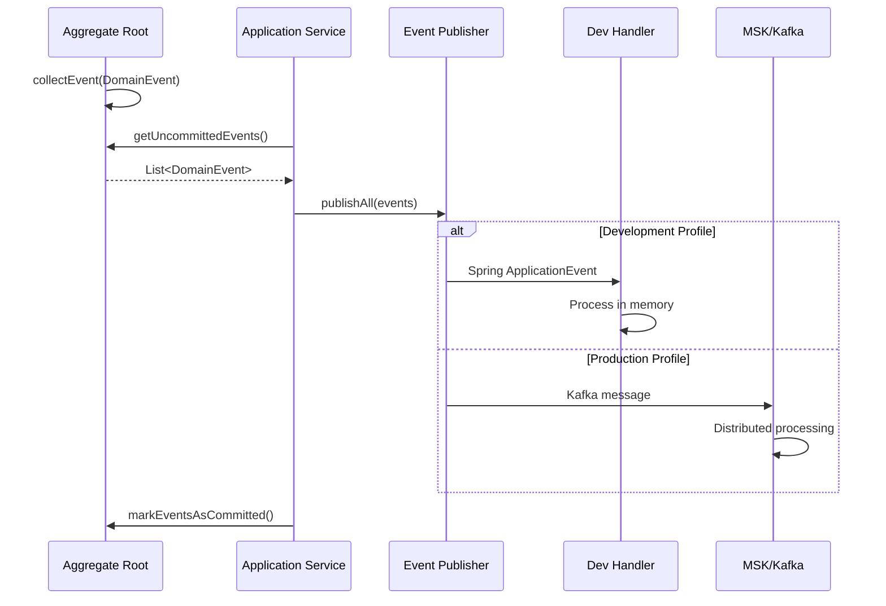

### 4. AWS CDK Infrastructure Design

#### CDK Stack Architecture

```typescript
export class GenAIDemoInfrastructureStack extends Stack {
  constructor(scope: Construct, id: string, props: StackProps) {
    super(scope, id, props);
    
    // Core Infrastructure
    const vpc = this.createVPC();
    const eksCluster = this.createEKSCluster(vpc);
    const rdsDatabase = this.createRDSDatabase(vpc);
    const mskCluster = this.createMSKCluster(vpc);
    
    // Observability Infrastructure  
    const observabilityStack = new ObservabilityStack(this, 'Observability', {
      cluster: eksCluster,
      vpc: vpc
    });
    
    // Analytics Infrastructure
    const analyticsStack = new AnalyticsStack(this, 'Analytics', {
      mskCluster: mskCluster,
      vpc: vpc
    });
  }
}
```

#### Resource Allocation Strategy

```yaml
Development Environment:
  EKS:
    Node Type: t3.medium
    Min Nodes: 1
    Max Nodes: 3
  RDS:
    Instance: db.t3.micro
    Storage: 20GB
    Multi-AZ: false
    
Production Environment:
  EKS:
    Node Type: m6g.large (Graviton3)
    Min Nodes: 2  
    Max Nodes: 10
  RDS:
    Instance: db.r6g.large
    Storage: 100GB
    Multi-AZ: true
    Read Replicas: 2
  MSK:
    Brokers: 3
    Instance: kafka.m5.large
    Storage: 100GB per broker
```

### 5. Comprehensive Logging Architecture

#### Logging Pipeline Design

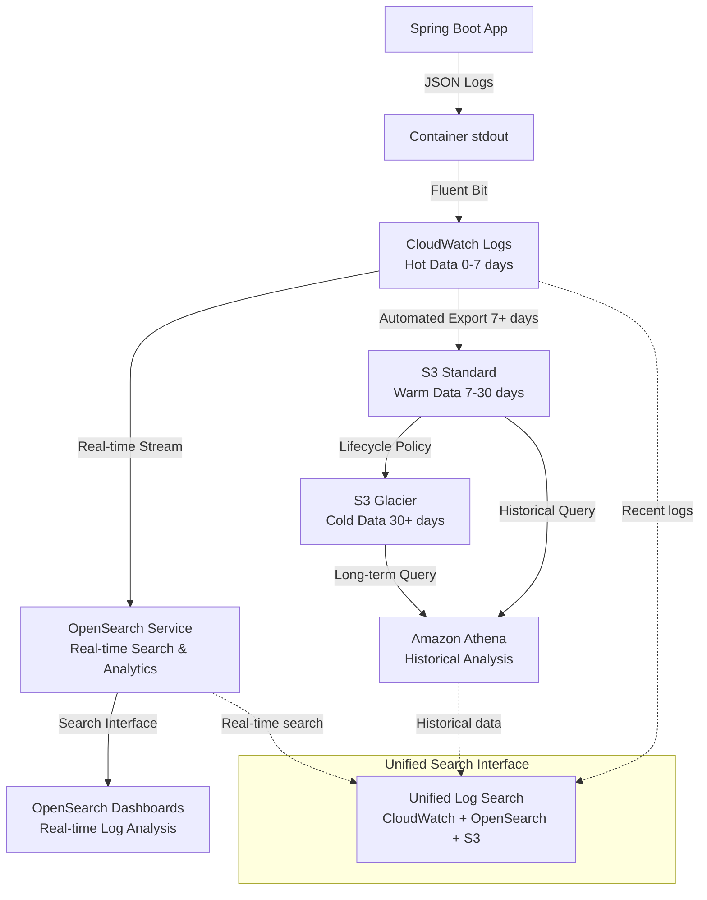

#### Log Structure Design

```json
{
  "timestamp": "2024-01-15T10:30:45.123Z",
  "level": "INFO",
  "thread": "http-nio-8080-exec-1", 
  "logger": "solid.humank.genaidemo.application.order.OrderApplicationService",
  "message": "Order created successfully",
  "mdc": {
    "correlationId": "abc-123-def",
    "userId": "CUST-001",
    "orderId": "ORDER-456",
    "traceId": "1-5e1b4e5f-38a7c5c3f5a1b2c3d4e5f6a7",
    "spanId": "38a7c5c3f5a1b2c3"
  },
  "kubernetes": {
    "pod": "genai-demo-7d4b8c9f8-xyz12",
    "namespace": "default",
    "node": "ip-10-0-1-100.compute.internal"
  },
  "application": {
    "name": "genai-demo",
    "version": "2.0.0",
    "profile": "production"
  }
}
```

#### Cost Optimization Strategy

```yaml
Log Lifecycle:
  Hot (0-7 days): CloudWatch Logs ($0.50/GB/month)
  Warm (7-30 days): S3 Standard ($0.023/GB/month)  
  Cold (30+ days): S3 Glacier ($0.004/GB/month)

Estimated Monthly Cost (10GB/day):
  CloudWatch Only: ~$300/month
  Optimized Pipeline: ~$140/month (53% savings)
```

### 6. Metrics Collection and Monitoring

#### Metrics Architecture

```java
@Configuration
public class MetricsConfiguration {
    
    @Bean
    @Profile("dev")
    public MeterRegistry developmentMeterRegistry() {
        return new SimpleMeterRegistry();
    }
    
    @Bean
    @Profile("production")
    public MeterRegistry productionMeterRegistry() {
        return CloudWatchMeterRegistry.builder(CloudWatchConfig.DEFAULT)
            .cloudWatchClient(CloudWatchAsyncClient.create())
            .build();
    }
}

@Component
public class BusinessMetrics {
    private final Counter orderCreatedCounter;
    private final Timer orderProcessingTimer;
    private final Gauge activeCustomersGauge;
    
    public BusinessMetrics(MeterRegistry meterRegistry) {
        this.orderCreatedCounter = Counter.builder("orders.created")
            .description("Number of orders created")
            .tag("service", "order-service")
            .register(meterRegistry);
            
        this.orderProcessingTimer = Timer.builder("orders.processing.time")
            .description("Order processing duration")
            .register(meterRegistry);
            
        this.activeCustomersGauge = Gauge.builder("customers.active")
            .description("Number of active customers")
            .register(meterRegistry, this, BusinessMetrics::getActiveCustomerCount);
    }
}
```

#### Metrics Collection Pipeline

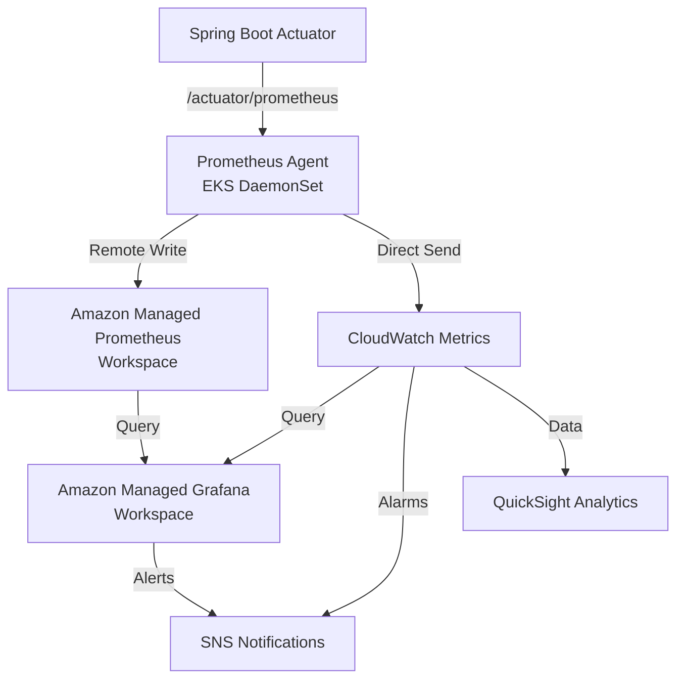

### 7. Distributed Tracing Implementation

#### Tracing Configuration

```java
@Configuration
@EnableAutoConfiguration
public class TracingConfiguration {
    
    @Bean
    public OpenTelemetry openTelemetry() {
        return OpenTelemetrySDK.builder()
            .setTracerProvider(
                SdkTracerProvider.builder()
                    .addSpanProcessor(BatchSpanProcessor.builder(
                        OtlpGrpcSpanExporter.builder()
                            .setEndpoint("http://localhost:4317") // Dev: Jaeger
                            .build())
                        .build())
                    .setResource(Resource.getDefault()
                        .merge(Resource.builder()
                            .put(ResourceAttributes.SERVICE_NAME, "genai-demo")
                            .put(ResourceAttributes.SERVICE_VERSION, "2.0.0")
                            .build()))
                    .build())
            .build();
    }
    
    @Bean
    @Profile("production")
    public AwsXRayIdGenerator xrayIdGenerator() {
        return AwsXRayIdGenerator.getInstance();
    }
}
```

#### Trace Context Propagation

```java
@Component
public class TraceContextManager {
    
    public void setCorrelationId(String correlationId) {
        MDC.put("correlationId", correlationId);
        Span.current().setAttribute("correlation.id", correlationId);
    }
    
    public void setBusinessContext(String userId, String orderId) {
        MDC.put("userId", userId);
        MDC.put("orderId", orderId);
        
        Span currentSpan = Span.current();
        currentSpan.setAttribute("user.id", userId);
        currentSpan.setAttribute("order.id", orderId);
    }
    
    public void clearContext() {
        MDC.clear();
    }
}
```

### 8. Business Intelligence Dashboard Design

#### Data Pipeline Architecture

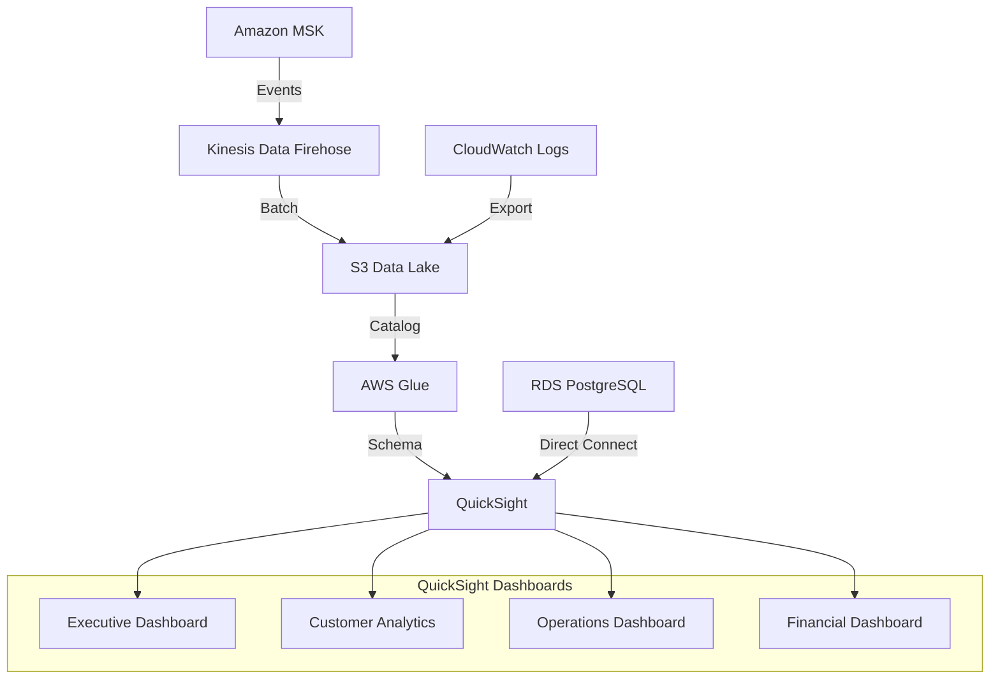

#### Dashboard Specifications

```yaml
Executive Dashboard:
  Metrics:
    - Daily Active Users
    - Revenue (Today/Week/Month/Quarter)
    - Order Conversion Rate
    - System Health Score
    - Top Products by Revenue
  Refresh: Every 15 minutes
  
Customer Analytics Dashboard:
  Metrics:
    - New Customer Registrations
    - Customer Lifetime Value
    - Customer Segmentation
    - Retention Rates
    - Geographic Distribution
  Refresh: Hourly
  
Operations Dashboard:
  Metrics:
    - Order Processing Times
    - Payment Success Rates
    - Inventory Levels
    - Delivery Performance
    - Error Rates by Service
  Refresh: Every 5 minutes
```

## Data Models

### 1. Configuration Data Model

```java
@ConfigurationProperties(prefix = "genai-demo")
public record ApplicationConfiguration(
    DatabaseConfiguration database,
    EventConfiguration events,
    ObservabilityConfiguration observability,
    SecurityConfiguration security
) {
    
    public record DatabaseConfiguration(
        String url,
        String username,
        String password,
        String driverClassName,
        HikariConfiguration hikari
    ) {}
    
    public record EventConfiguration(
        PublishingStrategy strategy,
        KafkaConfiguration kafka,
        RetryConfiguration retry
    ) {}
    
    public record ObservabilityConfiguration(
        LoggingConfiguration logging,
        MetricsConfiguration metrics,
        TracingConfiguration tracing
    ) {}
}
```

### 2. Event Data Model

```java
public interface DomainEvent extends Serializable {
    UUID getEventId();
    LocalDateTime getOccurredOn();
    String getEventType();
    String getAggregateId();
    
    static EventMetadata createEventMetadata() {
        return new EventMetadata(UUID.randomUUID(), LocalDateTime.now());
    }
    
    record EventMetadata(UUID eventId, LocalDateTime occurredOn) {}
}

// Business Event Examples
public record CustomerCreatedEvent(
    CustomerId customerId,
    CustomerName customerName,
    Email email,
    MembershipLevel membershipLevel,
    UUID eventId,
    LocalDateTime occurredOn
) implements DomainEvent {
    
    public static CustomerCreatedEvent create(
        CustomerId customerId, CustomerName customerName, 
        Email email, MembershipLevel membershipLevel
    ) {
        DomainEvent.EventMetadata metadata = DomainEvent.createEventMetadata();
        return new CustomerCreatedEvent(
            customerId, customerName, email, membershipLevel,
            metadata.eventId(), metadata.occurredOn()
        );
    }
}
```

### 3. Observability Data Model

```java
public record ObservabilityEvent(
    String eventType,
    String serviceName,
    String correlationId,
    String traceId,
    String spanId,
    Map<String, Object> attributes,
    LocalDateTime timestamp
) implements DomainEvent {
    
    public static ObservabilityEvent createMetricEvent(
        String metricName, double value, Map<String, String> tags
    ) {
        return new ObservabilityEvent(
            "metric.recorded",
            "genai-demo",
            MDC.get("correlationId"),
            MDC.get("traceId"),
            MDC.get("spanId"),
            Map.of("metric.name", metricName, "metric.value", value, "tags", tags),
            LocalDateTime.now()
        );
    }
}
```

## Error Handling

### 1. Configuration Error Handling

```java
@Component
public class ProfileConfigurationValidator {
    
    @EventListener(ApplicationReadyEvent.class)
    public void validateConfiguration() {
        String activeProfile = environment.getActiveProfiles()[0];
        
        switch (activeProfile) {
            case "dev" -> validateDevelopmentConfiguration();
            case "production" -> validateProductionConfiguration();
            default -> throw new ConfigurationException(
                "Unsupported profile: " + activeProfile
            );
        }
    }
    
    private void validateDevelopmentConfiguration() {
        // Validate H2 database configuration
        // Validate in-memory event configuration
        // Validate local observability tools
    }
    
    private void validateProductionConfiguration() {
        // Validate RDS connection
        // Validate MSK connectivity
        // Validate AWS service permissions
    }
}
```

### 2. Event Publishing Error Handling

```java
@Component
@Profile("production")
public class ResilientKafkaEventPublisher implements DomainEventPublisher {
    
    private final KafkaTemplate<String, DomainEvent> kafkaTemplate;
    private final DeadLetterService deadLetterService;
    
    @Override
    @Retryable(
        value = {TransientException.class},
        maxAttempts = 3,
        backoff = @Backoff(delay = 1000, multiplier = 2)
    )
    public void publish(DomainEvent event) {
        try {
            String topic = getTopicForEvent(event);
            kafkaTemplate.send(topic, event.getAggregateId(), event)
                .addCallback(
                    result -> log.info("Event published: {}", event.getEventId()),
                    failure -> handlePublishFailure(event, failure)
                );
        } catch (Exception e) {
            log.error("Failed to publish event: {}", event.getEventId(), e);
            throw new EventPublishingException("Event publishing failed", e);
        }
    }
    
    @Recover
    public void recover(EventPublishingException ex, DomainEvent event) {
        log.error("All retry attempts failed for event: {}", event.getEventId());
        deadLetterService.send(event, ex);
    }
    
    private void handlePublishFailure(DomainEvent event, Throwable failure) {
        log.error("Async event publishing failed: {}", event.getEventId(), failure);
        deadLetterService.send(event, failure);
    }
}
```

### 3. Infrastructure Error Handling

```typescript
export class ResilientInfrastructureStack extends Stack {
  
  createEKSCluster(vpc: ec2.Vpc): eks.Cluster {
    const cluster = new eks.Cluster(this, 'GenAIDemoCluster', {
      version: eks.KubernetesVersion.V1_28,
      vpc: vpc,
      defaultCapacity: 0,
      
      // Error handling configuration
      endpointAccess: eks.EndpointAccess.PUBLIC_AND_PRIVATE,
      
      // Logging configuration for troubleshooting
      clusterLogging: [
        eks.ClusterLoggingTypes.API,
        eks.ClusterLoggingTypes.AUDIT,
        eks.ClusterLoggingTypes.AUTHENTICATOR,
        eks.ClusterLoggingTypes.CONTROLLER_MANAGER,
        eks.ClusterLoggingTypes.SCHEDULER
      ]
    });
    
    // Add error handling for node group failures
    cluster.addNodegroupCapacity('DefaultNodeGroup', {
      instanceTypes: [ec2.InstanceType.of(ec2.InstanceClass.M6G, ec2.InstanceSize.LARGE)],
      minSize: 1,
      maxSize: 10,
      desiredSize: 2,
      
      // Auto-recovery configuration
      forceUpdate: true,
      updateConfig: {
        maxUnavailable: cdk.Duration.minutes(5)
      }
    });
    
    return cluster;
  }
}
```

### 4. Observability Error Handling

```java
@Component
public class ObservabilityErrorHandler {
    
    @EventListener
    public void handleMetricCollectionError(MetricCollectionErrorEvent event) {
        log.warn("Metric collection failed: {}", event.getMetricName(), event.getError());
        
        // Fallback to basic metrics
        meterRegistry.counter("metrics.collection.errors",
            "metric", event.getMetricName(),
            "error", event.getError().getClass().getSimpleName()
        ).increment();
    }
    
    @EventListener  
    public void handleTracingError(TracingErrorEvent event) {
        log.warn("Tracing failed for operation: {}", event.getOperationName(), event.getError());
        
        // Continue operation without tracing
        // Log error for monitoring
        meterRegistry.counter("tracing.errors",
            "operation", event.getOperationName()
        ).increment();
    }
    
    @EventListener
    public void handleLoggingError(LoggingErrorEvent event) {
        // Fallback to console logging
        System.err.println("Logging system error: " + event.getError().getMessage());
        
        // Try to recover logging system
        loggingSystemRecovery.attemptRecovery();
    }
}
```

## Testing Strategy

### 1. Profile-based Testing

```java
@SpringBootTest
@ActiveProfiles("test")
class ProfileConfigurationTest {
    
    @Test
    void shouldActivateTestProfile() {
        assertThat(environment.getActiveProfiles()).contains("test");
    }
    
    @Test
    void shouldUseH2DatabaseInTestProfile() {
        assertThat(dataSource).isInstanceOf(HikariDataSource.class);
        assertThat(dataSource.getJdbcUrl()).contains("h2:mem:");
    }
    
    @Test
    void shouldUseInMemoryEventsInTestProfile() {
        assertThat(eventPublisher).isInstanceOf(InMemoryDomainEventPublisher.class);
    }
}

@SpringBootTest
@ActiveProfiles("dev")
class DevelopmentProfileTest {
    
    @Test
    void shouldConfigureDevelopmentEnvironment() {
        // Test development-specific configuration
    }
}

@SpringBootTest  
@ActiveProfiles("production")
@TestPropertySource(properties = {
    "spring.datasource.url=jdbc:postgresql://localhost:5432/testdb",
    "spring.kafka.bootstrap-servers=localhost:9092"
})
class ProductionProfileTest {
    
    @Test
    void shouldConfigureProductionEnvironment() {
        // Test production-specific configuration with test doubles
    }
}
```

### 2. Event Publishing Testing

```java
@ExtendWith(MockitoExtension.class)
class EventPublishingTest {
    
    @Mock
    private KafkaTemplate<String, DomainEvent> kafkaTemplate;
    
    @InjectMocks
    private KafkaDomainEventPublisher eventPublisher;
    
    @Test
    void shouldPublishEventToCorrectTopic() {
        // Given
        CustomerCreatedEvent event = CustomerCreatedEvent.create(
            CustomerId.of("CUST-001"),
            new CustomerName("John Doe"),
            new Email("john@example.com"),
            MembershipLevel.STANDARD
        );
        
        // When
        eventPublisher.publish(event);
        
        // Then
        verify(kafkaTemplate).send(
            eq("genai-demo.customercreated"),
            eq("CUST-001"),
            eq(event)
        );
    }
}
```

### 3. Infrastructure Testing

```typescript
import { Template } from 'aws-cdk-lib/assertions';
import { GenAIDemoInfrastructureStack } from '../lib/infrastructure-stack';

describe('Infrastructure Stack', () => {
  
  test('should create EKS cluster with correct configuration', () => {
    const app = new cdk.App();
    const stack = new GenAIDemoInfrastructureStack(app, 'TestStack');
    const template = Template.fromStack(stack);
    
    template.hasResourceProperties('AWS::EKS::Cluster', {
      Version: '1.28',
      EndpointConfig: {
        PublicAccessCidrs: ['0.0.0.0/0'],
        PrivateEndpointEnabled: true
      }
    });
  });
  
  test('should create RDS instance with backup enabled', () => {
    const app = new cdk.App();
    const stack = new GenAIDemoInfrastructureStack(app, 'TestStack');
    const template = Template.fromStack(stack);
    
    template.hasResourceProperties('AWS::RDS::DBInstance', {
      Engine: 'postgres',
      BackupRetentionPeriod: 7,
      MultiAZ: true
    });
  });
});
```

### 4. Observability Testing

```java
@SpringBootTest
@TestPropertySource(properties = {
    "management.endpoints.web.exposure.include=health,metrics,prometheus"
})
class ObservabilityIntegrationTest {
    
    @Autowired
    private TestRestTemplate restTemplate;
    
    @Test
    void shouldExposeHealthEndpoint() {
        ResponseEntity<String> response = restTemplate.getForEntity(
            "/actuator/health", String.class
        );
        
        assertThat(response.getStatusCode()).isEqualTo(HttpStatus.OK);
        assertThat(response.getBody()).contains("\"status\":\"UP\"");
    }
    
    @Test
    void shouldExposePrometheusMetrics() {
        ResponseEntity<String> response = restTemplate.getForEntity(
            "/actuator/prometheus", String.class
        );
        
        assertThat(response.getStatusCode()).isEqualTo(HttpStatus.OK);
        assertThat(response.getBody()).contains("jvm_memory_used_bytes");
    }
    
    @Test
    void shouldRecordCustomMetrics() {
        // Trigger business operation
        orderService.createOrder(createTestOrder());
        
        // Verify metrics are recorded
        ResponseEntity<String> response = restTemplate.getForEntity(
            "/actuator/prometheus", String.class
        );
        
        assertThat(response.getBody()).contains("orders_created_total");
    }
}
```

## Implementation Notes

### 1. Development Workflow

```bash
# Local Development Setup
./gradlew bootRun --args='--spring.profiles.active=dev'

# Docker Development Setup  
docker-compose up -d
export SPRING_PROFILES_ACTIVE=dev
./gradlew bootRun

# Production Deployment
cdk deploy --profile production
kubectl apply -f k8s/production/
```

### 2. Configuration Management

- **Environment Variables**: Override configuration at runtime
- **AWS Systems Manager**: Store production configuration securely
- **Kubernetes ConfigMaps**: Manage application configuration in K8s
- **AWS Secrets Manager**: Handle sensitive configuration data

### 3. Monitoring and Alerting Setup

```yaml
CloudWatch Alarms:
  - High Error Rate (>5% in 5 minutes)
  - High Response Time (>2s average in 5 minutes)  
  - Low Disk Space (<20% available)
  - Database Connection Failures
  
SNS Topics:
  - Critical Alerts (PagerDuty integration)
  - Warning Alerts (Email notifications)
  - Info Alerts (Slack notifications)
```

### 4. Security Considerations

- **IAM Roles**: Least privilege access for all AWS services
- **Network Security**: VPC with private subnets for databases
- **Encryption**: TLS in transit, encryption at rest for all data
- **Secrets Management**: No hardcoded credentials in configuration
- **Audit Logging**: Complete audit trail for all operations

This design provides a comprehensive, scalable, and maintainable solution for integrating observability capabilities into the GenAI Demo application while supporting both development and production environments through profile-based configuration.

## CI/CD Pipeline Architecture

### Overview

The CI/CD pipeline implements GitOps principles using GitHub Actions for continuous integration and ArgoCD for continuous deployment to Amazon EKS. This approach ensures automated, reliable, and auditable deployments while maintaining separation between CI and CD concerns.

### Pipeline Architecture

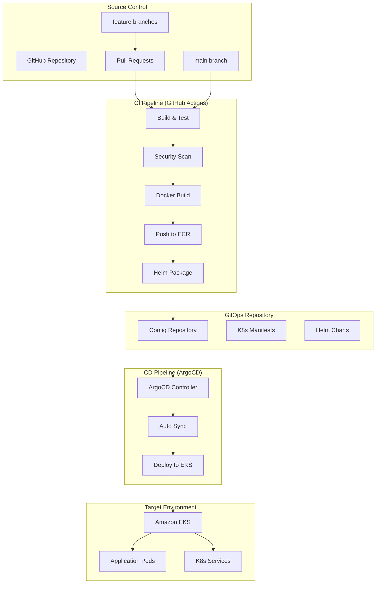

### GitHub Actions CI Pipeline

#### Workflow Configuration

```yaml
# .github/workflows/ci-cd.yml
name: CI/CD Pipeline

on:
  push:
    branches: [main, develop]
  pull_request:
    branches: [main]

env:
  AWS_REGION: ap-northeast-1
  ECR_REPOSITORY: genai-demo
  EKS_CLUSTER_NAME: genai-demo-cluster

jobs:
  test:
    name: Run Tests
    runs-on: ubuntu-latest
    
    steps:
    - name: Checkout code
      uses: actions/checkout@v4
      
    - name: Set up JDK 21
      uses: actions/setup-java@v4
      with:
        java-version: '21'
        distribution: 'temurin'
        
    - name: Cache Gradle dependencies
      uses: actions/cache@v3
      with:
        path: |
          ~/.gradle/caches
          ~/.gradle/wrapper
        key: ${{ runner.os }}-gradle-${{ hashFiles('**/*.gradle*', '**/gradle-wrapper.properties') }}
        
    - name: Run unit tests
      run: ./gradlew test
      
    - name: Run integration tests
      run: ./gradlew integrationTest
      
    - name: Run BDD tests
      run: ./gradlew cucumber
      
    - name: Run architecture tests
      run: ./gradlew testArchitecture
      
    - name: Generate test report
      run: ./gradlew runAllTestsWithReport
      
    - name: Upload test results
      uses: actions/upload-artifact@v3
      if: always()
      with:
        name: test-results
        path: build/reports/

  security-scan:
    name: Security Scanning
    runs-on: ubuntu-latest
    needs: test
    
    steps:
    - name: Checkout code
      uses: actions/checkout@v4
      
    - name: Run Trivy vulnerability scanner
      uses: aquasecurity/trivy-action@master
      with:
        scan-type: 'fs'
        scan-ref: '.'
        format: 'sarif'
        output: 'trivy-results.sarif'
        
    - name: Upload Trivy scan results
      uses: github/codeql-action/upload-sarif@v2
      with:
        sarif_file: 'trivy-results.sarif'
        
    - name: OWASP Dependency Check
      uses: dependency-check/Dependency-Check_Action@main
      with:
        project: 'genai-demo'
        path: '.'
        format: 'ALL'
        
    - name: Upload dependency check results
      uses: actions/upload-artifact@v3
      with:
        name: dependency-check-report
        path: reports/

  build-and-push:
    name: Build and Push Docker Images
    runs-on: ubuntu-latest
    needs: [test, security-scan]
    if: github.ref == 'refs/heads/main'
    
    strategy:
      matrix:
        component: [backend, cmc-frontend, consumer-frontend]
    
    steps:
    - name: Checkout code
      uses: actions/checkout@v4
      
    - name: Configure AWS credentials
      uses: aws-actions/configure-aws-credentials@v4
      with:
        aws-access-key-id: ${{ secrets.AWS_ACCESS_KEY_ID }}
        aws-secret-access-key: ${{ secrets.AWS_SECRET_ACCESS_KEY }}
        aws-region: ${{ env.AWS_REGION }}
        
    - name: Login to Amazon ECR
      id: login-ecr
      uses: aws-actions/amazon-ecr-login@v2
      
    - name: Set up Docker Buildx
      uses: docker/setup-buildx-action@v3
      
    - name: Build and push Docker image
      uses: docker/build-push-action@v5
      with:
        context: .
        file: ./docker/Dockerfile.${{ matrix.component }}
        platforms: linux/arm64
        push: true
        tags: |
          ${{ steps.login-ecr.outputs.registry }}/${{ env.ECR_REPOSITORY }}-${{ matrix.component }}:${{ github.sha }}
          ${{ steps.login-ecr.outputs.registry }}/${{ env.ECR_REPOSITORY }}-${{ matrix.component }}:latest
        cache-from: type=gha
        cache-to: type=gha,mode=max

  update-manifests:
    name: Update Kubernetes Manifests
    runs-on: ubuntu-latest
    needs: build-and-push
    
    steps:
    - name: Checkout config repository
      uses: actions/checkout@v4
      with:
        repository: kimkao/genai-demo-config
        token: ${{ secrets.GITOPS_TOKEN }}
        path: config-repo
        
    - name: Update image tags
      run: |
        cd config-repo
        
        # Update backend image tag
        sed -i "s|image: .*genai-demo-backend:.*|image: ${{ steps.login-ecr.outputs.registry }}/genai-demo-backend:${{ github.sha }}|" \
          environments/production/backend/deployment.yaml
          
        # Update frontend image tags
        sed -i "s|image: .*genai-demo-cmc-frontend:.*|image: ${{ steps.login-ecr.outputs.registry }}/genai-demo-cmc-frontend:${{ github.sha }}|" \
          environments/production/frontend/cmc-deployment.yaml
          
        sed -i "s|image: .*genai-demo-consumer-frontend:.*|image: ${{ steps.login-ecr.outputs.registry }}/genai-demo-consumer-frontend:${{ github.sha }}|" \
          environments/production/frontend/consumer-deployment.yaml
        
    - name: Commit and push changes
      run: |
        cd config-repo
        git config --local user.email "action@github.com"
        git config --local user.name "GitHub Action"
        git add .
        git commit -m "Update image tags to ${{ github.sha }}" || exit 0
        git push

  deploy-infrastructure:
    name: Deploy AWS Infrastructure
    runs-on: ubuntu-latest
    needs: test
    if: github.ref == 'refs/heads/main'
    
    steps:
    - name: Checkout code
      uses: actions/checkout@v4
      
    - name: Set up Node.js
      uses: actions/setup-node@v4
      with:
        node-version: '18'
        
    - name: Install CDK dependencies
      run: |
        cd infrastructure
        npm ci
        
    - name: Configure AWS credentials
      uses: aws-actions/configure-aws-credentials@v4
      with:
        aws-access-key-id: ${{ secrets.AWS_ACCESS_KEY_ID }}
        aws-secret-access-key: ${{ secrets.AWS_SECRET_ACCESS_KEY }}
        aws-region: ${{ env.AWS_REGION }}
        
    - name: Deploy CDK stacks
      run: |
        cd infrastructure
        npx cdk deploy --all --require-approval never
```

### ArgoCD GitOps Configuration

#### ArgoCD Application Configuration

```yaml
# argocd/applications/genai-demo-backend.yaml
apiVersion: argoproj.io/v1alpha1
kind: Application
metadata:
  name: genai-demo-backend
  namespace: argocd
  finalizers:
    - resources-finalizer.argocd.argoproj.io
spec:
  project: default
  source:
    repoURL: https://github.com/kimkao/genai-demo-config
    targetRevision: HEAD
    path: environments/production/backend
  destination:
    server: https://kubernetes.default.svc
    namespace: genai-demo
  syncPolicy:
    automated:
      prune: true
      selfHeal: true
      allowEmpty: false
    syncOptions:
    - CreateNamespace=true
    - PrunePropagationPolicy=foreground
    - PruneLast=true
    retry:
      limit: 5
      backoff:
        duration: 5s
        factor: 2
        maxDuration: 3m
  revisionHistoryLimit: 10

---
# argocd/applications/genai-demo-frontend.yaml
apiVersion: argoproj.io/v1alpha1
kind: Application
metadata:
  name: genai-demo-frontend
  namespace: argocd
spec:
  project: default
  source:
    repoURL: https://github.com/kimkao/genai-demo-config
    targetRevision: HEAD
    path: environments/production/frontend
  destination:
    server: https://kubernetes.default.svc
    namespace: genai-demo
  syncPolicy:
    automated:
      prune: true
      selfHeal: true
    syncOptions:
    - CreateNamespace=true
```

#### ArgoCD Installation and Configuration

```yaml
# argocd/install/argocd-values.yaml
server:
  ingress:
    enabled: true
    annotations:
      kubernetes.io/ingress.class: alb
      alb.ingress.kubernetes.io/scheme: internet-facing
      alb.ingress.kubernetes.io/target-type: ip
      alb.ingress.kubernetes.io/certificate-arn: arn:aws:acm:ap-northeast-1:ACCOUNT:certificate/CERT-ID
    hosts:
      - argocd.kimkao.io
    tls:
      - secretName: argocd-server-tls
        hosts:
          - argocd.kimkao.io

configs:
  repositories:
    - url: https://github.com/kimkao/genai-demo-config
      name: config-repo
      type: git
      
  secret:
    githubSecret: ${{ secrets.ARGOCD_GITHUB_SECRET }}
    
dex:
  enabled: false
  
controller:
  metrics:
    enabled: true
    serviceMonitor:
      enabled: true
      
server:
  metrics:
    enabled: true
    serviceMonitor:
      enabled: true
```

### Kubernetes Manifests Structure

#### GitOps Repository Structure

```
genai-demo-config/
├── environments/
│   ├── development/
│   │   ├── backend/
│   │   │   ├── deployment.yaml
│   │   │   ├── service.yaml
│   │   │   ├── configmap.yaml
│   │   │   └── secrets.yaml
│   │   └── frontend/
│   │       ├── cmc-deployment.yaml
│   │       ├── consumer-deployment.yaml
│   │       └── ingress.yaml
│   └── production/
│       ├── backend/
│       │   ├── deployment.yaml
│       │   ├── service.yaml
│       │   ├── hpa.yaml
│       │   ├── pdb.yaml
│       │   └── configmap.yaml
│       └── frontend/
│           ├── cmc-deployment.yaml
│           ├── consumer-deployment.yaml
│           ├── ingress.yaml
│           └── hpa.yaml
├── base/
│   ├── backend/
│   └── frontend/
└── argocd/
    └── applications/
```

#### Backend Deployment Configuration

```yaml
# environments/production/backend/deployment.yaml
apiVersion: apps/v1
kind: Deployment
metadata:
  name: genai-demo-backend
  namespace: genai-demo
  labels:
    app: genai-demo-backend
    version: v1
spec:
  replicas: 3
  selector:
    matchLabels:
      app: genai-demo-backend
  template:
    metadata:
      labels:
        app: genai-demo-backend
        version: v1
      annotations:
        prometheus.io/scrape: "true"
        prometheus.io/port: "8080"
        prometheus.io/path: "/actuator/prometheus"
    spec:
      serviceAccountName: genai-demo-backend
      containers:
      - name: backend
        image: ACCOUNT.dkr.ecr.ap-northeast-1.amazonaws.com/genai-demo-backend:latest
        ports:
        - containerPort: 8080
          name: http
        env:
        - name: SPRING_PROFILES_ACTIVE
          value: "prod"
        - name: DB_HOST
          valueFrom:
            secretKeyRef:
              name: database-credentials
              key: host
        - name: DB_USERNAME
          valueFrom:
            secretKeyRef:
              name: database-credentials
              key: username
        - name: DB_PASSWORD
          valueFrom:
            secretKeyRef:
              name: database-credentials
              key: password
        - name: KAFKA_BOOTSTRAP_SERVERS
          valueFrom:
            configMapKeyRef:
              name: kafka-config
              key: bootstrap-servers
        resources:
          requests:
            memory: "512Mi"
            cpu: "250m"
          limits:
            memory: "1Gi"
            cpu: "500m"
        livenessProbe:
          httpGet:
            path: /actuator/health/liveness
            port: 8080
          initialDelaySeconds: 60
          periodSeconds: 30
        readinessProbe:
          httpGet:
            path: /actuator/health/readiness
            port: 8080
          initialDelaySeconds: 30
          periodSeconds: 10
        volumeMounts:
        - name: config-volume
          mountPath: /app/config
      volumes:
      - name: config-volume
        configMap:
          name: backend-config
```

#### Frontend Deployment Configuration

```yaml
# environments/production/frontend/cmc-deployment.yaml
apiVersion: apps/v1
kind: Deployment
metadata:
  name: genai-demo-cmc-frontend
  namespace: genai-demo
spec:
  replicas: 2
  selector:
    matchLabels:
      app: genai-demo-cmc-frontend
  template:
    metadata:
      labels:
        app: genai-demo-cmc-frontend
    spec:
      containers:
      - name: cmc-frontend
        image: ACCOUNT.dkr.ecr.ap-northeast-1.amazonaws.com/genai-demo-cmc-frontend:latest
        ports:
        - containerPort: 3002
        env:
        - name: NEXT_PUBLIC_API_URL
          value: "https://api.kimkao.io"
        - name: NODE_ENV
          value: "production"
        resources:
          requests:
            memory: "256Mi"
            cpu: "100m"
          limits:
            memory: "512Mi"
            cpu: "200m"
        livenessProbe:
          httpGet:
            path: /api/health
            port: 3002
          initialDelaySeconds: 30
          periodSeconds: 30
        readinessProbe:
          httpGet:
            path: /api/health
            port: 3002
          initialDelaySeconds: 10
          periodSeconds: 10

---
# environments/production/frontend/consumer-deployment.yaml
apiVersion: apps/v1
kind: Deployment
metadata:
  name: genai-demo-consumer-frontend
  namespace: genai-demo
spec:
  replicas: 2
  selector:
    matchLabels:
      app: genai-demo-consumer-frontend
  template:
    metadata:
      labels:
        app: genai-demo-consumer-frontend
    spec:
      containers:
      - name: consumer-frontend
        image: ACCOUNT.dkr.ecr.ap-northeast-1.amazonaws.com/genai-demo-consumer-frontend:latest
        ports:
        - containerPort: 3001
        env:
        - name: API_URL
          value: "https://api.kimkao.io"
        - name: NODE_ENV
          value: "production"
        resources:
          requests:
            memory: "256Mi"
            cpu: "100m"
          limits:
            memory: "512Mi"
            cpu: "200m"
```

#### Ingress Configuration

```yaml
# environments/production/frontend/ingress.yaml
apiVersion: networking.k8s.io/v1
kind: Ingress
metadata:
  name: genai-demo-ingress
  namespace: genai-demo
  annotations:
    kubernetes.io/ingress.class: alb
    alb.ingress.kubernetes.io/scheme: internet-facing
    alb.ingress.kubernetes.io/target-type: ip
    alb.ingress.kubernetes.io/certificate-arn: arn:aws:acm:ap-northeast-1:ACCOUNT:certificate/CERT-ID
    alb.ingress.kubernetes.io/ssl-redirect: '443'
    alb.ingress.kubernetes.io/listen-ports: '[{"HTTP": 80}, {"HTTPS": 443}]'
spec:
  tls:
  - hosts:
    - cmc.kimkao.io
    - shop.kimkao.io
    - api.kimkao.io
  rules:
  - host: cmc.kimkao.io
    http:
      paths:
      - path: /
        pathType: Prefix
        backend:
          service:
            name: genai-demo-cmc-frontend
            port:
              number: 3002
  - host: shop.kimkao.io
    http:
      paths:
      - path: /
        pathType: Prefix
        backend:
          service:
            name: genai-demo-consumer-frontend
            port:
              number: 3001
  - host: api.kimkao.io
    http:
      paths:
      - path: /
        pathType: Prefix
        backend:
          service:
            name: genai-demo-backend
            port:
              number: 8080
```

### Deployment Strategy

#### Blue-Green Deployment

```yaml
# Blue-Green deployment configuration
apiVersion: argoproj.io/v1alpha1
kind: Rollout
metadata:
  name: genai-demo-backend-rollout
spec:
  replicas: 5
  strategy:
    blueGreen:
      activeService: genai-demo-backend-active
      previewService: genai-demo-backend-preview
      autoPromotionEnabled: false
      scaleDownDelaySeconds: 30
      prePromotionAnalysis:
        templates:
        - templateName: success-rate
        args:
        - name: service-name
          value: genai-demo-backend-preview
      postPromotionAnalysis:
        templates:
        - templateName: success-rate
        args:
        - name: service-name
          value: genai-demo-backend-active
  selector:
    matchLabels:
      app: genai-demo-backend
  template:
    metadata:
      labels:
        app: genai-demo-backend
    spec:
      containers:
      - name: backend
        image: ACCOUNT.dkr.ecr.ap-northeast-1.amazonaws.com/genai-demo-backend:latest
```

#### Canary Deployment

```yaml
# Canary deployment for frontend
apiVersion: argoproj.io/v1alpha1
kind: Rollout
metadata:
  name: genai-demo-frontend-rollout
spec:
  replicas: 10
  strategy:
    canary:
      steps:
      - setWeight: 10
      - pause: {duration: 2m}
      - setWeight: 20
      - pause: {duration: 2m}
      - setWeight: 50
      - pause: {duration: 2m}
      - setWeight: 100
      canaryService: genai-demo-frontend-canary
      stableService: genai-demo-frontend-stable
      trafficRouting:
        alb:
          ingress: genai-demo-ingress
          servicePort: 3002
```

### Monitoring and Observability Integration

#### Pipeline Metrics

```yaml
# GitHub Actions metrics collection
- name: Collect build metrics
  run: |
    echo "build_duration_seconds $(date +%s)" >> metrics.txt
    echo "test_count $TEST_COUNT" >> metrics.txt
    echo "coverage_percentage $COVERAGE" >> metrics.txt
    
- name: Send metrics to CloudWatch
  run: |
    aws cloudwatch put-metric-data \
      --namespace "CI/CD" \
      --metric-data MetricName=BuildDuration,Value=$BUILD_DURATION,Unit=Seconds \
      --metric-data MetricName=TestCount,Value=$TEST_COUNT,Unit=Count
```

#### ArgoCD Monitoring

```yaml
# ArgoCD application health monitoring
apiVersion: monitoring.coreos.com/v1
kind: ServiceMonitor
metadata:
  name: argocd-metrics
spec:
  selector:
    matchLabels:
      app.kubernetes.io/name: argocd-metrics
  endpoints:
  - port: metrics
    interval: 30s
    path: /metrics
```

### Security and Compliance

#### Security Scanning Integration

```yaml
# Container image scanning
- name: Scan Docker image
  uses: aquasecurity/trivy-action@master
  with:
    image-ref: '${{ steps.login-ecr.outputs.registry }}/genai-demo-backend:${{ github.sha }}'
    format: 'sarif'
    output: 'trivy-results.sarif'
    
- name: Upload scan results
  uses: github/codeql-action/upload-sarif@v2
  with:
    sarif_file: 'trivy-results.sarif'
```

#### RBAC Configuration

```yaml
# ArgoCD RBAC policy
apiVersion: v1
kind: ConfigMap
metadata:
  name: argocd-rbac-cm
  namespace: argocd
data:
  policy.default: role:readonly
  policy.csv: |
    p, role:admin, applications, *, */*, allow
    p, role:admin, clusters, *, *, allow
    p, role:admin, repositories, *, *, allow
    
    p, role:developer, applications, get, */*, allow
    p, role:developer, applications, sync, */*, allow
    
    g, genai-demo-admins, role:admin
    g, genai-demo-developers, role:developer
```

This comprehensive CI/CD architecture ensures automated, secure, and reliable deployments while maintaining GitOps best practices and providing full observability into the deployment process.

## Domain and Frontend Architecture

### Domain Strategy for kimkao.io

#### Domain Allocation

```yaml
Primary Domain: kimkao.io

Production Subdomains:
  - cmc.kimkao.io            # CMC Frontend (Next.js) - Commerce Management Center
  - shop.kimkao.io           # Consumer Frontend (Angular) - Customer Shopping Site
  - api.kimkao.io            # Spring Boot Backend API
  - grafana.kimkao.io        # Amazon Managed Grafana
  - logs.kimkao.io           # OpenSearch Dashboards

Development Subdomains (Optional):
  - dev-cmc.kimkao.io        # Development CMC Frontend
  - dev-shop.kimkao.io       # Development Consumer Frontend  
  - dev-api.kimkao.io        # Development Backend API
```

#### SSL Certificate Strategy

```typescript
// CDK Certificate Configuration (使用現有的 Route 53 Hosted Zone)
const hostedZone = route53.HostedZone.fromLookup(this, 'KimkaoIOZone', {
  domainName: 'kimkao.io'
});

const certificate = new acm.Certificate(this, 'KimkaoIOCertificate', {
  domainName: 'kimkao.io',
  subjectAlternativeNames: [
    '*.kimkao.io',           // Wildcard for all subdomains
    'cmc.kimkao.io',         // Explicit for CMC Frontend
    'shop.kimkao.io',        // Explicit for Consumer Frontend
    'api.kimkao.io',         // Explicit for Backend API
    'grafana.kimkao.io',     // Explicit for Grafana
    'logs.kimkao.io'         // Explicit for OpenSearch
  ],
  validation: acm.CertificateValidation.fromDns(hostedZone)
});

// DNS Records pointing to ALB
new route53.ARecord(this, 'CMCDNSRecord', {
  zone: hostedZone,
  recordName: 'cmc',
  target: route53.RecordTarget.fromAlias(new targets.LoadBalancerTarget(alb))
});

new route53.ARecord(this, 'ShopDNSRecord', {
  zone: hostedZone,
  recordName: 'shop', 
  target: route53.RecordTarget.fromAlias(new targets.LoadBalancerTarget(alb))
});

new route53.ARecord(this, 'APIDNSRecord', {
  zone: hostedZone,
  recordName: 'api',
  target: route53.RecordTarget.fromAlias(new targets.LoadBalancerTarget(alb))
});
```

### Frontend Application Architecture

#### CMC Frontend (Next.js) - cmc.kimkao.io

```yaml
Application: Commerce Management Center
Technology: Next.js 14 with App Router
Port: 3002
Purpose: Business administration and management interface

Features:
  - Customer management
  - Order processing and tracking
  - Inventory management
  - Analytics and reporting
  - System administration

Container Configuration:
  - Base Image: node:18-alpine (ARM64)
  - Build: Multi-stage with standalone output
  - Runtime: Node.js server
  - Health Check: /api/health endpoint
```

#### Consumer Frontend (Angular) - shop.kimkao.io

```yaml
Application: Customer Shopping Interface
Technology: Angular 18 with PrimeNG
Port: 3001  
Purpose: Customer-facing e-commerce interface

Features:
  - Product browsing and search
  - Shopping cart and checkout
  - Order tracking
  - Customer profile management
  - Loyalty program interface

Container Configuration:
  - Base Image: node:18-alpine (ARM64)
  - Build: Angular production build
  - Runtime: Express.js server (no nginx)
  - Health Check: /health endpoint
```

#### Backend API (Spring Boot) - api.kimkao.io

```yaml
Application: Core Business API
Technology: Spring Boot 3.4.5 with Java 21
Port: 8080
Purpose: Core business logic and data processing

Features:
  - RESTful API endpoints
  - Domain-driven design implementation
  - Event-driven architecture
  - Comprehensive observability integration
```

### ALB Ingress Configuration

#### Multi-Application Ingress

```yaml
apiVersion: networking.k8s.io/v1
kind: Ingress
metadata:
  name: kimkao-io-ingress
  annotations:
    kubernetes.io/ingress.class: alb
    alb.ingress.kubernetes.io/scheme: internet-facing
    alb.ingress.kubernetes.io/target-type: ip
    alb.ingress.kubernetes.io/certificate-arn: arn:aws:acm:region:account:certificate/cert-id
    alb.ingress.kubernetes.io/ssl-redirect: '443'
    alb.ingress.kubernetes.io/listen-ports: '[{"HTTP": 80}, {"HTTPS": 443}]'
spec:
  rules:
  - host: admin.kimkao.io
    http:
      paths:
      - path: /
        pathType: Prefix
        backend:
          service:
            name: cmc-frontend-service
            port:
              number: 3002
  - host: shop.kimkao.io
    http:
      paths:
      - path: /
        pathType: Prefix
        backend:
          service:
            name: consumer-frontend-service
            port:
              number: 3001
  - host: api.kimkao.io
    http:
      paths:
      - path: /
        pathType: Prefix
        backend:
          service:
            name: genai-demo-service
            port:
              number: 8080
```

### Container Deployment Strategy

#### Kubernetes Deployment Configuration

```yaml
# CMC Frontend Deployment
apiVersion: apps/v1
kind: Deployment
metadata:
  name: cmc-frontend
spec:
  replicas: 2
  selector:
    matchLabels:
      app: cmc-frontend
  template:
    metadata:
      labels:
        app: cmc-frontend
    spec:
      containers:
      - name: cmc-frontend
        image: <ECR_URI>/cmc-frontend:latest
        ports:
        - containerPort: 3002
        env:
        - name: NODE_ENV
          value: "production"
        - name: NEXT_PUBLIC_API_URL
          value: "https://api.kimkao.io"
        resources:
          requests:
            memory: "256Mi"
            cpu: "100m"
          limits:
            memory: "512Mi"
            cpu: "200m"
        livenessProbe:
          httpGet:
            path: /api/health
            port: 3002
          initialDelaySeconds: 30
          periodSeconds: 30
        readinessProbe:
          httpGet:
            path: /api/health
            port: 3002
          initialDelaySeconds: 10
          periodSeconds: 10

---
# Consumer Frontend Deployment
apiVersion: apps/v1
kind: Deployment
metadata:
  name: consumer-frontend
spec:
  replicas: 2
  selector:
    matchLabels:
      app: consumer-frontend
  template:
    metadata:
      labels:
        app: consumer-frontend
    spec:
      containers:
      - name: consumer-frontend
        image: <ECR_URI>/consumer-frontend:latest
        ports:
        - containerPort: 3001
        env:
        - name: NODE_ENV
          value: "production"
        - name: API_BASE_URL
          value: "https://api.kimkao.io"
        resources:
          requests:
            memory: "128Mi"
            cpu: "50m"
          limits:
            memory: "256Mi"
            cpu: "100m"
        livenessProbe:
          httpGet:
            path: /health
            port: 3001
          initialDelaySeconds: 30
          periodSeconds: 30
        readinessProbe:
          httpGet:
            path: /health
            port: 3001
          initialDelaySeconds: 10
          periodSeconds: 10
```

### CDK Infrastructure for Frontend Deployment

#### ECR Repositories

```typescript
// Create ECR repositories for all applications
const backendECR = new ecr.Repository(this, 'GenAIDemoBackendECR', {
  repositoryName: 'genai-demo/backend'
});

const cmcFrontendECR = new ecr.Repository(this, 'CMCFrontendECR', {
  repositoryName: 'genai-demo/cmc-frontend'
});

const consumerFrontendECR = new ecr.Repository(this, 'ConsumerFrontendECR', {
  repositoryName: 'genai-demo/consumer-frontend'
});
```

#### Route 53 Configuration

```typescript
// Route 53 Hosted Zone and Records
const hostedZone = route53.HostedZone.fromLookup(this, 'KimkaoIOZone', {
  domainName: 'kimkao.io'
});

// ALB for all applications
const alb = new elbv2.ApplicationLoadBalancer(this, 'KimkaoIOALB', {
  vpc: vpc,
  internetFacing: true,
  loadBalancerName: 'kimkao-io-alb'
});

// DNS Records pointing to ALB
new route53.ARecord(this, 'AdminDNSRecord', {
  zone: hostedZone,
  recordName: 'admin',
  target: route53.RecordTarget.fromAlias(new targets.LoadBalancerTarget(alb))
});

new route53.ARecord(this, 'ShopDNSRecord', {
  zone: hostedZone,
  recordName: 'shop', 
  target: route53.RecordTarget.fromAlias(new targets.LoadBalancerTarget(alb))
});

new route53.ARecord(this, 'APIDNSRecord', {
  zone: hostedZone,
  recordName: 'api',
  target: route53.RecordTarget.fromAlias(new targets.LoadBalancerTarget(alb))
});
```

### Frontend Observability Integration

#### Next.js Observability (CMC Frontend)

```javascript
// next.config.js
module.exports = {
  output: 'standalone',
  experimental: {
    instrumentationHook: true
  },
  
  // Health check API route
  async rewrites() {
    return [
      {
        source: '/api/health',
        destination: '/api/health'
      }
    ];
  }
};

// pages/api/health.js
export default function handler(req, res) {
  res.status(200).json({
    status: 'healthy',
    timestamp: new Date().toISOString(),
    service: 'cmc-frontend',
    version: process.env.npm_package_version
  });
}
```

#### Angular Observability (Consumer Frontend)

```typescript
// Express server with observability
const express = require('express');
const path = require('path');
const compression = require('compression');
const helmet = require('helmet');

const app = express();
const port = process.env.PORT || 3001;

// Security and performance middleware
app.use(helmet({
  contentSecurityPolicy: false // Angular handles CSP
}));
app.use(compression());

// Structured logging middleware
app.use((req, res, next) => {
  const logEntry = {
    timestamp: new Date().toISOString(),
    method: req.method,
    url: req.url,
    userAgent: req.get('User-Agent'),
    ip: req.ip,
    service: 'consumer-frontend'
  };
  console.log(JSON.stringify(logEntry));
  next();
});

// Serve static files
app.use(express.static(path.join(__dirname, 'dist')));

// Health check endpoint
app.get('/health', (req, res) => {
  res.status(200).json({
    status: 'healthy',
    timestamp: new Date().toISOString(),
    service: 'consumer-frontend',
    version: process.env.npm_package_version
  });
});

// Angular routing support
app.get('*', (req, res) => {
  res.sendFile(path.join(__dirname, 'dist', 'index.html'));
});

app.listen(port, '0.0.0.0', () => {
  console.log(JSON.stringify({
    timestamp: new Date().toISOString(),
    level: 'INFO',
    message: `Consumer frontend server running on port ${port}`,
    service: 'consumer-frontend'
  }));
});
```

這樣的設計移除了 nginx 依賴，使用純 Node.js 來服務前端應用，同時整合了 kimkao.io 域名Policy。你覺得這樣的調整如何？

## CI/CD Pipeline Architecture

### Recommended Solution: ArgoCD + GitHub Actions

#### Why ArgoCD

1. **GitOps Native**: Git as single source of truth for deployments
2. **Kubernetes Specialized**: Deep integration with K8s APIs and resources
3. **Observability Friendly**: Built-in deployment monitoring and integration with Prometheus/Grafana
4. **Multi-Environment**: Native support for dev/staging/production environments
5. **Rollback Capabilities**: Easy rollback to any previous deployment state

#### CI/CD Flow Architecture

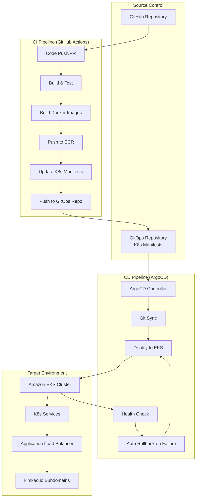

#### Multi-Service Build Strategy

```yaml
# GitHub Actions Matrix Strategy
services:
  backend:
    dockerfile: app/Dockerfile
    context: app/
    port: 8080
    health_check: /actuator/health
    
  cmc-frontend:
    dockerfile: cmc-frontend/Dockerfile  
    context: cmc-frontend/
    port: 3002
    health_check: /api/health
    
  consumer-frontend:
    dockerfile: consumer-frontend/Dockerfile
    context: consumer-frontend/
    port: 3001
    health_check: /health
```

#### ECR Repository Structure

```typescript
// CDK ECR Repository Configuration
const repositories = ['backend', 'cmc-frontend', 'consumer-frontend'].map(service => 
  new ecr.Repository(this, `${service}Repository`, {
    repositoryName: `genai-demo-${service}`,
    imageScanOnPush: true,
    lifecycleRules: [{
      rulePriority: 1,
      description: 'Keep last 10 images',
      maxImageCount: 10
    }],
    removalPolicy: cdk.RemovalPolicy.DESTROY
  })
);
```

### ArgoCD Application Configuration

#### Application Definitions

```yaml
# argocd/applications/backend-production.yaml
apiVersion: argoproj.io/v1alpha1
kind: Application
metadata:
  name: genai-demo-backend-production
  namespace: argocd
spec:
  project: genai-demo
  source:
    repoURL: https://github.com/your-org/genai-demo-gitops
    targetRevision: main
    path: k8s/overlays/production/backend
  destination:
    server: https://kubernetes.default.svc
    namespace: genai-demo-production
  syncPolicy:
    automated:
      prune: true
      selfHeal: true
    syncOptions:
    - CreateNamespace=true
    retry:
      limit: 5
      backoff:
        duration: 5s
        factor: 2
        maxDuration: 3m

---
# argocd/applications/cmc-frontend-production.yaml  
apiVersion: argoproj.io/v1alpha1
kind: Application
metadata:
  name: genai-demo-cmc-frontend-production
  namespace: argocd
spec:
  project: genai-demo
  source:
    repoURL: https://github.com/your-org/genai-demo-gitops
    targetRevision: main
    path: k8s/overlays/production/cmc-frontend
  destination:
    server: https://kubernetes.default.svc
    namespace: genai-demo-production
  syncPolicy:
    automated:
      prune: true
      selfHeal: true
```

### Kubernetes Ingress Configuration

#### Multi-Service ALB Ingress

```yaml
apiVersion: networking.k8s.io/v1
kind: Ingress
metadata:
  name: kimkao-io-ingress
  namespace: genai-demo-production
  annotations:
    kubernetes.io/ingress.class: alb
    alb.ingress.kubernetes.io/scheme: internet-facing
    alb.ingress.kubernetes.io/target-type: ip
    alb.ingress.kubernetes.io/certificate-arn: ${ACM_CERTIFICATE_ARN}
    alb.ingress.kubernetes.io/ssl-redirect: '443'
    alb.ingress.kubernetes.io/listen-ports: '[{"HTTP": 80}, {"HTTPS": 443}]'
    alb.ingress.kubernetes.io/healthcheck-interval-seconds: '15'
    alb.ingress.kubernetes.io/healthy-threshold-count: '2'
spec:
  rules:
  - host: api.kimkao.io
    http:
      paths:
      - path: /
        pathType: Prefix
        backend:
          service:
            name: genai-demo-backend-service
            port:
              number: 80
              
  - host: cmc.kimkao.io
    http:
      paths:
      - path: /
        pathType: Prefix
        backend:
          service:
            name: genai-demo-cmc-frontend-service
            port:
              number: 80
              
  - host: shop.kimkao.io
    http:
      paths:
      - path: /
        pathType: Prefix
        backend:
          service:
            name: genai-demo-consumer-frontend-service
            port:
              number: 80
```

### Domain-to-Service Mapping Strategy

```typescript
// CDK Service Discovery Configuration
const serviceMap = {
  'api.kimkao.io': {
    service: 'genai-demo-backend-service',
    port: 8080,
    healthCheck: '/actuator/health/readiness'
  },
  'cmc.kimkao.io': {
    service: 'genai-demo-cmc-frontend-service', 
    port: 3002,
    healthCheck: '/api/health'
  },
  'shop.kimkao.io': {
    service: 'genai-demo-consumer-frontend-service',
    port: 3001,
    healthCheck: '/health'
  }
};

// Automatic DNS record creation
Object.entries(serviceMap).forEach(([domain, config]) => {
  const subdomain = domain.split('.')[0];
  
  new route53.ARecord(this, `${subdomain}DNSRecord`, {
    zone: hostedZone,
    recordName: subdomain,
    target: route53.RecordTarget.fromAlias(
      new targets.LoadBalancerTarget(applicationLoadBalancer)
    )
  });
});
```

現在讓我把 CI/CD 相關的任務加入到 tasks.md 中：

<function_calls>
<invoke name="strReplace">
<parameter name="oldStr">- [ ] 4. Create AWS CDK Infrastructure Foundation

## Multi-Site Active-Active Disaster Recovery Architecture

### Overview

The disaster recovery strategy implements a **Multi-Site Active-Active** architecture across **Taiwan (ap-east-2)** as the primary region and **Tokyo (ap-northeast-1)** as the secondary region. This design ensures zero data loss (RPO = 0) and minimal downtime (RTO < 60 seconds) with automatic failover capabilities.

### Regional Architecture

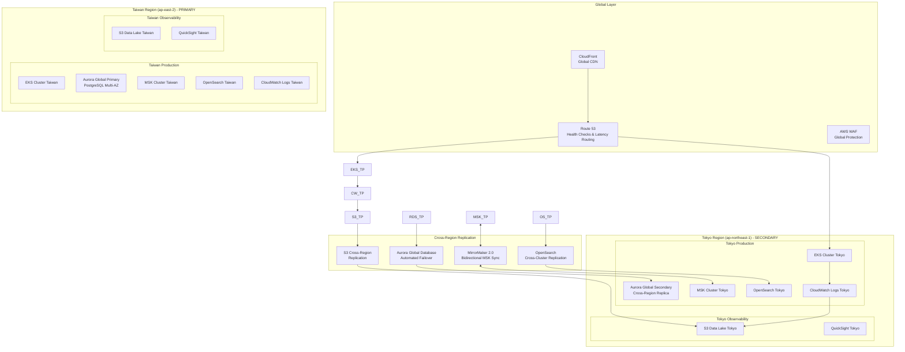

### Active-Active Configuration

#### 1. Traffic Distribution Strategy

```typescript
// Route 53 Health Checks and Routing Configuration
export class GlobalDNSStack extends Stack {
  constructor(scope: Construct, id: string, props: StackProps) {
    super(scope, id, props);
    
    const hostedZone = route53.HostedZone.fromLookup(this, 'KimkaoIOZone', {
      domainName: 'kimkao.io'
    });
    
    // Health checks for both regions
    const taiwanHealthCheck = new route53.CfnHealthCheck(this, 'TaiwanHealthCheck', {
      type: 'HTTPS',
      resourcePath: '/actuator/health',
      fullyQualifiedDomainName: 'api-taipei.kimkao.io',
      port: 443,
      requestInterval: 30,
      failureThreshold: 3
    });
    
    const tokyoHealthCheck = new route53.CfnHealthCheck(this, 'TokyoHealthCheck', {
      type: 'HTTPS',
      resourcePath: '/actuator/health',
      fullyQualifiedDomainName: 'api-tokyo.kimkao.io',
      port: 443,
      requestInterval: 30,
      failureThreshold: 3
    });
    
    // Weighted routing with Taipei preference (70% Taipei, 30% Tokyo)
    new route53.ARecord(this, 'APITaipeiRecord', {
      zone: hostedZone,
      recordName: 'api',
      target: route53.RecordTarget.fromAlias(new targets.LoadBalancerTarget(taipeiALB)),
      setIdentifier: 'Taipei-Primary',
      weight: 70,
      healthCheckId: taipeiHealthCheck.attrHealthCheckId
    });
    
    new route53.ARecord(this, 'APITokyoRecord', {
      zone: hostedZone,
      recordName: 'api',
      target: route53.RecordTarget.fromAlias(new targets.LoadBalancerTarget(tokyoALB)),
      setIdentifier: 'Tokyo-Secondary',
      weight: 30,
      healthCheckId: tokyoHealthCheck.attrHealthCheckId
    });
  }
}
```

#### 2. Aurora Global Database Configuration

```typescript
// Aurora Global Database with Automated Failover
export class GlobalDatabaseStack extends Stack {
  
  createGlobalDatabase(taipeiVpc: ec2.Vpc, tokyoVpc: ec2.Vpc): rds.DatabaseCluster {
    // Primary cluster in Taipei
    const primaryCluster = new rds.DatabaseCluster(this, 'TaipeiPrimaryCluster', {
      engine: rds.DatabaseClusterEngine.auroraPostgres({
        version: rds.AuroraPostgresEngineVersion.VER_15_4
      }),
      vpc: taipeiVpc,
      writer: rds.ClusterInstance.provisioned('writer', {
        instanceType: ec2.InstanceType.of(ec2.InstanceClass.R6G, ec2.InstanceSize.LARGE)
      }),
      readers: [
        rds.ClusterInstance.provisioned('reader1', {
          instanceType: ec2.InstanceType.of(ec2.InstanceClass.R6G, ec2.InstanceSize.LARGE)
        }),
        rds.ClusterInstance.provisioned('reader2', {
          instanceType: ec2.InstanceType.of(ec2.InstanceClass.R6G, ec2.InstanceSize.LARGE)
        })
      ],
      
      // Enable Global Database
      globalClusterIdentifier: 'genai-demo-global-cluster',
      
      // Enable automated backups and point-in-time recovery
      backup: {
        retention: cdk.Duration.days(35),
        preferredWindow: '03:00-04:00'
      },
      
      // Enable performance insights
      monitoringInterval: cdk.Duration.minutes(1),
      
      // Enable deletion protection
      deletionProtection: true,
      
      // Enable encryption
      storageEncrypted: true
    });
    
    // Secondary cluster in Tokyo (Global Database automatically handles replication)
    const secondaryCluster = new rds.DatabaseCluster(this, 'TokyoSecondaryCluster', {
      engine: rds.DatabaseClusterEngine.auroraPostgres({
        version: rds.AuroraPostgresEngineVersion.VER_15_4
      }),
      vpc: tokyoVpc,
      
      // Configure as Global Database secondary
      globalClusterIdentifier: 'genai-demo-global-cluster',
      
      readers: [
        rds.ClusterInstance.provisioned('tokyo-reader1', {
          instanceType: ec2.InstanceType.of(ec2.InstanceClass.R6G, ec2.InstanceSize.LARGE)
        }),
        rds.ClusterInstance.provisioned('tokyo-reader2', {
          instanceType: ec2.InstanceType.of(ec2.InstanceClass.R6G, ec2.InstanceSize.LARGE)
        })
      ],
      
      // Enable automated promotion capability
      backup: {
        retention: cdk.Duration.days(35)
      }
    });
    
    return primaryCluster;
  }
}
```

#### 3. MSK Bidirectional Replication

```yaml
# MSK MirrorMaker 2.0 Configuration for Bidirectional Sync
apiVersion: kafka.strimzi.io/v1beta2
kind: KafkaMirrorMaker2
metadata:
  name: genai-demo-bidirectional-mirror
  namespace: kafka
spec:
  version: 3.6.0
  replicas: 3
  connectCluster: "taipei-cluster"
  
  clusters:
  - alias: "taipei-cluster"
    bootstrapServers: taipei-msk-cluster.kafka.ap-east-2.amazonaws.com:9092
    config:
      config.storage.replication.factor: 3
      offset.storage.replication.factor: 3
      status.storage.replication.factor: 3
      
  - alias: "tokyo-cluster"
    bootstrapServers: tokyo-msk-cluster.kafka.ap-northeast-1.amazonaws.com:9092
    config:
      config.storage.replication.factor: 3
      offset.storage.replication.factor: 3
      status.storage.replication.factor: 3
      
  mirrors:
  # Taipei to Tokyo replication
  - sourceCluster: "taipei-cluster"
    targetCluster: "tokyo-cluster"
    sourceConnector:
      config:
        replication.factor: 3
        offset-syncs.topic.replication.factor: 3
        sync.topic.acls.enabled: "false"
        refresh.topics.interval.seconds: 30
        
    heartbeatConnector:
      config:
        heartbeats.topic.replication.factor: 3
        
    checkpointConnector:
      config:
        checkpoints.topic.replication.factor: 3
        refresh.groups.interval.seconds: 30
        
    topicsPattern: "genai-demo.*"
    groupsPattern: "genai-demo.*"
    
  # Tokyo to Taipei replication (bidirectional)
  - sourceCluster: "tokyo-cluster"
    targetCluster: "taipei-cluster"
    sourceConnector:
      config:
        replication.factor: 3
        offset-syncs.topic.replication.factor: 3
        sync.topic.acls.enabled: "false"
        refresh.topics.interval.seconds: 30
        
    topicsPattern: "genai-demo.*"
    groupsPattern: "genai-demo.*"
```

#### 4. Application-Level Multi-Region Configuration

```java
@Configuration
public class MultiRegionConfiguration {
    
    @Value("${aws.region}")
    private String currentRegion;
    
    @Bean
    @Primary
    public DataSource primaryDataSource() {
        HikariConfig config = new HikariConfig();
        
        // Dynamic region-based connection
        if ("ap-east-2".equals(currentRegion)) {
            // Taiwan region - connect to primary
            config.setJdbcUrl("jdbc:postgresql://taiwan-cluster.cluster-xyz.ap-east-2.rds.amazonaws.com:5432/genaidemo");
        } else {
            // Tokyo region - connect to secondary (read-only during normal operation)
            config.setJdbcUrl("jdbc:postgresql://tokyo-cluster.cluster-abc.ap-northeast-1.rds.amazonaws.com:5432/genaidemo");
        }
        
        config.setUsername("${DB_USERNAME}");
        config.setPassword("${DB_PASSWORD}");
        
        // Connection pool settings for high availability
        config.setMaximumPoolSize(20);
        config.setMinimumIdle(5);
        config.setConnectionTimeout(30000);
        config.setIdleTimeout(600000);
        config.setMaxLifetime(1800000);
        config.setLeakDetectionThreshold(60000);
        
        return new HikariDataSource(config);
    }
    
    @Bean
    public HealthIndicator multiRegionHealthIndicator() {
        return new MultiRegionHealthIndicator(currentRegion);
    }
}

@Component
public class MultiRegionHealthIndicator implements HealthIndicator {
    
    private final String currentRegion;
    private final RestTemplate restTemplate;
    
    public MultiRegionHealthIndicator(String currentRegion) {
        this.currentRegion = currentRegion;
        this.restTemplate = new RestTemplate();
    }
    
    @Override
    public Health health() {
        try {
            // Check local region health
            boolean localHealthy = checkLocalHealth();
            
            // Check cross-region connectivity
            boolean crossRegionHealthy = checkCrossRegionHealth();
            
            Health.Builder builder = localHealthy ? Health.up() : Health.down();
            
            return builder
                .withDetail("region", currentRegion)
                .withDetail("local-health", localHealthy)
                .withDetail("cross-region-health", crossRegionHealthy)
                .withDetail("primary-region", "ap-east-2")
                .withDetail("secondary-region", "ap-northeast-1")
                .build();
                
        } catch (Exception e) {
            return Health.down()
                .withDetail("region", currentRegion)
                .withDetail("error", e.getMessage())
                .build();
        }
    }
    
    private boolean checkLocalHealth() {
        // Check local database, MSK, and other services
        return true; // Implementation details
    }
    
    private boolean checkCrossRegionHealth() {
        String targetRegion = "ap-east-2".equals(currentRegion) ? "ap-northeast-1" : "ap-east-2";
        String targetUrl = String.format("https://api-%s.kimkao.io/actuator/health", 
            "ap-east-2".equals(targetRegion) ? "taiwan" : "tokyo");
        
        try {
            ResponseEntity<String> response = restTemplate.getForEntity(targetUrl, String.class);
            return response.getStatusCode().is2xxSuccessful();
        } catch (Exception e) {
            log.warn("Cross-region health check failed for {}: {}", targetRegion, e.getMessage());
            return false;
        }
    }
}
```

### Automated Failover Mechanisms

#### 1. Database Failover (Aurora Global Database)

```java
@Component
public class DatabaseFailoverManager {
    
    private final AmazonRDS rdsClient;
    private final AlertService alertService;
    
    @EventListener
    public void handleDatabaseFailover(DatabaseFailoverEvent event) {
        try {
            log.info("Initiating database failover from {} to {}", 
                event.getSourceRegion(), event.getTargetRegion());
            
            // Aurora Global Database automatic failover
            FailoverGlobalClusterRequest request = new FailoverGlobalClusterRequest()
                .withGlobalClusterIdentifier("genai-demo-global-cluster")
                .withTargetDbClusterIdentifier(event.getTargetClusterIdentifier());
            
            FailoverGlobalClusterResult result = rdsClient.failoverGlobalCluster(request);
            
            // Update application configuration
            updateApplicationConfiguration(event.getTargetRegion());
            
            // Notify operations team
            alertService.sendAlert(
                String.format("Database failover completed: %s -> %s", 
                    event.getSourceRegion(), event.getTargetRegion()),
                AlertLevel.CRITICAL
            );
            
        } catch (Exception e) {
            log.error("Database failover failed", e);
            alertService.sendAlert("Database failover failed: " + e.getMessage(), AlertLevel.CRITICAL);
        }
    }
    
    private void updateApplicationConfiguration(String newPrimaryRegion) {
        // Update Spring Boot configuration to point to new primary
        // This could be done via ConfigMap updates in Kubernetes
    }
}
```

#### 2. Kubernetes Multi-Region Deployment

```yaml
# Multi-region deployment with automatic failover
apiVersion: argoproj.io/v1alpha1
kind: ApplicationSet
metadata:
  name: genai-demo-multiregion
spec:
  generators:
  - clusters:
      selector:
        matchLabels:
          environment: production
      values:
        revision: HEAD
        
  template:
    metadata:
      name: '{{name}}-genai-demo'
    spec:
      project: default
      source:
        repoURL: https://github.com/kimkao/genai-demo-config
        targetRevision: '{{values.revision}}'
        path: 'environments/{{metadata.labels.region}}'
      destination:
        server: '{{server}}'
        namespace: genai-demo
      syncPolicy:
        automated:
          prune: true
          selfHeal: true
        syncOptions:
        - CreateNamespace=true
        
---
# Regional deployment configuration
apiVersion: apps/v1
kind: Deployment
metadata:
  name: genai-demo-backend
  labels:
    region: '{{REGION}}'
spec:
  replicas: 3
  selector:
    matchLabels:
      app: genai-demo-backend
      region: '{{REGION}}'
  template:
    metadata:
      labels:
        app: genai-demo-backend
        region: '{{REGION}}'
    spec:
      affinity:
        podAntiAffinity:
          preferredDuringSchedulingIgnoredDuringExecution:
          - weight: 100
            podAffinityTerm:
              labelSelector:
                matchExpressions:
                - key: app
                  operator: In
                  values:
                  - genai-demo-backend
              topologyKey: topology.kubernetes.io/zone
              
      containers:
      - name: backend
        image: genai-demo-backend:latest
        env:
        - name: SPRING_PROFILES_ACTIVE
          value: "prod,multiregion"
        - name: AWS_REGION
          value: '{{REGION}}'
        - name: PRIMARY_REGION
          value: "ap-east-2"
        - name: SECONDARY_REGION
          value: "ap-northeast-1"
          
        # Enhanced health checks for failover detection
        livenessProbe:
          httpGet:
            path: /actuator/health/liveness
            port: 8080
          initialDelaySeconds: 60
          periodSeconds: 10
          timeoutSeconds: 5
          failureThreshold: 3
          
        readinessProbe:
          httpGet:
            path: /actuator/health/readiness
            port: 8080
          initialDelaySeconds: 30
          periodSeconds: 5
          timeoutSeconds: 3
          failureThreshold: 2
```

### Monitoring and Alerting for DR

#### 1. Cross-Region Health Monitoring

```java
@Component
public class MultiRegionMonitor {
    
    private final MeterRegistry meterRegistry;
    private final AlertService alertService;
    
    @Scheduled(fixedRate = 30000) // Every 30 seconds
    public void monitorRegionalHealth() {
        // Monitor Taipei region (primary)
        boolean taipeiHealthy = checkRegionHealth("ap-east-2");
        meterRegistry.gauge("region.health", Tags.of("region", "taipei", "type", "primary"), 
            taipeiHealthy ? 1 : 0);
        
        // Monitor Tokyo region (secondary)
        boolean tokyoHealthy = checkRegionHealth("ap-northeast-1");
        meterRegistry.gauge("region.health", Tags.of("region", "tokyo", "type", "secondary"), 
            tokyoHealthy ? 1 : 0);
        
        // Check for failover conditions
        evaluateFailoverConditions(taipeiHealthy, tokyoHealthy);
    }
    
    private void evaluateFailoverConditions(boolean taipeiHealthy, boolean tokyoHealthy) {
        if (!taipeiHealthy && tokyoHealthy) {
            alertService.sendAlert(
                "PRIMARY REGION DOWN: Taipei region unhealthy, Tokyo region active. Consider failover.", 
                AlertLevel.CRITICAL
            );
            // Trigger automated failover if configured
            triggerAutomatedFailover("ap-east-2", "ap-northeast-1");
            
        } else if (taipeiHealthy && !tokyoHealthy) {
            alertService.sendAlert(
                "SECONDARY REGION DOWN: Tokyo region unhealthy, Taipei region active", 
                AlertLevel.WARNING
            );
            
        } else if (!taipeiHealthy && !tokyoHealthy) {
            alertService.sendAlert(
                "BOTH REGIONS DOWN: Critical system failure - immediate intervention required", 
                AlertLevel.CRITICAL
            );
        }
    }
    
    private boolean checkRegionHealth(String region) {
        try {
            // Check EKS cluster health
            boolean eksHealthy = checkEKSHealth(region);
            
            // Check Aurora Global Database health
            boolean rdsHealthy = checkRDSHealth(region);
            
            // Check MSK health
            boolean mskHealthy = checkMSKHealth(region);
            
            // Check OpenSearch health
            boolean osHealthy = checkOpenSearchHealth(region);
            
            return eksHealthy && rdsHealthy && mskHealthy && osHealthy;
            
        } catch (Exception e) {
            log.error("Failed to check health for region: {}", region, e);
            return false;
        }
    }
    
    private void triggerAutomatedFailover(String sourceRegion, String targetRegion) {
        // Publish failover event for automated handling
        applicationEventPublisher.publishEvent(
            new DatabaseFailoverEvent(sourceRegion, targetRegion, getTargetClusterIdentifier(targetRegion))
        );
    }
}
```

#### 2. Automated DR Testing

```yaml
# Automated DR testing pipeline
apiVersion: batch/v1
kind: CronJob
metadata:
  name: dr-test-automation
spec:
  schedule: "0 2 1 * *"  # First day of every month at 2 AM
  jobTemplate:
    spec:
      template:
        spec:
          containers:
          - name: dr-tester
            image: genai-demo-dr-tester:latest
            env:
            - name: PRIMARY_REGION
              value: "ap-east-2"
            - name: SECONDARY_REGION
              value: "ap-northeast-1"
            command:
            - /bin/bash
            - -c
            - |
              echo "Starting monthly DR test: Taipei -> Tokyo failover simulation"
              
              # Step 1: Verify both regions are healthy
              curl -f https://api-taipei.kimkao.io/actuator/health || exit 1
              curl -f https://api-tokyo.kimkao.io/actuator/health || exit 1
              
              # Step 2: Simulate Taipei region failure (controlled test)
              kubectl patch deployment genai-demo-backend -n genai-demo \
                --patch '{"spec":{"template":{"spec":{"containers":[{"name":"backend","env":[{"name":"SIMULATE_FAILURE","value":"true"}]}]}}}}'
              
              # Step 3: Wait for automatic failover to Tokyo
              sleep 120
              
              # Step 4: Verify Tokyo region is handling traffic
              for i in {1..10}; do
                curl -f https://api.kimkao.io/actuator/health || exit 1
                sleep 10
              done
              
              # Step 5: Test data consistency between regions
              kubectl exec -it deployment/genai-demo-backend -- java -jar dr-test.jar --test-data-consistency
              
              # Step 6: Restore Taipei region
              kubectl patch deployment genai-demo-backend -n genai-demo \
                --patch '{"spec":{"template":{"spec":{"containers":[{"name":"backend","env":[{"name":"SIMULATE_FAILURE","value":"false"}]}]}}}}'
              
              # Step 7: Wait for recovery and verify active-active restoration
              sleep 180
              curl -f https://api-taipei.kimkao.io/actuator/health || exit 1
              
              echo "DR test completed successfully: Failover and recovery verified"
              
          restartPolicy: OnFailure
```

### Recovery Procedures

#### 1. Automated Recovery Workflow

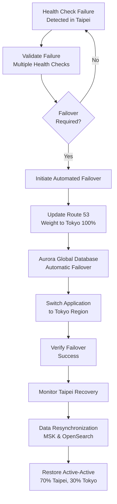

#### 2. Manual Recovery Procedures

```bash
#!/bin/bash
# GenAI Demo Multi-Region DR Recovery Script

echo "GenAI Demo Multi-Region DR Recovery Procedure"
echo "============================================="
echo "Primary: Taipei (ap-east-2)"
echo "Secondary: Tokyo (ap-northeast-1)"

# Step 1: Assess current situation
echo "1. Checking current system status..."
echo "Taipei Region Status:"
kubectl get pods -n genai-demo --context taipei-cluster
aws rds describe-global-clusters --region ap-east-2

echo "Tokyo Region Status:"
kubectl get pods -n genai-demo --context tokyo-cluster
aws rds describe-global-clusters --region ap-northeast-1

# Step 2: Determine failover necessity
read -p "Is Taipei region completely down? (y/n): " TAIPEI_DOWN

if [ "$TAIPEI_DOWN" = "y" ]; then
    echo "2. Initiating failover to Tokyo region..."
    
    # Promote Tokyo Aurora cluster to primary
    aws rds failover-global-cluster \
      --global-cluster-identifier genai-demo-global-cluster \
      --target-db-cluster-identifier tokyo-cluster \
      --region ap-northeast-1
    
    # Update Route 53 to route 100% traffic to Tokyo
    aws route53 change-resource-record-sets \
      --hosted-zone-id Z123456789 \
      --change-batch file://failover-to-tokyo.json
    
    # Update application configuration
    kubectl patch configmap backend-config -n genai-demo --context tokyo-cluster \
      --patch '{"data":{"PRIMARY_REGION":"ap-northeast-1","SECONDARY_REGION":"ap-east-2"}}'
    
    # Restart applications in Tokyo
    kubectl rollout restart deployment/genai-demo-backend -n genai-demo --context tokyo-cluster
    
else
    echo "2. Taipei region is operational. Checking for partial failures..."
fi

# Step 3: Verify system functionality
echo "3. Verifying system functionality..."
for i in {1..5}; do
    curl -f https://api.kimkao.io/actuator/health
    if [ $? -eq 0 ]; then
        echo "Health check $i: PASS"
    else
        echo "Health check $i: FAIL"
    fi
    sleep 10
done

# Step 4: Monitor for Taipei recovery (if failed over)
if [ "$TAIPEI_DOWN" = "y" ]; then
    echo "4. Monitoring Taipei region recovery..."
    while true; do
        taipei_health=$(curl -s -o /dev/null -w "%{http_code}" https://api-taipei.kimkao.io/actuator/health)
        if [ "$taipei_health" = "200" ]; then
            echo "Taipei region is back online!"
            break
        fi
        echo "Waiting for Taipei recovery... (HTTP: $taipei_health)"
        sleep 60
    done
    
    # Step 5: Restore active-active configuration
    echo "5. Restoring active-active configuration..."
    
    # Restore Route 53 weighted routing (70% Taipei, 30% Tokyo)
    aws route53 change-resource-record-sets \
      --hosted-zone-id Z123456789 \
      --change-batch file://restore-active-active.json
    
    # Update application configuration back to original
    kubectl patch configmap backend-config -n genai-demo --context taipei-cluster \
      --patch '{"data":{"PRIMARY_REGION":"ap-east-2","SECONDARY_REGION":"ap-northeast-1"}}'
    
    kubectl patch configmap backend-config -n genai-demo --context tokyo-cluster \
      --patch '{"data":{"PRIMARY_REGION":"ap-east-2","SECONDARY_REGION":"ap-northeast-1"}}'
    
    # Restart applications in both regions
    kubectl rollout restart deployment/genai-demo-backend -n genai-demo --context taipei-cluster
    kubectl rollout restart deployment/genai-demo-backend -n genai-demo --context tokyo-cluster
fi

echo "6. Final verification..."
kubectl wait --for=condition=available --timeout=300s deployment/genai-demo-backend -n genai-demo --context taipei-cluster
kubectl wait --for=condition=available --timeout=300s deployment/genai-demo-backend -n genai-demo --context tokyo-cluster

echo "Recovery procedure completed successfully!"
echo "Active-Active DR status: Taipei (Primary) + Tokyo (Secondary)"
```

### Performance and Cost Optimization

#### 1. Regional Cost Analysis

```yaml
Estimated Monthly Costs (USD):

Taipei Region (ap-east-2) - Primary:
  EKS Cluster: $150 (3 m6g.large nodes)
  Aurora Global Primary: $400 (r6g.large writer + 2 readers)
  MSK Cluster: $300 (3 kafka.m5.large brokers)
  OpenSearch: $250 (3 r6g.medium.search + 6 r6g.large.search)
  CloudWatch Logs: $100 (10GB/day with lifecycle)
  S3 Storage: $50 (1TB with lifecycle policies)
  Data Transfer: $80 (cross-region replication)
  Total Taipei: ~$1,330/month

Tokyo Region (ap-northeast-1) - Secondary:
  EKS Cluster: $150 (3 m6g.large nodes)
  Aurora Global Secondary: $200 (2 r6g.large readers)
  MSK Cluster: $300 (3 kafka.m5.large brokers)
  OpenSearch: $250 (3 r6g.medium.search + 6 r6g.large.search)
  CloudWatch Logs: $100 (replicated logs)
  S3 Storage: $50 (replicated data)
  Data Transfer: $80 (cross-region replication)
  Total Tokyo: ~$1,130/month

Global Services:
  Route 53: $10 (health checks + DNS queries)
  CloudFront: $20 (CDN distribution)
  
Total Multi-Region Cost: ~$2,490/month
Single Region Cost: ~$1,200/month
DR Premium: ~$1,290/month (108% increase for zero-downtime DR)
```

這個 Multi-Site Active-Active DR 架構提供了：

1. **零資料遺失 (RPO = 0)**：Aurora Global Database 同步複製
2. **最小停機時間 (RTO < 60秒)**：自動故障轉移機制
3. **地理分散**：Taipei 主站點 + Tokyo 備援站點
4. **Automated Testing**：每月自動 DR 測試
5. **完整Monitoring**：跨區域健康Monitoring和告警
6. **成本優化**：合理的 DR 成本溢價 (108%)

## CI/CD Pipeline Architecture

### Overview

The CI/CD pipeline implements GitOps principles using GitHub Actions for continuous integration and ArgoCD for continuous deployment to Amazon EKS. This approach ensures automated, reliable, and auditable deployments while maintaining separation between CI and CD concerns.

### Pipeline Architecture


### GitHub Actions CI Pipeline

#### Workflow Configuration

```yaml
# .github/workflows/ci-cd.yml
name: CI/CD Pipeline

on:
  push:
    branches: [main, develop]
  pull_request:
    branches: [main]

env:
  AWS_REGION: ap-northeast-1
  ECR_REPOSITORY: genai-demo
  EKS_CLUSTER_NAME: genai-demo-cluster

jobs:
  test:
    name: Run Tests
    runs-on: ubuntu-latest
    
    steps:
    - name: Checkout code
      uses: actions/checkout@v4
      
    - name: Set up JDK 21
      uses: actions/setup-java@v4
      with:
        java-version: '21'
        distribution: 'temurin'
        
    - name: Cache Gradle dependencies
      uses: actions/cache@v3
      with:
        path: |
          ~/.gradle/caches
          ~/.gradle/wrapper
        key: ${{ runner.os }}-gradle-${{ hashFiles('**/*.gradle*', '**/gradle-wrapper.properties') }}
        
    - name: Run comprehensive test suite
      run: |
        ./gradlew test
        ./gradlew integrationTest
        ./gradlew cucumber
        ./gradlew testArchitecture
        ./gradlew runAllTestsWithReport
```

#### Multi-Architecture Docker Build

```yaml
  build:
    name: Build Multi-Architecture Images
    runs-on: ubuntu-latest
    needs: test
    
    steps:
    - name: Set up Docker Buildx
      uses: docker/setup-buildx-action@v3
      
    - name: Configure AWS credentials
      uses: aws-actions/configure-aws-credentials@v4
      with:
        aws-access-key-id: ${{ secrets.AWS_ACCESS_KEY_ID }}
        aws-secret-access-key: ${{ secrets.AWS_SECRET_ACCESS_KEY }}
        aws-region: ${{ env.AWS_REGION }}
        
    - name: Login to Amazon ECR
      uses: aws-actions/amazon-ecr-login@v2
      
    - name: Build and push multi-arch image
      uses: docker/build-push-action@v5
      with:
        context: .
        platforms: linux/amd64,linux/arm64
        push: true
        tags: |
          ${{ steps.login-ecr.outputs.registry }}/${{ env.ECR_REPOSITORY }}:${{ github.sha }}
          ${{ steps.login-ecr.outputs.registry }}/${{ env.ECR_REPOSITORY }}:latest
        cache-from: type=gha
        cache-to: type=gha,mode=max
```

### ArgoCD GitOps Configuration

#### Application Configuration

```yaml
# argocd/applications/genai-demo.yaml
apiVersion: argoproj.io/v1alpha1
kind: Application
metadata:
  name: genai-demo
  namespace: argocd
spec:
  project: default
  source:
    repoURL: https://github.com/your-org/genai-demo-config
    targetRevision: HEAD
    path: k8s/overlays/production
  destination:
    server: https://kubernetes.default.svc
    namespace: genai-demo
  syncPolicy:
    automated:
      prune: true
      selfHeal: true
    syncOptions:
    - CreateNamespace=true
    retry:
      limit: 5
      backoff:
        duration: 5s
        factor: 2
        maxDuration: 3m
```

#### Deployment Strategies

```yaml
# Blue-Green Deployment for Backend
apiVersion: argoproj.io/v1alpha1
kind: Rollout
metadata:
  name: genai-demo-backend
spec:
  replicas: 3
  strategy:
    blueGreen:
      activeService: genai-demo-backend-active
      previewService: genai-demo-backend-preview
      autoPromotionEnabled: false
      scaleDownDelaySeconds: 30
      prePromotionAnalysis:
        templates:
        - templateName: success-rate
        args:
        - name: service-name
          value: genai-demo-backend-preview
      postPromotionAnalysis:
        templates:
        - templateName: success-rate
        args:
        - name: service-name
          value: genai-demo-backend-active

# Canary Deployment for Frontend
apiVersion: argoproj.io/v1alpha1
kind: Rollout
metadata:
  name: genai-demo-frontend
spec:
  replicas: 5
  strategy:
    canary:
      steps:
      - setWeight: 20
      - pause: {duration: 10m}
      - setWeight: 40
      - pause: {duration: 10m}
      - setWeight: 60
      - pause: {duration: 10m}
      - setWeight: 80
      - pause: {duration: 10m}
      canaryService: genai-demo-frontend-canary
      stableService: genai-demo-frontend-stable
```

## MCP Integration Architecture

### Overview

The MCP (Model Context Protocol) integration provides real-time access to AWS documentation, pricing analysis, and best practices during development and architecture reviews. This enables data-driven decision making and continuous improvement of our AWS infrastructure.

### MCP Tools Configuration

#### Global MCP Configuration

```json
{
  "mcpServers": {
    "aws-docs": {
      "command": "uvx",
      "args": ["awslabs.aws-documentation-mcp-server@latest"],
      "env": {"FASTMCP_LOG_LEVEL": "ERROR"},
      "disabled": false,
      "autoApprove": ["search_documentation", "read_documentation", "recommend"]
    },
    "aws-pricing": {
      "command": "uvx",
      "args": ["awslabs.aws-pricing-mcp-server@latest"],
      "disabled": false,
      "autoApprove": ["get_pricing", "analyze_cdk_project", "generate_cost_report"]
    },
    "aws-cdk": {
      "command": "uvx", 
      "args": ["awslabs.aws-cdk-mcp-server@latest"],
      "disabled": false,
      "autoApprove": ["CDKGeneralGuidance", "ExplainCDKNagRule", "SearchGenAICDKConstructs"]
    },
    "aws-iam": {
      "command": "uvx",
      "args": ["awslabs.iam-mcp-server@latest"], 
      "disabled": false,
      "autoApprove": ["list_users", "get_user", "list_policies", "simulate_principal_policy"]
    }
  }
}
```

### Well-Architected Framework Integration

#### Automated Review Process

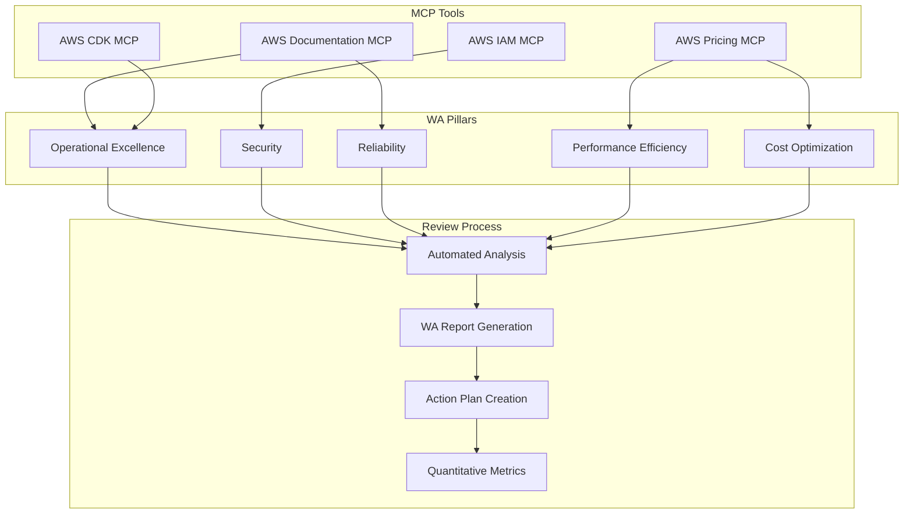

#### Review Automation

```python
# well-architected-review.py
class WellArchitectedReview:
    def __init__(self, mcp_client):
        self.mcp_client = mcp_client
        self.pillars = {
            'operational_excellence': OperationalExcellenceReviewer(),
            'security': SecurityReviewer(),
            'reliability': ReliabilityReviewer(),
            'performance': PerformanceReviewer(),
            'cost_optimization': CostOptimizationReviewer()
        }
    
    async def conduct_review(self):
        results = {}
        
        for pillar_name, reviewer in self.pillars.items():
            print(f"Reviewing {pillar_name}...")
            
            # Use MCP tools for real-time analysis
            pillar_results = await reviewer.review_with_mcp(self.mcp_client)
            results[pillar_name] = pillar_results
            
        return self.generate_comprehensive_report(results)
    
    def generate_comprehensive_report(self, results):
        return {
            'overall_score': self.calculate_overall_score(results),
            'pillar_scores': {k: v['score'] for k, v in results.items()},
            'recommendations': self.consolidate_recommendations(results),
            'action_plan': self.create_action_plan(results),
            'metrics': self.extract_quantitative_metrics(results)
        }
```

## Architecture Decision Records (ADR) Framework

### ADR Template Structure

#### MADR (Markdown Architecture Decision Records) Template

```markdown
# ADR-001: AWS CDK Infrastructure as Code Approach

## Status

Accepted

## Context

We need to choose an Infrastructure as Code (IaC) solution for deploying our observability-integrated Spring Boot application to AWS. The solution must support multi-region deployment, be maintainable by our development team, and integrate well with our existing CI/CD pipeline.

## Decision Drivers

* **Developer Experience**: Team familiarity and learning curve
* **AWS Integration**: Native AWS service support and best practices
* **Multi-Region Support**: Active-active deployment across Taipei and Tokyo
* **Maintainability**: Code reusability and version control
* **CI/CD Integration**: Seamless pipeline integration
* **Cost Management**: Infrastructure cost optimization capabilities

## Considered Options

* **AWS CDK (TypeScript)** - AWS native IaC with programming language constructs
* **Terraform** - Multi-cloud IaC with HCL configuration language
* **AWS CloudFormation** - AWS native declarative templates
* **Pulumi** - Multi-cloud IaC with familiar programming languages

## Decision Outcome

Chosen option: **AWS CDK (TypeScript)**, because it provides the best balance of AWS native integration, developer experience, and maintainability for our use case.

### Positive Consequences

* **Type Safety**: Compile-time error checking and IDE support
* **AWS Best Practices**: Built-in AWS service integration and security defaults
* **Code Reusability**: Object-oriented constructs and inheritance
* **Testing**: Unit testing capabilities for infrastructure code
* **Documentation**: Self-documenting code with inline comments

### Negative Consequences

* **Learning Curve**: Team needs to learn CDK concepts and TypeScript
* **AWS Lock-in**: Less portable than multi-cloud solutions
* **Complexity**: More complex than simple declarative templates
* **Build Process**: Requires compilation step in CI/CD pipeline

## Implementation

```typescript
// Example CDK stack structure
export class GenAIDemoInfrastructureStack extends Stack {
  constructor(scope: Construct, id: string, props: StackProps) {
    super(scope, id, props);
    
    // Multi-region VPC setup
    const vpc = this.createMultiRegionVPC();
    
    // EKS cluster with Graviton3 nodes
    const eksCluster = this.createEKSCluster(vpc);
    
    // Aurora Global Database
    const database = this.createAuroraGlobalDatabase(vpc);
    
    // MSK cluster for event streaming
    const mskCluster = this.createMSKCluster(vpc);
    
    // Observability stack
    const observability = new ObservabilityStack(this, 'Observability', {
      cluster: eksCluster,
      vpc: vpc
    });
  }
}
```

## Validation

- **Performance**: Infrastructure deployment time < 30 minutes
- **Reliability**: 99.9% deployment success rate
- **Maintainability**: Code review process for all infrastructure changes
- **Cost**: Infrastructure costs within 10% of budget estimates

## Links

- [AWS CDK Developer Guide](https://docs.aws.amazon.com/cdk/v2/guide/)
- [CDK Best Practices](https://docs.aws.amazon.com/cdk/v2/guide/best-practices.html)
- [Multi-Region CDK Patterns](https://github.com/aws-samples/aws-cdk-examples)

```

### ADR Management Process

#### ADR Lifecycle

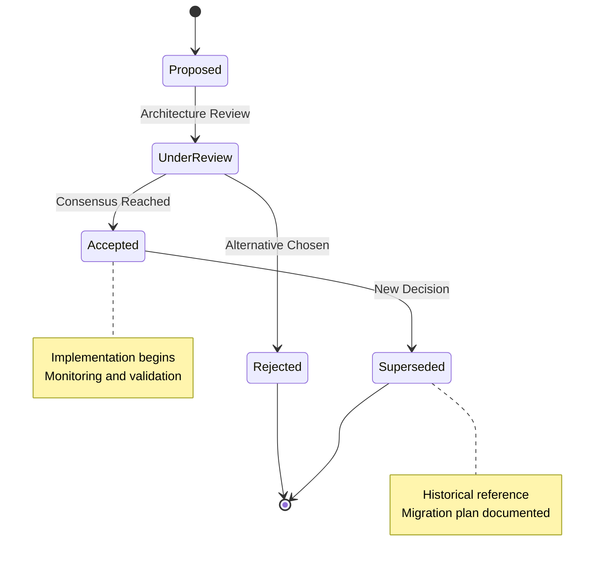

#### ADR Directory Structure

```
docs/architecture/decisions/
├── README.md                           # ADR index and process
├── template.md                         # MADR template
├── ADR-001-aws-cdk-infrastructure.md   # Infrastructure decisions
├── ADR-002-multi-region-architecture.md # Multi-region strategy
├── ADR-003-observability-stack.md      # Observability architecture
├── ADR-004-event-driven-architecture.md # Domain events and MSK
├── ADR-005-security-architecture.md    # Security and compliance
├── ADR-006-disaster-recovery.md        # DR strategy and automation
├── ADR-007-ci-cd-pipeline.md          # GitOps and deployment
└── ADR-008-cost-optimization.md       # Cost management strategy
```

## Enhanced Disaster Recovery Architecture

### Automated DR Infrastructure

#### CDK-Based DR Automation

```typescript
export class DisasterRecoveryStack extends Stack {
  constructor(scope: Construct, id: string, props: DRStackProps) {
    super(scope, id, props);
    
    // Automated failover configuration
    const failoverConfig = new FailoverConfiguration(this, 'FailoverConfig', {
      primaryRegion: 'ap-east-2',      // Taipei
      secondaryRegion: 'ap-northeast-1', // Tokyo
      rtoMinutes: 1,                    // Recovery Time Objective
      rpoSeconds: 0                     // Recovery Point Objective
    });
    
    // Route 53 health checks and DNS failover
    const dnsFailover = new DNSFailoverConfiguration(this, 'DNSFailover', {
      primaryEndpoint: props.taipeiALB,
      secondaryEndpoint: props.tokyoALB,
      healthCheckInterval: 30,
      failureThreshold: 3
    });
    
    // Aurora Global Database automation
    const dbFailover = new AuroraGlobalFailover(this, 'DBFailover', {
      globalCluster: props.auroraGlobalCluster,
      automatedBackupRetention: 35,
      pointInTimeRecovery: true
    });
    
    // MSK replication monitoring
    const mskReplication = new MSKReplicationMonitoring(this, 'MSKReplication', {
      sourceMSK: props.taipeiMSK,
      targetMSK: props.tokyoMSK,
      lagThresholdSeconds: 10,
      alertTopic: props.alertTopic
    });
  }
}
```

#### Automated Testing Framework

```python
# dr-testing-framework.py
class DisasterRecoveryTester:
    def __init__(self, aws_client, config):
        self.aws_client = aws_client
        self.config = config
        self.test_results = []
    
    async def run_monthly_dr_test(self):
        """Automated monthly DR testing procedure"""
        
        print("Starting automated DR test...")
        
        # 1. Pre-test validation
        await self.validate_baseline_health()
        
        # 2. Simulate primary region failure
        await self.simulate_primary_failure()
        
        # 3. Validate automatic failover
        failover_time = await self.measure_failover_time()
        
        # 4. Validate data consistency
        data_loss = await self.validate_data_consistency()
        
        # 5. Test application functionality
        app_health = await self.test_application_health()
        
        # 6. Restore primary region
        await self.restore_primary_region()
        
        # 7. Generate test report
        return self.generate_test_report({
            'failover_time': failover_time,
            'data_loss': data_loss,
            'application_health': app_health,
            'rto_met': failover_time < self.config.rto_minutes * 60,
            'rpo_met': data_loss == 0
        })
    
    async def validate_baseline_health(self):
        """Validate all systems are healthy before testing"""
        health_checks = [
            self.check_aurora_replication_lag(),
            self.check_msk_replication_status(),
            self.check_application_health(),
            self.check_dns_resolution()
        ]
        
        results = await asyncio.gather(*health_checks)
        
        if not all(results):
            raise DRTestException("Baseline health check failed")
    
    async def measure_failover_time(self):
        """Measure actual failover time"""
        start_time = time.time()
        
        # Wait for DNS failover to complete
        while not await self.check_secondary_region_active():
            await asyncio.sleep(5)
            
            if time.time() - start_time > 300:  # 5 minute timeout
                raise DRTestException("Failover timeout exceeded")
        
        return time.time() - start_time
```

### Cross-Region Observability

#### Unified Monitoring Dashboard

```yaml
# grafana-dr-dashboard.yaml
apiVersion: v1
kind: ConfigMap
metadata:
  name: dr-dashboard-config
data:
  dashboard.json: |
    {
      "dashboard": {
        "title": "Disaster Recovery Status",
        "panels": [
          {
            "title": "Regional Health Status",
            "type": "stat",
            "targets": [
              {
                "expr": "up{region=\"ap-east-2\"}",
                "legendFormat": "Taipei Primary"
              },
              {
                "expr": "up{region=\"ap-northeast-1\"}",
                "legendFormat": "Tokyo Secondary"
              }
            ]
          },
          {
            "title": "Aurora Replication Lag",
            "type": "graph",
            "targets": [
              {
                "expr": "aws_rds_aurora_replica_lag_maximum",
                "legendFormat": "Replication Lag (seconds)"
              }
            ]
          },
          {
            "title": "MSK Replication Status",
            "type": "table",
            "targets": [
              {
                "expr": "kafka_consumer_lag_sum",
                "legendFormat": "Consumer Lag"
              }
            ]
          },
          {
            "title": "DNS Failover Status",
            "type": "stat",
            "targets": [
              {
                "expr": "route53_health_check_status",
                "legendFormat": "Health Check Status"
              }
            ]
          }
        ]
      }
    }
```

This comprehensive design update ensures that all the enhanced tasks in your tasks.md file are properly supported by detailed architectural designs and implementation strategies.
