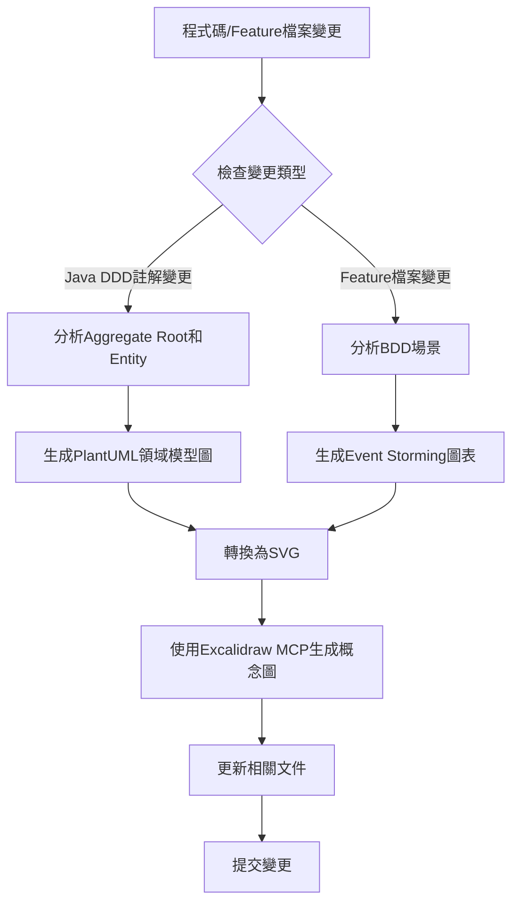
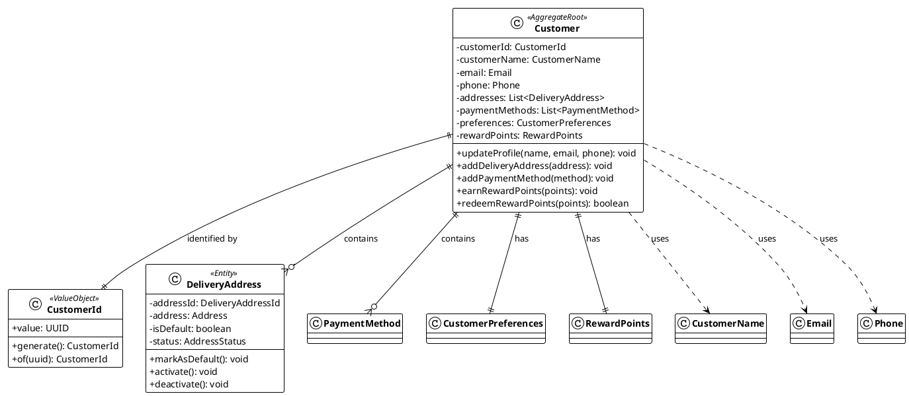
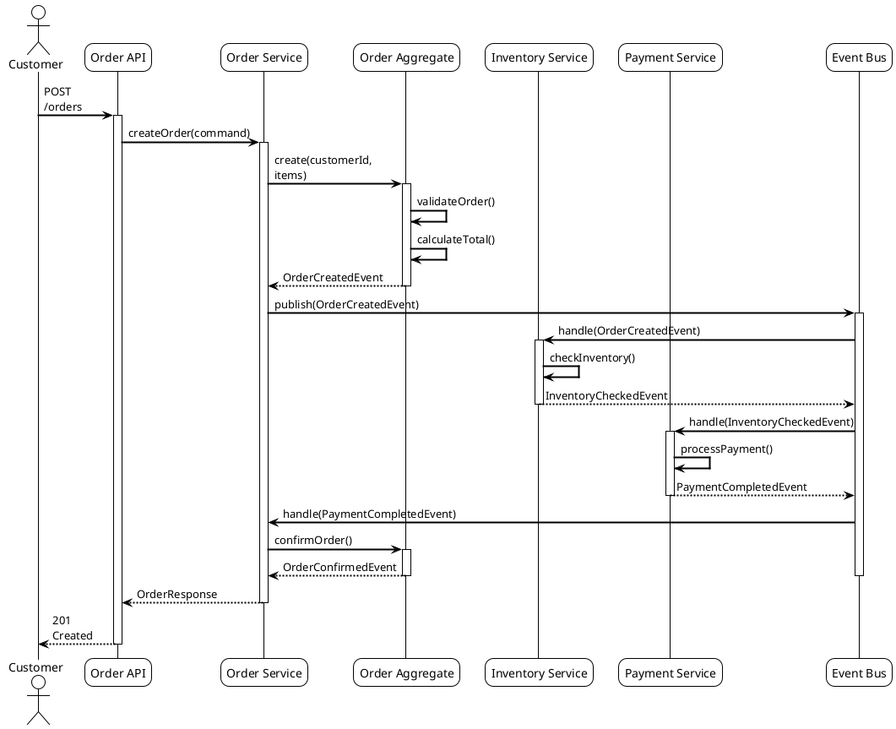

# Design

## Overview

本設計文件詳細規劃如何將現有的文件結構從以 DDD 為中心的組織方式，Refactoring為基於 Rozanski & Woods 的 Viewpoints 和 Perspectives 的系統化架構文件體系。

## 架構

### 根目錄 README.md 重新定位

根目錄的 README.md 將重新定位為：

**專案標題**: "現代軟體架構Best Practice範例專案"  
**副標題**: "基於 Rozanski & Woods 方法論的企業級架構展示"

**核心價值主張**:
- 🏗️ **架構方法論展示**: 完整實現 Rozanski & Woods 的 7 大 Viewpoints 和 8 大 Perspectives
- 🎯 **Best Practice集合**: DDD + Hexagonal Architecture + 事件驅動 + Test-Driven Development (TDD)
- 🤖 **AI 輔助開發**: Model Context Protocol 整合，展示未來開發模式
- 📚 **學習Resource**: 120+ 文件，涵蓋完整的企業級開發標準
- 🧪 **品質工程**: 568 個測試，測試PerformanceMonitoring框架，架構合規驗證

### Design

```
README.md                               # Best Practices
docs/
├── README.md                           # 文件導航中心
├── viewpoints/                         # 七大Architectural Viewpoint
│   ├── README.md                      # Viewpoints 總覽
│   ├── functional/                    # Functional Viewpoint
│   │   ├── README.md
│   │   ├── domain-model.md           # 領域模型 (從 design/ddd-guide.md 遷移)
│   │   ├── bounded-contexts.md       # Bounded Context
│   │   ├── aggregates.md             # Design
│   │   ├── use-cases.md              # 用例分析
│   │   └── interfaces.md             # 介面規格
│   ├── information/                   # Information Viewpoint
│   │   ├── README.md
│   │   ├── data-model.md             # 資料模型
│   │   ├── domain-events.md          # Domain Event (從現有內容整合)
│   │   ├── event-storming.md         # Event Storming 分析
│   │   ├── information-flow.md       # 資訊流
│   │   └── data-consistency.md       # 資料一致性Policy
│   ├── concurrency/                   # Concurrency Viewpoint
│   │   ├── README.md
│   │   ├── async-processing.md       # 非同步處理
│   │   ├── event-driven.md           # Event-Driven Architecture
│   │   ├── transaction-boundaries.md # 交易邊界
│   │   └── concurrency-patterns.md   # 並發模式
│   ├── development/                   # Development Viewpoint
│   │   ├── README.md
│   │   ├── module-structure.md       # 模組結構 (從 architecture/ 遷移)
│   │   ├── hexagonal-architecture.md # Hexagonal Architecture (從 architecture/ 遷移)
│   │   ├── coding-standards.md       # Standards
│   │   ├── testing-strategy.md       # Testing
│   │   └── build-system.md           # 建置系統
│   ├── deployment/                    # Deployment
│   │   ├── README.md
│   │   ├── infrastructure.md         # 基礎設施 (從 deployment/ 遷移)
│   │   ├── containerization.md       # Containerization (從 deployment/ 遷移)
│   │   ├── cloud-architecture.md     # 雲端架構
│   │   ├── environments.md           # Environment配置
│   │   └── deployment-strategies.md  # Deployment
│   └── operational/                   # Operational Viewpoint
│       ├── README.md
│       ├── monitoring.md             # Monitoring (從 observability/ 遷移)
│       ├── logging.md                # Logging
│       ├── maintenance.md            # Maintenance
│       ├── troubleshooting.md        # Troubleshooting
│       └── sre-practices.md          # SRE 實踐
├── perspectives/                       # Architectural Perspective (Architectural Perspectives)
│   ├── README.md                      # Perspectives 總覽
│   ├── security/                      # Security Perspective
│   │   ├── README.md
│   │   ├── authentication.md         # 認證
│   │   ├── authorization.md          # 授權
│   │   ├── data-protection.md        # 資料保護
│   │   ├── security-testing.md       # Testing
│   │   └── compliance.md             # 合規性
│   ├── performance/                   # Performance & Scalability Perspective
│   │   ├── README.md
│   │   ├── performance-requirements.md # Requirements
│   │   ├── scalability-patterns.md   # Scalability模式
│   │   ├── caching-strategy.md       # 快取Policy
│   │   ├── database-optimization.md  # Repository優化
│   │   └── load-testing.md           # Testing
│   ├── availability/                  # Availability & Resilience Perspective
│   │   ├── README.md
│   │   ├── fault-tolerance.md        # 容錯
│   │   ├── disaster-recovery.md      # 災難恢復
│   │   ├── circuit-breaker.md        # Circuit Breaker Pattern
│   │   ├── health-checks.md          # Health Check
│   │   └── resilience-patterns.md    # Resilience模式
│   ├── evolution/                     # Evolution Perspective
│   │   ├── README.md
│   │   ├── maintainability.md        # Maintenance
│   │   ├── extensibility.md          # Scalability
│   │   ├── technology-evolution.md   # 技術演進
│   │   ├── refactoring-guide.md      # Guidelines
│   │   └── technical-debt.md         # Technical Debt管理
│   ├── usability/                     # Availability & Resilience Perspective
│   │   ├── README.md
│   │   ├── user-experience.md        # User體驗
│   │   ├── accessibility.md          # Design
│   │   ├── internationalization.md   # 國際化
│   │   └── user-interface-design.md  # Design
│   ├── regulation/                    # Regulation Perspective
│   │   ├── README.md
│   │   ├── compliance-requirements.md # Requirements
│   │   ├── data-governance.md        # 資料治理
│   │   ├── audit-trails.md           # 稽核軌跡
│   │   └── regulatory-reporting.md   # 法規報告
│   ├── location/                      # Location Perspective
│   │   ├── README.md
│   │   ├── geographic-distribution.md # 地理分佈
│   │   ├── data-locality.md          # 資料本地化
│   │   ├── network-topology.md       # 網路拓撲
│   │   └── edge-computing.md         # 邊緣運算
│   └── cost/                          # Cost Perspective
│       ├── README.md
│       ├── cost-optimization.md      # 成本優化
│       ├── resource-efficiency.md    # Resources
│       ├── pricing-models.md         # 定價模式
│       └── budget-management.md      # 預算管理
├── diagrams/                          # Resources
│   ├── README.md
│   ├── viewpoints/                    # 按視點分類的圖表
│   │   ├── functional/
│   │   │   ├── domain-model.mmd      # Mermaid 格式
│   │   │   ├── bounded-contexts.puml # PlantUML 格式
│   │   │   └── use-cases.puml
│   │   ├── information/
│   │   │   ├── data-model.puml
│   │   │   ├── event-storming-big-picture.puml
│   │   │   ├── event-storming-process-level.puml
│   │   │   └── event-storming-design-level.puml
│   │   ├── concurrency/
│   │   │   ├── event-driven-architecture.mmd
│   │   │   └── async-processing.puml
│   │   ├── development/
│   │   │   ├── hexagonal-architecture.mmd
│   │   │   └── module-dependencies.puml
│   │   ├── deployment/
│   │   │   ├── infrastructure.mmd
│   │   │   └── deployment-diagram.puml
│   │   └── operational/
│   │       ├── monitoring-architecture.mmd
│   │       └── observability.puml
│   ├── perspectives/                  # 按觀點分類的圖表
│   │   ├── security/
│   │   │   └── security-architecture.puml
│   │   ├── performance/
│   │   │   └── performance-architecture.mmd
│   │   ├── availability/
│   │   │   └── resilience-patterns.puml
│   │   ├── evolution/
│   │   │   └── evolution-roadmap.mmd
│   │   ├── usability/
│   │   │   └── user-experience-flow.mmd
│   │   ├── regulation/
│   │   │   └── compliance-architecture.puml
│   │   ├── location/
│   │   │   └── geographic-distribution.mmd
│   │   └── cost/
│   │       └── cost-optimization.mmd
│   └── legacy/                        # 保留現有圖表
│       └── [現有圖表檔案]
├── api/                               # API 文件 (保持現有結構)
├── mcp/                               # MCP 整合文件 (保持現有結構)
├── releases/                          # 發布說明 (保持現有結構)
├── reports/                           # 專案報告 (保持現有結構)
└── en/                                # 英文版本 (自動生成)
    └── [對應的英文文件結構]
```

### 內容遷移對應表

| 現有位置 | 新位置 | 說明 |
|---------|--------|------|
| `design/ddd-guide.md` | `viewpoints/functional/domain-model.md` | DDD 領域模型設計 |
| `architecture/hexagonal-architecture.md` | `viewpoints/development/hexagonal-architecture.md` | Hexagonal Architecture實現 |
| `architecture/overview.md` | `viewpoints/functional/README.md` | 整合到Functional Viewpoint概覽 |
| `development/` | `viewpoints/development/` | 開發相關文件 |
| `deployment/` | `viewpoints/deployment/` | Deployment相關文件 |
| `testing/` | `viewpoints/development/testing-strategy.md` | 測試Policy整合 |
| `observability/` | `viewpoints/operational/monitoring.md` | Observability整合 |
| `diagrams/legacy-uml/` | `diagrams/legacy/` | 保留歷史圖表 |

## 組件和介面

### Templates

#### Templates

```markdown
# [Viewpoint Name] 視點

## Overview

[視點的定義和目標]

## Stakeholders

- **Primary Stakeholder**: [角色列表]
- **Secondary Stakeholder**: [角色列表]

## Concerns

1. [Concern1]
2. [Concern2]
3. [Concern3]

## Architectural Elements

### [元素類型1]
[描述]

### [元素類型2]
[描述]

## Quality Attributes考量

### Security Perspective
[Security在此視點的考量]

### Performance & Scalability Perspective
[Performance在此視點的考量]

### Availability & Resilience Perspective
[Availability在此視點的考量]

### Evolution Perspective
[演進性在此視點的考量]

## Related Diagrams

- [圖表1](../diagrams/viewpoints/[viewpoint]/[diagram1].mmd)
- [圖表2](../diagrams/viewpoints/[viewpoint]/[diagram2].puml)

## Relationships with Other Viewpoints

- **[其他視點1]**: [關聯描述]
- **[其他視點2]**: [關聯描述]

## Guidelines

[具體的實現recommendations和Best Practice]

## Standards

[如何驗證此視點的實現品質]
```

#### Templates

```markdown
# [Perspective Name] 觀點

## Overview

[觀點的定義和重要性]

## Quality Attributes

### Primary Quality Attributes
- [屬性1]: [定義和測量方式]
- [屬性2]: [定義和測量方式]

### Secondary Quality Attributes
- [屬性3]: [定義和測量方式]

## Cross-Viewpoint Application

### Functional Viewpoint中的考量
[在Functional Viewpoint中如何體現此觀點]

### Information Viewpoint中的考量
[在Information Viewpoint中如何體現此觀點]

### Concurrency Viewpoint中的考量
[在Concurrency Viewpoint中如何體現此觀點]

### Development Viewpoint中的考量
[在Development Viewpoint中如何體現此觀點]

### Deployment
[在Deployment Viewpoint中如何體現此觀點]

### Operational Viewpoint中的考量
[在Operational Viewpoint中如何體現此觀點]

## Design

[實現此觀點的設計Policy和模式]

## Implementation Technique

[支援此觀點的技術和工具]

## Testing

[如何Testing and Verification此觀點的實現]

## Monitoring and Measurement

[相關的MonitoringMetrics和度量方法]
```

### Design

#### Design

```markdown
# Best Practices

> **基於 Rozanski & Woods 方法論的企業級架構展示**

[](..architecture/rozanski-woods-architecture-assessment.md)
[](..reports/reports-summaries/project-management/project-summary-2025.md)
[](..README.md)

## 🎯 專案價值主張

這不是一個簡單的電商 demo，而是一個**現代軟體架構Best Practice的綜合展示專案**，完整實現了：

### 🏗️ 架構方法論展示
- **Rozanski & Woods 完整實現**: 7 大 Viewpoints + 8 大 Perspectives
- **DDD + Hexagonal Architecture**: 13 個Bounded Context，完整的戰術和戰略模式
- **Event-Driven Architecture**: Domain Event + Event Sourcing + Command Query Responsibility Segregation (Command Query Responsibility Segregation (CQRS))
- **Test-Driven Development (TDD)**: 568 個測試，涵蓋 BDD + TDD + Architecture Test

### 🤖 AI 輔助開發展示
- **Model Context Protocol (MCP)**: 完整的 AI 輔助開發工具鏈
- **智能文檔查詢**: AWS 官方文檔即時搜索
- **成本優化分析**: 自動化 CDK/Terraform 成本分析
- **架構決策支援**: CDK Nag 規則解釋和Best Practicerecommendations

### Standards
- **完整開發規範**: 安全、Performance、Code Review、測試標準
- **品質工程**: 測試PerformanceMonitoring框架，架構合規驗證
- **Observability**: 結構化Logging、Monitoring、Tracing的完整實現
- **Cloud NativeDeployment**: AWS CDK + Kubernetes + GitOps

## 🚀 快速體驗

### 方式一：Docker 一鍵啟動 (推薦)
```bash
docker-compose up -d
```

### 方式二：本地開發Environment
```bash
./scripts/start-fullstack.sh
```

**體驗端點**:
- 🌐 **API 文檔**: http://localhost:8080/swagger-ui/index.html
- 📊 **管理介面**: http://localhost:3002
- 🛒 **消費者介面**: http://localhost:3001
- 💰 **成本分析**: http://localhost:8080/api/cost-optimization/recommendations

## Resources

### 🎯 按學習目標導航
- **學習現代架構** → [Architectural Viewpoint文檔](..viewpoints/README.md)
- **學習 DDD 實踐** → [Domain-Driven Design](..viewpoints/functional/domain-model.md)
- **學習測試Policy** → [測試Best Practice](..viewpoints/development/testing-strategy.md)
- **學習 AI 輔助開發** → [MCP 整合指南](..mcp/README.md)

### 👨‍💼 按角色導航
- **Architect** → [Rozanski & Woods 評估](..architecture/rozanski-woods-architecture-assessment.md)
- **Developer** → [開發標準規範](..viewpoints/development/README.md)
- **DevOps** → [Deployment和運營](..viewpoints/deployment/README.md)
- **QA 工程師** → [測試PerformanceMonitoring](..viewpoints/development/testing-strategy.md)

## 🏆 專案成果

### 📈 量化Metrics
- **代碼品質**: 250,000+ 行高品質代碼
- **測試覆蓋**: 568 個測試，100% 通過率
- **Performance優化**: 測試執行時間優化 99%+ (13分52秒 → <30秒)
- **文檔完整性**: 120+ 個詳細文檔頁面
- **架構合規**: ArchUnit 測試確保架構一致性

### 🎯 技術亮點
- **Java 21 + Spring Boot 3.4.5**: 最新技術棧
- **雙前端架構**: Next.js 14 + Angular 18
- **雲端基礎設施**: AWS CDK Infrastructure as Code
- **企業級Observability**: Monitoring、Logging、Tracing、Alerting

## 📖 完整文檔

> **文檔中心**: [docs/README.md](..README.md)

### Rozanski & Woods 七大視點
1. **[Functional Viewpoint](..viewpoints/functional/README.md)** - 系統功能和職責
2. **[Information Viewpoint](..viewpoints/information/README.md)** - 資料和資訊流  
3. **[Concurrency Viewpoint](..viewpoints/concurrency/README.md)** - 並發和同步
4. **[Development Viewpoint](..viewpoints/development/README.md)** - 開發和建置
5. **[Deployment Viewpoint](..viewpoints/deployment/README.md)** - Deployment和Environment
6. **[Operational Viewpoint](..viewpoints/operational/README.md)** - 運營和維護

### 八大Architectural Perspective
1. **[Security](..perspectives/security/README.md)** - 安全和合規
2. **[Performance](..perspectives/performance/README.md)** - Performance和Scalability
3. **[Availability](..perspectives/availability/README.md)** - Availability和Resilience
4. **[演進性](..perspectives/evolution/README.md)** - 演進和維護
5. **[使用性](..perspectives/usability/README.md)** - User體驗
6. **[法規](..perspectives/regulation/README.md)** - 法規合規
7. **[位置](..perspectives/location/README.md)** - 地理分佈
8. **[成本](..perspectives/cost/README.md)** - 成本優化

## 🤝 適用場景

### 🎓 學習和教育
- 軟體架構課程的實踐範例
- DDD 和Hexagonal Architecture的完整實現
- 現代測試Policy的Best Practice
- AI 輔助開發的實際應用

### Reference
- 企業級Architecture Design參考
- 開發標準和規範模板
- Observability系統Implementation Guide
- Cloud NativeDeploymentBest Practice

### 🔬 技術研究
- 架構方法論的實際應用
- 測試Performance優化技術
- MCP 協議的整合實踐
- 現代 Java 生態的綜合運用

---

**專案維護者**: 現代軟體架構實踐團隊  
**技術棧**: Java 21 + Spring Boot 3.4.5 + Next.js 14 + Angular 18  
**架構方法論**: Rozanski & Woods + DDD + Hexagonal Architecture + 事件驅動  
**最後更新**: 2025年1月21日
```

#### 文檔中心 README.md 結構

```markdown
# 架構文檔中心

> **基於 Rozanski & Woods 方法論的系統化架構文檔**

## 🎯 快速導航

### 👨‍💼 按角色導航
- **Architect** → [Architectural Viewpoint總覽](viewpoints/README.md)
- **Developer** → [Development Viewpoint](viewpoints/development/README.md)
- **Operations Engineer** → [Operational Viewpoint](viewpoints/operational/README.md)
- **Security Engineer** → [Security Perspective](perspectives/security/README.md)

### 🔍 按Concern導航
- **系統功能** → [Functional Viewpoint](viewpoints/functional/README.md)
- **資料架構** → [Information Viewpoint](viewpoints/information/README.md)
- **Performance優化** → [Performance & Scalability Perspective](perspectives/performance/README.md)
- **系統Resilience** → [Availability & Resilience Perspective](perspectives/availability/README.md)

### 📊 視覺化導航
- **架構圖表** → [圖表總覽](diagrams/README.md)
- **Event Storming** → [Event Storming分析](viewpoints/information/event-storming.md)
- **系統概覽** → [架構概覽圖](diagrams/viewpoints/functional/system-overview.mmd)

## 📚 Rozanski & Woods 方法論

### 七大Architectural Viewpoint (Architectural Viewpoints)
1. **[Functional Viewpoint](viewpoints/functional/README.md)** - 系統功能和職責
2. **[Information Viewpoint](viewpoints/information/README.md)** - 資料和資訊流
3. **[Concurrency Viewpoint](viewpoints/concurrency/README.md)** - 並發和同步
4. **[Development Viewpoint](viewpoints/development/README.md)** - 開發和建置
5. **[Deployment Viewpoint](viewpoints/deployment/README.md)** - Deployment和Environment
6. **[Operational Viewpoint](viewpoints/operational/README.md)** - 運營和維護

### 八大Architectural Perspective (Architectural Perspectives)
1. **[Security Perspective](perspectives/security/README.md)** - 安全和合規
2. **[Performance & Scalability Perspective](perspectives/performance/README.md)** - Performance和Scalability
3. **[Availability & Resilience Perspective](perspectives/availability/README.md)** - Availability和Resilience
4. **[Evolution Perspective](perspectives/evolution/README.md)** - 演進和維護
5. **[Usability Perspective](perspectives/usability/README.md)** - User體驗和介面
6. **[Regulation Perspective](perspectives/regulation/README.md)** - 法規合規和治理
7. **[Location Perspective](perspectives/location/README.md)** - 地理分佈和本地化
8. **[Cost Perspective](perspectives/cost/README.md)** - 成本優化和Resource效率

## 🔗 交叉引用矩陣

[視點-觀點交叉引用表]
```

### Tools

#### Tools

| 工具 | 最佳使用場景 | 輸出格式 | 優勢 | 劣勢 |
|------|-------------|----------|------|------|
| **Mermaid** | 系統架構圖、流程圖、時序圖 | SVG 向量圖 | 語法簡潔、版本控制友好、高解析度輸出 | 樣式自訂有限、複雜圖表表達力不足 |
| **PlantUML** | 詳細 UML 圖、複雜類圖、設計文件 | SVG 向量圖 | 功能強大、UML 標準、支援複雜圖表 | 語法複雜、學習曲線較陡 |
| **Excalidraw** | 概念設計、腦力激盪、手繪風格圖 | SVG 向量圖 | 直觀易用、手繪風格、AI 輔助創建 | 不適合精確技術圖、需要 MCP 整合 |

#### 推薦使用Policy

**1. Mermaid - 主要架構圖表 (高解析度 SVG 輸出)**
```
docs/diagrams/viewpoints/functional/
├── system-overview.mmd              # Overview
├── bounded-contexts.mmd             # Bounded Context圖
└── use-case-flow.mmd               # 用例流程圖

docs/diagrams/viewpoints/information/
├── event-driven-architecture.mmd   # Event-Driven Architecture
├── data-flow.mmd                   # 資料流圖
└── event-storming-overview.mmd     # Overview

docs/diagrams/viewpoints/development/
├── hexagonal-architecture.mmd      # Hexagonal Architecture圖
├── module-dependencies.mmd         # 模組依賴圖
└── development-workflow.mmd        # 開發工作流程圖
```

**2. PlantUML - 詳細技術圖表 (自動生成 SVG)**
```
docs/diagrams/viewpoints/functional/
├── domain-model-class.puml         # 領域模型類圖
├── aggregate-details.puml          # Design
└── use-case-diagram.puml           # 用例圖

docs/diagrams/viewpoints/information/
├── event-storming-big-picture.puml # Event Storming Big Picture
├── event-storming-process.puml     # Event Storming Process Level
├── event-storming-design.puml      # Event Storming Design Level
└── sequence-diagrams/              # 時序圖目錄
    ├── order-processing.puml
    ├── payment-processing.puml
    └── inventory-management.puml

docs/diagrams/viewpoints/deployment/
├── infrastructure-architecture.puml # 基礎設施架構
├── deployment-diagram.puml         # Deployment
└── network-topology.puml           # 網路拓撲圖
```

**3. Excalidraw - 概念設計和腦力激盪 (MCP 輔助)**
```
docs/diagrams/concepts/
├── architecture-brainstorm.excalidraw  # 架構腦力激盪
├── design-sketches.excalidraw          # Design
└── stakeholder-mapping.excalidraw      # Stakeholder對應圖
```

#### 自動化圖表生成工作流程

**本地開發腳本**
```bash
#!/bin/bash
# scripts/generate-all-diagrams.sh

echo "🎨 生成所有圖表..."

# 生成 PlantUML 圖表
echo "📊 生成 PlantUML 圖表..."
find docs/diagrams -name "*.puml" -exec java -jar tools/plantuml.jar -tsvg {} \;

# 生成 Excalidraw 圖表 (透過 MCP)
echo "✏️ 生成 Excalidraw 圖表..."
find docs/diagrams -name "*.excalidraw" -exec node scripts/excalidraw-to-svg.js {} \;

# 驗證 Mermaid 語法
echo "🔍 驗證 Mermaid 語法..."
find docs/diagrams -name "*.mmd" -exec npx @mermaid-js/mermaid-cli -i {} -o {}.svg \;

echo "✅ 所有圖表生成完成！"
```

**3. Excalidraw MCP 整合腳本**
```javascript
// scripts/excalidraw-to-svg.js
const { ExcalidrawMCP } = require('mcp-excalidraw-server');

async function convertToSVG(excalidrawFile) {
  const mcp = new ExcalidrawMCP();
  const svgContent = await mcp.exportToSVG(excalidrawFile);
  const outputFile = excalidrawFile.replace('.excalidraw', '.svg');
  require('fs').writeFileSync(outputFile, svgContent);
  console.log(`✅ 已生成: ${outputFile}`);
}

// 處理Command列參數
const file = process.argv[2];
if (file) {
  convertToSVG(file);
}
```

#### CDK Infrastructure as Code 文件整合

**新增到 `viewpoints/deployment/infrastructure-as-code.md`**

```markdown
# Infrastructure as Code (IaC) - AWS CDK 實踐

## Overview

This project使用 AWS CDK v2 實現完整的Infrastructure as Code，展示現代Cloud NativeDeployment的Best Practice。

## Design

### Multi-Stack Architecture
- **NetworkStack**: VPC、子網路、安全群組
- **SecurityStack**: IAM 角色、政策、憑證管理
- **DatabaseStack**: RDS、DynamoDB、快取層
- **ApplicationStack**: ECS、Lambda、API Gateway
- **MonitoringStack**: CloudWatch、X-Ray、Alerting
- **CertificateStack**: SSL/TLS 憑證管理

### Best Practices
- **Construct 重用**: 自訂 Construct 提高程式碼重用性
- **Environment分離**: dev/staging/prod Environment配置分離
- **成本優化**: 自動化成本分析和優化recommendations
- **安全合規**: CDK Nag 規則確保安全Best Practice
- **災難恢復**: 跨區域備份和恢復機制

### MCP 整合支援
- **AWS CDK MCP**: 即時 CDK Best Practice指導
- **AWS Pricing MCP**: 自動化成本分析
- **CDK Nag 規則解釋**: AI 輔助安全合規檢查

## Related Diagrams
- [基礎設施架構圖](../../diagrams/viewpoints/deployment/infrastructure-architecture.mmd)
- [Deployment流程圖](../../diagrams/viewpoints/deployment/deployment-pipeline.mmd)
- [多Environment架構](../../diagrams/viewpoints/deployment/multi-environment.puml)
```

### Kiro Hook 自動化圖表生成系統

#### 圖表生成 Hook 配置

```json
{
  "name": "diagram-generator",
  "description": "自動分析程式碼變更並生成對應的架構圖表",
  "trigger": {
    "type": "file_change",
    "patterns": [
      "app/src/main/java/**/*.java",
      "app/src/test/resources/features/**/*.feature"
    ]
  },
  "conditions": [
    {
      "type": "annotation_change",
      "annotations": ["@AggregateRoot", "@ValueObject", "@Entity", "@DomainEvent"]
    },
    {
      "type": "feature_change",
      "file_extension": ".feature"
    }
  ],
  "actions": [
    {
      "type": "analyze_ddd_code",
      "source_dir": "app/src/main/java/",
      "output_dir": "docs/diagrams/viewpoints/functional/",
      "generate_plantuml": true,
      "generate_mermaid": true
    },
    {
      "type": "analyze_bdd_features",
      "source_dir": "app/src/test/resources/features/",
      "output_dir": "docs/diagrams/viewpoints/information/",
      "generate_event_storming": true,
      "generate_process_flow": true
    },
    {
      "type": "generate_excalidraw_concepts",
      "mcp_service": "excalidraw",
      "output_dir": "docs/diagrams/concepts/",
      "auto_convert_svg": true
    },
    {
      "type": "update_documentation",
      "target_files": [
        "docs/viewpoints/functional/domain-model.md",
        "docs/viewpoints/information/event-storming.md"
      ]
    }
  ],
  "post_actions": [
    {
      "type": "convert_to_svg",
      "source_patterns": ["**/*.puml", "**/*.excalidraw"],
      "preserve_source": true
    },
    {
      "type": "update_diagram_index",
      "index_file": "docs/diagrams/README.md"
    }
  ]
}
```

#### Hook 執行流程



#### Hook 觸發條件詳細說明

**1. DDD 程式碼變更觸發**
- 新增或修改 @AggregateRoot 類別
- 新增或修改 @ValueObject Record
- 新增或修改 @Entity 類別
- 新增或修改Domain Event類別
- 修改Aggregate Root的業務方法

**2. BDD Feature 檔案變更觸發**
- 新增 .feature 檔案
- 修改現有 Feature 的 Scenario
- 新增或修改 Given-When-Then 步驟
- 修改 Feature 描述或業務規則

**3. 自動生成的圖表類型**
- **PlantUML 類圖**：領域模型、Aggregate Root詳細設計
- **PlantUML Event Storming**：Big Picture、Process Level、Design Level
- **Mermaid 流程圖**：業務流程、系統互動
- **Excalidraw 概念圖**：Bounded Context、User旅程

#### Hook 執行優先順序

```json
{
  "execution_order": [
    {
      "step": 1,
      "action": "analyze_ddd_code",
      "priority": "high",
      "timeout": "30s"
    },
    {
      "step": 2,
      "action": "analyze_bdd_features", 
      "priority": "high",
      "timeout": "30s"
    },
    {
      "step": 3,
      "action": "generate_excalidraw_concepts",
      "priority": "medium",
      "timeout": "60s",
      "depends_on": ["analyze_ddd_code", "analyze_bdd_features"]
    },
    {
      "step": 4,
      "action": "convert_to_svg",
      "priority": "low",
      "timeout": "120s"
    },
    {
      "step": 5,
      "action": "update_documentation",
      "priority": "medium",
      "timeout": "30s"
    }
  ]
}
```

### 自動化翻譯系統

#### Hook 配置更新

```json
{
  "name": "documentation-translation",
  "description": "自動翻譯中文文件到英文",
  "trigger": {
    "type": "file_change",
    "patterns": [
      "docs/**/*.md",
      "!docs/en/**/*.md"
    ]
  },
  "actions": [
    {
      "type": "translate",
      "source_lang": "zh-TW",
      "target_lang": "en",
      "source_dir": "docs/",
      "target_dir": "docs/en/",
      "preserve_structure": true,
      "terminology_file": "docs/.terminology.json"
    }
  ]
}
```

#### 術語字典

```json
{
  "terminology": {
    "Architectural Viewpoint": "Architectural Viewpoint",
    "Architectural Perspective": "Architectural Perspective", 
    "Functional Viewpoint": "Functional Viewpoint",
    "Information Viewpoint": "Information Viewpoint",
    "Concurrency Viewpoint": "Concurrency Viewpoint",
    "Development Viewpoint": "Development Viewpoint",
    "Deployment Viewpoint": "Deployment Viewpoint",
    "Operational Viewpoint": "Operational Viewpoint",
    "Security Perspective": "Security Perspective",
    "Performance & Scalability Perspective": "Performance & Scalability Perspective",
    "Availability & Resilience Perspective": "Availability & Resilience Perspective",
    "Evolution Perspective": "Evolution Perspective",
    "Availability & Resilience Perspective": "Usability Perspective",
    "Regulation Perspective": "Regulation Perspective", 
    "Location Perspective": "Location Perspective",
    "Cost Perspective": "Cost Perspective",
    "Infrastructure as Code": "Infrastructure as Code",
    "AWS CDK": "AWS CDK",
    "Multi-Stack Architecture": "Multi-Stack Architecture",
    "Domain-Driven Design": "Domain-Driven Design",
    "Hexagonal Architecture": "Hexagonal Architecture",
    "Event Storming": "Event Storming",
    "Aggregate Root": "Aggregate Root",
    "Bounded Context": "Bounded Context",
    "Domain Event": "Domain Event"
  }
}
```

## 資料模型

### 文件元資料結構

```yaml
# 每個文件的 Front Matter
---
title: "文件標題"
viewpoint: "functional|information|concurrency|development|deployment|operational"
perspective: ["security", "performance", "availability", "evolution", "usability", "regulation", "location", "cost"]
stakeholders: ["architect", "developer", "operator", "security-engineer"]
related_viewpoints: ["viewpoint1", "viewpoint2"]
related_documents: ["doc1.md", "doc2.md"]
diagrams: ["diagram1.mmd", "diagram2.puml"]
last_updated: "2025-01-21"
version: "1.0"
---
```

### 圖表元資料結構

```yaml
# 圖表檔案的元資料
---
title: "圖表標題"
type: "mermaid|plantuml"
viewpoint: "functional"
perspective: ["security", "performance"]
description: "圖表描述"
related_documents: ["doc1.md", "doc2.md"]
last_updated: "2025-01-21"
---
```

### 完整的 Viewpoints & Perspectives 文件和圖表矩陣

#### Standards

| Viewpoint | 核心文件 | Mermaid 圖表 | PlantUML 圖表 | Excalidraw 概念圖 |
|-----------|----------|--------------|---------------|-------------------|
| **Functional** | domain-model.md<br/>bounded-contexts.md<br/>aggregates.md<br/>use-cases.md | system-overview.mmd<br/>bounded-contexts.mmd<br/>use-case-flow.mmd | domain-model-class.puml<br/>aggregate-details.puml<br/>use-case-diagram.puml | domain-concepts.excalidraw<br/>stakeholder-mapping.excalidraw |
| **Information** | data-model.md<br/>domain-events.md<br/>event-storming.md<br/>information-flow.md | data-flow.mmd<br/>event-driven-architecture.mmd | event-storming-big-picture.puml<br/>event-storming-process.puml<br/>event-storming-design.puml<br/>sequence-diagrams/*.puml | information-flow-concepts.excalidraw |
| **Concurrency** | async-processing.md<br/>event-driven.md<br/>transaction-boundaries.md | async-processing.mmd<br/>event-flow.mmd | concurrency-patterns.puml<br/>transaction-boundaries.puml | concurrency-concepts.excalidraw |
| **Development** | module-structure.md<br/>hexagonal-architecture.md<br/>coding-standards.md<br/>testing-strategy.md | hexagonal-architecture.mmd<br/>module-dependencies.mmd<br/>development-workflow.mmd | module-structure.puml<br/>dependency-graph.puml | development-workflow.excalidraw |
| **Deployment** | infrastructure.md<br/>containerization.md<br/>cloud-architecture.md<br/>infrastructure-as-code.md | infrastructure-overview.mmd<br/>deployment-pipeline.mmd | infrastructure-architecture.puml<br/>deployment-diagram.puml<br/>network-topology.puml | deployment-concepts.excalidraw |
| **Operational** | monitoring.md<br/>logging.md<br/>maintenance.md<br/>sre-practices.md | monitoring-architecture.mmd<br/>observability-flow.mmd | monitoring-components.puml<br/>alert-flow.puml | operational-concepts.excalidraw |

#### 八大 Perspectives Cross-Viewpoint Application文件

| Perspective | Cross-Viewpoint Application文件 | 設計Policy | Implementation Technique | 測試驗證 |
|-------------|----------------|----------|----------|----------|
| **Security** | security-architecture.md<br/>threat-modeling.md | zero-trust-design.md<br/>defense-in-depth.md | authentication-impl.md<br/>encryption-impl.md | security-testing.md<br/>penetration-testing.md |
| **Performance** | performance-requirements.md<br/>scalability-patterns.md | caching-strategy.md<br/>load-balancing.md | database-optimization.md<br/>async-processing.md | load-testing.md<br/>performance-monitoring.md |
| **Availability** | fault-tolerance.md<br/>disaster-recovery.md | circuit-breaker.md<br/>bulkhead-pattern.md | health-checks.md<br/>backup-restore.md | chaos-engineering.md<br/>failover-testing.md |
| **Evolution** | maintainability.md<br/>extensibility.md | modular-design.md<br/>api-versioning.md | refactoring-guide.md<br/>migration-strategies.md | regression-testing.md<br/>compatibility-testing.md |
| **Usability** | user-experience.md<br/>accessibility.md | user-centered-design.md<br/>responsive-design.md | ui-components.md<br/>internationalization.md | usability-testing.md<br/>accessibility-testing.md |
| **Regulation** | compliance-requirements.md<br/>data-governance.md | privacy-by-design.md<br/>audit-trails.md | gdpr-implementation.md<br/>data-retention.md | compliance-testing.md<br/>audit-verification.md |
| **Location** | geographic-distribution.md<br/>data-locality.md | multi-region-design.md<br/>edge-computing.md | cdn-implementation.md<br/>geo-routing.md | latency-testing.md<br/>geo-failover-testing.md |
| **Cost** | cost-optimization.md<br/>resource-efficiency.md | right-sizing.md<br/>auto-scaling.md | cost-monitoring.md<br/>resource-tagging.md | cost-analysis.md<br/>efficiency-metrics.md |

#### Standards

**Big Picture 階段配色**
```plantuml
' Event Storming 標準配色
skinparam rectangle {
    ' 事件 - 橙色系
    BackgroundColor<<Event>> #FFA500
    BorderColor<<Event>> #FF8C00
    
    ' Hotspot/問題 - 紅色系  
    BackgroundColor<<Hotspot>> #FF0000
    BorderColor<<Hotspot>> #DC143C
    
    ' Actor - 黃色系
    BackgroundColor<<Actor>> #FFD700
    BorderColor<<Actor>> #DAA520
    
    ' External System - 粉色系
    BackgroundColor<<ExternalSystem>> #FF69B4
    BorderColor<<ExternalSystem>> #FF1493
}
```

**Process Level 階段配色**
```plantuml
' Process Level 額外配色
skinparam rectangle {
    ' Command - 藍色系
    BackgroundColor<<Command>> #1E90FF
    BorderColor<<Command>> #0000FF
    
    ' Aggregate - 黃色系
    BackgroundColor<<Aggregate>> #FFFF00
    BorderColor<<Aggregate>> #FFD700
    
    ' Read Model - 綠色系
    BackgroundColor<<ReadModel>> #32CD32
    BorderColor<<ReadModel>> #228B22
    
    ' Policy - 紫色系
    BackgroundColor<<Policy>> #800080
    BorderColor<<Policy>> #4B0082
}
```

**Design Level 階段配色**
```plantuml
' Design Level 額外配色
skinparam rectangle {
    ' 服務 - 淺藍色系
    BackgroundColor<<Service>> #ADD8E6
    BorderColor<<Service>> #87CEEB
    
    ' Bounded Context - 邊框樣式
    BackgroundColor<<BoundedContext>> #F0F8FF
    BorderColor<<BoundedContext>> #4682B4
    BorderThickness<<BoundedContext>> 3
}
```

#### Standards

**類圖標準語法**


**時序圖標準語法**


#### Viewpoint-Perspective 交叉引用矩陣

| Viewpoint\Perspective | Security | Performance | Availability | Evolution | Usability | Regulation | Location | Cost |
|----------------------|----------|-------------|--------------|-----------|-----------|------------|----------|------|
| **Functional** | 認證授權<br/>資料保護 | 業務邏輯優化<br/>快取Policy | 業務連續性<br/>容錯設計 | API 版本管理<br/>向後相容 | User體驗<br/>業務流程 | 業務合規<br/>稽核軌跡 | 多地區業務<br/>本地化 | 功能成本<br/>ROI 分析 |
| **Information** | 資料加密<br/>存取控制 | 查詢優化<br/>資料分割 | 資料備份<br/>災難恢復 | 資料遷移<br/>結構演進 | 資料呈現<br/>搜尋體驗 | 資料治理<br/>隱私保護 | 資料本地化<br/>法規遵循 | 儲存成本<br/>資料生命週期 |
| **Concurrency** | 並發安全<br/>競態條件 | 並行處理<br/>鎖定優化 | 分散式一致性<br/>故障隔離 | 並發模式演進<br/>擴展性 | 回應性<br/>User等待 | 交易合規<br/>一致性保證 | 分散式協調<br/>網路延遲 | Resource使用<br/>並發成本 |
| **Development** | 安全開發<br/>Code Review | 開發效率<br/>建置優化 | 開發Environment<br/>工具Availability | Technical Debt<br/>RefactoringPolicy | Developer體驗<br/>工具易用性 | 開發合規<br/>Code Quality | 分散式開發<br/>協作工具 | 開發成本<br/>工具授權 |
| **Deployment** | Deployment安全<br/>Environment隔離 | Deployment效能<br/>Auto Scaling | 零停機Deployment<br/>回滾機制 | DeploymentPolicy<br/>Environment管理 | Deployment體驗<br/>Monitoring介面 | Deployment合規<br/>Change Management | 多地區Deployment<br/>邊緣節點 | 基礎設施成本<br/>Resource優化 |
| **Operational** | 運營安全<br/>存取Monitoring | 系統效能<br/>ResourceMonitoring | 服務Availability<br/>故障恢復 | 運營流程<br/>工具演進 | 運營介面<br/>Alerting體驗 | 運營合規<br/>稽核Logging | 全球運營<br/>時區管理 | 運營成本<br/>自動化節省 |

## 錯誤處理

### 文件一致性檢查

1. **連結檢查**: 驗證所有內部連結的有效性
2. **圖表同步**: 確保圖表檔案與文件引用一致
3. **元資料驗證**: 檢查 Front Matter 的完整性和正確性
4. **翻譯同步**: 驗證中英文版本的同步狀態

### 遷移風險管控

1. **備份Policy**: 完整備份現有文件結構
2. **漸進式遷移**: 分階段進行文件遷移
3. **連結重定向**: 為舊連結提供重定向機制
4. **回滾計畫**: 準備完整的回滾方案

## Testing

### Testing

1. **語法檢查**: Markdown 語法正確性
2. **連結測試**: 所有連結的可達性
3. **圖表渲染**: 圖表的正確渲染
4. **翻譯品質**: 自動翻譯的基本品質檢查

### Testing

1. **導航測試**: 不同角色的導航路徑
2. **搜尋測試**: 關鍵字搜尋的準確性
3. **跨引用測試**: 文件間關聯的正確性
4. **行動裝置適配**: 行動裝置上的閱讀體驗

## 實現時程

### 第一階段 (週 1-2): 結構建立
- 建立新的目錄結構
- 創建模板和導航系統
- 設定自動化 Hook

### 第二階段 (週 3-4): 內容遷移
- 遷移現有文件到新結構
- 更新內部連結和引用
- 生成初始英文版本

### 第三階段 (週 5-6): 內容更新
- 更新 DDD 相關內容
- 重新生成 Event Storming 圖表
- 同步程式碼範例

### 第四階段 (週 7-8): 整合和優化
- 建立跨視點關聯
- 優化導航和搜尋
- 品質檢查和測試

這個設計提供了一個完整的框架，將現有的文件重新組織為基於 Rozanski & Woods 方法論的系統化架構文件體系。