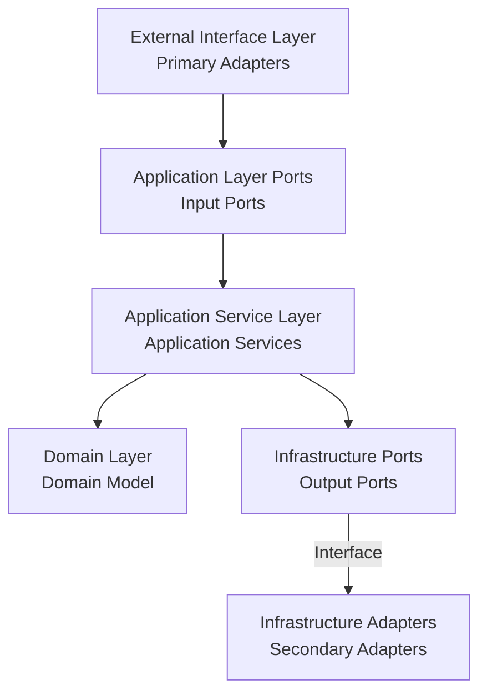

# Hexagonal Architecture and Event Storming Integration Refactoring Guide

## Architecture Overview

Hexagonal Architecture divides applications into three main parts: core domain, ports, and adapters. By combining Event Storming design elements, we can more effectively organize and implement business processes.



## Mapping Event Storming Design Elements to Hexagonal Architecture

### 1. Commands

In Event Storming, commands represent user intentions, mapped in hexagonal architecture as:

- **Location**: Passed from primary adapters to application services
- **Implementation**: As parameters to input ports
- **Examples**: `CreateOrderCommand`, `AddOrderItemCommand`, `ProcessPaymentCommand`

```java
// Command object example
public class CreateOrderCommand {
    private final String customerId;
    private final String shippingAddress;
    
    // Static factory method for easy creation
    public static CreateOrderCommand of(String customerId, String shippingAddress) {
        return new CreateOrderCommand(customerId, shippingAddress);
    }
}
```

### 2. Events

Domain events represent important changes that occur in the system:

- **Location**: Published by domain models, propagated through event bus
- **Implementation**: Domain event classes containing event-related data
- **Examples**: `OrderCreatedEvent`, `PaymentCompletedEvent`

```java
// Domain event example
public class PaymentCompletedEvent implements DomainEvent {
    private final PaymentId paymentId;
    private final OrderId orderId;
    private final Money amount;
    private final Instant occurredOn;
    
    public PaymentCompletedEvent(PaymentId paymentId, OrderId orderId, Money amount) {
        this.paymentId = paymentId;
        this.orderId = orderId;
        this.amount = amount;
        this.occurredOn = Instant.now();
    }
}
```

### 3. Aggregates

Aggregates are consistency boundaries in the domain:

- **Location**: Core of the domain layer
- **Implementation**: Aggregate root entities with business logic
- **Examples**: `Order`, `Payment`, `Inventory`

```java
// Aggregate example
@AggregateRoot
public class Order {
    private OrderId id;
    private CustomerId customerId;
    private List<OrderItem> items;
    private OrderStatus status;
    
    public void addItem(ProductId productId, int quantity, Money unitPrice) {
        validateCanAddItem();
        OrderItem item = new OrderItem(productId, quantity, unitPrice);
        this.items.add(item);
        publishEvent(new OrderItemAddedEvent(this.id, item));
    }
}
```

### 4. Read Models

Read models provide optimized views for queries:

- **Location**: Infrastructure layer, accessed through output ports
- **Implementation**: Query-optimized data structures
- **Examples**: `OrderSummaryView`, `CustomerOrderHistoryView`

```java
// Read model example
public class OrderSummaryView {
    private final String orderId;
    private final String customerName;
    private final Money totalAmount;
    private final String status;
    private final LocalDateTime createdAt;
    
    // Constructor and getters
}
```

## Refactoring Strategy

### Phase 1: Identify Boundaries

1. **Analyze Event Storming Output**
   - Identify aggregates and their boundaries
   - Map commands to use cases
   - Identify domain events and their triggers

2. **Define Ports**
   - Input ports for each use case
   - Output ports for external dependencies
   - Event publishing ports

### Phase 2: Implement Core Domain

1. **Create Aggregates**
   ```java
   @AggregateRoot
   public class Order {
       // Business logic and invariants
       public void process() {
           validateCanProcess();
           this.status = OrderStatus.PROCESSING;
           publishEvent(new OrderProcessingStartedEvent(this.id));
       }
   }
   ```

2. **Define Domain Services**
   ```java
   @DomainService
   public class PricingService {
       public Money calculateTotal(Order order, List<Promotion> promotions) {
           // Complex pricing logic
       }
   }
   ```

### Phase 3: Implement Application Layer

1. **Create Application Services**
   ```java
   @ApplicationService
   public class OrderApplicationService {
       public void createOrder(CreateOrderCommand command) {
           Order order = Order.create(command.getCustomerId(), command.getShippingAddress());
           orderRepository.save(order);
           eventPublisher.publish(new OrderCreatedEvent(order.getId()));
       }
   }
   ```

2. **Define Input Ports**
   ```java
   public interface OrderManagementPort {
       void createOrder(CreateOrderCommand command);
       void addOrderItem(AddOrderItemCommand command);
       void processOrder(ProcessOrderCommand command);
   }
   ```

### Phase 4: Implement Infrastructure

1. **Create Output Ports**
   ```java
   public interface OrderRepository {
       void save(Order order);
       Optional<Order> findById(OrderId id);
   }
   ```

2. **Implement Adapters**
   ```java
   @Repository
   public class JpaOrderRepository implements OrderRepository {
       @Override
       public void save(Order order) {
           OrderEntity entity = OrderMapper.toEntity(order);
           jpaRepository.save(entity);
       }
   }
   ```

### Phase 5: Implement Primary Adapters

1. **REST Controllers**
   ```java
   @RestController
   @RequestMapping("/api/orders")
   public class OrderController {
       private final OrderManagementPort orderManagement;
       
       @PostMapping
       public ResponseEntity<Void> createOrder(@RequestBody CreateOrderRequest request) {
           CreateOrderCommand command = CreateOrderCommand.of(
               request.getCustomerId(), 
               request.getShippingAddress()
           );
           orderManagement.createOrder(command);
           return ResponseEntity.ok().build();
       }
   }
   ```

## Event-Driven Integration

### Event Publishing

```java
@Component
public class DomainEventPublisher {
    private final ApplicationEventPublisher eventPublisher;
    
    public void publish(DomainEvent event) {
        eventPublisher.publishEvent(event);
    }
}
```

### Event Handlers

```java
@EventHandler
public class OrderEventHandler {
    @EventListener
    public void handle(OrderCreatedEvent event) {
        // Handle order creation side effects
        inventoryService.reserveItems(event.getOrderId());
    }
}
```

## Testing Strategy

### Unit Testing
```java
@Test
void shouldCreateOrderSuccessfully() {
    // Given
    CreateOrderCommand command = CreateOrderCommand.of("CUSTOMER-001", "123 Main St");
    
    // When
    orderService.createOrder(command);
    
    // Then
    verify(orderRepository).save(any(Order.class));
    verify(eventPublisher).publish(any(OrderCreatedEvent.class));
}
```

### Integration Testing
```java
@SpringBootTest
@Testcontainers
class OrderIntegrationTest {
    @Test
    void shouldProcessOrderWorkflow() {
        // Test complete workflow from command to event
    }
}
```

### Architecture Testing
```java
@Test
void shouldRespectHexagonalArchitecture() {
    noClasses()
        .that().resideInAPackage("..domain..")
        .should().dependOnClassesThat()
        .resideInAPackage("..infrastructure..")
        .check(importedClasses);
}
```

## Benefits of This Approach

1. **Clear Separation of Concerns**: Each layer has distinct responsibilities
2. **Testability**: Easy to test business logic in isolation
3. **Flexibility**: Easy to change external dependencies
4. **Event-Driven**: Natural integration with event-driven architectures
5. **Domain-Centric**: Business logic remains at the center

## Common Pitfalls to Avoid

1. **Anemic Domain Models**: Ensure aggregates contain business logic
2. **Leaky Abstractions**: Keep infrastructure concerns out of the domain
3. **Over-Engineering**: Start simple and evolve as needed
4. **Ignoring Boundaries**: Respect aggregate boundaries and consistency rules
5. **Event Overuse**: Not everything needs to be an event

## Migration Checklist

- [ ] Identify aggregates and boundaries from Event Storming
- [ ] Define input and output ports
- [ ] Implement domain models with business logic
- [ ] Create application services for use cases
- [ ] Implement infrastructure adapters
- [ ] Add primary adapters (controllers, etc.)
- [ ] Set up event publishing and handling
- [ ] Write comprehensive tests
- [ ] Validate architecture constraints
- [ ] Document the new structure

This refactoring approach ensures a clean, maintainable architecture that aligns with both DDD principles and hexagonal architecture patterns.
