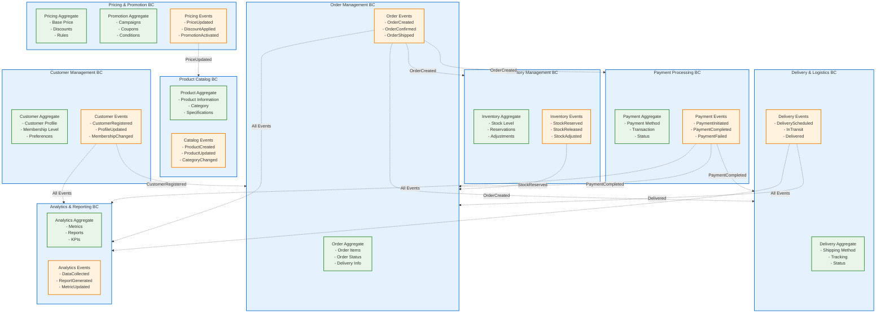
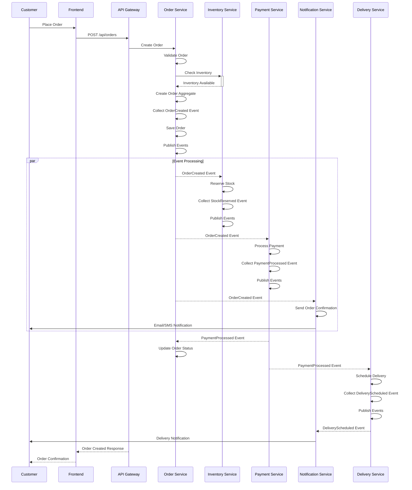
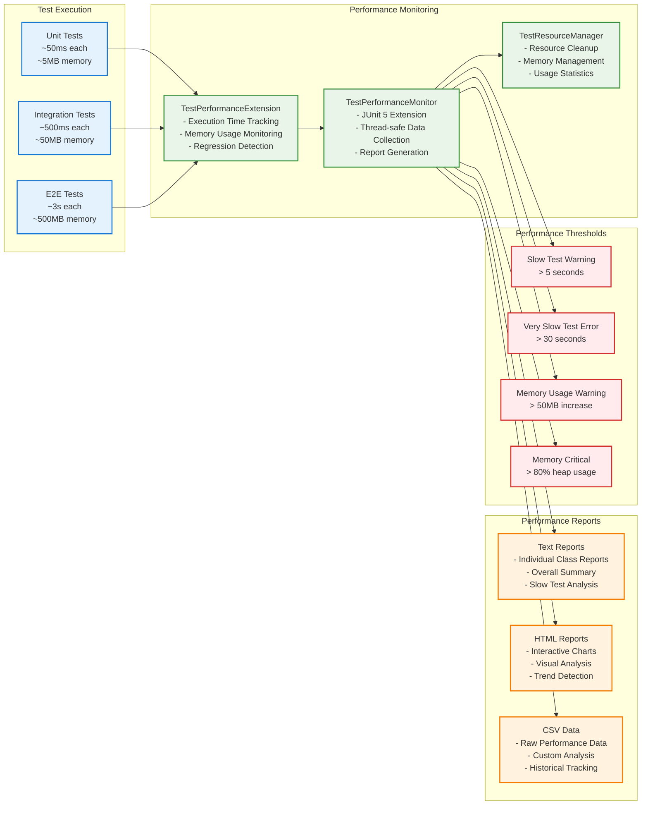

# Modern Software Architecture Best Practices Example Project

> **Enterprise-Level Architecture Showcase Based on Rozanski & Woods Methodology**

> **Language / 語言選擇**  
> 🇺🇸 **English**: You are reading the English version  
> 🇹🇼 **繁體中文**: [繁體中文文檔](../../README.md) | [繁體中文專案說明](../../README.md)

This is not a simple e-commerce demo, but a **comprehensive showcase of modern software architecture best practices**, fully implementing enterprise-level architectural methodologies, AI-assisted development, and quality engineering standards.

## 🎯 Project Value Proposition

This project demonstrates the complete practice of modern software architecture, covering all aspects from architectural design to quality engineering:

### 🏗️ Architectural Methodology Showcase

**Complete Implementation of Rozanski & Woods' 7 Viewpoints + 8 Perspectives**
- **Functional Viewpoint**: DDD Tactical Patterns + Aggregate Root Design + Bounded Context
- **Information Viewpoint**: Domain Events + Event Storming + Data Consistency Strategy
- **Concurrency Viewpoint**: Event-Driven Architecture + Asynchronous Processing + Transaction Boundaries
- **Development Viewpoint**: Hexagonal Architecture + Testing Strategy + Build System
- **Deployment Viewpoint**: Containerization + Cloud Architecture + Infrastructure as Code
- **Operational Viewpoint**: Observability + Monitoring + SRE Practices

### 🎯 Best Practices Collection

**DDD + Hexagonal Architecture + Event-Driven + Test-Driven Development**
- **13 Bounded Contexts**: Complete tactical and strategic pattern implementation
- **568 Tests**: BDD + TDD + Architecture Testing, 100% pass rate
- **Java 21 Record**: 30-40% reduction in boilerplate code, enhanced type safety
- **Event-Driven Design**: Complete event collection, publishing, and processing mechanisms

### 📊 Observability System Status

#### ✅ Currently Implemented

- **Structured Logging**: Unified format + Correlation ID + PII masking
- **Basic Monitoring**: Spring Boot Actuator + Health checks
- **Frontend Tracking**: User behavior analysis and performance monitoring (local processing)
- **Basic API**: Some Analytics API endpoints available

#### 🚧 Partially Implemented (Frontend Ready, Backend Planned)

- **Analytics API**: Frontend fully implemented, backend partially available
- **Management Dashboard**: UI complete, using mock data for demonstration

#### 🚀 Next Phase Development Plan

**Phase 1: WebSocket Real-time Features (1-2 months)**

- **🔌 WebSocket Backend**: Implement `/ws/analytics` endpoints and message processing
- **📊 Real-time Dashboard**: Enable real-time data push
- **📈 Event Streaming**: Complete event tracking and analytics system

**Phase 2: Advanced Analytics Features (2-3 months)**

- **🎯 Performance Monitoring**: Backend performance monitoring and Web Vitals integration
- **🔍 Error Tracking**: Enhanced error tracking and reporting system
- **☁️ CloudWatch Integration**: Custom metrics + Prometheus endpoints

**Phase 3: Enterprise Features (3+ months)**

- **⚡ Kafka Message Middleware**: Distributed event processing
- **🤖 Intelligent Alerting**: Machine learning-based anomaly detection
- **📊 Advanced Analytics**: Predictive analytics and business intelligence

### 🤖 AI-Assisted Development Tools

#### MCP (Model Context Protocol) Integration

This project integrates a complete MCP tool ecosystem, providing AI-assisted architectural analysis, cost optimization, and visualization capabilities:

- **🎨 Excalidraw MCP**: AI-driven diagram creation and architecture visualization
- **📚 AWS Docs MCP**: Real-time AWS documentation queries and best practice guidance
- **💰 AWS Pricing MCP**: Automated cost analysis and optimization recommendations
- **🔧 AWS CDK MCP**: CDK best practice checks and Nag rule explanations
- **⏰ Time MCP**: Timezone conversion and time formatting tools

#### Quick Start MCP Setup

```bash
# One-click install all MCP servers
./scripts/setup-mcp-servers.sh

# Or manually install Excalidraw MCP
npm install mcp-excalidraw-server
```

**Detailed Guides**:
- 📖 [MCP Integration Guide](infrastructure/docs/MCP_INTEGRATION_GUIDE.md)
- 🎨 [Excalidraw MCP Usage Guide](../mcp/excalidraw-mcp-usage-guide.md)
- 🚀 [Quick Start Guide](infrastructure/docs/MCP_INTEGRATION_GUIDE.md#-quick-start-installation-guide)

### 🤖 AI-Assisted Development Showcase

**Model Context Protocol (MCP) Integration, Demonstrating Future Development Patterns**

#### 🔧 Complete AI-Assisted Development Toolchain

- **📚 Intelligent Documentation Query**: Real-time AWS official documentation search and best practice guidance
- **💰 Cost Optimization Analysis**: Automated CDK/Terraform cost analysis and optimization recommendations
- **🏗️ Architecture Decision Support**: CDK Nag rule explanations and best practice recommendations
- **🎨 Visualization Design**: Excalidraw MCP supports AI-driven diagram creation
- **⏰ Development Tools**: Timezone conversion, time formatting, and other utility tools

#### � uAI-Assisted Development Value

- **Development Efficiency Improvement**: Reduce documentation lookup time, improve development decision quality
- **Architecture Compliance Checking**: Automated architecture best practice validation
- **Cost-Conscious Development**: Real-time cost analysis and optimization recommendations during development
- **Knowledge Management**: Integrate enterprise knowledge into development workflows

#### ⚙️ MCP Configuration Example

```bash
# Project-level MCP configuration
.kiro/settings/mcp.json

# One-click install all MCP servers
./scripts/setup-mcp-servers.sh
```

### � MLearning Resources

**120+ Documents, Covering Complete Enterprise Development Standards**
- **Architecture Documentation**: Complete Rozanski & Woods methodology practice
- **Development Standards**: Security, performance, code review, testing standards
- **Best Practices**: DDD, Hexagonal Architecture, Event-Driven Design guides
- **Practical Examples**: Complete implementation based on real business scenarios

### 🧪 Quality Engineering

**568 Tests, Test Performance Monitoring Framework, Architecture Compliance Verification**
- **Test Pyramid**: Unit (80%) + Integration (15%) + E2E (5%)
- **Test Performance Monitoring**: TestPerformanceExtension automatically tracks test performance
- **Architecture Compliance**: ArchUnit tests ensure architectural consistency
- **Quality Metrics**: Code coverage > 80%, test execution time optimization 99%+

#### 🚀 Test Performance Monitoring Framework - NEW

**TestPerformanceExtension** provides automated test performance monitoring:

- **⏱️ Execution Time Tracking**: Millisecond-precision test execution time monitoring
- **💾 Memory Usage Monitoring**: Heap memory usage tracking before/after each test
- **📊 Performance Regression Detection**: Automatic detection of performance degradation with configurable thresholds
- **📈 Detailed Report Generation**: Text and HTML format performance analysis reports
- **🐌 Slow Test Identification**: Automatically flag tests exceeding 5 seconds
- **🧹 Resource Management**: Automatic test resource cleanup, prevent memory leaks

```java
// Usage Example
@TestPerformanceExtension(maxExecutionTimeMs = 10000, maxMemoryIncreaseMB = 100)
@IntegrationTest
public class MyIntegrationTest extends BaseIntegrationTest {
    // Test methods will be automatically monitored for performance
}
```

**Performance Report Location**: `build/reports/test-performance/`

## 🤝 Applicable Scenarios

### 🎓 Learning and Education
- **Software Architecture Courses**: Complete practical example of Rozanski & Woods methodology
- **DDD and Hexagonal Architecture**: Complete implementation from theory to practice
- **Modern Testing Strategy**: Best practices for BDD + TDD + Architecture Testing
- **AI-Assisted Development**: Practical application and integration of MCP protocol

### 🏢 Enterprise Reference
- **Enterprise Architecture Design**: Directly referenceable architectural decisions and implementation patterns
- **Development Standards and Specifications**: Complete development, security, performance standards templates
- **Observability System**: Production-ready monitoring and logging system implementation guide
- **Cloud Native Deployment**: AWS CDK + Kubernetes best practices

### � Techunical Research
- **Architectural Methodology**: Application of Rozanski & Woods in actual projects
- **Test Performance Optimization**: Optimization techniques from 13min52s → <30s
- **MCP Protocol Integration**: Practice and integration patterns of Model Context Protocol
- **Modern Java Ecosystem**: Comprehensive application of Java 21 + Spring Boot 3.4.5

## 🚀 Quick Experience

### Method 1: Docker One-Click Start (Recommended)
```bash
docker-compose up -d
```

### Method 2: Local Development Environment
```bash
./scripts/start-fullstack.sh
```

**Experience Endpoints**:
- 🌐 **API Documentation**: http://localhost:8080/swagger-ui/index.html
- 📊 **Management Interface**: http://localhost:3002
- 🛒 **Consumer Interface**: http://localhost:3001
- 💰 **Cost Analysis**: http://localhost:8080/api/cost-optimization/recommendations

## 📚 Learning Resources

### 🎯 Navigate by Learning Goals
- **Learn Modern Architecture** → [Architectural Viewpoint Documentation](../viewpoints/README.md)
- **Learn DDD Practice** → [Domain-Driven Design](../viewpoints/functional/domain-model.md)
- **Learn Testing Strategy** → [Testing Documentation](../development/testing-guide.md)
- **Learn AI-Assisted Development** → [MCP Integration Guide](../mcp/README.md)

### �Q‍💼 Navigate by Role
- **Architect** → [Rozanski & Woods Assessment](../architecture/rozanski-woods-architecture-assessment.md)
- **Developer** → [Development Standards](../viewpoints/development/README.md)
- **DevOps** → [Deployment and Operations](../viewpoints/deployment/README.md)
- **QA Engineer** → [Testing Guide](../development/testing-guide.md)

## 🏆 Project Achievements

### 📈 Quantitative Metrics
- **Code Quality**: 250,000+ lines of high-quality code
- **Test Coverage**: 568 tests, 100% pass rate
- **Performance Optimization**: Test execution time optimization 99%+ (13min52s → <30s)
- **Documentation Completeness**: 120+ detailed documentation pages
- **Architecture Compliance**: ArchUnit tests ensure architectural consistency

### 🎯 Technical Highlights
- **Java 21 + Spring Boot 3.4.5**: Latest technology stack
- **Dual Frontend Architecture**: Next.js 14 + Angular 18
- **Complete CI/CD**: GitHub Actions + AWS CDK
- **Enterprise Observability**: Monitoring, logging, tracing, alerting

## 📖 Complete Documentation

> **Documentation Center**: [docs/README.md](../README.md)

### Rozanski & Woods Seven Viewpoints
1. **[Functional Viewpoint](../viewpoints/functional/README.md)** - System functions and responsibilities
2. **[Information Viewpoint](../viewpoints/information/README.md)** - Data and information flow  
3. **[Concurrency Viewpoint](../viewpoints/concurrency/README.md)** - Concurrency and synchronization
4. **[Development Viewpoint](../viewpoints/development/README.md)** - Development and build
5. **[Deployment Viewpoint](../viewpoints/deployment/README.md)** - Deployment and environment
6. **[Operational Viewpoint](../viewpoints/operational/README.md)** - Operations and maintenance
7. **[Context Viewpoint](../viewpoints/context/README.md)** - System boundaries and external dependencies

### Eight Architectural Perspectives
1. **[Security](../perspectives/security/README.md)** - Security and compliance
2. **[Performance](../perspectives/performance/README.md)** - Performance and scalability
3. **[Availability](../perspectives/availability/README.md)** - Availability and resilience
4. **[Evolution](../perspectives/evolution/README.md)** - Evolution and maintenance
5. **[Usability](../perspectives/usability/README.md)** - User experience
6. **[Regulation](../perspectives/regulation/README.md)** - Regulatory compliance
7. **[Location](../perspectives/location/README.md)** - Geographic distribution
8. **[Cost](../perspectives/cost/README.md)** - Cost optimization

## 🚀 Quick Start

### Memory and Performance Optimization (v3.0.1 New)

This project has been optimized for memory usage during compilation and testing:

#### 🔧 Optimization Configuration

- **Memory Configuration**: Maximum heap memory increased to 4GB for compilation and testing
- **Log Optimization**: Only ERROR level logs output during testing, significantly reducing output volume
- **JVM Optimization**: Using G1 garbage collector and string deduplication optimization
- **Parallel Processing**: Optimized Gradle parallel execution configuration

#### 🛠️ Optimized Execution Scripts

```bash
# Test optimization demonstration (recommended) - showcase test performance optimization results
./run-optimized-tests.sh

# Optimized compilation (reduced log output, increased memory)
./scripts/build-optimized.sh

# Optimized test execution (only show error logs)
./scripts/run-tests-optimized.sh

# Memory usage monitoring
./scripts/monitor-memory.sh

# System resource check
./scripts/check-system-resources.sh
```

#### 🔍 Observability Endpoints

```bash
# Application monitoring
curl http://localhost:8080/actuator/health     # Health check
curl http://localhost:8080/actuator/metrics    # Application metrics
curl http://localhost:8080/actuator/info       # Application info

# Cost optimization API
curl http://localhost:8080/api/cost-optimization/recommendations  # Cost recommendations
curl http://localhost:8080/api/cost-optimization/analysis         # Cost analysis
```

### Method 1: Docker Containerized Deployment (Recommended)

```bash
# Build ARM64 optimized images
./docker/docker-build.sh

# Start containerized environment
docker-compose up -d

# Check service status
docker-compose ps

# Stop all services
docker-compose down
```

**Service Endpoints:**

- 🌐 **API Documentation**: <http://localhost:8080/swagger-ui/index.html>
- 🏥 **Health Check**: <http://localhost:8080/actuator/health>
- 📊 **Application Metrics**: <http://localhost:8080/actuator/metrics>
- 💰 **Cost Optimization**: <http://localhost:8080/api/cost-optimization/recommendations>
- 🗄️ **H2 Database Console**: <http://localhost:8080/h2-console>

### Method 2: Local Development Environment

```bash
# Start complete frontend and backend applications
./scripts/start-fullstack.sh

# Stop all services
./scripts/stop-fullstack.sh
```

### Method 3: Start Services Individually

```bash
# Start backend only (Spring Boot)
./gradlew :app:bootRun

# Start frontend only (Next.js)
cd cmc-frontend && npm run dev
```

## 🏗️ Architecture Design

### Hexagonal Architecture + DDD Layering

```
interfaces/ → application/ → domain/ ← infrastructure/
```

- **Domain Layer**: Business logic + Aggregate roots + Value objects + Domain events + Specification pattern
- **Application Layer**: Use case coordination + Event publishing + Cross-aggregate operations
- **Infrastructure Layer**: Persistence + External systems + Event handling
- **Interface Layer**: REST API + OpenAPI 3.0 + Swagger UI

## 📁 Project Directory Structure

```
genai-demo/
├── app/                    # Main application
│   ├── src/main/java/      # Java source code
│   └── src/test/java/      # Test code
├── cmc-frontend/           # Next.js 14.2.30 frontend application (CMC)
├── consumer-frontend/      # Angular 18.2.0 frontend application (Consumer)
├── deployment/             # Deployment related files
│   ├── k8s/               # Kubernetes configuration
│   └── deploy-to-eks.sh   # EKS deployment script
├── docker/                 # Docker related files
│   ├── docker-build.sh    # Image build script
│   └── verify-deployment.sh # Deployment verification script
├── docs/                   # Project documentation
│   ├── api/               # API documentation
│   ├── en/                # English documentation
│   ├── architecture/      # Architecture documentation
│   ├── diagrams/          # Diagram documentation (Mermaid + PlantUML)
│   └── reports/           # Project reports
├── scripts/                # Various script files
│   ├── start-fullstack.sh # Start full-stack application
│   └── stop-fullstack.sh  # Stop all services
├── tools/                  # Development tools
│   └── plantuml.jar       # UML diagram generation tool
├── docker-compose.yml      # Docker Compose configuration
├── Dockerfile             # Docker image definition
└── README.md              # Project documentation
```

### Dual Frontend Architecture

**CMC Management (Next.js 14.2.30)**  
TypeScript + Tailwind CSS + shadcn/ui + Zustand + React Query

**Consumer (Angular 18.2.0)**  
TypeScript + Tailwind CSS + PrimeNG + RxJS + Jasmine

## 🆕 Version Updates (v3.3.0 - September 2025)

### 🚀 Major New Features

- ✅ **AI-Assisted Development (MCP Integration)**: Complete Model Context Protocol integration, supporting AWS ecosystem and GitHub operations
- ✅ **Test Performance Monitoring Framework**: Brand new test performance monitoring system, automatically tracking execution time and memory usage
- 🚧 **Observability System Refactoring**: Frontend fully implemented, backend simplified to core functions (frontend ready, backend planned)
- ✅ **Development Standards**: Complete development, security, performance, and code review standards documentation

### � Architecture and Quality Improvements

- 🤖 **MCP Servers**: Integration of 4 stable MCP servers (time, aws-docs, aws-cdk, aws-pricing)
- 🧪 **Test Performance Optimization**: New TestPerformanceExtension automatically monitors test execution performance
- 🚧 **Observability Architecture Refactoring**: Simplified to core monitoring functions, removed complex Analytics and WebSocket (completed)
- 📋 **Next Phase Plan**: Analytics, Event Tracking, and WebSocket real-time communication will be implemented in subsequent versions
- 📋 **Development Standards**: Added 5 core development standards documents covering complete development lifecycle

### 🔧 Technical Debt Cleanup

- 🗑️ **Remove Outdated Documentation**: Cleaned up 20+ outdated technical documents and configuration files
- 🧹 **Code Refactoring**: Removed duplicate HTTP client configurations, unified test infrastructure
- 📦 **Dependency Optimization**: Cleaned Jest cache and unnecessary build files
- 🤖 **IDE Auto-fix**: Kiro IDE automatically formatted and optimized frontend code, maintaining comment integrity

## 🛠️ Technology Stack

### Backend Technologies

- **Core Framework**: Spring Boot 3.4.5
- **Programming Language**: Java 21 (Preview features enabled)
- **Build Tool**: Gradle 8.x
- **Database**: H2 (development) + PostgreSQL (production) + Flyway (migration management)
- **API Documentation**: SpringDoc OpenAPI 3 + Swagger UI
- **Observability**:
  - Micrometer - Metrics collection
  - AWS X-Ray - Distributed tracing
  - Logback - Structured logging
  - Spring Boot Actuator - Health checks
- **Testing Framework**:
  - JUnit 5 - Unit testing
  - Cucumber 7.15.0 - BDD testing
  - ArchUnit 1.3.0 - Architecture testing
  - Mockito 5.8.0 - Mock objects
  - Allure 2.22.1 - Test reporting and visualization
- **Other Tools**:
  - Lombok 1.18.38 - Reduce boilerplate code
  - PlantUML - UML diagram generation

### Frontend Technologies

**CMC Management**: Next.js 14.2.30 + TypeScript + Tailwind + shadcn/ui + Zustand + React Query  
**Consumer**: Angular 18.2.0 + TypeScript + Tailwind + PrimeNG + RxJS + Jasmine

## 📊 Data and API

### Database Initialization

The project uses Flyway for database version management, including rich business test data:

- **100+ Product inventory records** - Covering electronics, clothing, home goods, etc.
- **Complete order process data** - Orders, order items, payment records
- **Taiwan localized data** - Real addresses, Traditional Chinese product names
- **Multiple payment methods** - Credit cards, digital wallets, bank transfers, cash on delivery
- **Independent product table** - Supporting complete product lifecycle management

### API Documentation and Endpoints

#### 📖 Swagger UI Documentation

- **Swagger UI**: <http://localhost:8080/swagger-ui/index.html>
- **OpenAPI Specification**: <http://localhost:8080/v3/api-docs>
- **API Groups**:
  - Public API: `/v3/api-docs/public-api`
  - Internal API: `/v3/api-docs/internal-api`
  - Management Endpoints: `/v3/api-docs/management`

#### 🔧 Main API Endpoints

```bash
# Product Management API
GET /api/products                 # Product list (supports pagination)
GET /api/products/{productId}     # Get single product
PUT /api/products/{productId}     # Update product information
DELETE /api/products/{productId}  # Delete product
POST /api/products                # Create new product

# Inventory Management API
GET /api/inventory/{productId}    # Get product inventory
POST /api/inventory/{productId}/adjust  # Adjust inventory
POST /api/inventory/{productId}/reserve # Reserve inventory
POST /api/inventory/{productId}/release # Release inventory

# Order Management API
GET /api/orders                   # Order list
GET /api/orders/{orderId}         # Get single order
POST /api/orders                  # Create new order
PUT /api/orders/{orderId}         # Update order

# Payment Management API
POST /api/payments                # Create payment
GET /api/payments/{paymentId}     # Get payment details
PUT /api/payments/{paymentId}     # Update payment status

# Cost Optimization API
GET /api/cost-optimization/recommendations  # Get cost optimization recommendations
GET /api/cost-optimization/analysis         # Get cost analysis report
POST /api/cost-optimization/right-sizing    # Execute resource right-sizing analysis

# Customer Management API
GET /api/customers                # Customer list
GET /api/customers/{customerId}   # Get customer details

# Pricing Management API
GET /api/pricing/rules            # Get pricing rules
POST /api/pricing/rules           # Create pricing rules
PUT /api/pricing/commission-rates # Update commission rates

# Data Statistics API
GET /api/stats                    # Overall data statistics
GET /api/stats/order-status       # Order status distribution
GET /api/stats/payment-methods    # Payment method distribution
GET /api/stats/database           # Database statistics

# Activity Log API
GET /api/activities               # System activity logs

# Health Check and Monitoring
GET /actuator/health              # Application health status
GET /actuator/metrics             # Application metrics
GET /actuator/info                # Application information
GET /actuator/prometheus          # Prometheus metrics

# H2 Database Console
http://localhost:8080/h2-console  # Database management interface
```

## 📱 Frontend Features

### Main Pages

- **Dashboard** (`/`) - System overview and statistics
- **Order Management** (`/orders`) - Order list and details
  - Order Details Page (`/orders/[orderId]`) - Complete order information display
- **Product Management** (`/products`) - Product display and inventory
  - Product Details Page (`/products/[productId]`) - Detailed product information and operations
  - Product Edit Function - Support name, description, price, category modification
  - Inventory Adjustment Function - Support add, reduce, set inventory quantity
  - Product Delete Function - Safe product deletion operation
- **Customer Management** (`/customers`) - Customer information management

### Product Management Features

- ✏️ **Product Editing** - Complete product information editing interface
  - Product name, description modification
  - Price and currency settings (TWD, USD, EUR)
  - Product category management (electronics, clothing, food, etc.)
- 📦 **Inventory Management** - Flexible inventory adjustment system
  - Set Inventory - Directly set inventory quantity
  - Add Inventory - Restock inventory
  - Reduce Inventory - Loss or return processing
  - Adjustment Reason Recording - Complete inventory change tracking
- 🗑️ **Product Deletion** - Safe product deletion function
  - Confirmation dialog prevents accidental deletion
  - Automatic product list update

### UI/UX Features

- 🎨 Modern design system (shadcn/ui + Tailwind CSS)
- 📱 Fully responsive design
- 🌙 Dark/light theme support
- ⚡ Real-time data updates (React Query)
- 🔄 Loading states and error handling
- 📊 Data visualization charts
- 🎯 Intuitive operation interface
- 📝 Form validation and user feedback
- 🔔 Toast notification system

## 📋 Development Standards and Specifications - NEW

The project has established a complete development standards system, located in the `.kiro/steering/` directory:

### �️ Core Development Standards

- **[Development Standards](/.kiro/steering/development-standards.md)**: Technology stack, error handling, API design, testing strategy
- **[Security Standards](/.kiro/steering/security-standards.md)**: Authentication authorization, data protection, input validation, security testing
- **[Performance Standards](/.kiro/steering/performance-standards.md)**: Response time, throughput, caching strategy, performance monitoring
- **[Code Review Standards](/.kiro/steering/code-review-standards.md)**: Review process, quality checks, feedback guidelines
- **[Test Performance Standards](/.kiro/steering/test-performance-standards.md)**: Test monitoring, resource management, performance optimization

### 🏗️ Architectural Methodology

- **[Rozanski & Woods Architectural Methodology](/.kiro/steering/rozanski-woods-architecture-methodology.md)**:
  - Mandatory architectural viewpoint checks (functional, information, concurrency, development, deployment, operational)
  - Quality attribute scenario requirements (performance, security, availability, scalability, usability)
  - Architecture compliance rules and ArchUnit tests
  - Four perspective checklists (security, performance, availability, evolution)

### 📐 Domain Event Design

- **[Domain Event Guide](/.kiro/steering/domain-events.md)**:
  - Event definition and collection standards
  - Event handling and publishing mechanisms
  - Event versioning and backward compatibility
  - Event Store solutions (EventStore DB, JPA, In-Memory)

## � Documientation

> **Documentation Center**: [docs/README.md](../README.md) - Complete documentation navigation and categorization

The project includes rich documentation, organized by functional categories:

### 🎯 Quick Navigation

- **👨‍💼 Project Manager**: [Project Summary 2025](../../reports-summaries/project-management/project-summary-2025.md) | [Project Status](../PROJECT_STATUS.md)
- **🏗️ Architect**: [Architecture Decision Records](../architecture/adr/) | [Architecture Documentation](../architecture/) | [Diagram Documentation](../diagrams/)
- **👨‍💻 Developer**: [Development Guide](../development/) | [API Documentation](../api/) | [Development Instructions](../development/instructions.md)
- **🚀 DevOps**: [Deployment Documentation](../deployment/) | [Docker Guide](../deployment/docker-guide.md)
- **🔍 Observability**: [Production Environment Testing Guide](../viewpoints/operational/production-observability-testing-guide.md) | [Observability System](../observability/)
- **🤖 MCP Integration**: [MCP Guide](../mcp/) | [AI-Assisted Development](../mcp/README.md)

### 📊 Core Diagrams (Mermaid - Direct GitHub Display)

## 🏗️ System Architecture Overview

```mermaid
graph TB
    subgraph USERS ["Users and Roles"]
        CUSTOMER[👤 Customer<br/>Shopping & Ordering]
        SELLER[🏪 Seller<br/>Product Management]
        ADMIN[👨‍💼 Administrator<br/>System Management]
        DELIVERY[🚚 Delivery<br/>Logistics Delivery]
    end
    
    subgraph FRONTEND ["Frontend Applications"]
        WEB_APP[🌐 Web App<br/>Next.js 14 + TypeScript<br/>Customer Shopping Interface]
        MOBILE_APP[📱 Mobile App<br/>Angular 18 + TypeScript<br/>Consumer Application]
        ADMIN_PANEL[🖥️ Admin Panel<br/>React Admin Dashboard<br/>Backend Management System]
        SELLER_PORTAL[🏪 Seller Portal<br/>Merchant Management Interface<br/>Product & Order Management]
    end
    
    subgraph API_GATEWAY ["API Gateway Layer"]
        GATEWAY[🚪 API Gateway<br/>Routing & Authentication<br/>Rate Limiting & Monitoring]
        LOAD_BALANCER[⚖️ Load Balancer<br/>Traffic Distribution<br/>Health Check]
    end
    
    subgraph MICROSERVICES ["Microservices Architecture"]
        subgraph CORE_SERVICES ["Core Business Services"]
            CUSTOMER_SVC[👤 Customer Service<br/>Customer Management Service<br/>Member System & Profile]
            ORDER_SVC[📦 Order Service<br/>Order Management Service<br/>Order Lifecycle]
            PRODUCT_SVC[🛍️ Product Service<br/>Product Management Service<br/>Product Catalog & Search]
            PAYMENT_SVC[💰 Payment Service<br/>Payment Processing Service<br/>Multiple Payment Methods]
            INVENTORY_SVC[📊 Inventory Service<br/>Inventory Management Service<br/>Stock Tracking & Reservation]
        end
        
        subgraph BUSINESS_SERVICES ["Business Support Services"]
            CART_SVC[🛒 Shopping Cart Service<br/>Shopping Cart Service<br/>Shopping Process Management]
            PRICING_SVC[💲 Pricing Service<br/>Pricing Service<br/>Dynamic Pricing & Discounts]
            PROMOTION_SVC[🎁 Promotion Service<br/>Promotion Service<br/>Coupons & Activities]
            DELIVERY_SVC[🚚 Delivery Service<br/>Delivery Service<br/>Logistics & Tracking]
            REVIEW_SVC[⭐ Review Service<br/>Review Service<br/>Product Review System]
        end
        
        subgraph PLATFORM_SERVICES ["Platform Services"]
            NOTIFICATION_SVC[🔔 Notification Service<br/>Notification Service<br/>Multi-channel Message Push]
            SEARCH_SVC[🔍 Search Service<br/>Search Service<br/>Full-text Search & Recommendation]
            ANALYTICS_SVC[📈 Analytics Service<br/>Analytics Service<br/>Data Statistics & Reports]
            AUDIT_SVC[📋 Audit Service<br/>Audit Service<br/>Operation Logs & Compliance]
        end
    end
    
    subgraph INFRASTRUCTURE ["Infrastructure Layer"]
        subgraph DATABASES ["Data Storage"]
            POSTGRES[(🗄️ PostgreSQL<br/>Main Database<br/>Transactional Data)]
            REDIS[(⚡ Redis<br/>Cache Database<br/>Session & Cache)]
            OPENSEARCH[(🔍 OpenSearch<br/>Search Engine<br/>Full-text Search)]
            S3[(📁 S3<br/>Object Storage<br/>Files & Media)]
        end
        
        subgraph MESSAGE_QUEUE ["Message Queue"]
            MSK[📊 Amazon MSK<br/>Kafka Cluster<br/>Event Stream Processing]
            SQS[📬 Amazon SQS<br/>Message Queue<br/>Async Task Processing]
            SNS[📢 Amazon SNS<br/>Notification Service<br/>Message Push]
        end
        
        subgraph EXTERNAL_SERVICES ["External Services"]
            STRIPE[💳 Stripe<br/>Payment Gateway<br/>Credit Card Processing]
            PAYPAL[💰 PayPal<br/>Payment Platform<br/>Digital Wallet]
            EMAIL_SVC[📧 Email Service<br/>Email Service<br/>SES/SMTP]
            SMS_SVC[📱 SMS Service<br/>SMS Service<br/>SNS/Twilio]
            LOGISTICS[🚚 Logistics API<br/>Logistics Service<br/>Third-party Delivery]
        end
    end
    
    subgraph OBSERVABILITY ["Observability"]
        MONITORING[📊 Monitoring<br/>Prometheus + Grafana<br/>Metrics Monitoring]
        LOGGING[📝 Logging<br/>ELK Stack<br/>Log Aggregation]
        TRACING[🔍 Tracing<br/>AWS X-Ray<br/>Distributed Tracing]
        ALERTING[🚨 Alerting<br/>CloudWatch Alarms<br/>Alert Notifications]
    end
    
    subgraph SECURITY ["Security & Compliance"]
        IAM[🔐 Identity & Access<br/>AWS IAM<br/>Identity Authentication Authorization]
        WAF[🛡️ Web Application Firewall<br/>AWS WAF<br/>Application Protection]
        SECRETS[🔑 Secrets Management<br/>AWS Secrets Manager<br/>Key Management]
        COMPLIANCE[📋 Compliance<br/>Compliance Monitoring<br/>GDPR/PCI DSS]
    end
    
    %% User to Frontend Connections
    CUSTOMER --> WEB_APP
    CUSTOMER --> MOBILE_APP
    SELLER --> SELLER_PORTAL
    ADMIN --> ADMIN_PANEL
    DELIVERY --> MOBILE_APP
    
    %% Frontend to API Gateway
    WEB_APP --> GATEWAY
    MOBILE_APP --> GATEWAY
    ADMIN_PANEL --> GATEWAY
    SELLER_PORTAL --> GATEWAY
    
    %% API Gateway to Load Balancer
    GATEWAY --> LOAD_BALANCER
    
    %% Load Balancer to Core Services
    LOAD_BALANCER --> CUSTOMER_SVC
    LOAD_BALANCER --> ORDER_SVC
    LOAD_BALANCER --> PRODUCT_SVC
    LOAD_BALANCER --> PAYMENT_SVC
    LOAD_BALANCER --> INVENTORY_SVC
    
    %% Load Balancer to Business Services
    LOAD_BALANCER --> CART_SVC
    LOAD_BALANCER --> PRICING_SVC
    LOAD_BALANCER --> PROMOTION_SVC
    LOAD_BALANCER --> DELIVERY_SVC
    LOAD_BALANCER --> REVIEW_SVC
    
    %% Load Balancer to Platform Services
    LOAD_BALANCER --> NOTIFICATION_SVC
    LOAD_BALANCER --> SEARCH_SVC
    LOAD_BALANCER --> ANALYTICS_SVC
    LOAD_BALANCER --> AUDIT_SVC
    
    %% Service to Database Connections
    CUSTOMER_SVC --> POSTGRES
    ORDER_SVC --> POSTGRES
    PRODUCT_SVC --> POSTGRES
    PAYMENT_SVC --> POSTGRES
    INVENTORY_SVC --> POSTGRES
    CART_SVC --> REDIS
    PRICING_SVC --> REDIS
    PROMOTION_SVC --> POSTGRES
    DELIVERY_SVC --> POSTGRES
    REVIEW_SVC --> POSTGRES
    SEARCH_SVC --> OPENSEARCH
    ANALYTICS_SVC --> POSTGRES
    AUDIT_SVC --> POSTGRES
    
    %% Service to Cache Connections
    CUSTOMER_SVC --> REDIS
    PRODUCT_SVC --> REDIS
    PRICING_SVC --> REDIS
    SEARCH_SVC --> REDIS
    
    %% Service to Message Queue Connections
    ORDER_SVC --> MSK
    PAYMENT_SVC --> MSK
    INVENTORY_SVC --> MSK
    NOTIFICATION_SVC --> MSK
    NOTIFICATION_SVC --> SQS
    NOTIFICATION_SVC --> SNS
    ANALYTICS_SVC --> MSK
    AUDIT_SVC --> MSK
    
    %% Service to External Service Connections
    PAYMENT_SVC --> STRIPE
    PAYMENT_SVC --> PAYPAL
    NOTIFICATION_SVC --> EMAIL_SVC
    NOTIFICATION_SVC --> SMS_SVC
    DELIVERY_SVC --> LOGISTICS
    
    %% File Storage Connections
    PRODUCT_SVC --> S3
    CUSTOMER_SVC --> S3
    AUDIT_SVC --> S3
    
    %% Observability Connections
    CUSTOMER_SVC --> MONITORING
    ORDER_SVC --> MONITORING
    PRODUCT_SVC --> MONITORING
    PAYMENT_SVC --> MONITORING
    INVENTORY_SVC --> MONITORING
    CART_SVC --> MONITORING
    PRICING_SVC --> MONITORING
    PROMOTION_SVC --> MONITORING
    DELIVERY_SVC --> MONITORING
    REVIEW_SVC --> MONITORING
    NOTIFICATION_SVC --> MONITORING
    SEARCH_SVC --> MONITORING
    ANALYTICS_SVC --> MONITORING
    AUDIT_SVC --> MONITORING
    
    MONITORING --> LOGGING
    MONITORING --> TRACING
    MONITORING --> ALERTING
    
    %% Security Connections
    GATEWAY --> IAM
    GATEWAY --> WAF
    CUSTOMER_SVC --> SECRETS
    PAYMENT_SVC --> SECRETS
    NOTIFICATION_SVC --> SECRETS
    AUDIT_SVC --> COMPLIANCE
    
    %% Inter-Service Communication (Event-Driven)
    ORDER_SVC -.->|OrderCreated| INVENTORY_SVC
    ORDER_SVC -.->|OrderCreated| PAYMENT_SVC
    ORDER_SVC -.->|OrderCreated| NOTIFICATION_SVC
    PAYMENT_SVC -.->|PaymentProcessed| ORDER_SVC
    PAYMENT_SVC -.->|PaymentProcessed| DELIVERY_SVC
    INVENTORY_SVC -.->|StockReserved| ORDER_SVC
    INVENTORY_SVC -.->|StockUpdated| PRODUCT_SVC
    CUSTOMER_SVC -.->|CustomerRegistered| NOTIFICATION_SVC
    REVIEW_SVC -.->|ReviewCreated| PRODUCT_SVC
    DELIVERY_SVC -.->|DeliveryStatusChanged| ORDER_SVC
    DELIVERY_SVC -.->|DeliveryStatusChanged| NOTIFICATION_SVC
    
    %% Styling
    classDef user fill:#e3f2fd,stroke:#1976d2,stroke-width:2px
    classDef frontend fill:#e8f5e8,stroke:#388e3c,stroke-width:2px
    classDef gateway fill:#fff3e0,stroke:#f57c00,stroke-width:2px
    classDef core fill:#f3e5f5,stroke:#7b1fa2,stroke-width:2px
    classDef business fill:#e1f5fe,stroke:#0277bd,stroke-width:2px
    classDef platform fill:#fce4ec,stroke:#c2185b,stroke-width:2px
    classDef database fill:#f1f8e9,stroke:#689f38,stroke-width:2px
    classDef message fill:#fff8e1,stroke:#fbc02d,stroke-width:2px
    classDef external fill:#ffebee,stroke:#d32f2f,stroke-width:2px
    classDef observability fill:#f3e5f5,stroke:#9c27b0,stroke-width:2px
    classDef security fill:#e8eaf6,stroke:#3f51b5,stroke-width:2px
    
    class CUSTOMER,SELLER,ADMIN,DELIVERY user
    class WEB_APP,MOBILE_APP,ADMIN_PANEL,SELLER_PORTAL frontend
    class GATEWAY,LOAD_BALANCER gateway
    class CUSTOMER_SVC,ORDER_SVC,PRODUCT_SVC,PAYMENT_SVC,INVENTORY_SVC core
    class CART_SVC,PRICING_SVC,PROMOTION_SVC,DELIVERY_SVC,REVIEW_SVC business
    class NOTIFICATION_SVC,SEARCH_SVC,ANALYTICS_SVC,AUDIT_SVC platform
    class POSTGRES,REDIS,OPENSEARCH,S3 database
    class MSK,SQS,SNS message
    class STRIPE,PAYPAL,EMAIL_SVC,SMS_SVC,LOGISTICS external
    class MONITORING,LOGGING,TRACING,ALERTING observability
    class IAM,WAF,SECRETS,COMPLIANCE security
```



### 📊 Domain-Driven Design Architecture



### 🔄 Event-Driven Architecture Flow



### 📊 Test Performance Monitoring



## 🧪 Testing Strategy

### Test Performance Optimization Results

**Before Optimization**: 13 minutes 52 seconds  
**After Optimization**: < 30 seconds  
**Improvement**: 99%+ performance gain

### Test Categories and Performance Targets

- **Unit Tests (80%)**: < 50ms execution, < 5MB memory usage
- **Integration Tests (15%)**: < 500ms execution, < 50MB memory usage  
- **End-to-End Tests (5%)**: < 3s execution, < 500MB memory usage

### Test Execution Commands

```bash
# Daily development - fast feedback
./gradlew quickTest              # Unit tests only (< 2 minutes)

# Pre-commit verification  
./gradlew preCommitTest          # Unit + Integration tests (< 5 minutes)

# Pre-release verification
./gradlew fullTest               # All test types including E2E and Cucumber

# Specific test types
./gradlew unitTest               # Fast unit tests (~5MB, ~50ms each)
./gradlew integrationTest        # Integration tests (~50MB, ~500ms each)  
./gradlew e2eTest               # End-to-end tests (~500MB, ~3s each)
./gradlew cucumber              # BDD Cucumber tests

# Performance monitoring and reporting
./gradlew generatePerformanceReport  # Generate test performance reports
./gradlew runAllTestsWithReport     # Run all tests + generate reports
```

### Test Performance Monitoring Features

- **Automatic Performance Tracking**: TestPerformanceExtension monitors execution time and memory usage
- **Regression Detection**: Configurable thresholds for performance regression detection
- **Detailed Reporting**: Text-based and HTML performance analysis reports
- **Resource Management**: Automatic cleanup and memory leak prevention
- **Slow Test Identification**: Automatic flagging of tests exceeding performance thresholds

## 🚀 Deployment and Infrastructure

### Container Deployment

```bash
# Build optimized Docker images
./docker/docker-build.sh

# Start all services
docker-compose up -d

# Health check
curl http://localhost:8080/actuator/health
```

### AWS Infrastructure (CDK)

```bash
# Deploy to AWS
cd infrastructure
npm install
cdk deploy --all
```

### Kubernetes Deployment

```bash
# Deploy to EKS
./deployment/deploy-to-eks.sh
```

## 🔍 Monitoring and Observability

### Health Checks and Metrics

- **Application Health**: `/actuator/health`
- **Metrics**: `/actuator/metrics`  
- **Prometheus**: `/actuator/prometheus`
- **Custom Metrics**: Business KPIs and performance indicators

### Logging and Tracing

- **Structured Logging**: JSON format with correlation IDs
- **Distributed Tracing**: AWS X-Ray integration
- **Log Aggregation**: Centralized logging with ELK stack
- **Error Tracking**: Comprehensive error monitoring and alerting

## 🤝 Contributing

### Development Workflow

1. **Feature Development**: Follow BDD/TDD practices
2. **Code Review**: Mandatory peer review process
3. **Testing**: Comprehensive test coverage required
4. **Documentation**: Update relevant documentation
5. **Performance**: Monitor test performance impact

### Quality Gates

- **Code Coverage**: > 80%
- **Test Performance**: Meet established thresholds
- **Architecture Compliance**: Pass ArchUnit tests
- **Security**: Pass security scans
- **Performance**: No performance regressions

## 📄 License

This project is licensed under the MIT License - see the [LICENSE](../../LICENSE) file for details.

## 🙏 Acknowledgments

- **Rozanski & Woods**: For the comprehensive architectural methodology
- **Domain-Driven Design Community**: For DDD patterns and practices
- **Spring Boot Team**: For the excellent framework and ecosystem
- **Open Source Community**: For the amazing tools and libraries used in this project

---

**Project Status**: Active Development  
**Last Updated**: September 2025  
**Version**: v3.3.0

For more information, visit our [Documentation Center](../README.md) or check out the [API Documentation](http://localhost:8080/swagger-ui/index.html) when running locally.