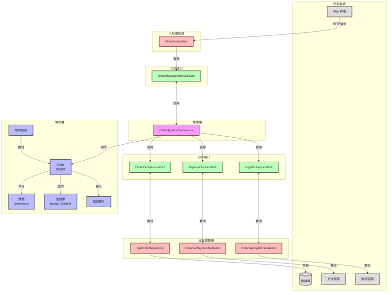
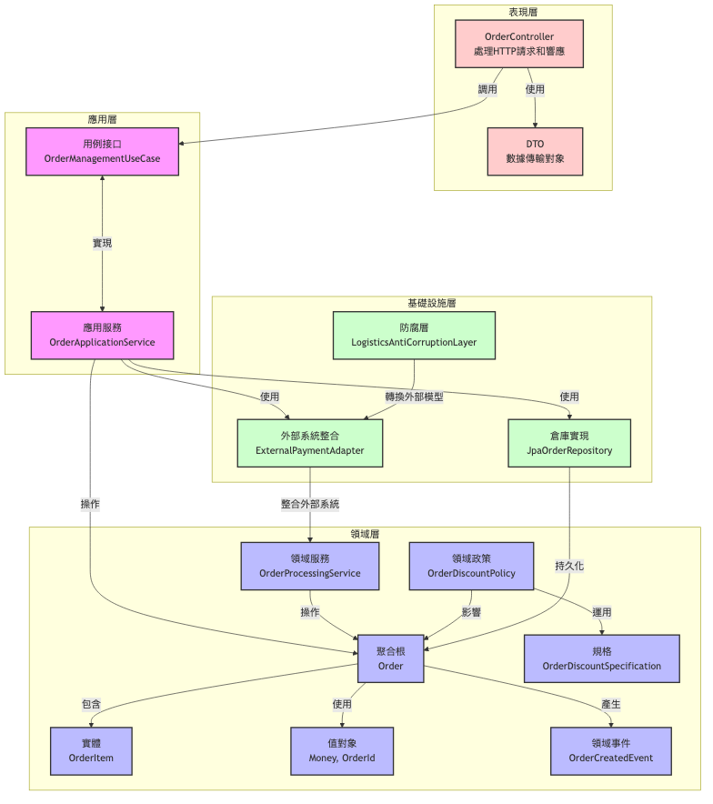
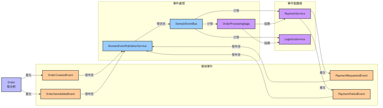

# System Architecture Overview

This document provides a high-level view of the system architecture, including major components and their interaction patterns.

## Hexagonal Architecture

## Domain-Driven Design Architecture

## Event-Driven Architecture

## Architecture Features

### Hexagonal Architecture (Ports and Adapters) Features

1. **Domain Core Independence**: Business logic is at the center, independent of external technical implementations.
2. **Ports Define Abstract Interfaces**:
   - Inbound Ports (Primary/Driving Ports): Define services the system provides externally (e.g., OrderManagementUseCase).
   - Outbound Ports (Secondary/Driven Ports): Define external dependencies the system needs (e.g., OrderPersistencePort).
3. **Adapters Implement Specific Technologies**:
   - Inbound Adapters (Primary/Driving Adapters): Handle external requests (e.g., REST controllers).
   - Outbound Adapters (Secondary/Driven Adapters): Interact with external systems (e.g., database storage, external services).
4. **Testability**: Business logic can be tested independently, without depending on external technical implementations.
5. **Easy Technology Replacement**: Technical implementations can be easily replaced without affecting core business logic.

### Domain-Driven Design (DDD) Features

1. **Rich Domain Model**: Uses concepts like aggregate roots, entities, and value objects to build rich domain models.
2. **Domain Events**: Captures important changes within the domain through events, achieving loose coupling between modules.
3. **Aggregate Boundaries**: Clearly defines consistency boundaries to ensure business rule integrity.
4. **Domain Services**: Handles business logic that doesn't fit within a single entity or value object.
5. **Anti-Corruption Layer (ACL)**: Isolates external systems through transformation layers, preventing external concepts from penetrating the domain model.
6. **Specification Pattern**: Uses specifications to encapsulate business rules, improving readability and maintainability.

### Layered Architecture Features

1. **Strict Dependency Direction**: Upper layers depend on lower layers, lower layers don't depend on upper layers.
2. **Layer Structure**:
   - **Interface Layer**: Handles user interactions, only depends on application layer.
   - **Application Layer**: Coordinates domain objects to complete use cases, only depends on domain layer.
   - **Domain Layer**: Contains core business logic and rules, doesn't depend on other layers.
   - **Infrastructure Layer**: Provides technical implementation, depends on domain layer, implements interfaces defined by domain layer.
3. **Data Transformation**:
   - Each layer uses its own data model (DTO).
   - Data transformation between layers is handled by mappers.
4. **Separation of Concerns**: Each layer has clear responsibilities, promoting code organization and maintenance.

### Event-Driven Architecture Features

1. **Event Sourcing**: Records system state changes through events, allowing system state reconstruction.
2. **Loose Coupling**: Event publishers don't need to know event consumers, consumers subscribe to events of interest.
3. **Scalability**: New event listeners can be easily added without affecting existing functionality.
4. **SAGA Pattern**: Coordinates complex business processes across aggregates or systems through events.

### Overall Architecture Advantages

1. **Separation of Concerns**: Each layer has clear responsibilities, promoting code organization and maintenance.
2. **Modularity**: System is decomposed into loosely coupled modules, facilitating development and maintenance.
3. **Complex Business Adaptation**: Capable of handling complex business logic and rules.
4. **Evolutionary Architecture**: System can evolve with changing business requirements without large-scale refactoring.
5. **Team Collaboration**: Different teams can focus on different modules, reducing conflicts.
6. **Continuous Delivery**: Supports incremental development and deployment, promoting continuous delivery.
7. **Architecture Consistency**: Ensures system compliance with predefined architectural rules through architecture testing.