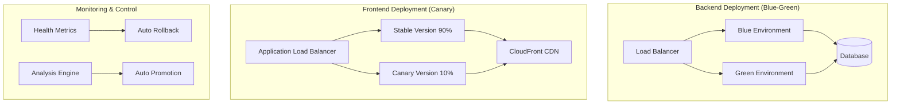
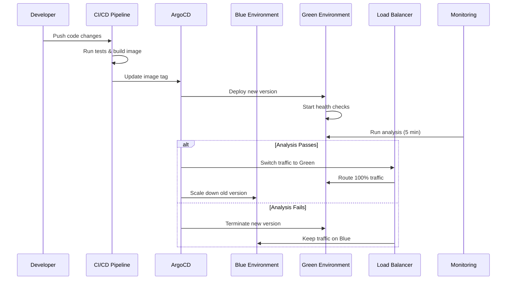
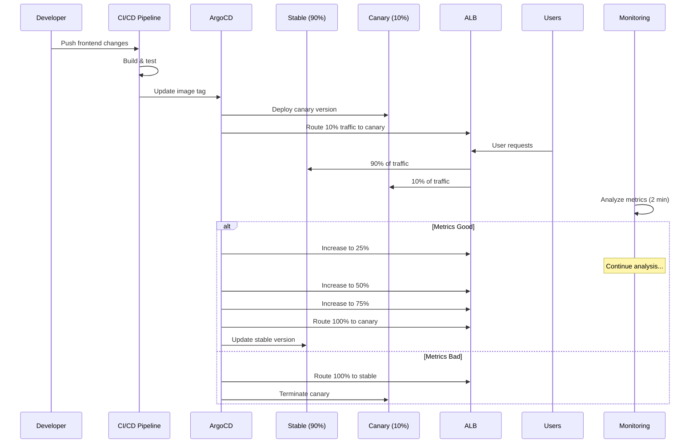

# ADR-013: Blue-Green vs Canary Deployment Strategies

## Status

**Accepted** - 2024-01-15

## Context

The GenAI Demo project requires sophisticated deployment strategies to ensure zero-downtime deployments while minimizing risk. Different components have different risk profiles and requirements, necessitating tailored deployment approaches.

### Business Requirements

- **Zero Downtime**: No service interruption during deployments
- **Risk Mitigation**: Minimize impact of deployment failures
- **Fast Rollback**: Quick recovery from problematic deployments
- **User Experience**: Maintain consistent user experience during deployments
- **Compliance**: Audit trail for all deployment activities

### Technical Requirements

- **Backend Services**: High availability, data consistency, complex business logic
- **Frontend Applications**: User-facing, performance-sensitive, A/B testing capability
- **Database Changes**: Schema migrations, data consistency
- **Infrastructure Updates**: Network, security, configuration changes

### Component Analysis

#### Backend Services (Spring Boot API)

- **Characteristics**: Stateful, database connections, complex business logic
- **Risk Profile**: High - business logic errors can cause data corruption
- **Rollback Requirements**: Immediate rollback capability
- **Testing Needs**: Comprehensive health checks, business logic validation

#### Frontend Applications (Next.js CMC, Angular Consumer)

- **Characteristics**: Stateless, user-facing, performance-sensitive
- **Risk Profile**: Medium - UI issues affect user experience but not data
- **Rollback Requirements**: Gradual rollback with user feedback
- **Testing Needs**: User experience validation, performance monitoring

## Decision

We implement **differentiated deployment strategies** based on component characteristics and risk profiles:

- **Backend Services**: Blue-Green deployment for immediate switching and rollback
- **Frontend Applications**: Canary deployment for gradual user exposure and feedback

### Architecture Overview



## Implementation Strategy

### 1. Backend Blue-Green Deployment

#### Argo Rollouts Configuration

```yaml
apiVersion: argoproj.io/v1alpha1
kind: Rollout
metadata:
  name: genai-demo-backend
spec:
  replicas: 3
  strategy:
    blueGreen:
      activeService: genai-demo-backend-active
      previewService: genai-demo-backend-preview
      autoPromotionEnabled: false
      scaleDownDelaySeconds: 30
      prePromotionAnalysis:
        templates:
        - templateName: success-rate
        args:
        - name: service-name
          value: genai-demo-backend-preview
      postPromotionAnalysis:
        templates:
        - templateName: success-rate
        args:
        - name: service-name
          value: genai-demo-backend-active
```

#### Health Check Analysis Template

```yaml
apiVersion: argoproj.io/v1alpha1
kind: AnalysisTemplate
metadata:
  name: success-rate
spec:
  args:
  - name: service-name
  - name: prometheus-server
    value: http://prometheus.monitoring.svc.cluster.local:9090
  metrics:
  - name: success-rate
    interval: 30s
    count: 5
    successCondition: result[0] >= 0.95
    failureLimit: 3
    provider:
      prometheus:
        address: "{{args.prometheus-server}}"
        query: |
          sum(rate(http_requests_total{service="{{args.service-name}}",status!~"5.."}[2m])) /
          sum(rate(http_requests_total{service="{{args.service-name}}"}[2m]))
  - name: avg-response-time
    interval: 30s
    count: 5
    successCondition: result[0] <= 0.5
    failureLimit: 3
    provider:
      prometheus:
        address: "{{args.prometheus-server}}"
        query: |
          histogram_quantile(0.95,
            sum(rate(http_request_duration_seconds_bucket{service="{{args.service-name}}"}[2m])) by (le)
          )
```

#### Blue-Green Deployment Process



### 2. Frontend Canary Deployment

#### Canary Rollout Configuration

```yaml
apiVersion: argoproj.io/v1alpha1
kind: Rollout
metadata:
  name: genai-demo-cmc-frontend
spec:
  replicas: 3
  strategy:
    canary:
      stableService: genai-demo-cmc-frontend-stable
      canaryService: genai-demo-cmc-frontend-canary
      trafficRouting:
        alb:
          ingress: genai-demo-cmc-frontend-ingress
          servicePort: 80
          rootService: genai-demo-cmc-frontend-root
      steps:
      - setWeight: 10
      - pause:
          duration: 2m
      - analysis:
          templates:
          - templateName: frontend-success-rate
      - setWeight: 25
      - pause:
          duration: 5m
      - analysis:
          templates:
          - templateName: frontend-success-rate
      - setWeight: 50
      - pause:
          duration: 10m
      - analysis:
          templates:
          - templateName: frontend-success-rate
      - setWeight: 75
      - pause:
          duration: 10m
      - analysis:
          templates:
          - templateName: frontend-success-rate
```

#### Frontend Analysis Template

```yaml
apiVersion: argoproj.io/v1alpha1
kind: AnalysisTemplate
metadata:
  name: frontend-success-rate
spec:
  metrics:
  - name: success-rate
    interval: 30s
    count: 5
    successCondition: result[0] >= 0.95
    failureLimit: 3
    provider:
      prometheus:
        query: |
          sum(rate(nginx_ingress_controller_requests{service="{{args.service-name}}",status!~"5.."}[2m])) /
          sum(rate(nginx_ingress_controller_requests{service="{{args.service-name}}"}[2m]))
  - name: avg-response-time
    interval: 30s
    count: 5
    successCondition: result[0] <= 1.0
    failureLimit: 3
    provider:
      prometheus:
        query: |
          histogram_quantile(0.95,
            sum(rate(nginx_ingress_controller_request_duration_seconds_bucket{service="{{args.service-name}}"}[2m])) by (le)
          )
```

#### Canary Deployment Process



### 3. Automated Rollback System

#### Health Metrics Monitoring

```python
# rollback-automation-app.py
class RollbackAutomation:
    
    def should_rollback(self, app: Application) -> tuple[bool, str]:
        """Determine if an application should be rolled back"""
        
        # Check metrics
        failed_metrics = []
        for metric in app.metrics:
            threshold_exceeded, value = self.check_metric(metric)
            if threshold_exceeded:
                failed_metrics.append(f"{metric.name}={value}")
        
        if failed_metrics:
            self.failure_counts[app.name] += 1
            consecutive_failures = self.config['rollback']['triggers']['consecutive_failures']
            
            if self.failure_counts[app.name] >= consecutive_failures:
                reason = f"Consecutive failures: {', '.join(failed_metrics)}"
                return True, reason
        else:
            self.failure_counts[app.name] = 0
        
        return False, "healthy"
    
    def trigger_rollback(self, app: Application, reason: str) -> bool:
        """Trigger rollback for an application"""
        try:
            if app.type == "rollout":
                success = self._rollback_rollout(app, reason)
            else:
                success = self._rollback_deployment(app, reason)
            
            if success:
                self._send_notification(app, reason, "rollback_triggered")
                
            return success
        except Exception as e:
            logger.error(f"Error triggering rollback: {e}")
            return False
```

#### Rollback Configuration

```yaml
# rollback-automation-config
rollback:
  enabled: true
  thresholds:
    error_rate: 0.05          # 5% error rate threshold
    response_time: 2.0        # 2 second response time threshold
    success_rate: 0.95        # 95% success rate threshold
    availability: 0.99        # 99% availability threshold
  
  intervals:
    check_interval: 30s       # How often to check metrics
    evaluation_window: 5m     # Time window for metric evaluation
    cooldown_period: 10m      # Cooldown between rollback attempts
  
  triggers:
    consecutive_failures: 3   # Number of consecutive failures to trigger rollback
    failure_percentage: 60    # Percentage of failed checks to trigger rollback
```

## Consequences

### Positive Outcomes

#### Business Benefits

- **Zero Downtime**: Both strategies ensure continuous service availability
- **Risk Mitigation**: Appropriate risk management for each component type
- **Fast Recovery**: Quick rollback capabilities minimize business impact
- **User Experience**: Gradual frontend rollouts enable user feedback incorporation

#### Technical Benefits

- **Automated Operations**: Minimal manual intervention required
- **Comprehensive Monitoring**: Health metrics drive deployment decisions
- **Flexible Strategies**: Different approaches for different component types
- **Audit Trail**: Complete deployment history and decision tracking

#### Operational Benefits

- **Reduced Stress**: Automated rollback reduces operational pressure
- **Faster Deployments**: Confidence in rollback enables more frequent deployments
- **Better Quality**: Analysis gates prevent problematic deployments
- **Team Productivity**: Developers can focus on features rather than deployment concerns

### Negative Outcomes

#### Complexity Challenges

- **Infrastructure Overhead**: Additional infrastructure for blue-green environments
- **Configuration Complexity**: Complex Argo Rollouts configurations
- **Monitoring Requirements**: Comprehensive metrics collection needed
- **Debugging Difficulty**: Multiple environments complicate troubleshooting

#### Resource Costs

- **Double Resources**: Blue-green requires 2x backend resources during deployment
- **Monitoring Infrastructure**: Additional monitoring and analysis infrastructure
- **Network Complexity**: Complex load balancer and ingress configurations
- **Storage Requirements**: Multiple image versions and configurations

#### Operational Challenges

- **Database Migrations**: Complex handling of schema changes
- **Configuration Management**: Environment-specific configurations
- **Testing Overhead**: Comprehensive testing required for analysis templates
- **Team Training**: Team needs training on new deployment processes

### Mitigation Strategies

#### Cost Optimization

- **Resource Scheduling**: Scale down non-production environments
- **Spot Instances**: Use spot instances for canary environments
- **Efficient Monitoring**: Optimize monitoring infrastructure costs
- **Automated Cleanup**: Automatic cleanup of old deployments

#### Complexity Management

- **Documentation**: Comprehensive deployment process documentation
- **Training Programs**: Team training on Argo Rollouts and monitoring
- **Standardization**: Standard templates and configurations
- **Automation**: Automated deployment pipeline setup

#### Risk Mitigation

- **Testing Strategy**: Comprehensive testing before deployment
- **Gradual Rollout**: Start with small user percentages
- **Monitoring Alerts**: Proactive alerting on deployment issues
- **Emergency Procedures**: Clear emergency rollback procedures

## Deployment Decision Matrix

| Component Type | Strategy | Reason | Traffic Split | Analysis Duration |
|---------------|----------|---------|---------------|-------------------|
| Backend API | Blue-Green | Data consistency, immediate rollback | 0% → 100% | 5 minutes |
| CMC Frontend | Canary | User feedback, gradual exposure | 10% → 25% → 50% → 75% → 100% | 20 minutes |
| Consumer Frontend | Canary | User experience, A/B testing | 10% → 25% → 50% → 75% → 100% | 20 minutes |
| Database | Blue-Green | Data integrity, immediate rollback | 0% → 100% | 10 minutes |
| Infrastructure | Blue-Green | System stability, quick recovery | 0% → 100% | 15 minutes |

## Success Metrics

### Deployment Success Metrics

- **Deployment Success Rate**: > 95%
- **Rollback Rate**: < 5%
- **Mean Time to Deploy**: < 30 minutes
- **Mean Time to Rollback**: < 5 minutes

### Quality Metrics

- **Post-Deployment Incidents**: < 2% of deployments
- **User-Reported Issues**: < 1% increase during canary
- **Performance Degradation**: < 5% during deployment
- **Availability**: > 99.9% during deployments

### Business Metrics

- **Deployment Frequency**: > 3 per day
- **Lead Time**: < 4 hours from commit to production
- **Change Failure Rate**: < 5%
- **Recovery Time**: < 1 hour for critical issues

## Well-Architected Framework Assessment

### Operational Excellence

- **Automation**: Fully automated deployment and rollback processes
- **Monitoring**: Comprehensive metrics-driven decision making
- **Documentation**: Self-documenting deployment processes
- **Continuous Improvement**: Regular analysis and optimization

### Security

- **Isolation**: Separate environments prevent security breaches
- **Audit Trail**: Complete deployment history and decisions
- **Access Control**: Role-based access to deployment controls
- **Compliance**: Automated compliance checking

### Reliability

- **Fault Tolerance**: Automatic rollback on failures
- **Recovery**: Quick recovery from deployment issues
- **Testing**: Comprehensive health checks and analysis
- **Availability**: Zero-downtime deployment strategies

### Performance Efficiency

- **Resource Optimization**: Efficient resource utilization during deployments
- **Monitoring**: Real-time performance monitoring
- **Scaling**: Automatic scaling during traffic shifts
- **Optimization**: Continuous performance optimization

### Cost Optimization

- **Resource Management**: Efficient use of deployment resources
- **Automation**: Reduced manual operational costs
- **Risk Reduction**: Lower cost of deployment failures
- **Efficiency**: Faster deployment cycles reduce overall costs

## Related Decisions

- [ADR-014: ArgoCD vs Flux for GitOps](./ADR-014-gitops-platform.md)
- [ADR-015: Automated Rollback Strategy](./ADR-015-automated-rollback.md)
- [ADR-007: EKS vs ECS vs Lambda](./ADR-007-container-orchestration.md)

## References

- [Blue-Green Deployment Pattern](https://martinfowler.com/bliki/BlueGreenDeployment.html)
- [Canary Deployment Pattern](https://martinfowler.com/bliki/CanaryRelease.html)
- [Argo Rollouts Documentation](https://argoproj.github.io/argo-rollouts/)
- [Kubernetes Deployment Strategies](https://kubernetes.io/docs/concepts/workloads/controllers/deployment/)
