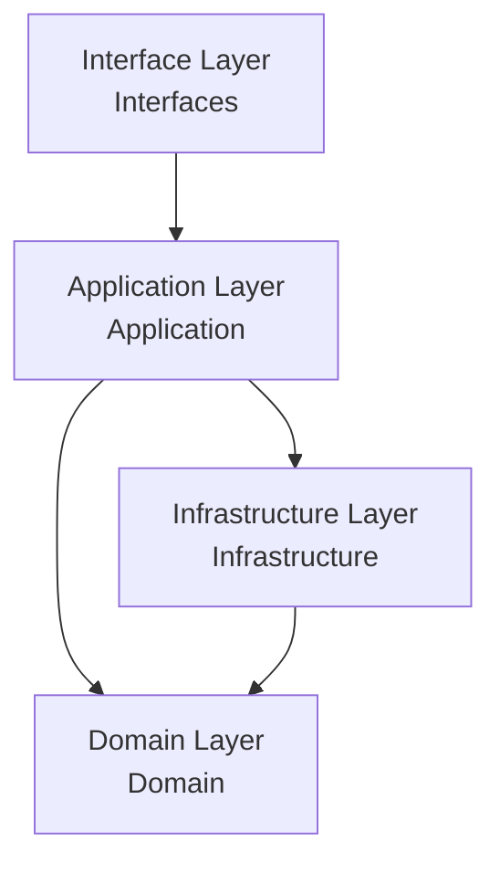
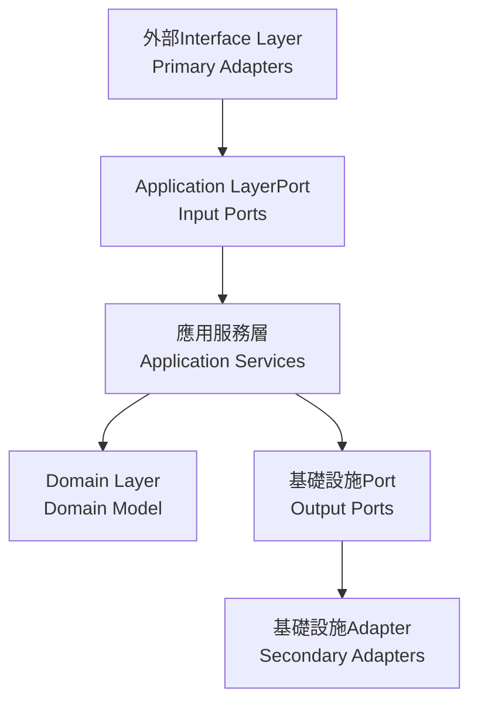

# Design

## Introduction

### 1. 傳統Layered Architecture (Traditional Layered Architecture)
- **特點**：
  - 最基本的分層方式：表現層 -> 業務層 -> 持久層
  - 每層只依賴其下層
  - 易於理解和實現
- **缺點**：
  - 層與層之間耦合度高
  - 難以實現業務邏輯的獨立性
  - 測試較為困難

### 2. 洋蔥架構 (Onion Architecture)
- **特點**：
  - 核心是領域模型（Domain Model）
  - 外層依賴內層，內層不知道外層的存在
  - 所有依賴都指向中心
- **優點**：
  - 業務邏輯高度內聚
  - 外部依賴（如Repository）容易替換
  - 良好的Testability
- **缺點**：
  - 學習曲線較陡
  - 可能過度抽象化

### 3. Hexagonal Architecture (Hexagonal Architecture / Ports and Adapters)
- **特點**：
  - 核心邏輯位於中心
  - 通過Port（Ports）定義接口
  - 使用Adapter（Adapters）實現外部整合
- **優點**：
  - 業務邏輯完全獨立
  - 外部依賴可以輕易替換
  - 非常適合Microservices Architecture
- **缺點**：
  - 初期開發成本較高
  - 小型項目可能過度設計

### 4. 簡潔架構 (Clean Architecture)
- **特點**：
  - 結合了洋蔥架構和Hexagonal Architecture的優點
  - 強調依賴規則：依賴只能指向內層
  - 使用接口來解耦
- **優點**：
  - 高度模組化
  - 極佳的Testability
  - 適應性強
- **缺點**：
  - 架構較為複雜
  - 需要寫更多的接口和轉換代碼

## 當前專案架構分析

我們的專案採用了Hexagonal Architecture（Hexagonal Architecture）作為主要的Layered ArchitectureDesign Pattern，並結合了Domain-Driven Design（DDD）和Event-Driven Architecture（EDA）的概念。

### 現有分層結構

### 1. Domain Layer (Domain Layer)
- **位置**: `solid.humank.genaidemo.domain`
- **職責**: 包含核心業務邏輯和領域模型
- **主要元素**:
  - **Aggregate Root (Aggregate Roots)**: `Order`, `Payment`, `Inventory`, `Delivery`, `Notification`, `OrderWorkflow`
  - **Value Object (Value Objects)**: `OrderId`, `Money`, `OrderStatus`, `DeliveryStatus`
  - **Domain Event (Domain Events)**: `OrderCreatedEvent`, `PaymentCompletedEvent`
  - **Domain Service (Domain Services)**: `PaymentService`
  - **Factory (Factories)**: `OrderFactory`
  - **儲存庫接口 (Repository Interfaces)**: `OrderRepository`, `PaymentRepository`

### 2. Application Layer (Application Layer)
- **位置**: `solid.humank.genaidemo.application`
- **職責**: 協調領域對象和外部Resource，實現用例
- **主要元素**:
  - **用例接口 (Use Case Interfaces)**: `OrderManagementUseCase`, `PaymentManagementUseCase`
  - **應用服務 (Application Services)**: `OrderApplicationService`, `PaymentApplicationService`
  - **Command對象 (Command Objects)**: `CreateOrderCommand`, `AddOrderItemCommand`, `ProcessPaymentCommand`
  - **DTO (Data Transfer Objects)**: `OrderResponse`, `PaymentResponseDto`
  - **輸出Port (Output Ports)**: `OrderPersistencePort`, `PaymentServicePort`, `LogisticsServicePort`

### 3. Infrastructure Layer (Infrastructure Layer)
- **位置**: `solid.humank.genaidemo.infrastructure`
- **職責**: 提供技術實現和External System整合
- **主要元素**:
  - **儲存庫實現 (Repository Implementations)**: `OrderRepositoryAdapter`, `JpaOrderRepository`
  - **External SystemAdapter (External System Adapters)**: `ExternalPaymentAdapter`, `ExternalLogisticsAdapter`
  - **ORM Entity (ORM Entities)**: `JpaOrderEntity`, `JpaOrderItemEntity`
  - **事件處理 (Event Handling)**: `SimpleEventBus`
  - **Saga 協調器 (Saga Coordinators)**: `OrderProcessingSaga`
  - **Anti-Corruption Layer (Anti-Corruption Layer)**: `LogisticsAntiCorruptionLayer`

### 4. Interface Layer (Interfaces Layer)
- **位置**: `solid.humank.genaidemo.interfaces`
- **職責**: 處理用戶交互和外部請求
- **主要元素**:
  - **控制器 (Controllers)**: `OrderController`, `PaymentController`
  - **請求/響應模型 (Request/Response Models)**: `CreateOrderRequest`, `OrderResponse`
  - **API 端點 (API Endpoints)**: REST API 定義
  - **異常處理 (Exception Handling)**: 全局異常處理器

## Design

### 1. Port與Adapter模式 (Ports and Adapters Pattern)
- **輸入Port (Input Ports)**: 定義系統功能的接口，如 `OrderManagementUseCase`
- **輸出Port (Output Ports)**: 定義系統對外部依賴的接口，如 `OrderPersistencePort`
- **主要Adapter (Primary Adapters)**: 實現輸入Port的外部組件，如 `OrderController`
- **次要Adapter (Secondary Adapters)**: 實現輸出Port的外部組件，如 `OrderRepositoryAdapter`

### 2. Command模式 (Command Pattern)
- **Command對象 (Command Objects)**: 封裝用戶意圖的對象，如 `CreateOrderCommand`
- **Command處理器 (Command Handlers)**: 處理Command的組件，通常是應用服務
- **CommandFactory (Command Factories)**: 創建Command對象的靜態方法，如 `CreateOrderCommand.of()`

### 3. Domain Event模式 (Domain Event Pattern)
- **事件對象 (Event Objects)**: 表示領域中發生的事件，如 `OrderCreatedEvent`
- **事件發布 (Event Publishing)**: 通過 `DomainEventPublisherService` 發布事件
- **事件訂閱 (Event Subscription)**: 通過事件監聽器處理事件

### 4. 儲存庫模式 (Repository Pattern)
- **儲存庫接口 (Repository Interfaces)**: 定義持久化操作的接口，如 `OrderRepository`
- **儲存庫實現 (Repository Implementations)**: 實現持久化操作，如 `OrderRepositoryAdapter`
- **查詢方法 (Query Methods)**: 定義查詢數據的方法，如 `findById`, `findByCustomerId`

### 5. Factory模式 (Factory Pattern)
- **領域Factory (Domain Factories)**: 創建複雜領域對象的組件，如 `OrderFactory`
- **Factory方法 (Factory Methods)**: 封裝對象創建邏輯的方法，如 `create`, `reconstitute`

### 6. Value Object模式 (Value Object Pattern)
- **不可變性 (Immutability)**: Value Object一旦創建就不可修改，如 `Money`
- **相等性比較 (Equality Comparison)**: 基於屬性值而非身份比較相等性
- **自包含驗證 (Self-Contained Validation)**: Value Object自身包含驗證邏輯

### 7. Saga 模式 (Saga Pattern)
- **流程協調 (Process Coordination)**: 協調跨多個Aggregate Root的業務流程，如 `OrderProcessingSaga`
- **補償事務 (Compensating Transactions)**: 處理失敗情況下的回滾操作
- **狀態管理 (State Management)**: 管理長時間運行的業務流程的狀態

### 8. Anti-Corruption Layer模式 (Anti-Corruption Layer Pattern)
- **External System隔離 (External System Isolation)**: 隔離External System的差異，如 `LogisticsAntiCorruptionLayer`
- **模型轉換 (Model Translation)**: 在不同模型之間進行轉換
- **接口適配 (Interface Adaptation)**: 適配不兼容的接口

### 9. 依賴注入模式 (Dependency Injection Pattern)
- **Construct函數注入 (Constructor Injection)**: 通過Construct函數注入依賴
- **接口依賴 (Interface Dependencies)**: 依賴於接口而非具體實現
- **控制反轉 (Inversion of Control)**: 依賴的控制權交給外部容器

## 推薦架構選擇

基於當前專案的實現，我們應該繼續完善Hexagonal Architecture（Hexagonal Architecture）的應用，並加強以下方面：

### 1. 統一Command模式的應用
- 確保所有用戶意圖都通過Command對象表達
- 在控制器中創建Command對象，傳遞給應用服務
- 保持Command對象的不可變性和自包含驗證

### 2. 增強Event-Driven Architecture
- 完善Domain Event的發布和訂閱機制
- 實現Event Sourcing（Event Sourcing）以記錄系統狀態變化
- 使用事件總線（Event Bus）實現跨Bounded Context的通信

### 3. 實現 Command Query Responsibility Segregation (Command Query Responsibility Segregation (CQRS)) 模式
- 分離Command和查詢責任
- 為複雜查詢創建專用的Read Model
- 優化讀寫Performance

### 4. 完善 Saga 協調器
- 實現持久化 Saga 狀態
- 增強補償邏輯的健壯性
- 支持 Saga 恢復和重試

### recommendations的分層結構：

### Implementation

1. **Domain Layer（Domain Layer）**：
   - 保持當前的領域模型設計
   - 增強Domain Event的使用
   - 確保Aggregate Root的邊界清晰

2. **Application Layer（Application Layer）**：
   - 統一使用Command對象
   - 實現 Command Query Responsibility Segregation (Command Query Responsibility Segregation (CQRS)) 分離
   - 完善 Saga 協調器

3. **Infrastructure Layer（Infrastructure Layer）**：
   - 增強事件持久化
   - 完善External SystemAdapter
   - 實現分佈式Tracing

4. **Interface Layer（Interfaces Layer）**：
   - 統一 API 響應格式
   - 增強錯誤處理
   - 實現 API 版本控制

這種架構將幫助專案：
- 保持領域邏輯的純粹性
- 提升系統的Testability
- 簡化External System整合
- 支持未來的演化和擴展
