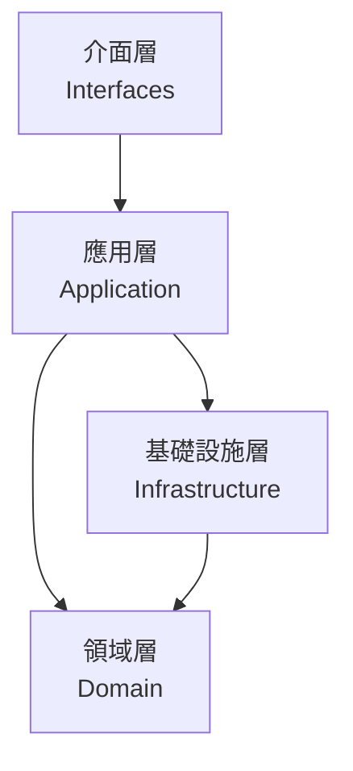
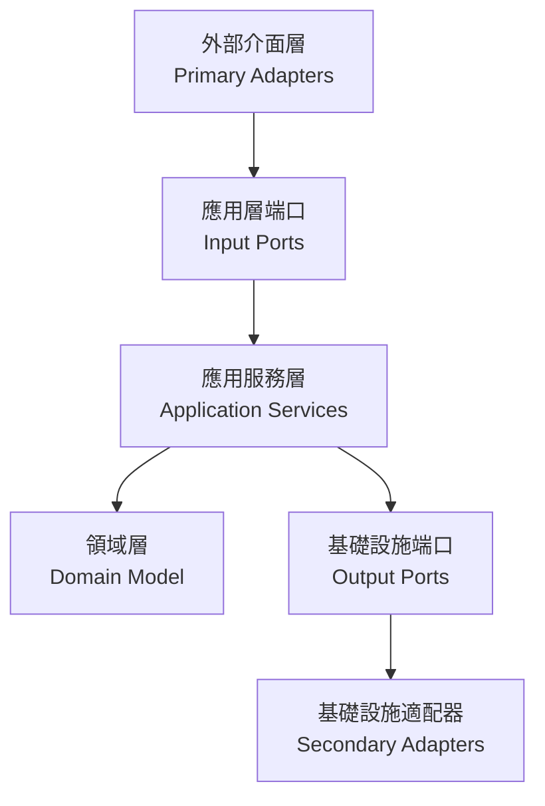

<!-- This document needs manual translation from Chinese to English -->
<!-- 此文檔需要從中文手動翻譯為英文 -->

# 分層架構設計分析與建議

## 常見分層架構介紹

### 1. 傳統分層架構 (Traditional Layered Architecture)
- **特點**：
  - 最基本的分層方式：表現層 -> 業務層 -> 持久層
  - 每層只依賴其下層
  - 易於理解和實現
- **缺點**：
  - 層與層之間耦合度高
  - 難以實現業務邏輯的獨立性
  - 測試較為困難

### 2. 洋蔥架構 (Onion Architecture)
- **特點**：
  - 核心是領域模型（Domain Model）
  - 外層依賴內層，內層不知道外層的存在
  - 所有依賴都指向中心
- **優點**：
  - 業務邏輯高度內聚
  - 外部依賴（如資料庫）容易替換
  - 良好的可測試性
- **缺點**：
  - 學習曲線較陡
  - 可能過度抽象化

### 3. 六角架構 (Hexagonal Architecture / Ports and Adapters)
- **特點**：
  - 核心邏輯位於中心
  - 通過端口（Ports）定義接口
  - 使用適配器（Adapters）實現外部整合
- **優點**：
  - 業務邏輯完全獨立
  - 外部依賴可以輕易替換
  - 非常適合微服務架構
- **缺點**：
  - 初期開發成本較高
  - 小型項目可能過度設計

### 4. 簡潔架構 (Clean Architecture)
- **特點**：
  - 結合了洋蔥架構和六角架構的優點
  - 強調依賴規則：依賴只能指向內層
  - 使用接口來解耦
- **優點**：
  - 高度模組化
  - 極佳的可測試性
  - 適應性強
- **缺點**：
  - 架構較為複雜
  - 需要寫更多的接口和轉換代碼

## 當前專案架構分析

我們的專案採用了六角架構（Hexagonal Architecture）作為主要的分層架構設計模式，並結合了領域驅動設計（DDD）和事件驅動架構（EDA）的概念。

### 現有分層結構

### 1. 領域層 (Domain Layer)
- **位置**: `solid.humank.genaidemo.domain`
- **職責**: 包含核心業務邏輯和領域模型
- **主要元素**:
  - **聚合根 (Aggregate Roots)**: `Order`, `Payment`, `Inventory`, `Delivery`, `Notification`, `OrderWorkflow`
  - **值對象 (Value Objects)**: `OrderId`, `Money`, `OrderStatus`, `DeliveryStatus`
  - **領域事件 (Domain Events)**: `OrderCreatedEvent`, `PaymentCompletedEvent`
  - **領域服務 (Domain Services)**: `PaymentService`
  - **工廠 (Factories)**: `OrderFactory`
  - **儲存庫接口 (Repository Interfaces)**: `OrderRepository`, `PaymentRepository`

### 2. 應用層 (Application Layer)
- **位置**: `solid.humank.genaidemo.application`
- **職責**: 協調領域對象和外部資源，實現用例
- **主要元素**:
  - **用例接口 (Use Case Interfaces)**: `OrderManagementUseCase`, `PaymentManagementUseCase`
  - **應用服務 (Application Services)**: `OrderApplicationService`, `PaymentApplicationService`
  - **命令對象 (Command Objects)**: `CreateOrderCommand`, `AddOrderItemCommand`, `ProcessPaymentCommand`
  - **DTO (Data Transfer Objects)**: `OrderResponse`, `PaymentResponseDto`
  - **輸出端口 (Output Ports)**: `OrderPersistencePort`, `PaymentServicePort`, `LogisticsServicePort`

### 3. 基礎設施層 (Infrastructure Layer)
- **位置**: `solid.humank.genaidemo.infrastructure`
- **職責**: 提供技術實現和外部系統整合
- **主要元素**:
  - **儲存庫實現 (Repository Implementations)**: `OrderRepositoryAdapter`, `JpaOrderRepository`
  - **外部系統適配器 (External System Adapters)**: `ExternalPaymentAdapter`, `ExternalLogisticsAdapter`
  - **ORM 實體 (ORM Entities)**: `JpaOrderEntity`, `JpaOrderItemEntity`
  - **事件處理 (Event Handling)**: `SimpleEventBus`
  - **Saga 協調器 (Saga Coordinators)**: `OrderProcessingSaga`
  - **防腐層 (Anti-Corruption Layer)**: `LogisticsAntiCorruptionLayer`

### 4. 介面層 (Interfaces Layer)
- **位置**: `solid.humank.genaidemo.interfaces`
- **職責**: 處理用戶交互和外部請求
- **主要元素**:
  - **控制器 (Controllers)**: `OrderController`, `PaymentController`
  - **請求/響應模型 (Request/Response Models)**: `CreateOrderRequest`, `OrderResponse`
  - **API 端點 (API Endpoints)**: REST API 定義
  - **異常處理 (Exception Handling)**: 全局異常處理器

## 應用的設計模式與概念

### 1. 端口與適配器模式 (Ports and Adapters Pattern)
- **輸入端口 (Input Ports)**: 定義系統功能的接口，如 `OrderManagementUseCase`
- **輸出端口 (Output Ports)**: 定義系統對外部依賴的接口，如 `OrderPersistencePort`
- **主要適配器 (Primary Adapters)**: 實現輸入端口的外部組件，如 `OrderController`
- **次要適配器 (Secondary Adapters)**: 實現輸出端口的外部組件，如 `OrderRepositoryAdapter`

### 2. 命令模式 (Command Pattern)
- **命令對象 (Command Objects)**: 封裝用戶意圖的對象，如 `CreateOrderCommand`
- **命令處理器 (Command Handlers)**: 處理命令的組件，通常是應用服務
- **命令工廠 (Command Factories)**: 創建命令對象的靜態方法，如 `CreateOrderCommand.of()`

### 3. 領域事件模式 (Domain Event Pattern)
- **事件對象 (Event Objects)**: 表示領域中發生的事件，如 `OrderCreatedEvent`
- **事件發布 (Event Publishing)**: 通過 `DomainEventPublisherService` 發布事件
- **事件訂閱 (Event Subscription)**: 通過事件監聽器處理事件

### 4. 儲存庫模式 (Repository Pattern)
- **儲存庫接口 (Repository Interfaces)**: 定義持久化操作的接口，如 `OrderRepository`
- **儲存庫實現 (Repository Implementations)**: 實現持久化操作，如 `OrderRepositoryAdapter`
- **查詢方法 (Query Methods)**: 定義查詢數據的方法，如 `findById`, `findByCustomerId`

### 5. 工廠模式 (Factory Pattern)
- **領域工廠 (Domain Factories)**: 創建複雜領域對象的組件，如 `OrderFactory`
- **工廠方法 (Factory Methods)**: 封裝對象創建邏輯的方法，如 `create`, `reconstitute`

### 6. 值對象模式 (Value Object Pattern)
- **不可變性 (Immutability)**: 值對象一旦創建就不可修改，如 `Money`
- **相等性比較 (Equality Comparison)**: 基於屬性值而非身份比較相等性
- **自包含驗證 (Self-Contained Validation)**: 值對象自身包含驗證邏輯

### 7. Saga 模式 (Saga Pattern)
- **流程協調 (Process Coordination)**: 協調跨多個聚合根的業務流程，如 `OrderProcessingSaga`
- **補償事務 (Compensating Transactions)**: 處理失敗情況下的回滾操作
- **狀態管理 (State Management)**: 管理長時間運行的業務流程的狀態

### 8. 防腐層模式 (Anti-Corruption Layer Pattern)
- **外部系統隔離 (External System Isolation)**: 隔離外部系統的差異，如 `LogisticsAntiCorruptionLayer`
- **模型轉換 (Model Translation)**: 在不同模型之間進行轉換
- **接口適配 (Interface Adaptation)**: 適配不兼容的接口

### 9. 依賴注入模式 (Dependency Injection Pattern)
- **構造函數注入 (Constructor Injection)**: 通過構造函數注入依賴
- **接口依賴 (Interface Dependencies)**: 依賴於接口而非具體實現
- **控制反轉 (Inversion of Control)**: 依賴的控制權交給外部容器

## 推薦架構選擇

基於當前專案的實現，我們應該繼續完善六角架構（Hexagonal Architecture）的應用，並加強以下方面：

### 1. 統一命令模式的應用
- 確保所有用戶意圖都通過命令對象表達
- 在控制器中創建命令對象，傳遞給應用服務
- 保持命令對象的不可變性和自包含驗證

### 2. 增強事件驅動架構
- 完善領域事件的發布和訂閱機制
- 實現事件溯源（Event Sourcing）以記錄系統狀態變化
- 使用事件總線（Event Bus）實現跨界限上下文的通信

### 3. 實現 CQRS 模式
- 分離命令和查詢責任
- 為複雜查詢創建專用的讀模型
- 優化讀寫性能

### 4. 完善 Saga 協調器
- 實現持久化 Saga 狀態
- 增強補償邏輯的健壯性
- 支持 Saga 恢復和重試

### 建議的分層結構：

### 實施建議：

1. **領域層（Domain Layer）**：
   - 保持當前的領域模型設計
   - 增強領域事件的使用
   - 確保聚合根的邊界清晰

2. **應用層（Application Layer）**：
   - 統一使用命令對象
   - 實現 CQRS 分離
   - 完善 Saga 協調器

3. **基礎設施層（Infrastructure Layer）**：
   - 增強事件持久化
   - 完善外部系統適配器
   - 實現分佈式追蹤

4. **介面層（Interfaces Layer）**：
   - 統一 API 響應格式
   - 增強錯誤處理
   - 實現 API 版本控制

這種架構將幫助專案：
- 保持領域邏輯的純粹性
- 提升系統的可測試性
- 簡化外部系統整合
- 支持未來的演化和擴展
