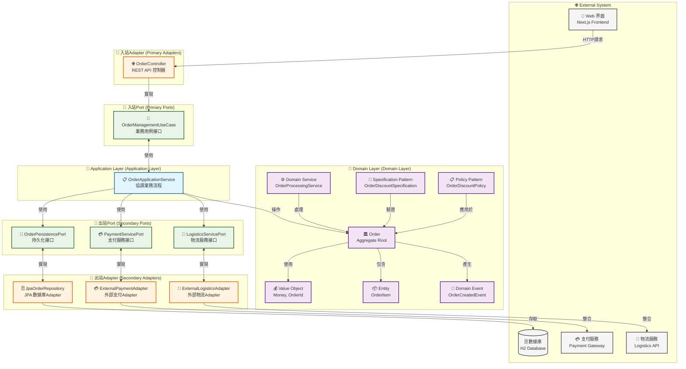
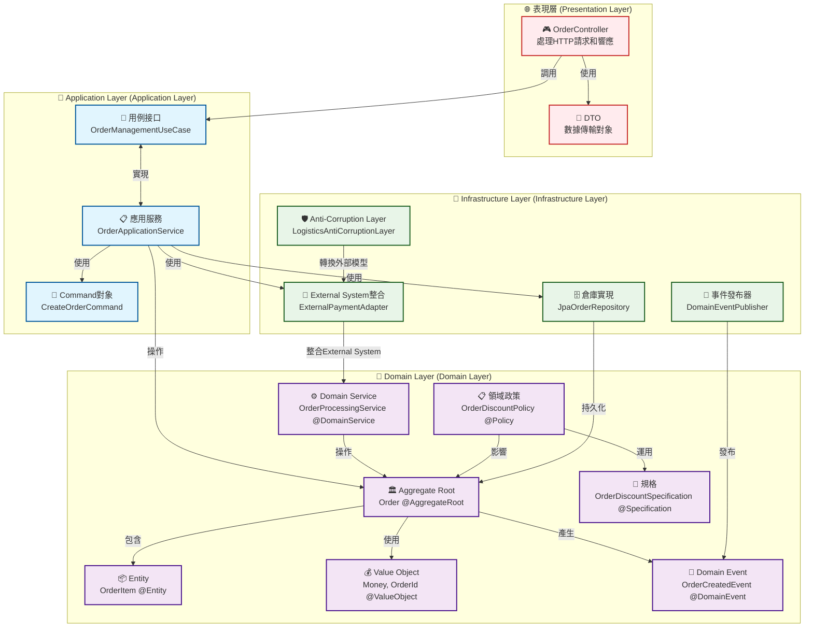
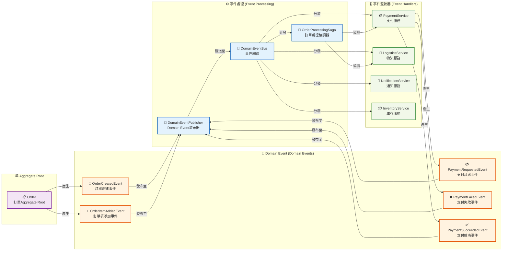
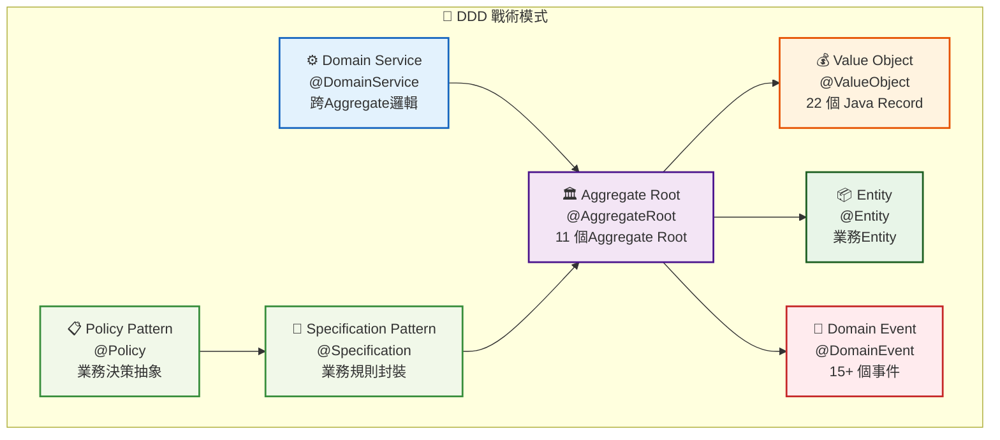
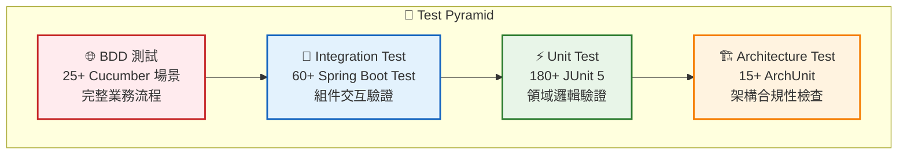

# Overview

This document提供了對系統架構的高層次視圖，包括主要組件及其交互方式。

## Hexagonal Architecture（Hexagonal Architecture）

## Design

## Event-Driven Architecture

## 架構特點

### Hexagonal Architecture（Port和Adapter）特點

1. **領域核心獨立性**：業務邏輯位於中心，不依賴於外部技術實現。
2. **Port定義抽象接口**：
   - 入站Port（Primary/Driving Ports）：定義系統對外提供的服務（如OrderManagementUseCase）。
   - 出站Port（Secondary/Driven Ports）：定義系統需要的外部依賴（如OrderPersistencePort）。
3. **Adapter實現具體技術**：
   - 入站Adapter（Primary/Driving Adapters）：處理外部請求（如REST控制器）。
   - 出站Adapter（Secondary/Driven Adapters）：與External System交互（如數據庫存儲、外部服務）。
4. **Testability**：業務邏輯可以獨立測試，不依賴於外部技術實現。
5. **技術替換簡單**：可以輕鬆替換技術實現，不影響核心業務邏輯。

### Design

1. **豐富的領域模型**：使用Aggregate Root、Entity、Value Object等概念建立豐富的領域模型。
2. **Domain Event**：通過事件捕獲領域內發生的重要變化，實現模塊間鬆散耦合。
3. **Aggregate邊界**：明確定義一致性邊界，保證業務規則的完整性。
4. **Domain Service**：處理不適合放在單一Entity或Value Object中的業務邏輯。
5. **Anti-Corruption Layer（ACL）**：通過轉換層隔離External System，防止外部概念滲透到領域模型中。
6. **Specification Pattern**：使用規格（Specification）封裝業務規則，提高可讀性和Maintainability。

### Layered Architecture特點

1. **嚴格的依賴方向**：上層依賴下層，下層不依賴上層。
2. **分層結構**：
   - **Interface Layer**：處理用戶交互，只依賴Application Layer。
   - **Application Layer**：協調領域對象完成用例，只依賴Domain Layer。
   - **Domain Layer**：包含業務核心邏輯和規則，不依賴其他層。
   - **Infrastructure Layer**：提供技術實現，依賴Domain Layer，實現Domain Layer定義的接口。
3. **數據轉換**：
   - 每一層使用自己的數據模型（DTO）。
   - 層與層之間通過映射器（Mapper）進行數據轉換。
4. **Concern分離**：每一層有明確的職責，促進代碼組織和維護。

### Event-Driven Architecture特點

1. **Event Sourcing**：通過事件記錄系統狀態變化，可以重建系統狀態。
2. **鬆散耦合**：事件發布者不需要知道事件消費者，消費者訂閱感興趣的事件。
3. **擴展性**：可以輕鬆添加新的事件監聽器，不影響現有功能。
4. **SAGA模式**：通過事件協調跨Aggregate或跨系統的複雜業務流程。

### 整體架構優勢

1. **Concern分離**：每一層都有明確的職責，促進代碼組織和維護。
2. **模塊化**：系統被分解為鬆散耦合的模塊，便於開發和維護。
3. **適應複雜業務**：能夠處理複雜的業務邏輯和規則。
4. **演進架構**：系統可以隨著業務需求的變化而演進，不需要大規模Refactoring。
5. **團隊協作**：不同的團隊可以專注於不同的模塊，減少衝突。
6. **持續交付**：支持增量開發和Deployment，促進持續交付。
7. **架構一致性**：通過Architecture Test確保系統符合預定的架構規則。

## 🏆 架構實現成果 (2025年8月)

### 架構評分總覽

| 架構維度 | 評分 | 說明 |
|----------|------|------|
| Hexagonal Architecture合規性 | 9.5/10 | 嚴格的Port與Adapter分離 |
| DDD 實踐完整性 | 9.5/10 | 完整的戰術模式實現 |
| 代碼品質 | 9.0/10 | Java Record Refactoring，減少樣板代碼 |
| Test Coverage | 10.0/10 | 272 個測試，100% 通過率 |
| 文檔完整性 | 9.0/10 | 30+ 個詳細文檔 |
| **總體評分** | **9.4/10** | **優秀級別** |

### DDD 戰術模式完整實現

### Java Record Refactoring成果

- **22 個主要類別**轉換為 Record 實現
- **減少 30-40% 樣板代碼**，提升可讀性和維護性
- **天然不可變性**，符合 DDD Value ObjectDesign Principle
- **自動實現**核心方法 (equals, hashCode, toString)

### Testing

**測試統計**: 272 個測試，100% 通過率，全面覆蓋業務邏輯、API 端點、架構合規性

## 📚 相關文檔

- [專案summary報告 2025](PROJECT_SUMMARY_2025.md) - 完整的專案成果summary
- [架構卓越性報告 2025](ARCHITECTURE_EXCELLENCE_2025.md) - 詳細的Architecture Assessment和分析
- [DDD Record Refactoringsummary](../DDD_RECORD_reports-summaries/project-management/REFACTORING_SUMMARY.md) - Java Record Refactoring的詳細過程
- [測試修復完成報告](test-fixes-complete-2025.md) - 測試品質改善的完整記錄
