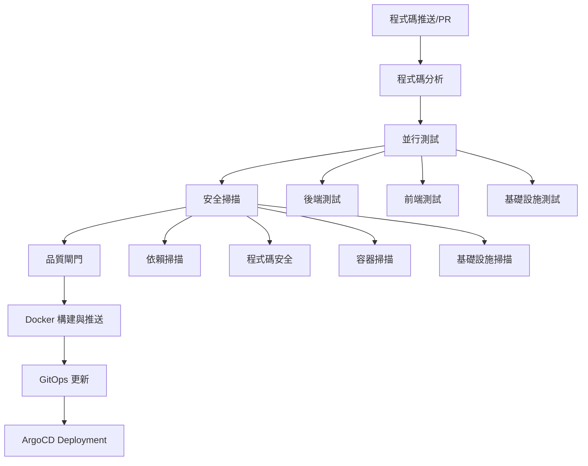

# CI/CD Pipeline文檔

本目錄包含 GenAI Demo 專案的完整 CI/CD Pipeline配置，實現Automated Testing、安全掃描、多架構 Docker 構建和 GitOps DeploymentPolicy。

## 🏗️ Pipeline架構

### Overview

CI/CD Pipeline遵循現代 DevOps 實踐：

- **全面測試**: Unit Test、Integration Test、BDD 測試和Architecture Test
- **安全優先方法**: 多層安全掃描和漏洞評估
- **多架構構建**: ARM64 Graviton3 優化的 Docker 映像
- **品質閘門**: 自動化Quality Assurance和合規檢查
- **GitOps Deployment**: ArgoCD 的自動化清單更新

### Pipeline流程



## 📁 工作流程文件

### 核心工作流程

#### 1. `ci-cd.yml` - 主要 CI/CD Pipeline

**觸發條件**: 推送到 main/develop 分支、Pull Request  
**目的**: 包含測試、安全和Deployment的完整 CI/CD Pipeline

**主要功能**:

- **變更檢測**: 僅根據文件變更運行相關測試
- **並行執行**: 後端、前端和基礎設施測試並行運行
- **多架構構建**: ARM64 和 AMD64 Docker 映像
- **品質閘門**: 具有可配置閾值的自動化Quality Assurance
- **GitOps 整合**: 自動 Kubernetes 清單更新

**作業**:

1. **程式碼分析** - 變更檢測和依賴漏洞掃描
2. **後端測試** - 單元、整合、BDD 和Architecture Test
3. **前端測試** - CMC 和消費者前端測試與 Lighthouse
4. **基礎設施測試** - CDK 單元、整合和合規測試
5. **安全掃描** - 全面安全分析
6. **構建與推送** - 多架構 Docker 映像構建
7. **品質閘門** - 自動化Quality Assurance和報告
8. **Deployment準備** - GitOps 清單更新
9. **通知** - 狀態報告和清理

#### 2. `security-scan.yml` - 安全掃描工作流程

**觸發條件**: 工作流程調用、手動調度、每日排程  
**目的**: 跨所有組件的全面安全掃描

**掃描類型**:

- **依賴漏洞**: OWASP Dependency Check、npm audit
- **靜態程式碼分析**: CodeQL、Semgrep
- **容器安全**: Trivy、Hadolint
- **基礎設施安全**: CDK-nag、Checkov

#### Testing

**觸發條件**: 手動調度、每週排程  
**目的**: Load Test和效能Monitoring

**測試類型**:

- **Load Test**: 基於 K6 的 API Load Test
- **Repository效能**: Repository操作基準測試
- **前端效能**: Lighthouse CI 效能審計

#### 4. `dependency-update.yml` - 依賴管理

**觸發條件**: 每週排程、手動調度  
**目的**: 以安全為重點的自動化依賴更新

**更新類型**:

- **安全更新**: 關鍵漏洞修補
- **次要更新**: 相容功能更新
- **主要更新**: 破壞性變更更新（手動審查）

#### 5. `release.yml` - 發布管理

**觸發條件**: Git 標籤、手動調度  
**目的**: 使用語義版本控制的自動化發布創建

**發布流程**:

1. 版本驗證和標籤創建
2. 完整測試套件執行
3. 安全掃描驗證
4. 發布工件構建
5. Docker 映像發布
6. 變更Logging生成
7. GitHub 發布創建
8. Deployment清單更新

### 支援文件

#### `dependabot.yml` - 自動化依賴更新

配置 Dependabot 用於:

- Java/Gradle 依賴
- Node.js/npm 依賴
- Docker 基礎映像
- GitHub Actions

#### `CODEOWNERS` - Code Review要求

定義審查要求:

- 後端程式碼 (@backend-team)
- 前端程式碼 (@frontend-team)
- 基礎設施程式碼 (@devops-team)
- 安全敏感文件 (@security-team)

#### Templates

標準化 PR 模板包含:

- 變更描述和類型
- 測試檢查清單
- 安全考量
- 效能影響評估
- Deployment考量

## 🔧 配置

### Environment變數

#### 必需的機密

```yaml
AWS_ACCESS_KEY_ID: 用於 ECR 和Deployment的 AWS 存取金鑰
AWS_SECRET_ACCESS_KEY: AWS 秘密金鑰
AWS_ACCOUNT_ID: ECR 儲存庫的 AWS 帳戶 ID
GITHUB_TOKEN: 用於發布和 PR 評論的 GitHub 權杖
```

#### Pipeline配置

```yaml
# AWS 配置
AWS_REGION: ap-northeast-1 (主要區域)
AWS_REGION_DR: ap-east-2 (災難恢復區域)

# 構建配置
JAVA_VERSION: '21'
NODE_VERSION: '18'

# 品質閘門
QUALITY_GATE_COVERAGE_THRESHOLD: 80
VULNERABILITY_SEVERITY_THRESHOLD: 'HIGH'
```

### ECR 儲存庫

Pipeline推送到這些 ECR 儲存庫:

- `genai-demo/backend` - Spring Boot 後端
- `genai-demo/cmc-frontend` - Next.js CMC 前端
- `genai-demo/consumer-frontend` - Angular 消費者前端

### Docker 映像標籤

映像標籤包含:

- `latest` - 最新 main 分支構建
- `{branch-name}` - 分支特定構建
- `{branch-name}-{sha}` - 提交特定構建
- `{version}` - 發布版本（例如 v1.2.3）

## Testing

### Testing

#### Testing

1. **Unit Test** (`./gradlew test`)
   - 純業務邏輯測試
   - 模擬外部依賴
   - 快速執行（< 100ms 每個測試）

2. **Integration Test** (`./gradlew integrationTest`)
   - RepositoryIntegration Test
   - 外部服務整合
   - Spring 上下文載入

3. **BDD 測試** (`./gradlew cucumber`)
   - Behavior-Driven Development (BDD)場景
   - 端到端用戶工作流程
   - Gherkin 功能規範

4. **Architecture Test** (`./gradlew testArchitecture`)
   - 基於 ArchUnit 的架構驗證
   - DDD 模式合規性
   - 依賴規則執行

#### Testing

1. **Unit Test** (`npm run test:ci`)
   - 組件測試
   - 服務測試
   - 工具函數測試

2. **構建驗證** (`npm run build`)
   - TypeScript 編譯
   - 包優化
   - 資產生成

3. **程式碼檢查** (`npm run lint`)
   - 程式碼風格執行
   - Best Practice驗證
   - 無障礙檢查

#### Testing

1. **CDK Unit Test** (`npm run test:unit`)
   - Construct測試
   - Resource配置驗證
   - Stack組合測試

2. **CDK Integration Test** (`npm run test:integration`)
   - 跨Stack依賴
   - Resource關係
   - 配置驗證

3. **CDK 快照測試** (`npm run test:snapshot`)
   - CloudFormation 模板驗證
   - 基礎設施漂移檢測
   - 變更影響分析

4. **合規測試** (`npm run test:compliance`)
   - 安全規則驗證
   - Best Practice合規性
   - 成本優化檢查

### Testing

#### 並行執行

- 後端、前端和基礎設施測試並行運行
- 多個測試套件的矩陣Policy
- 優化Resource利用

#### 條件執行

- 僅在相關程式碼變更時運行測試
- 基於路徑的變更檢測
- 高效的 CI Resource使用

#### 品質閾值

- Test Coverage最低: 80%
- 安全漏洞閾值: HIGH
- 效能回歸檢測

## Implementation

### 多層安全掃描

#### 1. 依賴漏洞掃描

- **OWASP Dependency Check**: Java 依賴
- **npm audit**: Node.js 依賴
- **Trivy**: 容器基礎映像
- **GitHub Security Advisories**: 自動化漏洞檢測

#### 2. 靜態程式碼分析

- **CodeQL**: 以安全為重點的程式碼分析
- **Semgrep**: 自定義安全規則
- **ESLint Security**: 前端安全模式

#### 3. 容器安全

- **Trivy**: 容器漏洞掃描
- **Hadolint**: Dockerfile Best Practice
- **多階段構建**: 最小攻擊面

#### 4. 基礎設施安全

- **CDK-nag**: AWS 安全Best Practice
- **Checkov**: Infrastructure as Code安全
- **AWS Config**: 運行時合規Monitoring

### 安全自動化

#### 自動化安全更新

- 每日安全掃描
- 關鍵漏洞的自動化依賴更新
- 關鍵發現的安全問題創建
- 與 GitHub Security 標籤的 SARIF 整合

#### 安全品質閘門

- 阻止具有關鍵漏洞的Deployment
- 要求安全團隊審查安全敏感變更
- 自動化安全回歸測試

## Deployment

### GitOps 工作流程

#### 1. 映像構建

- 多架構 Docker 構建（ARM64/AMD64）
- 針對 AWS Graviton3 處理器優化
- 快取構建以加快執行

#### 2. 清單更新

- 自動 Kubernetes 清單更新
- 使用提交 SHA 的映像標籤更新
- 配置版本管理

#### 3. ArgoCD 整合

- 自動Deployment檢測
- 藍綠DeploymentPolicy
- 回滾功能

### Deployment

#### 開發Environment

- main 分支自動Deployment
- 輕量級Resource分配
- 開發特定配置

#### 預發布Environment

- 手動Deployment觸發
- 類生產Environment
- 效能和Integration Test

#### 生產Environment

- 基於發布的Deployment
- 完整Resource分配
- 多區域Deployment支援

## 📊 Monitoring和Observability

### PipelineMonitoring

#### Metrics收集

- 構建持續時間Tracing
- 測試執行Metrics
- 安全掃描結果
- Deployment成功率

#### Alerting

- Pipeline失敗通知
- 安全漏洞Alerting
- 效能回歸Alerting
- Deployment狀態更新

#### 報告

- 品質閘門報告
- 安全掃描摘要
- 效能測試結果
- 依賴更新報告

### 工件管理

#### Testing

- JUnit XML 報告
- 覆蓋率報告
- 安全掃描結果（SARIF）
- 效能測試結果

#### 構建工件

- ECR 中的 Docker 映像
- 發布二進制文件
- 文檔工件
- 基礎設施模板

#### 保留政策

- 測試結果: 30 天
- 安全掃描: 30 天
- 發布工件: 90 天
- 效能報告: 90 天

## Maintenance

### Maintenance

#### 每週

- 依賴更新（自動化）
- 安全掃描（自動化）
- 效能測試（自動化）

#### 每月

- Pipeline優化審查
- 安全政策更新
- 效能基準更新

#### 每季

- 工具版本更新
- 安全審計
- 效能優化審查

### Pipeline演進

#### 持續改進

- Pipeline效能優化
- 新工具整合
- 安全增強
- 品質閘門改進

#### 版本管理

- 工作流程版本控制
- 向後相容性
- 遷移Policy
- 文檔更新

## Troubleshooting

### 常見問題

#### 構建失敗

1. **記憶體問題**: 在 Gradle 配置中增加 JVM 堆大小
2. **測試超時**: 優化測試執行或增加超時值
3. **依賴衝突**: 審查依賴更新和相容性

#### 安全掃描失敗

1. **誤報**: 更新安全掃描配置
2. **新漏洞**: 審查和更新依賴
3. **政策違規**: 更新安全政策或修復違規

#### Deployment

1. **映像拉取錯誤**: 驗證 ECR 權限和映像標籤
2. **清單錯誤**: 驗證 Kubernetes 清單語法
3. **ArgoCD 同步問題**: 檢查 ArgoCD 配置和連接性

### 除錯程序

#### Pipeline除錯

1. 在工作流程文件中啟用除錯Logging
2. 使用工作流程調度進行手動測試
3. 審查 GitHub Actions Logging和工件

#### 安全除錯

1. 審查 SARIF 文件以獲取詳細發現
2. 檢查安全掃描配置
3. 驗證安全工具版本

#### 效能除錯

1. 分析效能測試結果
2. 審查Resource利用Metrics
3. 檢查效能回歸

## Resources

### 文檔

- [GitHub Actions 文檔](https://docs.github.com/en/actions)
- [Docker 多架構構建](https://docs.docker.com/build/building/multi-platform/)
- [AWS CDK 測試](https://docs.aws.amazon.com/cdk/v2/guide/testing.html)
- [ArgoCD GitOps](https://argo-cd.readthedocs.io/en/stable/)

### Tools

- [Trivy 安全掃描器](https://trivy.dev/)
- [CodeQL](https://codeql.github.com/)
- [K6 Load Test](https://k6.io/)
- [Lighthouse CI](https://github.com/GoogleChrome/lighthouse-ci)

### Best Practices

- [CI/CD 安全Best Practice](https://owasp.org/www-project-devsecops-guideline/)
- [容器安全Best Practice](https://kubernetes.io/docs/concepts/security/)
- [GitOps Best Practice](https://www.gitops.tech/)

---

如有問題或需要支援，請聯繫 DevOps 團隊或在儲存庫中建立問題。
