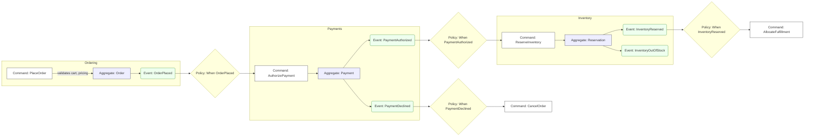
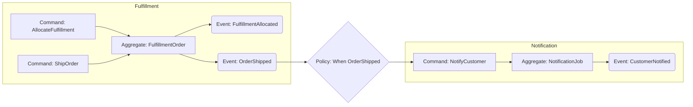
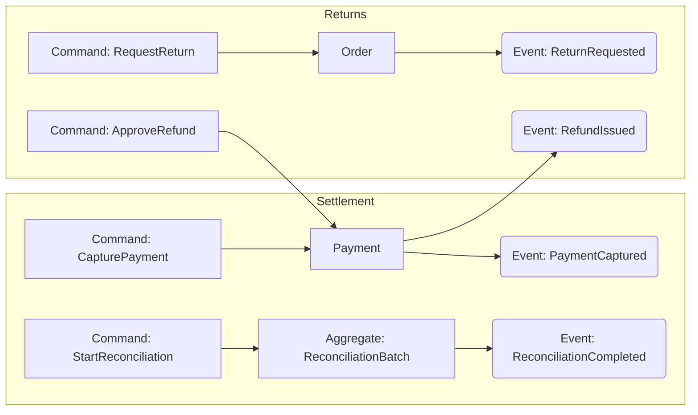
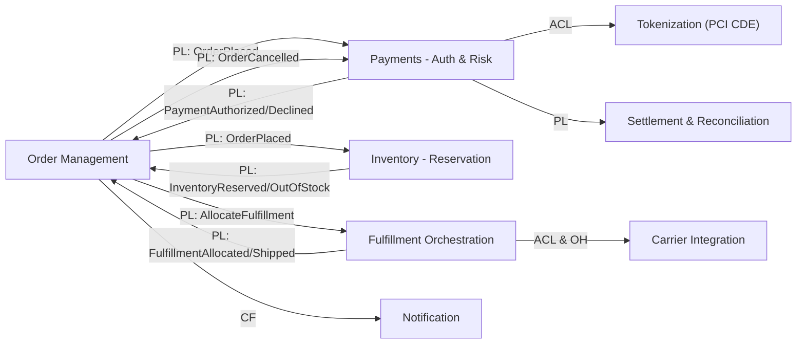
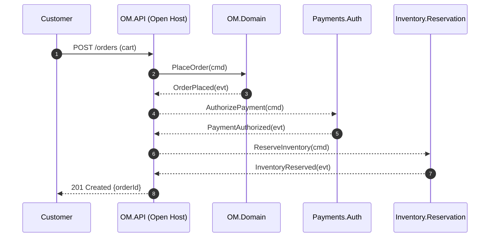
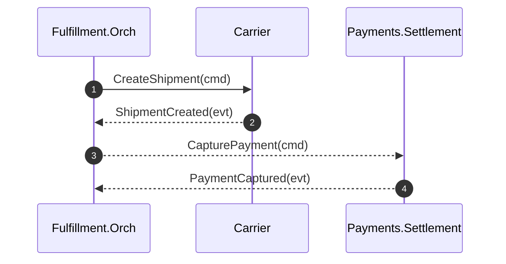
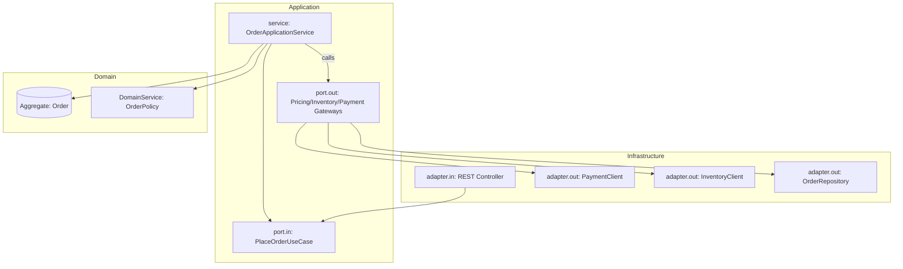
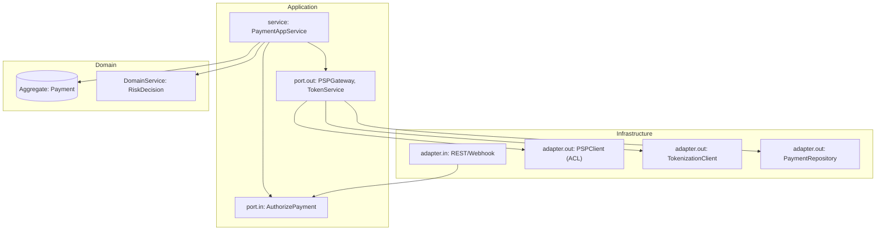

# Reference

> 本文件將「**子領域（Subdomain）** ➜ **Bounded Context（Bounded Context）** ➜ **Hexagonal Architecture（Ports & Adapters）**」一次畫清楚：
> 1) Event Storming Big Picture、2) 子領域 ➜ 上下文對映、3) 上下文地圖（Context Map）、4) 代表性序列圖、5) Aggregate與不變式、6) 事件契約（Published Language）、7) Hex 圖與 Port/Adapter、8) 模組化與測試守規（ArchUnit）。

---

## 0. 范疇與人物
- **商業目標**：支援下單、金流授權、庫存扣保、出貨配送、結算與對賬、退貨。
- **人物**：顧客、客服、倉務、財務、風控。
- **External System**：金流（PSP）、物流（Carriers）、稅務/會計、KYC/AML。

---

## 1. Event Storming（Big Picture）
> 以「下單 ➜ 授權 ➜ 扣保 ➜ 配貨 ➜ 出貨 ➜ 結算」為主線分場景繪製。色彩語意以文字標示：`Command`、`Aggregate`、`Event`、`Policy`、`External`。

### 1.1 下單 & 付款授權（Ordering + Payment Authorization）


### 1.2 配貨、出貨、通知（Fulfillment）


### 1.3 結算、對賬與退款（Settlement & Reconciliation & Refunds）


---

## 2. 子領域 ➜ Bounded Context（何時一對多）

| 子領域 (Subdomain) | 典型上游/下游能力 | recommendations Bounded Contexts | 為何要拆（一對多信號） |
|---|---|---|---|
| Ordering | 建立/管理訂單、取消、變更 | **Order Management** | 與 Fulfillment/Payment 有不同語義與一致性；訂單狀態機與出貨/金流分離 |
| Payments | 授權、捕提、對賬、退款、爭議 | **Auth & Risk**、**Settlement & Reconciliation**、**Dispute/Chargeback**、**Tokenization** | 一致性與時效不同（秒回 vs. 隔日批次）、合規分區（PCI CDE）、流程/外部協定差異 |
| Inventory | 庫存視圖、扣保、補貨 | **Reservation**、**StockLedger** | 交易邊界與讀寫模型不同，扣保與總帳演化速率不同 |
| Fulfillment | 配貨、出貨、逆物流 | **Fulfillment Orchestration**、**Carrier Integration** | 對接多 Carrier（協定/SLA 差異）與內部作業模型不同 |
| Customer | 身分、同意/偏好 | **Identity/Profile**、**Consent/Privacy** | 法規/資料等級不同、語義衝突 |

> 判斷依據：一致性規則差異、語言方言、讀寫剖分、合規邊界、外部整合、演化速率、組織邊界、地域法規、Event Storming聚類。

---

## 3. 上下文地圖（Context Map）
> 標注關係型態：`PL`=Published Language、`ACL`=Anti-Corruption Layer、`OH`=Open Host Service、`C/S`=Customer/Supplier、`CF`=Conformist。



---

## 4. 代表性序列圖

### 4.1 Place Order（含授權與扣保）


### 4.2 Ship & Capture（出貨與結算）


---

## 5. Aggregate（Aggregates）與不變式（Invariants）

### 5.1 Order Management
- **Order**(Aggregate Root)
  - 不變式：
    1) `Order` 在 `PENDING` 前不可出貨；
    2) `CANCELLED` 不可變更；
    3) `PaymentAuthorized` & `InventoryReserved` 才能進入 `READY_TO_SHIP`。

### 5.2 Payments - Auth & Risk
- **Payment**(AR)
  - 不變式：
    1) 授權不可重覆；
    2) `CAPTURED` 後不可退款以外的狀態逆轉；
    3) 卡號絕不儲存（僅 Token）。

### 5.3 Inventory - Reservation
- **Reservation**(AR)
  - 不變式：
    1) 同一 `orderId` 的扣保不可重覆；
    2) 扣保小於等於可用存量；
    3) 逾時自動釋放。

### 5.4 Fulfillment Orchestration
- **FulfillmentOrder**(AR)
  - 不變式：`Allocated` 才能 `Ship`；`Shipped` 才能觸發 `Capture`。

---

## 6. 事件契約（Published Language）
> 用 JSON Schema/範例表示。實務上recommendations以 **schema registry** 管控版本。

### 6.1 `OrderPlaced`（由 OM 發佈）
```json
{
  "event": "OrderPlaced",
  "version": 1,
  "orderId": "ORD-2025-0001",
  "customerId": "CUST-1001",
  "lines": [{"sku": "SKU-1", "qty": 2, "unitPrice": 100.0}],
  "total": 200.0,
  "occurredAt": "2025-08-28T10:02:00Z"
}
```

### 6.2 `PaymentAuthorized`（由 Payments.Auth 發佈）
```json
{
  "event": "PaymentAuthorized",
  "version": 2,
  "orderId": "ORD-2025-0001",
  "paymentId": "PAY-8899",
  "authCode": "A1B2C3",
  "amount": 200.0,
  "occurredAt": "2025-08-28T10:02:03Z"
}
```

### 6.3 `InventoryReserved`（由 Inventory.Reservation 發佈）
```json
{
  "event": "InventoryReserved",
  "version": 1,
  "orderId": "ORD-2025-0001",
  "reservations": [{"sku": "SKU-1", "qty": 2}],
  "expireAt": "2025-08-28T10:32:03Z"
}
```

---

## 7. Hexagonal Architecture視圖（Ports & Adapters）

### Examples


### 7.2 Payments.Auth（保有 ACL 與 Tokenization）


---

## 8. 模組化recommendations（Gradle Multi-Module）
```
app/
  ├─ order-management
  │   ├─ domain
  │   ├─ application
  │   └─ infrastructure
  ├─ payments-auth
  │   ├─ domain
  │   ├─ application
  │   └─ infrastructure
  ├─ payments-settlement
  ├─ inventory-reservation
  ├─ fulfillment-orchestration
  └─ shared-kernel (只放真正跨域的通用型 Domain Primitive/Events/Id)
```
> **Shared Kernel** 嚴格節制：僅放跨上下文穩定且通用的 **Domain Primitive**（如 Money、Quantity、Id）。避免把業務模型塞進來造成耦合。

---

## 9. ArchUnit 守規（擴充版）
> 於各模組 `src/test/java/.../architecture` 放置，配合 JUnit5。

```java
// 9.1 禁止 Application 依賴 Infrastructure
ArchRuleDefinition.noClasses()
  .that().resideInAPackage("solid.humank.genaidemo" + ".application..")
  .should().dependOnClassesThat().resideInAnyPackage("solid.humank.genaidemo" + ".infrastructure..");

// 9.2 Domain 不得依賴 Application/Infrastructure
ArchRuleDefinition.noClasses()
  .that().resideInAPackage("solid.humank.genaidemo" + ".domain..")
  .should().dependOnClassesThat()
  .resideInAnyPackage("solid.humank.genaidemo" + ".application..", "solid.humank.genaidemo" + ".infrastructure..");

// 9.3 Controller 不得直接觸碰 Repository 或 EntityManager
ArchRuleDefinition.noClasses()
  .that().resideInAnyPackage("solid.humank.genaidemo" + ".infrastructure.adapter.in..")
  .or().haveSimpleNameEndingWith("Controller")
  .should().accessClassesThat().haveSimpleNameEndingWith("Repository")
  .orShould().accessClassesThat().haveName("javax.persistence.EntityManager");

// 9.4 僅 Application 可標 @Transactional（或以白名單方式限制）
ArchRuleDefinition.noClasses()
  .that().resideInAPackage("solid.humank.genaidemo" + ".domain..")
  .or().resideInAPackage("solid.humank.genaidemo" + ".infrastructure..")
  .should().beAnnotatedWith("org.springframework.transaction.annotation.Transactional");

// 9.5 禁止欄位注入（field injection）
ArchRuleDefinition.noFields()
  .should().beAnnotatedWith("org.springframework.beans.factory.annotation.Autowired");
```

---

## 10. 拆分與演進Policy
1) **先單上下文跑通主線**（Order + Auth + Reservation + Fulfillment）。
2) **觀察壓力點**（一致性/語言/合規/供應商），對應拆出 `payments-settlement`、`carrier-integration` 等上下文。
3) **以事件為合約**（PL），跨上下文使用 ACL 避免語意滲透。
4) **團隊對齊**：一個 stream-aligned 團隊擁一個上下文；在架構門檻高處設 platform/enabling team 支援。

---

## 11. 對應 Q CLI Agent 的 Context 連結
- 將本文件放在 `docs/ddd-hex-rules.md`，把 `architecture-tests/**` 的 ArchUnit 測試加入。
- 於自訂 Agent 的 `resources` 指向本檔，讓 Q 回答時引用規範與事件契約。

> 以上視覺稿可直接當作工作坊素材（Event Storming ➜ Context Map ➜ Hex/Ports ➜ 測試守規）。若要我依你實際 package base 自動生成 ArchUnit 測試檔名與 Gradle 模組骨架，告訴我 base package，我會替換並輸出可貼上即跑的版本。


---

## Testing

> 這一節把Aggregate／業務邏輯層需要嚴格落實的規範，轉成可檢查的守則與 ArchUnit 測試骨架，已替換為你的 base package：`solid.humank.genaidemo`。

### 12.1 規範總表（精要）
1. **Aggregate Root唯一出入口**，狀態只透過 AR 公開行為改變。
2. **Invariant constraints** 必須在 AR 內「一次性」維護，禁止分散在Application Layer。
3. **Specification** 以可組合布林規則表達可/不可；**Policy** 決策應當如何做。
4. **狀態機白名單**：非法轉移拋出領域例外。
5. **跨Aggregate只以 ID 參照**；不在 AR 內做外部呼叫。
6. **單交易只改單一Aggregate**；預設樂觀鎖（`@Version`）。
7. **Domain Event** 僅在不變式成立、狀態確立後記錄；以 Outbox 於提交後送出。
8. **應用服務 vs Domain Service**：流程協調在Application Layer；核心規則在 AR/Domain Service。
9. **Validation 分層**：介面/應用做輸入格式檢查；業務規則在 AR/VO/規格。
10. **Repository 只針對 AR**；返回足夠維護不變式的Aggregate切片。
11. **禁止欄位注入**；以建構子注入強化Testability。
12. **@Transactional 白名單**：僅允許應用服務/adapter-in 邊界（可依專案調整）。
13. **Domain 不依賴 Spring**（避免技術框架污染模型）。

---

### Testing
> recommendations路徑：`app/src/test/java/solid/humank/genaidemo/architecture/`  
> 新增檔案：`ExtendedArchitectureRulesTest.java`

```java
package solid.humank.genaidemo.architecture;

import com.tngtech.archunit.core.domain.JavaClasses;
import com.tngtech.archunit.core.importer.ClassFileImporter;
import com.tngtech.archunit.lang.ArchCondition;
import com.tngtech.archunit.lang.ConditionEvents;
import com.tngtech.archunit.lang.SimpleConditionEvent;
import com.tngtech.archunit.lang.syntax.ArchRuleDefinition;
import com.tngtech.archunit.core.domain.JavaClass;
import org.junit.jupiter.api.Test;

class ExtendedArchitectureRulesTest {
  private static final String BASE = "solid.humank.genaidemo";

  @Test
  void transactional_annotation_whitelist() {
    JavaClasses classes = new ClassFileImporter().importPackages(BASE);
    ArchRuleDefinition.noClasses()
        .that().resideInAnyPackage(BASE + ".domain..", BASE + ".infrastructure..")
        .should().beAnnotatedWith("org.springframework.transaction.annotation.Transactional")
        .because("@Transactional 應由Application Layer/adapter-in 控制，避免污染 domain/infrastructure")
        .check(classes);
  }

  @Test
  void forbid_field_injection_autowired() {
    JavaClasses classes = new ClassFileImporter().importPackages(BASE);
    ArchRuleDefinition.noFields()
        .should().beAnnotatedWith("org.springframework.beans.factory.annotation.Autowired")
        .because("禁止欄位注入，請使用建構子注入")
        .check(classes);
  }

  @Test
  void domain_should_not_depend_on_spring_framework() {
    JavaClasses classes = new ClassFileImporter().importPackages(BASE);
    ArchRuleDefinition.noClasses()
        .that().resideInAPackage(BASE + ".domain..")
        .should().dependOnClassesThat().resideInAnyPackage("org.springframework..")
        .because("Domain 模型應與框架無關，保持純淨")
        .check(classes);
  }

  @Test
  void jpa_entity_should_have_version_field_for_optimistic_lock() {
    JavaClasses classes = new ClassFileImporter().importPackages(BASE);
    var mustHaveVersion = new ArchCondition<JavaClass>("have a @Version field") {
      @Override public void check(JavaClass clazz, ConditionEvents events) {
        boolean isEntity = clazz.isAnnotatedWith("jakarta.persistence.Entity")
                        || clazz.isAnnotatedWith("javax.persistence.Entity");
        if (!isEntity) return;
        boolean hasVersion = clazz.getFields().stream().anyMatch(f ->
            f.isAnnotatedWith("jakarta.persistence.Version") || f.isAnnotatedWith("javax.persistence.Version"));
        if (!hasVersion) {
          events.add(SimpleConditionEvent.violated(clazz,
              clazz.getName() + " should declare an @Version field for optimistic locking"));
        }
      }
    };
    ArchRuleDefinition.classes().should(mustHaveVersion).check(classes);
  }

  @Test
  void controller_should_not_access_repository_or_entitymanager_directly() {
    JavaClasses classes = new ClassFileImporter().importPackages(BASE);
    ArchRuleDefinition.noClasses()
        .that().resideInAnyPackage(BASE + ".infrastructure.adapter.in..")
        .or().haveSimpleNameEndingWith("Controller")
        .should().accessClassesThat().haveSimpleNameEndingWith("Repository")
        .orShould().accessClassesThat().haveName("jakarta.persistence.EntityManager")
        .orShould().accessClassesThat().haveName("javax.persistence.EntityManager")
        .because("Adapter-in 應透過 application ports 與資料存取互動")
        .check(classes);
  }
}
```

> 若你已有第 2 章中的 `LayerDependencyTest / AdaptersAndControllersTest / ValueObjectImmutabilityTest`，本檔視為**擴充規則**；四者合併可形成較完整的守規網。

---

### 12.3 Gradle 依賴（提醒）
將 ArchUnit 與 JUnit5 依賴加入 `app/build.gradle`：
```gradle
dependencies {
  testImplementation platform("org.junit:junit-bom:5.10.2")
  testImplementation "org.junit.jupiter:junit-jupiter"
  testImplementation "com.tngtech.archunit:archunit-junit5:1.3.0"
}

test { useJUnitPlatform() }
```

---

### Resources
請在你的 Agent JSON（`java-ddd-hex-genaidemo.json`）的 `resources` 中確保包含：
```
file://app/src/test/java/solid/humank/genaidemo/architecture/**/*.java
file://docs/ddd-hex-rules.md
```
如此 Q 在回答時會引用規範與測試檔。

