# AWS 基礎設施架構

This document展示 GenAI Demo 專案的完整 AWS 基礎設施架構，包括所有 CDK Stack、服務和Environment配置。

## Overview

```mermaid
graph TB
    subgraph "AWS CDK Stacks" as CDK
        MAIN_STACK[Main Infrastructure Stack]
        OBS_STACK[Observability Stack]
        DATA_STACK[Data Analytics Stack]
    end
    
    subgraph "Networking & Security" as NETWORK
        VPC[VPC<br/>Multi-AZ Setup]
        ALB[Application Load Balancer<br/>SSL Termination]
        WAF[AWS WAF<br/>Security Rules]
        SG[Security Groups<br/>Network ACLs]
    end
    
    subgraph "Container Platform" as CONTAINER
        EKS[Amazon EKS<br/>Kubernetes 1.28]
        ECR[Amazon ECR<br/>Container Registry]
        FARGATE[Fargate Nodes<br/>Serverless Compute]
        GRAVITON[Graviton3 Nodes<br/>ARM64 Instances]
    end
    
    subgraph "Data Services" as DATA
        RDS[RDS PostgreSQL<br/>Multi-AZ, Encrypted]
        MSK[Amazon MSK<br/>Kafka Cluster]
        REDIS[ElastiCache Redis<br/>Session & Cache]
        S3[S3 Buckets<br/>Data Lake & Backups]
    end
    
    subgraph "Observability Services" as OBS
        CW[CloudWatch<br/>Logs & Metrics]
        XRAY[AWS X-Ray<br/>Distributed Tracing]
        OPENSEARCH[OpenSearch Service<br/>Log Analytics]
        PROMETHEUS[Managed Prometheus<br/>Metrics Storage]
    end
    
    subgraph "Analytics & BI" as ANALYTICS
        FIREHOSE[Kinesis Data Firehose<br/>Data Streaming]
        GLUE[AWS Glue<br/>Data Catalog & ETL]
        ATHENA[Amazon Athena<br/>Serverless Queries]
        QUICKSIGHT[QuickSight<br/>Business Intelligence]
    end
    
    subgraph "Configuration & Secrets" as CONFIG
        SSM[Systems Manager<br/>Parameter Store]
        SECRETS[Secrets Manager<br/>Database Credentials]
        IAM[IAM Roles & Policies<br/>IRSA for EKS]
    end
    
    subgraph "Monitoring & Alerting" as MONITORING
        SNS[SNS Topics<br/>Alert Notifications]
        LAMBDA[Lambda Functions<br/>Custom Metrics & Automation]
        EVENTBRIDGE[EventBridge<br/>Event Routing]
    end
    
    %% CDK Deployment Flow
    CDK -->|Deploys| NETWORK
    CDK -->|Deploys| CONTAINER
    CDK -->|Deploys| DATA
    CDK -->|Deploys| OBS
    CDK -->|Deploys| ANALYTICS
    CDK -->|Deploys| CONFIG
    CDK -->|Deploys| MONITORING
    
    %% Network Flow
    ALB -->|Routes to| EKS
    WAF -->|Protects| ALB
    VPC -->|Contains| EKS
    VPC -->|Contains| RDS
    VPC -->|Contains| MSK
    VPC -->|Contains| REDIS
    
    %% Container Platform
    EKS -->|Pulls images| ECR
    EKS -->|Runs on| FARGATE
    EKS -->|Runs on| GRAVITON
    
    %% Data Flow
    EKS -->|Connects to| RDS
    EKS -->|Publishes to| MSK
    EKS -->|Caches in| REDIS
    MSK -->|Streams to| FIREHOSE
    
    %% Observability Flow
    EKS -->|Logs to| CW
    EKS -->|Traces to| XRAY
    CW -->|Streams to| OPENSEARCH
    CW -->|Archives to| S3
    
    %% Analytics Flow
    FIREHOSE -->|Stores in| S3
    S3 -->|Catalogs with| GLUE
    GLUE -->|Queries via| ATHENA
    ATHENA -->|Visualizes in| QUICKSIGHT
    OPENSEARCH -->|Dashboards in| QUICKSIGHT
    
    %% Configuration
    EKS -->|Reads config| SSM
    EKS -->|Gets secrets| SECRETS
    IAM -->|Authorizes| EKS
    
    %% Monitoring
    CW -->|Triggers| SNS
    LAMBDA -->|Processes| EVENTBRIDGE
    EVENTBRIDGE -->|Routes events| SNS
    
    %% Environment-specific Resources
    subgraph "Development Environment" as DEV_ENV
        DEV_EKS[EKS Dev Cluster<br/>t3.medium nodes]
        DEV_RDS[RDS Dev Instance<br/>db.t3.micro]
        DEV_REDIS[ElastiCache Dev<br/>cache.t3.micro]
    end
    
    subgraph "Production Environment" as PROD_ENV
        PROD_EKS[EKS Prod Cluster<br/>m6g.large nodes]
        PROD_RDS[RDS Prod Cluster<br/>Multi-AZ, Read Replicas]
        PROD_MSK[MSK Prod Cluster<br/>3 brokers, Multi-AZ]
        PROD_REDIS[ElastiCache Prod<br/>Cluster mode, Multi-AZ]
    end
    
    CDK -.->|Profile: dev| DEV_ENV
    CDK -.->|Profile: production| PROD_ENV
    
    classDef cdk fill:#ff9800,stroke:#e65100,stroke-width:3px
    classDef network fill:#2196f3,stroke:#0d47a1,stroke-width:2px
    classDef container fill:#4caf50,stroke:#1b5e20,stroke-width:2px
    classDef data fill:#9c27b0,stroke:#4a148c,stroke-width:2px
    classDef observability fill:#ff5722,stroke:#bf360c,stroke-width:2px
    classDef analytics fill:#607d8b,stroke:#263238,stroke-width:2px
    classDef config fill:#795548,stroke:#3e2723,stroke-width:2px
    classDef monitoring fill:#e91e63,stroke:#880e4f,stroke-width:2px
    classDef environment fill:#8bc34a,stroke:#33691e,stroke-width:2px
    
    class CDK cdk
    class VPC,ALB,WAF,SG network
    class EKS,ECR,FARGATE,GRAVITON container
    class RDS,MSK,REDIS,S3 data
    class CW,XRAY,OPENSEARCH,PROMETHEUS observability
    class FIREHOSE,GLUE,ATHENA,QUICKSIGHT analytics
    class SSM,SECRETS,IAM config
    class SNS,LAMBDA,EVENTBRIDGE monitoring
    class DEV_EKS,DEV_RDS,DEV_REDIS,PROD_EKS,PROD_RDS,PROD_MSK,PROD_REDIS environment
```

## 架構說明

### CDK Stack結構

1. **Main Infrastructure Stack**: 核心基礎設施，包括網路、容器平台和資料服務
2. **Observability Stack**: Observability服務，包括Monitoring、Logging和Tracing
3. **Data Analytics Stack**: 資料分析服務，包括資料湖和商業智慧

### 核心服務組件

#### 網路和安全層
- **VPC**: 多可用區設置，提供網路隔離
- **Application Load Balancer**: SSL 終止和流量路由
- **AWS WAF**: Web 應用程式防火牆，提供安全規則
- **Security Groups**: 網路存取控制清單

#### 容器平台
- **Amazon EKS**: Kubernetes 1.28 集群管理
- **Amazon ECR**: 容器映像註冊表
- **Fargate**: Serverless運算節點
- **Graviton3**: ARM64 高Performance實例

#### 資料服務
- **RDS PostgreSQL**: 多可用區、加密的關聯式Repository
- **Amazon MSK**: Kafka 集群，用於事件串流
- **ElastiCache Redis**: 會話和快取存儲
- **S3**: 資料湖和備份存儲

### Environment配置

#### 開發Environment
- **EKS**: t3.medium 節點，適合開發和測試
- **RDS**: db.t3.micro 實例，成本優化
- **Redis**: cache.t3.micro，基本快取需求

#### 生產Environment
- **EKS**: m6g.large 節點，高Performance ARM64 實例
- **RDS**: 多可用區集群，包含讀取副本
- **MSK**: 3 個代理，多可用區設置
- **Redis**: 集群模式，多可用區高可用

## 相關文檔

- **[Deployment Viewpoint](../viewpoints/deployment/README.md)** - DeploymentPolicy和Environment管理
- **[Infrastructure as Code](../viewpoints/deployment/infrastructure-as-code.md)** - AWS CDK 實踐
- **[ObservabilityDeployment](../viewpoints/deployment/observability-deployment.md)** - Monitoring系統Deployment

## 靜態圖表

如果上述 Mermaid 圖表無法正常顯示，請查看靜態 SVG 版本：

---

**維護說明**: 此圖表隨著基礎設施的演進自動更新，確保反映最新的 AWS 架構狀態。