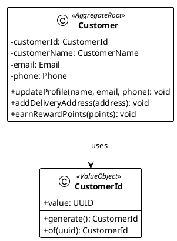

```mermaid
graph TB
    subgraph "Application Layer" ["Application Layer"]
        API[API Gateway]
        SVC1[Customer Service]
        SVC2[Order Service]
    end
    
    subgraph "資料層" ["Data Layer"]
        DB[(Database)]
        CACHE[(Cache)]
    end
    
    API --> SVC1
    API --> SVC2
    SVC1 --> DB
    SVC2 --> CACHE
    
    classDef application fill:#e3f2fd,stroke:#1565c0,stroke-width:2px
    classDef data fill:#f3e5f5,stroke:#7b1fa2,stroke-width:2px
    
    class API,SVC1,SVC2 application
    class DB,CACHE data
```

# Guidelines

## Overview

This project使用三種主要的圖表工具來滿足不同的視覺化需求：

- **Mermaid**: GitHub 直接顯示的架構圖
- **PlantUML**: 詳細的 UML 圖表
- **Excalidraw**: 概念設計和手繪風格圖

## Tools

### 使用場景對照表

| 工具 | 最佳使用場景 | GitHub 顯示 | 優勢 | 劣勢 |
|------|-------------|-------------|------|------|
| **Mermaid** | 系統架構圖、流程圖、時序圖 | ✅ 直接顯示 | 語法簡潔、GitHub 原生支援、版本控制友好 | 樣式自訂有限、複雜圖表表達力不足 |
| **PlantUML** | 詳細 UML 圖、複雜類圖、設計文件 | ❌ 需轉換 PNG | 功能強大、UML 標準、支援複雜圖表 | 語法複雜、需要額外工具生成圖片 |
| **Excalidraw** | 概念設計、腦力激盪、手繪風格圖 | ❌ 需轉換 PNG | 直觀易用、手繪風格、AI 輔助創建 | 不適合精確技術圖、需要 MCP 整合 |

## Mermaid - 主要架構圖表

### 推薦使用場景

1. **系統概覽圖** - 展示整體架構
2. **服務間互動** - 微服務通訊圖
3. **Deployment架構** - 基礎設施概覽
4. **業務流程** - 高層次流程圖
5. **Event-Driven Architecture** - 事件流向圖

### Examples



### 目錄結構

```
docs/diagrams/viewpoints/
├── functional/
│   ├── system-overview.mmd              # Overview
│   ├── bounded-contexts.mmd             # Bounded Context圖
│   └── use-case-flow.mmd               # 用例流程圖
├── information/
│   ├── event-driven-architecture.mmd   # Event-Driven Architecture
│   ├── data-flow.mmd                   # 資料流圖
│   └── event-storming-overview.mmd     # Overview
├── development/
│   ├── hexagonal-architecture.mmd      # Hexagonal Architecture圖
│   ├── ddd-layered-architecture.mmd    # DDD Layered Architecture
│   └── ci-cd-pipeline.mmd              # CI/CD 流程圖
├── deployment/
│   ├── infrastructure-overview.mmd     # Overview
│   └── deployment-pipeline.mmd         # Deployment
├── operational/
│   ├── monitoring-architecture.mmd     # Monitoring架構
│   └── observability-flow.mmd          # Observability流程
└── concurrency/
    └── async-processing.mmd             # 非同步處理架構
```

## PlantUML - 詳細技術圖表

### 推薦使用場景

1. **領域模型類圖** - DDD Aggregate Root設計
2. **Event Storming 圖表** - 三階段Event Storming
3. **時序圖** - 詳細的互動流程
4. **組件圖** - 系統組件關係
5. **Deployment圖** - 詳細的Deployment架構

### Examples



### 目錄結構

```
docs/diagrams/viewpoints/
├── functional/
│   ├── domain-model-class.puml         # 領域模型類圖
│   ├── aggregate-details.puml          # Design
│   └── use-case-diagram.puml           # 用例圖
├── information/
│   ├── event-storming-big-picture.puml # Event Storming Big Picture
│   ├── event-storming-process.puml     # Event Storming Process Level
│   ├── event-storming-design.puml      # Event Storming Design Level
│   └── sequence-diagrams/              # 時序圖目錄
│       ├── order-processing.puml
│       ├── payment-processing.puml
│       └── inventory-management.puml
└── deployment/
    ├── infrastructure-architecture.puml # 基礎設施架構
    ├── deployment-diagram.puml         # Deployment
    └── network-topology.puml           # 網路拓撲圖
```

### Standards

```plantuml
' Event Storming 標準配色
skinparam rectangle {
    ' 事件 - 橙色系
    BackgroundColor<<Event>> #FFA500
    BorderColor<<Event>> #FF8C00
    
    ' Hotspot/問題 - 紅色系  
    BackgroundColor<<Hotspot>> #FF0000
    BorderColor<<Hotspot>> #DC143C
    
    ' Actor - 黃色系
    BackgroundColor<<Actor>> #FFD700
    BorderColor<<Actor>> #DAA520
    
    ' Command - 藍色系
    BackgroundColor<<Command>> #1E90FF
    BorderColor<<Command>> #0000FF
    
    ' Aggregate - 黃色系
    BackgroundColor<<Aggregate>> #FFFF00
    BorderColor<<Aggregate>> #FFD700
    
    ' Read Model - 綠色系
    BackgroundColor<<ReadModel>> #32CD32
    BorderColor<<ReadModel>> #228B22
    
    ' Policy - 紫色系
    BackgroundColor<<Policy>> #800080
    BorderColor<<Policy>> #4B0082
}
```

## Design

### 推薦使用場景

1. **概念設計** - 早期Architecture Design
2. **腦力激盪** - 團隊討論圖
3. **Stakeholder對應** - 系統Actor圖
4. **User旅程** - 用戶體驗流程
5. **手繪風格圖** - 非正式文檔

### MCP 整合使用

```javascript
// 使用 Excalidraw MCP 創建概念圖
const conceptDiagram = await excalidrawMCP.createDiagram({
  title: "系統架構概念圖",
  elements: [
    {
      type: "rectangle",
      x: 100,
      y: 100,
      width: 200,
      height: 100,
      text: "用戶界面",
      backgroundColor: "#e3f2fd"
    },
    {
      type: "rectangle", 
      x: 100,
      y: 250,
      width: 200,
      height: 100,
      text: "業務邏輯",
      backgroundColor: "#f3e5f5"
    }
  ]
});
```

### 目錄結構

```
docs/diagrams/concepts/
├── architecture-brainstorm.excalidraw  # 架構腦力激盪
├── design-sketches.excalidraw          # Design
├── stakeholder-mapping.excalidraw      # Stakeholder對應圖
├── user-journey.excalidraw             # User旅程
└── system-context.excalidraw           # 系統上下文圖
```

## 自動化圖表生成

### GitHub Actions 工作流程

```yaml
name: Generate Diagrams
on:
  push:
    paths:
      - 'docs/diagrams/**/*.puml'
      - 'docs/diagrams/**/*.excalidraw'

jobs:
  generate-diagrams:
    runs-on: ubuntu-latest
    steps:
      - uses: actions/checkout@v3
      
      - name: Generate PlantUML diagrams
        uses: cloudbees/plantuml-github-action@master
        with:
          args: -v -tpng docs/diagrams/**/*.puml
          
      - name: Generate Excalidraw PNGs
        run: |
          npm install -g @excalidraw/cli
          find docs/diagrams -name "*.excalidraw" -exec excalidraw-cli {} \;
          
      - name: Commit generated images
        run: |
          git config --local user.email "action@github.com"
          git config --local user.name "GitHub Action"
          git add docs/diagrams/**/*.png
          git commit -m "Auto-generate diagram images" || exit 0
          git push
```

### 本地開發腳本

```bash
#!/bin/bash
# scripts/generate-all-diagrams.sh

echo "🎨 生成所有圖表..."

# 生成 PlantUML 圖表
echo "📊 生成 PlantUML 圖表..."
find docs/diagrams -name "*.puml" -exec java -jar tools/plantuml.jar -tpng {} \;

# 生成 Excalidraw 圖表 (透過 MCP)
echo "✏️ 生成 Excalidraw 圖表..."
find docs/diagrams -name "*.excalidraw" -exec node scripts/excalidraw-to-svg.js {} \;

# 驗證 Mermaid 語法
echo "🔍 驗證 Mermaid 語法..."
find docs/diagrams -name "*.mmd" -exec npx @mermaid-js/mermaid-cli -i {} -o {}.png \;

echo "✅ 所有圖表生成完成！"
```

## Maintenance

### 1. 命名規範

- **Mermaid**: `kebab-case.mmd`
- **PlantUML**: `kebab-case.puml`
- **Excalidraw**: `kebab-case.excalidraw`

### 2. 文件組織

- 按 Viewpoint 分類存放
- 相關圖表放在同一目錄
- 使用描述性檔案名稱

### 3. 版本控制

- 源文件納入版本控制
- PNG 文件可選擇性納入
- 使用 `.gitignore` 管理生成文件

### 4. 文檔關聯

- 在 Markdown 文檔中引用圖表
- 提供圖表說明和上下文
- 保持圖表與文檔同步

### 5. 品質檢查

- 定期檢查圖表準確性
- 驗證圖表語法正確性
- 確保圖表與實際實現一致

## Tools

### PlantUML 設置

```bash
# 下載 PlantUML JAR
wget https://github.com/plantuml/plantuml/releases/latest/download/plantuml.jar -O tools/plantuml.jar

# 生成圖表
java -jar tools/plantuml.jar -tpng docs/diagrams/**/*.puml
```

### Mermaid CLI 設置

```bash
# 安裝 Mermaid CLI
npm install -g @mermaid-js/mermaid-cli

# 生成圖表
mmdc -i input.mmd -o output.png
```

### Excalidraw MCP 設置

```json
{
  "mcpServers": {
    "excalidraw": {
      "command": "uvx",
      "args": ["excalidraw-mcp-server@latest"],
      "env": {
        "EXCALIDRAW_API_KEY": "${EXCALIDRAW_API_KEY}"
      }
    }
  }
}
```

## summary

通過合理使用這三種圖表工具，我們可以：

1. **Mermaid** - 提供 GitHub 友好的架構概覽
2. **PlantUML** - 創建詳細的技術設計圖
3. **Excalidraw** - 支援概念設計和創意表達

每種工具都有其最佳使用場景，選擇合適的工具可以最大化圖表的效果和維護性。