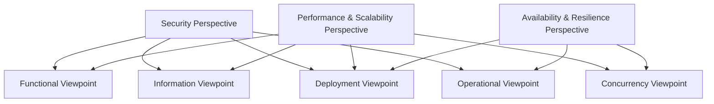

# Architectural Perspective圖表 (Perspective Diagrams)

## Overview

本目錄包含基於 Rozanski & Woods 八大Architectural Perspective的圖表Resource，展示跨視點的Quality Attribute和Non-Functional Requirement的視覺化表示。

## 觀點圖表目錄

### [Security Perspective圖表](README.md)
- **security-architecture.puml**: 安全架構圖 (PlantUML)
- **threat-model.mmd**: 威脅模型圖 (Mermaid)
- **authentication-flow.puml**: 認證流程圖 (PlantUML)

### [Performance & Scalability Perspective圖表](README.md)
- **performance-architecture.mmd**: Performance架構圖 (Mermaid)
- **load-balancing.puml**: 負載平衡圖 (PlantUML)
- **caching-strategy.mmd**: 快取Policy圖 (Mermaid)

### [Availability & Resilience Perspective圖表](README.md)
- **resilience-patterns.puml**: Resilience模式圖 (PlantUML)
- **disaster-recovery.mmd**: 災難恢復圖 (Mermaid)
- **fault-tolerance.puml**: 容錯機制圖 (PlantUML)

### [Evolution Perspective圖表](README.md)
- **evolution-roadmap.mmd**: 演進路線圖 (Mermaid)
- **refactoring-strategy.puml**: RefactoringPolicy圖 (PlantUML)
- **technology-migration.mmd**: 技術遷移圖 (Mermaid)

### [Availability & Resilience Perspective圖表](README.md)
- **user-experience-flow.mmd**: User體驗流程圖 (Mermaid)
- **interface-design.puml**: 介面設計圖 (PlantUML)
- **accessibility-features.mmd**: 無障礙功能圖 (Mermaid)

### [Regulation Perspective圖表](README.md)
- **compliance-architecture.puml**: 合規架構圖 (PlantUML)
- **data-governance.mmd**: 資料治理圖 (Mermaid)
- **audit-trail.puml**: 稽核軌跡圖 (PlantUML)

### [Location Perspective圖表](README.md)
- **geographic-distribution.mmd**: 地理分佈圖 (Mermaid)
- **data-locality.puml**: 資料本地化圖 (PlantUML)
- **edge-computing.mmd**: 邊緣運算圖 (Mermaid)

### [Cost Perspective圖表](README.md)
- **cost-optimization.mmd**: 成本優化圖 (Mermaid)
- **resource-efficiency.puml**: Resource效率圖 (PlantUML)
- **finops-dashboard.mmd**: FinOps Dashboard圖 (Mermaid)

## 觀點圖表特色

### 跨視點關聯
觀點圖表展示Quality Attribute如何影響多個Architectural Viewpoint：

### Quality Attributes場景視覺化
每個觀點圖表都包含Quality Attribute場景的視覺化表示：
- **來源 → 刺激 → Environment → 產物 → 響應 → 響應度量**

### 度量和Monitoring視覺化
展示如何Monitoring和度量各個Quality Attribute：
- 關鍵Metrics的Dashboard設計
- 告警和通知流程
- 持續改進的回饋循環

## Guidelines

### Design
1. **Quality Attribute識別**: 使用觀點圖表識別關鍵Quality Attribute
2. **場景定義**: 基於圖表定義具體的Quality Attribute場景
3. **Trade-off分析**: 使用圖表分析不同觀點間的Trade-off

### 實現階段
1. **架構決策**: 基於觀點圖表做出架構決策
2. **實現指導**: 使用圖表指導具體實現
3. **Verification Criteria**: 基於圖表建立Verification Criteria

### 運營階段
1. **Monitoring設計**: 基於圖表設計Monitoring系統
2. **問題診斷**: 使用圖表協助問題診斷
3. **持續改進**: 基於圖表識別改進機會

## 圖表更新流程

### 定期檢查
- **月度檢查**: 檢查圖表與實際系統的一致性
- **季度更新**: 基於系統變更更新相關圖表
- **年度評估**: 全面評估觀點圖表的有效性

### 變更觸發
- 系統架構重大變更
- 新的Quality Attribute需求
- 法規或標準的變更
- 技術棧的升級

### 協作流程
1. **需求識別**: 識別圖表更新需求
2. **設計討論**: 團隊討論圖表設計
3. **實現更新**: 更新圖表內容
4. **審查驗證**: 團隊審查和驗證
5. **發布更新**: 發布更新的圖表

## Resources

- [Architectural Viewpoint圖表](../viewpoints/README.md) - 系統架構的不同視角圖表
- [歷史圖表](../legacy/README.md) - 保留的歷史圖表
- \1 - Quality Attribute場景定義

---

**最後更新**: 2025年1月21日  
**維護者**: 架構團隊