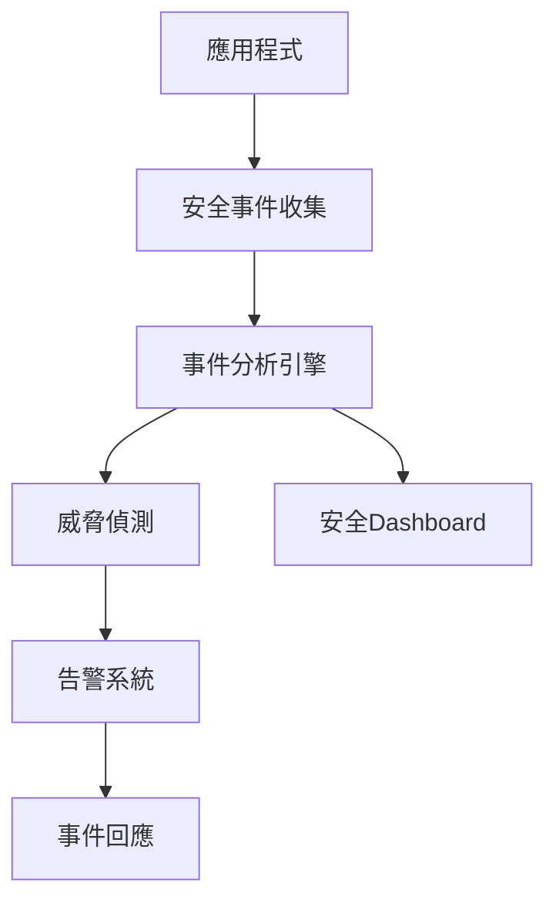

# Security Perspective - 認證與授權

---
title: "Security Perspective - 認證與授權"
perspective_type: "security"
applicable_viewpoints: ["functional", "information", "development", "deployment", "operational"]
quality_attributes: ["confidentiality", "integrity", "availability", "accountability"]
stakeholders: ["security-engineer", "architect", "developer", "operator"]
related_perspectives: ["performance", "usability", "regulation"]
related_documents: ["../viewpoints/functional/user-management.md", "../viewpoints/deployment/security-configuration.md"]
patterns: ["oauth2", "jwt", "rbac", "zero-trust"]
tools: ["spring-security", "keycloak", "vault"]
metrics: ["authentication-success-rate", "authorization-latency", "security-incidents"]
last_updated: "2025-01-21"
version: "1.3"
author: "Security Team"
review_status: "approved"
impact_level: "critical"
implementation_difficulty: "medium"
tags: ["authentication", "authorization", "oauth2", "jwt", "security"]
---

## Overview

Security Perspective專注於系統的認證與授權機制，確保只有經過驗證的User能夠存取適當的Resource，並且所有的安全操作都能被Tracing和稽核。

### 觀點目的
- 建立強健的身份驗證機制
- 實現細粒度的授權控制
- 確保安全操作的可Tracing性和合規性

### 核心價值
- 保護系統和資料免受未授權存取
- 滿足法規合規要求
- 建立User信任和系統Reliability

## Quality Attributes

### Primary Quality Attributes

#### 機密性 (Confidentiality)
**定義**: 確保敏感資訊只能被授權的Entity存取

**測量方式**:
- **量化Metrics**: 未授權存取嘗試的阻擋率
- **測量工具**: 安全Monitoring系統、稽核Logging
- **測量頻率**: 即時Monitoring
- **基準值**: 99.9% 阻擋率

**目標值**:
- **最低要求**: 99.5% 阻擋率
- **目標值**: 99.9% 阻擋率
- **優秀值**: 99.99% 阻擋率

#### 完整性 (Integrity)
**定義**: 確保資料在傳輸和儲存過程中不被未授權修改

**測量方式**:
- **量化Metrics**: 資料完整性驗證成功率
- **測量工具**: 雜湊驗證、數位簽章
- **測量頻率**: 每次資料操作
- **基準值**: 100% 驗證成功

**目標值**:
- **最低要求**: 99.99% 驗證成功
- **目標值**: 100% 驗證成功
- **優秀值**: 100% 驗證成功 + 即時異常偵測

#### 可問責性 (Accountability)
**定義**: 確保所有安全相關操作都能被Tracing到具體的User或系統

**測量方式**:
- **量化Metrics**: 稽核Logging完整性
- **測量工具**: Logging分析系統
- **測量頻率**: 持續Monitoring
- **基準值**: 100% 操作記錄

## Cross-Viewpoint Application

### Functional Viewpoint中的考量

**影響程度**: 高

**具體考量**:
- 業務功能需要整合認證檢查
- 敏感業務操作需要額外授權
- 業務規則需要考慮安全Constraint

**設計指導**:
- 在Aggregate Root中實現安全驗證
- 使用Domain Event記錄安全操作
- 實現基於角色的業務規則

**實現檢查點**:
- [ ] 所有業務操作都有適當的授權檢查
- [ ] 敏感資料在領域模型中被適當保護

### Information Viewpoint中的考量

**影響程度**: 高

**具體考量**:
- 敏感資料需要加密儲存
- 資料存取需要授權控制
- 資料傳輸需要安全通道

**設計指導**:
- 實現資料分類和標記
- 使用加密技術保護敏感資料
- 建立資料存取稽核機制

**實現檢查點**:
- [ ] 敏感資料已識別和分類
- [ ] 資料加密機制已實現

### Development Viewpoint中的考量

**影響程度**: 中

**具體考量**:
- 開發流程需要安全審查
- 程式碼需要安全掃描
- 測試需要包含安全測試

**設計指導**:
- 實現安全編碼標準
- 整合安全測試到 CI/CD 流程
- 建立安全Code Review機制

**實現檢查點**:
- [ ] 安全編碼標準已建立
- [ ] 自動化安全測試已整合

### Deployment

**影響程度**: 高

**具體考量**:
- DeploymentEnvironment需要安全加固
- 網路通訊需要加密
- 存取控制需要Environment隔離

**設計指導**:
- 實現零信任網路架構
- 使用容器安全Best Practice
- 建立Environment間的安全隔離

**實現檢查點**:
- [ ] 網路安全Policy已實現
- [ ] 容器安全配置已完成

### Operational Viewpoint中的考量

**影響程度**: 高

**具體考量**:
- 安全事件需要即時Monitoring
- 安全Metrics需要持續Tracing
- 事件回應需要標準流程

**設計指導**:
- 建立安全MonitoringDashboard
- 實現自動化威脅偵測
- 建立事件回應流程

**實現檢查點**:
- [ ] 安全Monitoring系統已Deployment
- [ ] 事件回應流程已建立

## Design

### 核心Policy

#### OAuth 2.0 + JWT Policy
**描述**: 使用 OAuth 2.0 進行授權，JWT 進行無狀態認證

**適用場景**:
- Microservices Architecture
- API 優先的應用
- 需要跨域認證的系統

**實現方法**:
1. 設定 OAuth 2.0 授權伺服器
2. 配置 JWT 簽發和驗證
3. 實現 Token 刷新機制
4. 建立 Scope 和權限對應

**優點**:
- 無狀態認證
- 標準化協議
- 良好的Scalability

**缺點**:
- Token 撤銷複雜
- 需要安全的 Token 儲存

**範例**:
```java
@Configuration
@EnableWebSecurity
public class SecurityConfiguration {
    
    @Bean
    public SecurityFilterChain filterChain(HttpSecurity http) throws Exception {
        http.oauth2ResourceServer(oauth2 -> oauth2
            .jwt(jwt -> jwt
                .decoder(jwtDecoder())
                .jwtAuthenticationConverter(jwtAuthenticationConverter())
            )
        );
        return http.build();
    }
    
    @Bean
    public JwtDecoder jwtDecoder() {
        return NimbusJwtDecoder.withJwkSetUri(jwkSetUri)
            .cache(Duration.ofMinutes(5))
            .build();
    }
}
```

#### 基於角色的存取控制 (RBAC)
**描述**: 根據User角色分配權限，簡化權限管理

**適用場景**:
- 企業內部系統
- 權限結構相對穩定的應用
- 需要集中權限管理的系統

**實現方法**:
1. 定義角色和權限模型
2. 實現角色分配機制
3. 建立權限檢查邏輯
4. 實現動態權限更新

**優點**:
- 權限管理簡化
- 易於理解和維護
- 支援權限繼承

**缺點**:
- 靈活性有限
- 角色爆炸問題
- 細粒度控制困難

## Implementation Technique

### 核心技術

#### Spring Security
**描述**: Java 生態系統中最成熟的安全框架

**適用性**:
- **優勢**: 功能完整、社群活躍、整合性好
- **限制**: 學習曲線陡峭、配置複雜
- **成熟度**: 非常成熟

**實現複雜度**: 中

**學習曲線**: 陡峭

**社群支援**: 強

**配置範例**:
```java
@EnableGlobalMethodSecurity(prePostEnabled = true)
public class MethodSecurityConfiguration {
    
    @PreAuthorize("hasRole('ADMIN') or (hasRole('USER') and #customerId == authentication.principal.customerId)")
    public Customer getCustomer(@PathVariable String customerId) {
        return customerService.findById(customerId);
    }
}
```

#### Keycloak
**描述**: 開源身份和存取管理解決方案

**適用性**:
- **優勢**: 功能豐富、標準支援、管理介面友好
- **限制**: Resource消耗較大、客製化複雜
- **成熟度**: 成熟

**實現複雜度**: 中

**學習曲線**: 適中

**社群支援**: 強

## Testing

### Testing

#### Testing
**目的**: 驗證認證和授權功能的正確性

**測試範圍**:
- 認證流程測試
- 授權規則測試
- Token 生命週期測試

**測試方法**:
1. Unit Test安全組件
2. Integration Test認證流程
3. End-to-End TestUser場景

**成功標準**:
- 所有認證場景通過測試
- 授權規則正確執行
- 安全異常正確處理

#### Testing
**目的**: 發現潛在的安全漏洞

**測試範圍**:
- 認證繞過測試
- 權限提升測試
- 注入攻擊測試

**測試方法**:
1. 自動化安全掃描
2. 手動滲透測試
3. 第三方安全評估

**成功標準**:
- 無高風險漏洞
- 中風險漏洞有緩解措施
- 安全控制有效運作

## Monitoring and Measurement

### 關鍵Metrics (KPIs)

#### 認證成功率
**定義**: 成功認證請求佔總認證請求的比例

**計算公式**: (成功認證數 / 總認證請求數) × 100%

**目標值**:
- **綠燈**: ≥ 99%
- **黃燈**: 95-99%
- **紅燈**: < 95%

**Monitoring頻率**: 即時

**資料來源**: 認證服務Logging

**告警條件**: 成功率低於 95%

#### 安全事件數量
**定義**: 檢測到的安全事件總數

**計算公式**: 每日/每週/每月安全事件計數

**目標值**:
- **綠燈**: 0 個高風險事件
- **黃燈**: 1-2 個中風險事件
- **紅燈**: > 2 個中風險事件或任何高風險事件

**Monitoring頻率**: 即時

**資料來源**: 安全Monitoring系統

**告警條件**: 任何高風險事件或中風險事件超過閾值

### Monitoring實現

#### Monitoring架構


#### Tools
```yaml
# Prometheus 安全Monitoring配置
security_monitoring:
  authentication:
    success_rate:
      query: "rate(auth_success_total[5m]) / rate(auth_total[5m])"
      threshold: 0.95
    
    failure_rate:
      query: "rate(auth_failure_total[5m])"
      threshold: 0.05
  
  authorization:
    denied_requests:
      query: "rate(authz_denied_total[5m])"
      threshold: 0.01
```

## Risk Management

### 風險識別

#### 認證繞過風險
**描述**: 攻擊者可能繞過認證機制直接存取系統

**可能性**: 中

**影響程度**: 高

**風險等級**: 高

**觸發條件**: 認證邏輯漏洞、配置錯誤

**影響範圍**: 整個系統安全

#### Token 洩露風險
**描述**: JWT Token 可能被竊取並用於未授權存取

**可能性**: 中

**影響程度**: 中

**風險等級**: 中

**觸發條件**: 不安全的 Token 儲存、網路攔截

**影響範圍**: 特定User帳戶

### 風險緩解Policy

#### 預防措施
- 實現多層安全防護
- 定期安全審查和測試
- 使用安全編碼Best Practice

#### 檢測機制
- 即時安全Monitoring
- 異常行為偵測
- 自動化威脅情報

#### 應對計畫
- 自動化事件回應
- 緊急存取撤銷
- 事件調查和分析

這個範例展示了如何使用 Perspective 模板創建具體的Security Perspective文件，涵蓋了Cross-Viewpoint Application、Implementation Technique和Monitoring度量等完整內容。