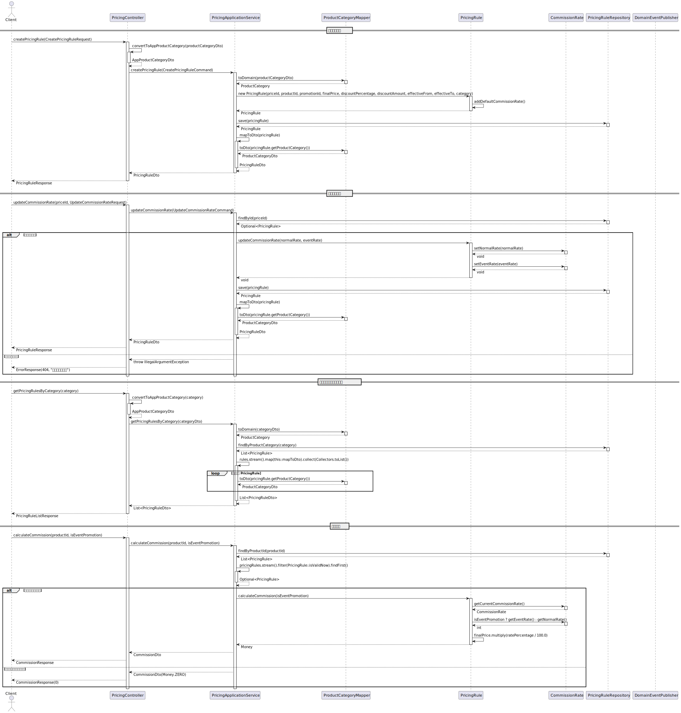
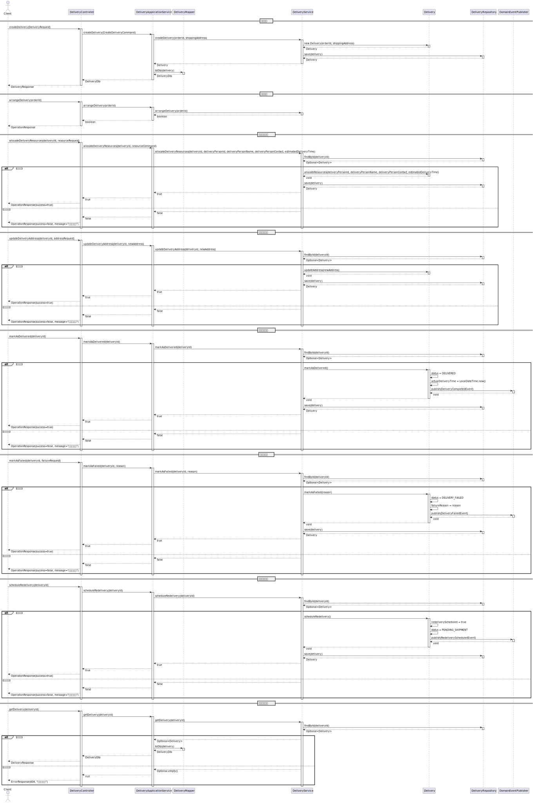
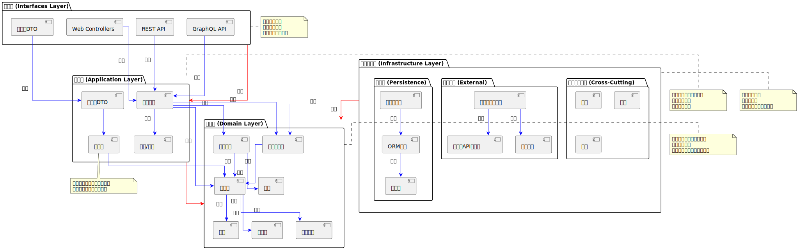

# E-commerce System UML Documentation

This directory contains various UML diagrams for the e-commerce system, describing the system's architecture, design, and behavior.

## Diagram List

### Basic Diagrams

1. **Class Diagram (class-diagram.puml)**
   - Describes main classes in the system and their relationships
   - Includes Order, Payment, Pricing, and Delivery aggregate roots, along with related entities, value objects, and domain services

2. **Object Diagram (object-diagram.puml)**
   - Shows instance relationships of the domain model
   - Includes specific object instances like orders, order items, payments, and deliveries

3. **Component Diagram (component-diagram.puml)**
   - Shows main system components and their interactions
   - Based on hexagonal architecture, showing ports and adapters
   - Includes persistence adapters and external system adapters

4. **Deployment Diagram (deployment-diagram.puml)**
   - Describes system deployment architecture
   - Includes servers, databases, message middleware, and external systems

5. **Package Diagram (package-diagram.puml)**
   - Shows system package structure and dependency relationships
   - Divided into interface layer, application layer, domain layer, and infrastructure layer according to hexagonal architecture
   - Includes package structure for pricing and delivery modules

6. **Sequence Diagram (sequence-diagram.puml)**
   - Describes main order processing flows
   - Includes creating orders, processing payments, and adding order items sequences

7. **Pricing Processing Sequence Diagram (pricing-sequence-diagram.puml)**
   - Describes main pricing processing flows
   - Includes creating pricing rules, updating commission rates, getting product category pricing rules, and calculating commissions

8. **Delivery Processing Sequence Diagram (delivery-sequence-diagram.puml)**
   - Describes main delivery processing flows
   - Includes creating deliveries, scheduling deliveries, allocating delivery resources, updating delivery addresses, marking as delivered, etc.

9. **State Diagram (state-diagram.puml)**
   - Shows order transitions between different states
   - Includes sub-states and possible rollback paths

10. **Activity Diagram Overview (activity-diagram-overview.puml)**
    - High-level view of main business processes in the e-commerce system
    - Includes interactions between customers, order system, payment system, and logistics system

11. **Activity Diagram Detail (activity-diagram-detail.puml)**
    - Detailed view of specific order processing steps
    - Includes interactions between layers and event flows

12. **Use Case Diagram (use-case-diagram.puml)**
    - Describes main system functions and actors
    - Distinguishes between core use cases and extended use cases

### Domain-Driven Design Diagrams

13. **Domain Model Diagram (domain-model-diagram.puml)**
    - Detailed view of aggregate roots, entities, value objects, and domain services in the system
    - Organized by domain contexts
    - Includes Order, Payment, Pricing, and Delivery aggregates

14. **Hexagonal Architecture Diagram (hexagonal-architecture-diagram.puml)**
    - Detailed view of system's ports and adapters pattern
    - Includes driving adapters, application core, and driven adapters
    - Shows the role of application layer mappers

15. **DDD Layered Architecture Diagram (ddd-layers-diagram.puml)**
    - Shows dependency relationships and data flow in DDD layered architecture
    - Detailed explanation of responsibilities and components of each layer
    - Emphasizes the role of data transformation and mappers

16. **Saga Pattern Diagram (saga-pattern-diagram.puml)**
    - Shows distributed transaction processing flow
    - Includes normal flow and compensating transactions

17. **Bounded Context Diagram (bounded-context-diagram.puml)**
    - Shows relationships between different contexts in the system
    - Includes context mapping patterns

18. **Event Storming Diagrams (big-picture-exploration.puml, process-modeling.puml, design-level.puml)**
    - Shows commands, events, aggregate roots, policies, and read models in the system
    - Based on Event Storming workshop results
    - **Big Picture Exploration**: Quickly understand the entire business domain
    - **Process Modeling**: Deep understanding of causal relationships between events
    - **Design Level**: Detailed design for software implementation

### Advanced Architecture Diagrams

19. **CQRS Pattern Diagram (cqrs-pattern-diagram.puml)**
    - Shows Command and Query Responsibility Segregation pattern
    - Includes command-side and query-side architecture

20. **Event Sourcing Diagram (event-sourcing-diagram.puml)**
    - Shows event storage and replay mechanisms
    - Includes how to build read models from events

21. **API Interface Diagram (api-interface-diagram.puml)**
    - Shows API interfaces provided by the system externally
    - Includes endpoints and data structures

22. **Data Model Diagram (data-model-diagram.puml)**
    - Shows system database model and relationships
    - Includes tables, columns, and relationships

23. **Security Architecture Diagram (security-architecture-diagram.puml)**
    - Shows system security mechanisms and authentication/authorization flows
    - Includes security controls and monitoring

24. **Observability Architecture Diagram (observability-diagram.puml)**
    - Shows system monitoring, logging, and observability architecture
    - Includes metrics, logs, traces, and alerts

## How to View Diagrams

These diagrams are created using PlantUML and can be viewed through the following methods:

1. **Using PlantUML Online Service**:
   - Visit <http://www.plantuml.com/plantuml/uml/>
   - Copy and paste .puml file content into the editor

2. **Using PlantUML Local Rendering**:
   - Use plantuml.jar in the project root directory
   - Execute command: `java -jar plantuml.jar docs/uml/diagram-name.puml`

3. **Using IDE Plugins**:
   - IDEs like IntelliJ IDEA, VS Code have PlantUML plugins
   - Install plugin to preview directly in IDE

## Diagram Update Guidelines

When updating these UML diagrams, please follow these principles:

1. Keep diagrams consistent with actual code
2. Use Chinese naming and comments for better readability
3. Use appropriate colors and grouping to enhance visual effects
4. Add necessary comments to explain complex relationships or concepts
5. Document changes in this file after updates

## Recent Updates

- 2023-03-23: Initial version created
- 2024-05-10: Updated all diagrams to reflect latest system architecture
- 2024-05-10: Added new Domain-Driven Design diagrams
- 2024-05-10: Added advanced architecture diagrams
- 2024-05-10: Added object diagrams and activity diagrams
- 2024-06-08: Updated class diagram, component diagram, domain model diagram, hexagonal architecture diagram, and package diagram
- 2024-06-08: Added pricing processing sequence diagram, delivery processing sequence diagram, and DDD layered architecture diagram

## Diagram Previews

To view diagrams, please use one of the methods above to render .puml files. Here are previews of some example diagrams:

### Class Diagram

### Object Diagram

### Component Diagram

### Deployment Diagram

### Package Diagram

### Sequence Diagram

### Pricing Processing Sequence Diagram

### Delivery Processing Sequence Diagram

### State Diagram

### Activity Diagram Overview

### Activity Diagram Detail

### Use Case Diagram

### Domain Model Diagram

### Hexagonal Architecture Diagram

### DDD Layered Architecture Diagram

### Saga Pattern Diagram

### Bounded Context Diagram

### Event Storming Diagram - Big Picture Exploration

### Event Storming Diagram - Process Modeling

### Event Storming Diagram - Design Level

### CQRS Pattern Diagram

### Event Sourcing Diagram

### API Interface Diagram

### Data Model Diagram

### Security Architecture Diagram

### Observability Architecture Diagram

