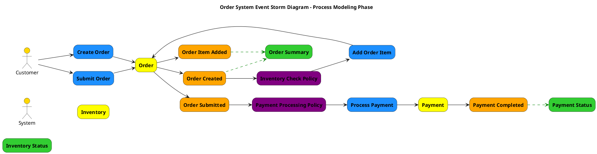
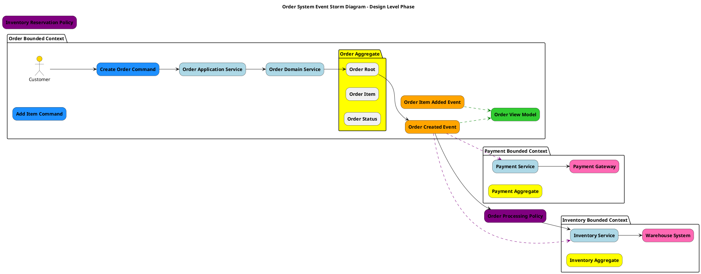

```puml
@startuml big-picture-exploration
left to right direction

skinparam rectangle {
    RoundCorner 25
    BorderColor black
    FontStyle bold
}

title Order System Event Storm Diagram - Big Picture Exploration Phase

' Focus only on major domain events
rectangle "Order Created" as OrderCreatedEvent #FFA500
rectangle "Order Item Added" as OrderItemAddedEvent #FFA500
rectangle "Order Submitted" as OrderSubmittedEvent #FFA500
rectangle "Inventory Checked" as InventoryCheckedEvent #FFA500
rectangle "Inventory Reserved" as InventoryReservedEvent #FFA500
rectangle "Payment Requested" as PaymentRequestedEvent #FFA500
rectangle "Payment Completed" as PaymentCompletedEvent #FFA500
rectangle "Order Confirmed" as OrderConfirmedEvent #FFA500
rectangle "Delivery Arranged" as DeliveryArrangedEvent #FFA500
rectangle "Delivery Completed" as DeliveryCompletedEvent #FFA500
rectangle "Order Cancelled" as OrderCancelledEvent #FFA500

' Hotspots/Issues
rectangle "How to handle inventory reservation timeout?" as InventoryTimeoutIssue #FF0000
rectangle "Payment failure retry strategy?" as PaymentRetryIssue #FF0000
rectangle "How to handle reserved inventory after order cancellation?" as InventoryReleaseIssue #FF0000
rectangle "How to handle delivery failure?" as DeliveryFailureIssue #FF0000

' Timeline connections
OrderCreatedEvent --> OrderItemAddedEvent
OrderItemAddedEvent --> OrderSubmittedEvent
OrderSubmittedEvent --> InventoryCheckedEvent
InventoryCheckedEvent --> InventoryReservedEvent
InventoryReservedEvent --> PaymentRequestedEvent
PaymentRequestedEvent --> PaymentCompletedEvent
PaymentCompletedEvent --> OrderConfirmedEvent
OrderConfirmedEvent --> DeliveryArrangedEvent
DeliveryArrangedEvent --> DeliveryCompletedEvent

' Branch paths
InventoryCheckedEvent -[#red]-> OrderCancelledEvent : Insufficient inventory
PaymentRequestedEvent -[#red]-> OrderCancelledEvent : Payment failed

' Hotspot issue connections
InventoryTimeoutIssue -[#red,dashed]-> InventoryReservedEvent
PaymentRetryIssue -[#red,dashed]-> PaymentRequestedEvent
InventoryReleaseIssue -[#red,dashed]-> OrderCancelledEvent
DeliveryFailureIssue -[#red,dashed]-> DeliveryArrangedEvent
```

# Event Storming Three-Phase Output PlantUML Guide

This document provides a guide for using PlantUML to draw the outputs of the three phases of Event Storming, including layout, color specifications, element ordering, and best practices.

## Event Storming Overview

Event Storming is a collaborative modeling technique created by Alberto Brandolini for exploring complex business domains. It typically consists of three main phases:

1. **Big Picture Exploration**: Quickly understand the entire business domain
2. **Process Modeling**: Deep understanding of causal relationships between events
3. **Design Level**: Provide detailed design for software implementation

## Standard Color Specifications

Event Storming uses specific colors to distinguish different types of elements:

| Element Type | Color Code | Description |
|-------------|------------|-------------|
| Events | #FFA500 (Orange) | Things that happen in the system |
| Commands | #1E90FF (Blue) | Actions or intentions that trigger events |
| Aggregates | #FFFF00 (Yellow) | Entities that ensure business rules |
| Policies | #800080 (Purple) | Business rules that should be executed when events occur |
| Read Models | #32CD32 (Green) | Information or views that users see |
| External Systems | #FF69B4 (Pink) | External systems that interact with the core system |
| Actors | #FFD700 (Gold) | People or systems that execute commands |
| Hotspots/Issues | #FF0000 (Red) | Problems or decision points that need to be resolved |
| Services | #ADD8E6 (Light Blue) | Coordinate aggregates and handle business logic |

## Layout Principles

### General Layout Principles

1. **Time Flow**: Left to right represents time flow
2. **Main Process Centered**: Main process (happy path) placed in the middle
3. **Branch Processes Below**: Exception paths or branch processes placed below main process
4. **Vertical Layering**: Different types of elements arranged in vertical layers
5. **Related Elements Grouped**: Use `together` or `package` to group related elements

### Element Vertical Ordering (Top to Bottom)

1. Actors
2. Read Models
3. Commands
4. Aggregates
5. Events
6. Issues/Hotspots
7. Policies
8. External Systems

## PlantUML Implementation for Three Phases

### 1. Big Picture Exploration

#### Focus Points
- Major domain events
- Temporal sequence between events
- Key issues and decision points

#### Element Types
- Events
- Hotspots/Issues

#### PlantUML Example

#### Layout Tips
- Keep it simple, focus only on main event flow
- Use red dashed lines to connect issues with related events
- Use red solid lines for exception flows
- Events arranged left to right in chronological order
- Issues placed diagonally above or below related events

### 2. Process Modeling

#### Focus Points
- Causal relationships between commands and events
- How aggregates handle commands and produce events
- How read models influence user decisions
- How policies respond to events

#### Element Types
- Actors
- Read Models
- Commands
- Aggregates
- Events
- Policies

#### PlantUML Example

#### Layout Tips
- Arrange elements in vertical layers according to their types
- Use solid arrows for command-event flows
- Use dashed green lines for read model updates
- Use dashed purple lines for policy triggers
- Group related elements using packages or together blocks

### 3. Design Level

#### Focus Points
- Detailed aggregate design
- Service boundaries
- Integration points
- Technical implementation details

#### Element Types
- All element types from previous phases
- Services
- External Systems
- Detailed aggregate internals

#### PlantUML Example

#### Layout Tips
- Use packages to represent bounded contexts
- Show aggregate internals when relevant
- Include services and their relationships
- Show external system integrations
- Use different line styles for different types of relationships

## Best Practices

### General Best Practices

1. **Consistent Coloring**: Always use standard Event Storming colors
2. **Clear Naming**: Use business language, not technical jargon
3. **Appropriate Granularity**: Match detail level to the phase
4. **Visual Hierarchy**: Use size and positioning to show importance
5. **Readable Layout**: Avoid crossing lines when possible

### PlantUML Specific Tips

1. **Use Skinparam**: Customize appearance for better readability
2. **Group Related Elements**: Use packages or together blocks
3. **Consistent Spacing**: Use consistent spacing between elements
4. **Line Styles**: Use different line styles to convey meaning
5. **Comments**: Add comments to explain complex relationships

### Phase-Specific Guidelines

#### Big Picture Exploration
- Focus on events and their sequence
- Include major hotspots and issues
- Keep it high-level and simple
- Use timeline layout (left to right)

#### Process Modeling
- Show command-event causality
- Include all element types
- Show policy triggers clearly
- Use vertical layering

#### Design Level
- Include technical details
- Show bounded context boundaries
- Include services and external systems
- Show aggregate internals when relevant

## Common Pitfalls to Avoid

1. **Too Much Detail Too Early**: Don't include implementation details in Big Picture phase
2. **Inconsistent Colors**: Stick to standard Event Storming colors
3. **Cluttered Layout**: Keep diagrams clean and readable
4. **Missing Relationships**: Show how elements connect and influence each other
5. **Technical Focus**: Use business language, especially in early phases

## Conclusion

Event Storming with PlantUML provides a powerful way to visualize and communicate complex business processes. By following these guidelines and using consistent colors, layouts, and naming conventions, you can create clear and effective Event Storming diagrams that serve as valuable documentation and communication tools for your development team.