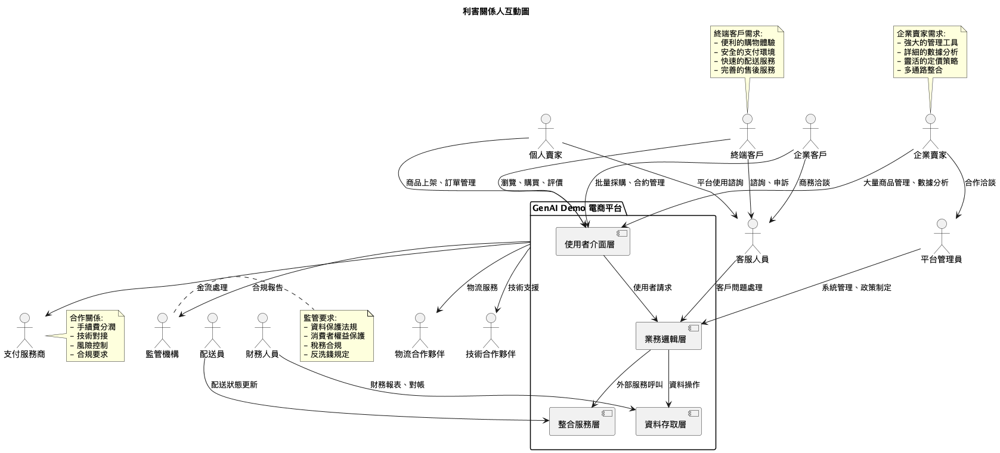
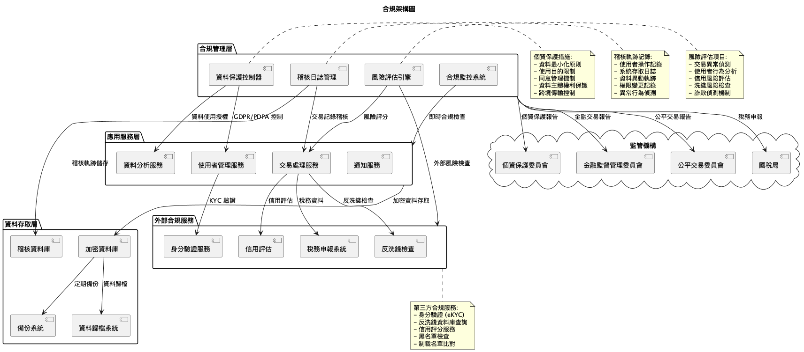

# Context Viewpoint (English)

## System Context Overview

This viewpoint describes the system's context and its relationships with external entities.

### Key Diagrams

- !!!!
- !!!!
- !!!!
- !!!!

### External Systems

#### Payment Providers
- Credit card gateways
- E-wallet services
- Bank transfer systems

#### Logistics Partners
- Home delivery services
- Convenience store pickup
- Postal services

#### Communication Services
- SMS providers
- Email services
- Push notification services

### Compliance Requirements

#### Data Protection
- GDPR compliance
- PDPA compliance
- Data encryption requirements

#### Financial Regulations
- Anti-money laundering (AML)
- Know Your Customer (KYC)
- Payment Card Industry (PCI) compliance

---

**Last Updated**: 2025-01-21  
**Language**: English  
**Status**: Active
