# Context Viewpoint

## Overview

The Context Viewpoint describes the relationships between the system and its environment, including external systems, stakeholders, organizational constraints, and regulatory requirements. This viewpoint defines system boundaries and explains how the system interacts with the external world.

## Stakeholders

- **Primary Concerns**: System Architects, Business Analysts, Project Managers, Compliance Officers
- **Secondary Concerns**: Developers, Operations Engineers, Security Engineers, Legal Team

## Concerns

1. **System Boundary Definition**: Clearly define system scope and boundaries
2. **External Dependency Management**: Identify and manage external system dependencies
3. **Stakeholder Interaction**: Define interaction patterns between various users and systems
4. **Integration Protocols**: Specify integration methods with external systems
5. **Organizational Constraints**: Consider organizational structure and policy impacts on the system
6. **Regulatory Compliance**: Ensure system compliance with relevant regulations

## System Boundaries and External Dependencies

### System Boundary Diagram

```mermaid
graph TB
    subgraph SYSTEM_BOUNDARY ["🏢 GenAI Demo System Boundary"]
        subgraph CORE_SYSTEM ["Core System"]
            API_GATEWAY[🚪 API Gateway]
            MICROSERVICES[🔧 Microservices]
            DATABASES[🗄️ Internal Databases]
            MESSAGE_QUEUE[📊 Internal Message Queue]
        end
    end
    
    subgraph EXTERNAL_USERS ["👥 External Users"]
        CUSTOMERS[👤 Customers<br/>Online Shopping Users]
        SELLERS[🏪 Sellers<br/>Product Suppliers]
        ADMINS[👨‍💼 Administrators<br/>System Managers]
        DELIVERY_STAFF[🚚 Delivery Staff<br/>Logistics Personnel]
    end
    
    subgraph EXTERNAL_SYSTEMS ["🌐 External Systems"]
        subgraph PAYMENT_PROVIDERS ["💳 Payment Providers"]
            STRIPE[Stripe<br/>Credit Card Payment]
            PAYPAL[PayPal<br/>Digital Wallet]
        end
        
        subgraph COMMUNICATION ["📞 Communication Services"]
            EMAIL_SERVICE[Email Service<br/>SES/SMTP]
            SMS_SERVICE[SMS Service<br/>SNS/Twilio]
        end
        
        subgraph LOGISTICS ["🚚 Logistics Services"]
            LOGISTICS_API[Third-party Logistics API<br/>Delivery Tracking Service]
        end
        
        subgraph CLOUD_SERVICES ["☁️ Cloud Services"]
            AWS_SERVICES[AWS Services<br/>MSK, S3, CloudWatch]
            MONITORING[Monitoring Services<br/>Prometheus, Grafana]
        end
    end
    
    subgraph REGULATORY ["📋 Regulatory Environment"]
        GDPR[GDPR<br/>EU Data Protection Regulation]
        PCI_DSS[PCI DSS<br/>Payment Card Industry Standard]
        LOCAL_LAWS[Local Regulations<br/>Consumer Protection Laws]
    end
    
    %% User Interactions
    CUSTOMERS --> API_GATEWAY
    SELLERS --> API_GATEWAY
    ADMINS --> API_GATEWAY
    DELIVERY_STAFF --> API_GATEWAY
    
    %% External System Integrations
    CORE_SYSTEM --> STRIPE
    CORE_SYSTEM --> PAYPAL
    CORE_SYSTEM --> EMAIL_SERVICE
    CORE_SYSTEM --> SMS_SERVICE
    CORE_SYSTEM --> LOGISTICS_API
    CORE_SYSTEM --> AWS_SERVICES
    CORE_SYSTEM --> MONITORING
    
    %% Regulatory Compliance
    CORE_SYSTEM -.-> GDPR
    CORE_SYSTEM -.-> PCI_DSS
    CORE_SYSTEM -.-> LOCAL_LAWS
    
    classDef systemBoundary fill:#e1f5fe,stroke:#0277bd,stroke-width:3px
    classDef externalUser fill:#e8f5e8,stroke:#388e3c,stroke-width:2px
    classDef externalSystem fill:#fff3e0,stroke:#f57c00,stroke-width:2px
    classDef regulatory fill:#fce4ec,stroke:#c2185b,stroke-width:2px
    
    class SYSTEM_BOUNDARY systemBoundary
    class CUSTOMERS,SELLERS,ADMINS,DELIVERY_STAFF externalUser
    class STRIPE,PAYPAL,EMAIL_SERVICE,SMS_SERVICE,LOGISTICS_API,AWS_SERVICES,MONITORING externalSystem
    class GDPR,PCI_DSS,LOCAL_LAWS regulatory
```



## Stakeholder Analysis

### Primary Stakeholders

#### 1. End Users

| Stakeholder | Role Description | Primary Needs | Interaction Method | Impact Level |
|-------------|------------------|---------------|-------------------|--------------|
| **Customers** | Online shopping consumers | Convenient shopping, secure payment, fast delivery | Web/Mobile App | 🔴 High |
| **Sellers** | Product suppliers and merchants | Product management, order processing, sales analytics | Seller Portal | 🔴 High |
| **Administrators** | System management and operations staff | System monitoring, user management, data analytics | Admin Panel | 🟡 Medium |
| **Delivery Staff** | Logistics delivery personnel | Delivery task management, status updates | Mobile App | 🟡 Medium |

#### 2. Organizational Stakeholders

| Stakeholder | Role Description | Primary Concerns | Decision Impact |
|-------------|------------------|------------------|-----------------|
| **Product Manager** | Product strategy and planning | Feature requirements, user experience, market competitiveness | 🔴 High |
| **CTO** | Technical strategy decisions | Technical architecture, security, scalability | 🔴 High |
| **Compliance Officer** | Regulatory compliance management | Data protection, payment security, regulatory compliance | 🔴 High |
| **CFO** | Finance and cost control | Operating costs, ROI, budget control | 🟡 Medium |
| **Legal Team** | Legal risk management | Contract management, intellectual property, legal liability | 🟡 Medium |

### External Stakeholders

| Stakeholder | Relationship Type | Impact Scope | Management Strategy |
|-------------|-------------------|--------------|-------------------|
| **Payment Providers** | Service Provider | Payment processing, fund security | SLA management, backup plans |
| **Logistics Partners** | Business Partner | Delivery service, customer satisfaction | Contract management, performance monitoring |
| **Cloud Service Providers** | Infrastructure Provider | System availability, data security | Multi-cloud strategy, disaster recovery |
| **Regulatory Bodies** | Regulatory Oversight | Compliance requirements, operating licenses | Proactive compliance, regular audits |

## External System Integration

### Implementation Status Legend
- ✅ **Implemented**: Features developed and running in production
- 🚧 **In Development**: Actively being developed, some features available
- 📋 **Planned**: Requirements confirmed, development not yet started

### Integration Status Overview

| External System | Status | Priority | Expected Completion | Responsible Team |
|----------------|--------|----------|-------------------|------------------|
| **Payment Systems** |  |  |  |  |
| Stripe | 📋 Planned | High | Q2 2025 | Backend Team |
| PayPal | 📋 Planned | Medium | Q3 2025 | Backend Team |
| **Communication Services** |  |  |  |  |
| Amazon SES | ✅ Implemented | High | Completed | Backend Team |
| SMS Service | 📋 Planned | Medium | Q2 2025 | Backend Team |
| **Logistics Services** |  |  |  |  |
| Third-party Logistics API | 📋 Planned | High | Q3 2025 | Backend Team |
| **Cloud Services** |  |  |  |  |
| AWS S3 | ✅ Implemented | High | Completed | DevOps Team |
| AWS MSK (Kafka) | 📋 Planned | Medium | Q2 2025 | DevOps Team |
| AWS CloudWatch | 🚧 In Development | High | Q1 2025 | DevOps Team |
| AWS Secrets Manager | 📋 Planned | Medium | Q2 2025 | DevOps Team |

### Payment System Integration

#### Stripe Integration 📋 **Planned**
- **Integration Type**: RESTful API
- **Data Exchange Format**: JSON over HTTPS
- **Authentication Method**: API Key + Webhook Signature Verification
- **SLA Requirements**: 99.9% availability, < 2s response time
- **Data Flow**: Bidirectional (payment request → payment result)
- **Security Requirements**: PCI DSS Level 1 compliance
- **Implementation Status**: Architecture design completed, awaiting development


#### PayPal Integration 📋 **Planned**
- **Integration Type**: OAuth 2.0 + REST API
- **Data Exchange Format**: JSON over HTTPS
- **Authentication Method**: Client ID/Secret + Access Token
- **SLA Requirements**: 99.5% availability, < 3s response time
- **Fault Tolerance**: Automatic retry + fallback to other payment methods
- **Implementation Status**: Technical research completed, awaiting business negotiation results

### Communication Service Integration

#### Email Service (Amazon SES) ✅ **Implemented**
- **Integration Type**: AWS SDK + SMTP
- **Use Cases**: Order confirmation, password reset, marketing emails
- **Data Format**: HTML/Text Email
- **Sending Limits**: 200 emails per day (adjustable)
- **Monitoring Metrics**: Send success rate, bounce rate, complaint rate
- **Implementation Status**: Basic functionality implemented, template system in development

#### SMS Service (Amazon SNS/Twilio) 📋 **Planned**
- **Integration Type**: REST API
- **Use Cases**: OTP verification, order status notifications
- **Data Format**: Plain text messages
- **Regional Support**: Taiwan, Hong Kong, Singapore
- **Cost Control**: 1000 messages per month limit
- **Implementation Status**: Requirements analysis completed, technology selection in progress

### Logistics Service Integration

#### Third-party Logistics API 📋 **Planned**
- **Integration Type**: RESTful API
- **Main Functions**: 
  - Delivery address validation
  - Shipping cost calculation
  - Delivery status tracking
  - Delivery time estimation
- **Data Synchronization**: Sync delivery status every 30 minutes
- **Backup Strategy**: Multi-logistics provider support
- **Implementation Status**: Logistics partner evaluation in progress, API specification design phase

### Cloud Service Integration

#### Amazon Web Services (AWS) 🚧 **In Development**
- **Core Services**:
  - **MSK (Kafka)**: Event stream processing 📋 Planned
  - **S3**: File and media storage ✅ Implemented
  - **CloudWatch**: Monitoring and logging 🚧 In Development
  - **Secrets Manager**: Secret management 📋 Planned
  - **IAM**: Identity and access management ✅ Implemented

- **Integration Pattern**: AWS SDK + IAM roles
- **Security Configuration**: Principle of least privilege
- **Cost Optimization**: Reserved instances + auto-scaling
- **Implementation Status**: Basic services deployed, advanced features being implemented progressively

## Integration Protocols and Data Exchange

### API Integration Standards

#### REST API Standards
```yaml
# API Integration Specifications
api_standards:
  protocol: HTTPS
  authentication: 
    - OAuth 2.0 (preferred)
    - API Key (alternative)
  data_format: JSON
  versioning: URL path versioning (/v1/, /v2/)
  rate_limiting: 1000 requests per minute
  timeout: 30 seconds
  retry_policy: Exponential backoff, maximum 3 retries
```

#### Data Exchange Format
```json
{
  "standard_response": {
    "success": true,
    "data": {},
    "error": null,
    "timestamp": "2025-01-22T10:00:00Z",
    "request_id": "uuid-v4"
  },
  "error_response": {
    "success": false,
    "data": null,
    "error": {
      "code": "ERROR_CODE",
      "message": "Human readable message",
      "details": {}
    },
    "timestamp": "2025-01-22T10:00:00Z",
    "request_id": "uuid-v4"
  }
}
```

### Event-Driven Integration

#### Domain Event Publishing


## Organizational Constraints

### Technical Constraints

#### Development Team Structure
- **Backend Team**: 3-4 Java/Spring Boot developers
- **Frontend Team**: 2-3 React/Angular developers
- **DevOps Team**: 1-2 AWS/Kubernetes experts
- **QA Team**: 2 test engineers

#### Technology Stack Limitations
- **Programming Languages**: Java 21, TypeScript, Python (limited)
- **Frameworks**: Spring Boot 3.x, React 18, Angular 18
- **Cloud Platform**: AWS (primary), avoid vendor lock-in
- **Database**: PostgreSQL (primary), Redis (cache)

### Budget Constraints

#### Cloud Service Costs
- **Monthly Budget**: $2,000 USD
- **Cost Allocation**:
  - Compute Resources: 40% ($800)
  - Database: 25% ($500)
  - Network and CDN: 15% ($300)
  - Monitoring and Logging: 10% ($200)
  - Other Services: 10% ($200)

#### Third-party Service Costs
- **Payment Processing Fee**: 2.9% + $0.30 per transaction
- **SMS Service**: $0.05 per message
- **Email Service**: $0.10 per 1000 emails
- **Logistics API**: Usage-based billing

### Timeline Constraints

#### Development Milestones
- **MVP Version**: 3 months
- **Beta Testing**: 4 months
- **Production Launch**: 6 months
- **Feature Expansion**: Continuous iteration

#### Compliance Timeline
- **GDPR Compliance**: Complete before launch
- **PCI DSS Certification**: Before payment feature launch
- **Security Audit**: Quarterly

## Regulatory and Compliance Requirements

### Data Protection Regulations

#### GDPR (General Data Protection Regulation)
- **Scope**: EU user data processing
- **Key Requirements**:
  - Explicit consent for data collection
  - Data portability rights
  - Right to be forgotten
  - Data breach notification (within 72 hours)
- **Technical Implementation**:
  - Encrypted data storage
  - Access logging
  - Data anonymization features
  - Consent management system

#### Personal Data Protection Act (Taiwan)
- **Scope**: Taiwan user personal data
- **Key Requirements**:
  - Notification obligations
  - Data subject consent
  - Data security maintenance
  - Data usage limitations
- **Technical Implementation**:
  - Privacy policy display
  - Consent record preservation
  - Data access control
  - Regular security checks

### Payment Security Standards

#### PCI DSS (Payment Card Industry Data Security Standard)
- **Applicable Level**: Level 4 (annual transactions < 20,000)
- **Key Requirements**:
  - Do not store sensitive authentication data
  - Encrypt payment data transmission
  - Regular security testing
  - Access control and monitoring
- **Technical Implementation**:
  - Use Stripe/PayPal proxy processing
  - Mandatory HTTPS encryption
  - Regular penetration testing
  - Access log monitoring

### Consumer Protection Regulations

#### E-commerce Regulations
- **Scope**: Online transactions and consumer rights
- **Key Requirements**:
  - Transparent product information
  - Return and exchange policies
  - Consumer complaint mechanisms
  - Transaction record preservation
- **Technical Implementation**:
  - Detailed product description system
  - Automated return/exchange processes
  - Customer service system integration
  - Transaction data backup

## Risk Management

### External Dependency Risks

#### Payment Service Risks
- **Risk**: Payment provider failure or policy changes
- **Impact**: Unable to process payments, directly affecting revenue
- **Mitigation Measures**:
  - Multi-payment channel support (Stripe + PayPal)
  - Payment status monitoring and alerts
  - Automatic failover mechanism
  - Regular backup testing

#### Cloud Service Risks
- **Risk**: AWS service interruption or cost explosion
- **Impact**: System unavailability or budget overrun
- **Mitigation Measures**:
  - Multi-availability zone deployment
  - Cost monitoring and budget alerts
  - Disaster recovery plan
  - Vendor diversification strategy

### Compliance Risks

#### Data Protection Risks
- **Risk**: Data breach or compliance violations
- **Impact**: Legal liability and reputation damage
- **Mitigation Measures**:
  - Data encryption and access control
  - Regular security audits
  - Employee security training
  - Incident response plan

#### Payment Security Risks
- **Risk**: Payment data breach or fraud
- **Impact**: PCI DSS violations and financial losses
- **Mitigation Measures**:
  - Use certified payment processors
  - Do not store sensitive payment data
  - Transaction monitoring and risk assessment
  - Regular security testing

## Monitoring and Governance

### External Service Monitoring

#### Service Availability Monitoring
```yaml
monitoring_targets:
  stripe_api:
    endpoint: "https://api.stripe.com/v1/charges"
    check_interval: "1m"
    timeout: "10s"
    alert_threshold: "99.5%"
  
  paypal_api:
    endpoint: "https://api.paypal.com/v1/payments"
    check_interval: "1m" 
    timeout: "15s"
    alert_threshold: "99.0%"
    
  logistics_api:
    endpoint: "https://logistics-partner.com/api/v1/status"
    check_interval: "5m"
    timeout: "30s"
    alert_threshold: "95.0%"
```

#### Performance Monitoring
- **Response Time**: P95 < 2 seconds
- **Error Rate**: < 1%
- **Availability**: > 99.5%
- **Alert Mechanism**: Slack + Email + SMS

### Compliance Monitoring

#### Data Protection Compliance
- **Access Logs**: All personal data access records
- **Data Retention**: Automatic cleanup of expired data per regulations
- **Consent Management**: Track user consent status changes
- **Data Breach Detection**: Abnormal access pattern alerts

#### Payment Security Compliance
- **Transaction Monitoring**: Abnormal transaction pattern detection
- **Access Control**: Strict permission management for payment-related functions
- **Security Testing**: Quarterly penetration testing and vulnerability scanning
- **Compliance Reporting**: Automatic PCI DSS compliance report generation

## Related Diagrams

- 
- 
- 
- 

## Relationships with Other Viewpoints

- **[Functional Viewpoint](../functional/README.md)**: Functional requirements for external system integration
- **[Information Viewpoint](../information/README.md)**: External data exchange and integration patterns
- **[Deployment Viewpoint](../deployment/README.md)**: External service deployment and configuration
- **[Operational Viewpoint](../operational/README.md)**: External dependency monitoring and maintenance
- **[Security Perspective](../../perspectives/security/README.md)**: Security requirements for external integration
- **[Regulatory Perspective](../../perspectives/regulation/README.md)**: Compliance requirements and implementation strategies

## Decision Records

### ADR-001: Payment Provider Selection
- **Decision**: Adopt Stripe as primary payment processor, PayPal as backup
- **Rationale**: Stripe provides better developer experience and API design
- **Impact**: Need to implement multi-payment channel support

### ADR-002: Cloud Service Provider Strategy
- **Decision**: Use AWS as primary cloud platform, avoid deep vendor lock-in
- **Rationale**: Team has extensive AWS experience, complete service ecosystem
- **Impact**: Need to design portable architecture patterns

### ADR-003: Compliance Strategy
- **Decision**: Adopt "Privacy by Design" principles, ensure compliance at architecture level
- **Rationale**: Reduce compliance risks and future refactoring costs
- **Impact**: Increase initial development complexity, but significant long-term benefits

---

**Last Updated**: January 22, 2025  
**Maintainer**: Architecture Team  
**Reviewers**: Compliance Team, Security Team  
**Change Log**: 
- 2025-01-22: Added external system integration implementation status annotations
- 2025-01-22: Added integration status overview table
