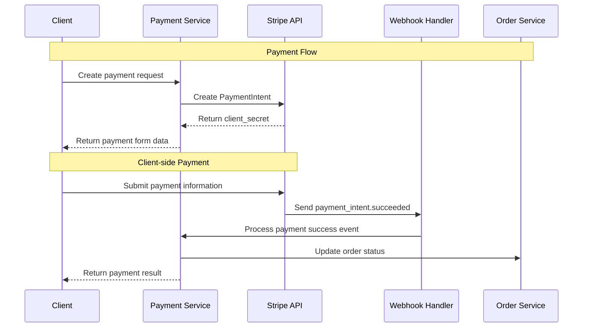
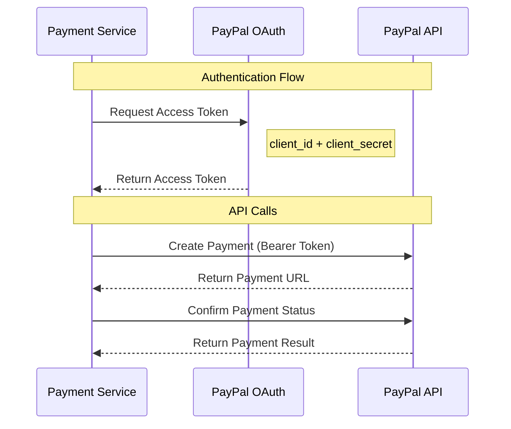

# External System Integration Detailed Design

## Overview

This document provides detailed design for GenAI Demo system integration with various external systems, including integration protocols, data exchange formats, error handling, and monitoring strategies.

## Payment System Integration

### Implementation Status Legend
- ✅ **Implemented**: Features developed and running in production
- 🚧 **In Development**: Actively being developed, some features available
- 📋 **Planned**: Requirements confirmed, development not yet started

### Stripe Integration 📋 **Planned**

#### Integration Architecture


#### API Configuration
```yaml
stripe_integration:
  api_version: "2023-10-16"
  base_url: "https://api.stripe.com"
  endpoints:
    create_payment_intent: "/v1/payment_intents"
    retrieve_payment_intent: "/v1/payment_intents/{id}"
    confirm_payment_intent: "/v1/payment_intents/{id}/confirm"
  
  authentication:
    type: "Bearer Token"
    secret_key: "${STRIPE_SECRET_KEY}"
    publishable_key: "${STRIPE_PUBLISHABLE_KEY}"
  
  webhooks:
    endpoint: "/api/v1/webhooks/stripe"
    events:
      - "payment_intent.succeeded"
      - "payment_intent.payment_failed"
      - "charge.dispute.created"
    signature_verification: true
  
  retry_policy:
    max_attempts: 3
    backoff_strategy: "exponential"
    initial_delay: "1s"
    max_delay: "30s"
```

### PayPal Integration 📋 **Planned**

#### OAuth 2.0 Authentication Flow


## Communication Service Integration

### Amazon SES Integration ✅ **Implemented**

#### Email Template Management
```java
@Service
public class EmailTemplateService {
    
    private final Map<EmailType, EmailTemplate> templates = Map.of(
        EmailType.ORDER_CONFIRMATION, EmailTemplate.builder()
            .subject("Order Confirmation - Order #{{orderNumber}}")
            .templatePath("templates/order-confirmation.html")
            .requiredVariables(Set.of("customerName", "orderNumber", "orderItems"))
            .build(),
            
        EmailType.PASSWORD_RESET, EmailTemplate.builder()
            .subject("Password Reset Request")
            .templatePath("templates/password-reset.html")
            .requiredVariables(Set.of("customerName", "resetLink", "expiryTime"))
            .build()
    );
    
    public EmailContent generateEmail(EmailType type, Map<String, Object> variables) {
        EmailTemplate template = templates.get(type);
        validateRequiredVariables(template, variables);
        
        String subject = processTemplate(template.getSubject(), variables);
        String body = processTemplate(loadTemplate(template.getTemplatePath()), variables);
        
        return new EmailContent(subject, body);
    }
}
```

### SMS Service Integration 📋 **Planned**

#### Multi-Provider Support
```java
@Component
public class SmsServiceRouter {
    
    private final List<SmsProvider> providers = List.of(
        new AwsSnsProvider(),
        new TwilioProvider()
    );
    
    public SmsResult sendSms(String phoneNumber, String message) {
        for (SmsProvider provider : providers) {
            if (provider.isAvailable() && provider.supportsRegion(getRegion(phoneNumber))) {
                try {
                    return provider.sendSms(phoneNumber, message);
                } catch (SmsException e) {
                    logger.warn("SMS provider {} failed: {}", provider.getName(), e.getMessage());
                    // Continue to next provider
                }
            }
        }
        
        throw new AllSmsProvidersFailedException("All SMS providers are unavailable");
    }
}
```

## Cloud Service Integration

### AWS S3 Integration ✅ **Implemented**

#### File Upload Service
```java
@Service
public class FileStorageService {
    
    private final S3Client s3Client;
    private final String bucketName;
    
    public FileUploadResult uploadFile(MultipartFile file, FileCategory category) {
        try {
            // Generate unique filename
            String fileName = generateFileName(file.getOriginalFilename(), category);
            String key = category.getPath() + "/" + fileName;
            
            // Upload to S3
            PutObjectRequest request = PutObjectRequest.builder()
                .bucket(bucketName)
                .key(key)
                .contentType(file.getContentType())
                .contentLength(file.getSize())
                .build();
                
            s3Client.putObject(request, RequestBody.fromInputStream(
                file.getInputStream(), file.getSize()));
            
            // Generate presigned URL
            String presignedUrl = generatePresignedUrl(key, Duration.ofHours(1));
            
            return FileUploadResult.success(key, presignedUrl);
            
        } catch (Exception e) {
            logger.error("Failed to upload file: {}", file.getOriginalFilename(), e);
            return FileUploadResult.failure("File upload failed");
        }
    }
}
```

## Monitoring and Alerting

### External Service Health Checks

#### Health Check Configuration
```java
@Component
public class ExternalServiceHealthIndicator implements HealthIndicator {
    
    private final List<ExternalServiceChecker> checkers = List.of(
        new StripeHealthChecker(),
        new PayPalHealthChecker(),
        new SesHealthChecker(),
        new LogisticsHealthChecker()
    );
    
    @Override
    public Health health() {
        Health.Builder builder = Health.up();
        
        for (ExternalServiceChecker checker : checkers) {
            try {
                ServiceHealth health = checker.checkHealth();
                builder.withDetail(checker.getServiceName(), health);
                
                if (!health.isHealthy()) {
                    builder.down();
                }
            } catch (Exception e) {
                builder.down()
                    .withDetail(checker.getServiceName(), "Health check failed: " + e.getMessage());
            }
        }
        
        return builder.build();
    }
}
```

## Security Considerations

### API Security
- **Authentication**: OAuth 2.0, API Key, JWT Token
- **Authorization**: Role-based access control (RBAC)
- **Encryption**: TLS 1.3 for data in transit
- **Signature Verification**: Webhook signature verification
- **Rate Limiting**: 1000 requests per minute limit

### Data Protection
- **Sensitive Data**: Do not store credit card information
- **PII Encryption**: Personal identifiable information encrypted storage
- **Access Logs**: All API calls recorded
- **Data Retention**: Automatic cleanup per regulatory requirements

---

**Last Updated**: January 22, 2025  
**Maintainer**: Architecture Team  
**Reviewers**: Security Team  
**Language**: English  
**Status**: Active